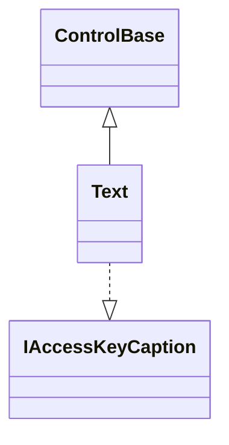
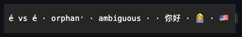

# Text

## Overview

`Text` is a non-focusable display control that formats Unicode text and applies
semantic terminal styling through compact inline markup. It derives from
`ControlBase`, draws only to the semantic cell canvas, and never emits terminal
protocol bytes. Markup is the only way to author styled text; there is no
mutable run or inline object model.

`Text` also implements the internal `IAccessKeyCaption` marker interface, which
is not part of the public API. It lets `AccessKeyManager` read `Content` as
caption text when a `Text` is used as another control's caption, without
exposing a public contract application code can implement.

## Inheritance



## API

| Member                        | Type                     | Default               | Description                                                                                                                                   |
| ----------------------------- | ------------------------ | --------------------- | --------------------------------------------------------------------------------------------------------------------------------------------- |
| `Text()`                      | —                        | —                     | Initializes empty text with `UseMnemonic` defaulted to `false`.                                                                               |
| `Text(string content)`        | —                        | —                     | Initializes text with non-null markup `content`; rejects `null`.                                                                              |
| `Content`                     | `string`                 | `string.Empty`        | Non-null markup text; unknown or malformed markup renders literally. Rejects `null`.                                                          |
| `Overflow`                    | `Overflow`               | `Overflow.Visible`    | Selects visible, wrap, wrap-anywhere, clip, or ellipsis behavior at grapheme boundaries.                                                      |
| `TextAlignment`               | `Alignment`              | `Alignment.Start`     | Places each formatted line at the start, center, or end of the content width.                                                                 |
| `AmbiguousWidth`              | `Ambiguous`              | Inherited cell policy | Optional local narrow or wide East Asian Ambiguous policy.                                                                                    |
| Inherited `UseMnemonic`       | `bool`                   | `false`               | Enables access-key marker parsing when this Text acts as a caption; overrides the base `true` default.                                        |
| `AccessKeyTarget`             | `ControlBase?`           | `null`                | The control this label's access key focuses directly, when set.                                                                               |
| `Style`                       | `TextStyle?`             | `null`                | Optional complete developer-authored presentation.                                                                                            |
| `ActualStyle`                 | `TextStyle`              | Resolved              | Read-only; the complete local, theme-owned, or code-owned presentation.                                                                       |
| `Escape(string value)`        | `string`                 | —                     | Static; escapes dynamic visible text for safe markup interpolation. Rejects `null`.                                                           |
| `GetSelectableTextSnapshot()` | `SelectableTextSnapshot` | —                     | Override; the leaf contributor to ancestor selection — returns the laid-out semantic text and visible grapheme geometry as an owned snapshot. |
| `TextChanged`                 | `EventHandler`           | —                     | Raised after `Content` changes.                                                                                                               |

The overflow modes behave as follows: `Overflow.Wrap` prefers breaking at
whitespace and falls back to grapheme boundaries; `WrapAnywhere` breaks only
between graphemes; `Clip` keeps complete clusters; `Ellipsis` reserves the
ellipsis width and prefers a word boundary; and `Visible` preserves every
complete logical line and reports its full cell width.

An unknown enum value throws `ArgumentOutOfRangeException` before any observable
state change. Mutating an attached control is dispatcher-affine and may throw
the base control's documented `InvalidOperationException` or
`ObjectDisposedException`.

Content, overflow, and ambiguous-width changes invalidate measure. Alignment
changes invalidate arrange. Resolved control style, theme, and visual-state
changes invalidate render through the base styling behavior. When an enabled
mnemonic marker is active, `Text` also tracks the resolved `Theme.Hotkey` color
as a render-only dependency; a hotkey-only theme swap does not measure or
arrange the control. Text without an effective marker does not acquire that
dependency.

Unlike captioned action controls, rich or body `Text` defaults `UseMnemonic` to
false, so ordinary ampersands stay literal. Set it to true when a standalone
`Text` acts as a label; the shared
[access-key syntax](../../concepts/access-keys.md#caption-syntax) is then
applied before markup parsing and grapheme layout.

## Keyboard

| Key            | Behavior                                                                         |
| -------------- | -------------------------------------------------------------------------------- |
| Alt+access key | Focuses the configured access-key target when the text declares that access key. |

## Markup grammar

A tag is `<name>`, `<name=value>`, `</name>`, or the generic close `</>`. Names,
named colors, and named values are case-insensitive. Each tag controls one
facet, and stacking tags composes facets. `</name>` closes the nearest
still-open tag with that exact name, so independent facets may overlap. `</>`
closes the most recently opened tag.

| Facet            | Accepted tags                                                                          |
| ---------------- | -------------------------------------------------------------------------------------- |
| Bold             | `<b>`, `<bold>`                                                                        |
| Dim              | `<d>`, `<dim>`                                                                         |
| Italic           | `<i>`, `<italic>`                                                                      |
| Underline        | `<u>`, `<underline>`                                                                   |
| Strike           | `<s>`, `<strike>`                                                                      |
| Other attributes | `<reverse>`, `<blink>`, `<rapidblink>`, `<hidden>`, `<conceal>`, `<overline>`          |
| Foreground       | `<fg=value>`, `<color=value>`, or a bare named-color tag such as `<red>` or `<accent>` |
| Background       | `<bg=value>`                                                                           |
| Underline color  | `<uc=value>`                                                                           |
| Underline shape  | `<u=straight>`, `<u=double>`, `<u=curly>`, `<u=dotted>`, `<u=dashed>`                  |
| Hyperlink        | `<link=target>`, `<a=target>`                                                          |

Bare `<u>` and valued `<u=...>` tags belong to a single underline facet: the
most recently opened underline wins until it closes, and `double` maps to the
semantic paired underline. Slow and rapid blink are likewise mutually exclusive,
with the most recently opened blink tag winning. The other attribute flags
simply combine.

Logical line breaks are literal LF, CR, or CRLF in the content. There is
deliberately no `<br>` tag.

### Color values

Color-valued tags accept:

- ANSI palette names `black` through `white` and `brightblack` through
  `brightwhite`; `gray` and `grey` alias `brightblack`;
- the fixed ANSI aliases `error`, `warning`, `hotkey`, `success`, `info`,
  `accent`, and `muted`; or
- RGB values `#rgb` and `#rrggbb`.

Parsing keeps concrete colors attached to each style span. Theme-aware text uses
its inherited resolved style unless markup supplies a local concrete override.

### Escaping and recovery

The markup metacharacters in visible text are `<` and `\`. Write `\<` for a
literal opening angle and `\\` for a literal backslash. `>` is literal outside a
tag. `Text.Escape` performs the required escaping for dynamic visible text:

```csharp
var user = "2 < 3";
var message = new Text($"<b>Value:</b> {Text.Escape(user)}")
{
    Overflow = Overflow.Wrap,
};
```

Parsing is lenient and deterministic:

- an unknown name, bad value, nested `<`, invalid hyperlink target, or missing
  `>` keeps the complete raw fragment as visible text;
- a stray named close is ignored;
- open tags automatically close at the end of `Content`; and
- a hyperlink target must be non-empty and contain no control code unit.

Hyperlinks become OSC 8 metadata on the cells; the control never opens a URL
itself.

## Style-resolved glyph

`TextStyle`, reached through `Style`/`ActualStyle`, owns the required validated
one-cell `EllipsisGlyph` — the marker drawn for `Overflow.Ellipsis` — alongside
the inherited `Face`/`Border`/`Shadow`. Without a local `Style`, ellipsis
overflow resolves the code-owned ellipsis glyph, and runtime repair falls back
to it when the configured glyph is unsuitable under the active width policy; the
width reservation stays one cell either way.

> [!NOTE]
>
> `Text` does not expose an individual `EllipsisGlyph` property or a
> `ResetEllipsisGlyph()` method. To override the marker, assign a complete local
> `Style` — for example
> `text.Style = text.ActualStyle with { EllipsisGlyph = new Rune('…') }` —
> rather than looking for a single-glyph property. Assigning `Style = null`
> returns the control to theme or code-owned ownership.

## Unicode, layout, and rendering

The parser produces one visible string plus internal, non-overlapping semantic
style spans. `SharpVision.Text.Layout.Format` takes that visible string, a
non-negative cell width, one `Overflow`, an `Alignment`, an explicit `Ambiguous`
policy, and caller-owned `Span<Line>` storage. It returns the complete required
line count even when the destination only has room for a prefix.

Each immutable `Line` records the visible-string UTF-16 `Offset` and `Length`,
the rendered `Cells`, the alignment `Leading`, and `HasEllipsis`. Delimiters are
excluded from the slices. Empty content and trailing logical newlines produce
stable empty lines. Tabs advance to four-cell stops.

Segmentation follows the
[Unicode geometry contract](../../concepts/unicode-cell-geometry.md#overview).
Wrapping, clipping, ellipsis, and drawing never split a surrogate pair, extended
grapheme cluster, or wide-cell owner. If a markup boundary falls inside a
grapheme, the style active at the cluster's first UTF-16 code unit applies to
the whole cluster.

Markup foreground, background, attributes, underline, underline color, and
hyperlink overlay the control's resolved visual-state style. An explicit markup
background draws opaquely; otherwise the text preserves whatever surface was
already painted, unless the control has a complete local `Face` with an opaque
background. Such a face supplies the opaque fill without changing the passive
control's input or focus behavior.

When `UseMnemonic` is enabled, access-key syntax is converted to markup before
parsing. While enabled, the marked grapheme receives the active `Theme.Hotkey`
color plus an underline; disabled text keeps its resolved disabled foreground.

`Text` reparses when content, effective mnemonic ownership, enabled state, or
the resolved hotkey color changes. Its parsed-span cache includes the concrete
hotkey color, so a later unrelated repaint cannot resurrect a color from an old
theme. It reuses its owned line array and reformats only when the visible text,
width, overflow, or ambiguous-width policy changes. An alignment-only change
rewrites the leading-cell metrics without re-enumerating graphemes. No pooled or
borrowed parser memory crosses a layout or frame boundary.

## Example



```csharp
var status = new Text
{
    Content = "<info>Status:</info> Ready",
    Overflow = Overflow.Ellipsis,
    TextAlignment = Alignment.Start,
};

status.Content = $"<info>User:</info> {Text.Escape(userName)}";
```

## Expected behavior

| Scope      | Observable evidence                                            |
| ---------- | -------------------------------------------------------------- |
| Public API | Validation, defaults, state changes, and deterministic output. |

- Every tag and every concrete or named color form, named and generic closes,
  overlapping and auto-closed facets, complete-fragment recovery from malformed
  markup, invalid links, escaping round trips, and fixed-seed span tiling all
  behave as described.
- All overflow modes, invalid values, empty and multiline text, resize reflow,
  alignment, tabs, combining marks, variation selectors, ZWJ emoji, wide cells,
  invalid UTF-16, and both ambiguous-width policies are covered by the same
  guarantees.
- The rendering evidence includes exact semantic
  foreground/background/attributes, typed underline and underline color,
  theme-role resolution, OSC 8 metadata, the mutually exclusive blink
  precedence, markup boundaries inside graphemes, transparent background
  preservation, access-key foreground and disabled-state preservation, ellipsis
  ownership, and multi-frame terminal output.
- `TextSurfaceTests` additionally mounts the control beneath a real application
  and demonstrates combining and wide-grapheme ownership, terminal-visible
  markup styles, ellipsis-to-alignment mutation with stale-cell clearing, and
  transparent composition over an opaque parent surface. Standalone and retained
  `InputBase`/`HeaderedContentControl` captions prove that hotkey-only theme
  swaps repaint without stale cached colors or geometry work. A mounted resize
  demonstrates Unicode-safe wrap reflow and removal of the obsolete row. The
  showcase owns one merged `Text` page with live markup, Unicode, overflow,
  hyperlink, and mutation specimens. A warmed, unchanged 80-column Unicode
  measure/render loop includes a zero-allocation measured window.
