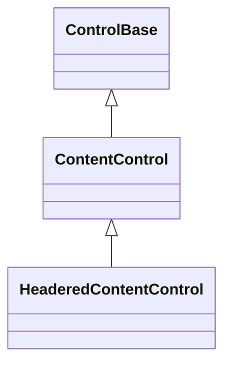

# HeaderedContentControl base API

## Overview

`HeaderedContentControl` is the abstract base for a control that owns a single
replaceable `Content` — inherited from
[`ContentControl`](content-control.md#overview) — plus an independent single
replaceable `Header`. It derives from `ContentControl`, so the two slots are
completely separate ownership edges: the same control instance can never be
assigned to both at once.

Use `HeaderedContentControl` when a component has a caller-replaceable title or
label alongside its main content, and that title should accept an ordinary
control rather than being locked to plain text.
[`GroupBox`](layout/group-box.md#overview) and
[`Expander`](layout/expander.md#overview) derive from it; each retains full
control over how its own header is arranged and rendered alongside its own
chrome, and each must declare that layout explicitly — this role only owns the
header's lifecycle and the plain-text convenience over it, never the layout.
[`TabItem`](collections/tab-control.md#tabitem) does not derive from it: the
owning `TabControl` renders every page's header through a private, text-only
strip control, so a page has nowhere to arrange a rich `Header` into and instead
exposes only its own plain `HeaderText`.

## Inheritance



## API

| Member                                                         | Type           | Default | Description                                                                                            |
| -------------------------------------------------------------- | -------------- | ------- | ------------------------------------------------------------------------------------------------------ |
| `Header`                                                       | `ControlBase?` | `null`  | Transfers ownership of zero or one detached `ControlBase`, independently of `Content`.                 |
| `HeaderText`                                                   | `string`       | Empty   | Reads or writes `Header` as plain text, materializing or mutating an owned `Text` caption.             |
| `MeasureOverride(Constraint constraint)`                       | `Size`         | —       | Protected abstract; measures `Header` and `Content` together and returns their intrinsic content size. |
| `ArrangeOverride(Rect bounds)`                                 | `void`         | —       | Protected abstract; assigns the final content-box slots of `Header` and `Content`.                     |
| `OnHeaderChanged(ControlBase? previous, ControlBase? current)` | `void`         | —       | Protected virtual; responds after the header ownership change is structurally committed.               |

## Keyboard

| Key                   | Behavior                                                             |
| --------------------- | -------------------------------------------------------------------- |
| Alt+header access key | Focuses the semantic owner when `HeaderText` declares an access key. |

## Ownership and mutation

`Header` follows the exact ownership, replacement, and disposal contract
[`ContentControl.Content`](content-control.md#ownership-and-mutation) already
documents, through its own capacity-one, normal-layer slot: assignment,
equivalence, clearing, and every rejection path (disposed, attached,
already-owned, duplicate-slot, cross-parent, cyclic) behave identically, and a
control already owned as `Content` cannot also be assigned as `Header`, or the
reverse. A derived class observes committed header changes through
`OnHeaderChanged(previous, current)`, the header counterpart of
`OnContentChanged`, and `PropertyChanged(nameof(Header))` follows the same
publication order.

## HeaderText

`HeaderText` is a convenience, not a second storage location. Reading it returns
the current header's text when `Header` is a `Text` control, and an empty string
otherwise. Assigning it mutates an existing `Text` header in place; any other
header, including none, is replaced by a newly materialized `Text`. Because a
`Text` header never allocates until first assigned, a consumer that only ever
sets `HeaderText` pays no cost for the richer `Header` slot underneath it.
`HeaderText` notifies exactly once per committed change and is silent on
same-value assignment, matching [`InputBase.Text`](pressable.md#overview)'s
convention on the unrelated caption capability.

## Access keys

`AccessKeyText` projects `Header` through `IAccessKeyCaption` when the header
implements it — which a `Text` header does — and is `null` for any other header
or when none is assigned. An ampersand in `HeaderText` therefore declares an
[access key](../concepts/access-keys.md#focus-and-semantic-actions) exactly as
it did when these controls exposed a plain string `Header`. The same internal
caption-owner contract drives retained `Text` parsing and duplicate suppression,
so header rendering and semantic dispatch share one ownership decision.

## Layout and rendering

This role owns no layout or rendering override of its own, and it does not
inherit `ContentControl`'s content-only default either: `MeasureOverride` and
`ArrangeOverride` are redeclared `abstract`, so every concrete subclass must
measure, arrange, and draw `Header` itself or the type fails to compile. Each
derived control decides where its header sits and how it participates in that
control's own chrome — a titled border edge for `GroupBox`, a
disclosure-glyph-prefixed row for `Expander` — using the same
`MeasureChild`/`ArrangeChild` primitives available to any owned control.

## Example

`HeaderedContentControl` is abstract, so this example uses
[`GroupBox`](layout/group-box.md#overview), the simplest concrete subclass, to
show the inherited `Header`/`HeaderText` surface in use.

```csharp
var box = new GroupBox
{
    HeaderText = "Settings",
    Content = new Text("General options go here."),
};
```

## Expected behavior

| Scope               | Observable evidence                                                       |
| ------------------- | ------------------------------------------------------------------------- |
| Public API          | Validation, defaults, state changes, and deterministic output.            |
| Integrated behavior | Cross-component behavior through the real ownership and routing boundary. |

- `Header` behaves like `Content` for the full assignment matrix: null, first
  assignment, equivalent assignment, replacement, clearing, and every rejection
  path, all independent of the inherited `Content` slot.
- `HeaderText` materializes once and mutates in place thereafter, notifies as
  documented, and falls back to replacement for a non-`Text` header.
- `AccessKeyText` resolves only through a `Text` header.
- Tests cover ownership, replacement, the `HeaderText` convenience over a rich
  header, access-key projection, and a consumer-derived control composing the
  role alongside its own state.
