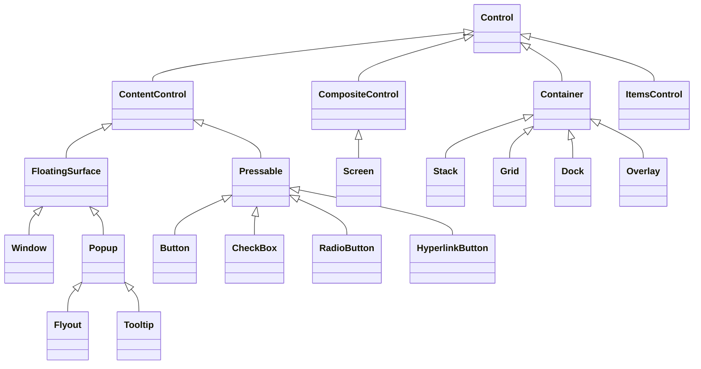

# Control API specifications

## Control catalog

Every concrete control page answers the same practical questions: when to use
the control, which properties and events change its behavior, their defaults and
validation, how layout and input work, and how to construct it in C#. Properties
inherited by every control are documented once in the
[`Control` property tables](control.md#api); each concrete page owns only its
specialized API.

The diagram shows authoring roles and representative controls, not every sealed
type. Choose the role with the
[custom-control walkthrough](../walkthroughs/custom-controls.md#choose-the-right-base-type).

All controls derive from the
[base control contract](control.md#control-contract) and use the shared
[layout](../concepts/layout.md#layout-contract),
[styling](../concepts/styling.md#styling-contract), and
[input](../concepts/input-routing.md#input-routing-contract) rules.

### Public namespaces

| Namespace                          | Responsibility                                               |
| ---------------------------------- | ------------------------------------------------------------ |
| `SharpVision.Controls`             | Foundational roles, ownership, and intrinsic chrome.         |
| `SharpVision.Controls.Display`     | Text, images, indicators, and passive presentation.          |
| `SharpVision.Controls.Input`       | Buttons, editors, pickers, and value controls.               |
| `SharpVision.Controls.Layout`      | Panels, overlays, structural chrome, and tables.             |
| `SharpVision.Controls.Collections` | Lists, tabs, trees, typed collections, and item realization. |
| `SharpVision.Controls.Scrolling`   | The ScrollBar control and its glyph and style values.        |
| `SharpVision.Menus`                | Menus, menu entries, and context menus.                      |
| `SharpVision.Navigation`           | Sidebar navigation controls and entries.                     |
| `SharpVision.Surfaces`             | Shared elevated-surface lifecycle and modality seams.        |
| `SharpVision.Popups`               | Anchored popup, flyout, and tooltip surfaces.                |
| `SharpVision.Windows`              | Free-standing retained window surfaces.                      |

Complete modal tasks such as `MessageBox` live in
[`SharpVision.Dialogs`](../dialogs/index.md#dialog-catalog).

### Authoring roles

- [Container](container.md#container-contract) owns an ordered public child
  collection and requires a concrete measure and arrange algorithm.
- [ContentControl](content-control.md#contentcontrol-contract) owns zero or one
  publicly replaceable content control.
- [CompositeControl](composite-control.md#compositecontrol-contract) owns one
  retained private implementation root initialized by the concrete constructor.
- [ItemsControl](items-control.md#itemscontrol-contract) exposes typed semantic
  items through a private presentation host.
- [Pressable](pressable.md#pressable-contract) adds focus and completed
  activation to that single-content role.

### Display

- [Text](display/text.md#text-contract)
- [FigletText](display/figlet-text.md#figlettext-contract)
- [Image](display/image.md#image-contract)
- [Prism](display/prism.md#prism-contract)
- [Separator](display/separator.md#separator-contract)
- [ProgressBar](display/progress-bar.md#progressbar-contract)
- [Spinner](display/spinner.md#spinner-contract)
- [ChaseIndicator](display/chase-indicator.md#chaseindicator-contract)
- [StatusBar and StatusBarItem](display/status-bar.md#statusbar-contract)

Face, border, and shadow are intrinsic `Control` appearance configured through
the complete `Face`, `Border`, and `Shadow` composites; none is a standalone
control. Their matching `*Set` records provide partial state contributions.
Enabled border sides reserve layout through the base box model, and the sealed
renderer paints configured chrome around `OnRenderContent`. See the
[intrinsic appearance contract](../concepts/styling.md#shared-chrome).

### Input

- [Button](input/button.md#button-contract)
- [HyperlinkButton](input/hyperlink-button.md#hyperlinkbutton-contract)
- [Calendar](input/calendar.md#calendar-contract)
- [CheckBox](input/check-box.md#checkbox-contract)
- [ColorPicker](input/color-picker.md#colorpicker-contract)
- [ComboBox](input/combo-box.md#combobox-contract)
- [DateInput](input/date-input.md#dateinput-contract)
- [DateTimeInput](input/date-time-input.md#datetimeinput-contract)
- [RadioButton](input/radio-button.md#radiobutton-contract)
- [Slider](input/slider.md#slider-contract)
- [TextInput](input/text-input.md#textinput-contract)
- [TimeInput](input/time-input.md#timeinput-contract)

### Layout

- [Stack](layout/stack.md#stack-contract)
- [Grid](layout/grid.md#grid-contract)
- [Dock](layout/dock.md#dock-contract)
- [Overlay](layout/overlay.md#overlay-contract)
- [Table](layout/table.md#table-contract)
- [GroupBox](layout/group-box.md#groupbox-contract)
- [Expander](layout/expander.md#expander-contract)

### Scrolling

- [ScrollBar](scrolling/scroll-bar.md#scrollbar-contract)

### Collections

- [ListView](collections/list-view.md#listview-contract)
- [TabControl and TabItem](collections/tab-control.md#tabcontrol-contract)
- [TreeView](collections/tree-view.md#treeview-contract)

### Menus and navigation

- [Menu](menus/menu.md#menu-contract)
- [MenuItem and MenuSeparator](menus/menu-item.md#menuitem-contract)
- [ContextMenu](menus/context-menu.md#contextmenu-contract)
- [NavigationView](navigation/navigation-view.md#navigationview-contract)

### Popups and windows

- [Popup](popups/popup.md#popup-contract)
- [Tooltip](popups/tooltip.md#tooltip-contract)
- [Flyout](popups/flyout.md#flyout-contract)
- [Window](windows/window.md#window-contract)
