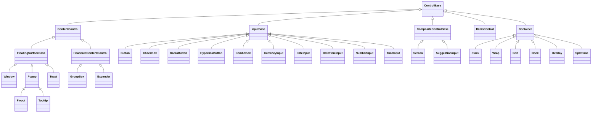

# Control API specifications

## Control catalog

Every concrete control page answers the same practical questions: when to use
the control, which properties and events change its behavior, their defaults and
validation, which keyboard commands it owns, how layout and input work, and how
to construct it in C#. Properties inherited by every control are documented once
in the [`ControlBase` property tables](control.md#api); each concrete page owns
only its specialized API.

The
[general keyboard behavior](../concepts/input-routing.md#general-keyboard-behavior)
applies when a focused control does not handle a key itself. Each control page's
`Keyboard` table lists the commands that take precedence for that control.

The diagram shows the authoring roles and representative controls, not every
sealed type. To pick a role for your own control, follow the
[custom-control walkthrough](../walkthroughs/custom-controls.md#choose-the-right-base-type).

All controls derive from the [`ControlBase` base class](control.md#overview) and
use the shared [layout](../concepts/layout.md#overview),
[invalidation](../concepts/invalidation.md#overview),
[styling](../concepts/styling.md#overview), and
[input](../concepts/input-routing.md#overview) rules.

### Public namespaces

| Namespace                          | Responsibility                                               |
| ---------------------------------- | ------------------------------------------------------------ |
| `SharpVision.Controls`             | Foundational roles, ownership, and intrinsic chrome.         |
| `SharpVision.Controls.Display`     | Text, images, indicators, and passive presentation.          |
| `SharpVision.Controls.Charts`      | Reactive bar, line, area, and compact trend charts.          |
| `SharpVision.Controls.Input`       | Buttons, editors, suggestions, pickers, and value controls.  |
| `SharpVision.Controls.Layout`      | Panels, overlays, structural chrome, and tables.             |
| `SharpVision.Controls.Collections` | Lists, tabs, trees, typed collections, and item realization. |
| `SharpVision.Controls.Documents`   | The Document control and its rich-text content-node tree.    |
| `SharpVision.Controls.Scrolling`   | The ScrollBar control and its glyph and style values.        |
| `SharpVision.Menus`                | Menus, menu entries, and context menus.                      |
| `SharpVision.Navigation`           | Sidebar navigation controls and entries.                     |
| `SharpVision.Surfaces`             | Shared elevated-surface lifecycle and modality seams.        |
| `SharpVision.Popups`               | Anchored popup, flyout, and tooltip surfaces.                |
| `SharpVision.Notifications`        | Non-modal Toast notifications, positions, and styles.        |
| `SharpVision.Windows`              | Free-standing retained window surfaces.                      |

Complete modal tasks such as `MessageBox` live in
[`SharpVision.Dialogs`](../dialogs/index.md#dialog-catalog).

### Authoring roles

- [Container](container.md#overview) owns an ordered public child collection and
  requires a concrete measure and arrange algorithm.
- [ContentControl](content-control.md#overview) owns zero or one publicly
  replaceable content control.
- [HeaderedContentControl](headered-content-control.md#overview) adds an
  independent replaceable header to `ContentControl`.
- [CompositeControl](composite-control.md#overview) owns one retained private
  implementation root initialized by the concrete constructor.
- [ItemsControl](items-control.md#overview) exposes typed semantic items through
  a private presentation host.
- [InputBase](input-base.md#overview) is the focusable role for a value editor
  or popup-backed input, exposing press activation, segment editing, step-key
  translation, the shared drop-down glyph, and an owned popup as independent
  opt-in capabilities.
- [Pressable](pressable.md#overview) adds focus and completed activation to the
  single-text-caption role.

### Display

- [Text](display/text.md#overview)
- [FigletText](display/figlet-text.md#overview)
- [Image](display/image.md#overview)
- [Prism](display/prism.md#overview)
- [Separator](display/separator.md#overview)
- [ProgressBar](display/progress-bar.md#overview)
- [Spinner](display/spinner.md#overview)
- [ChaseIndicator](display/chase-indicator.md#overview)
- [StatusBar and StatusBarItem](display/status-bar.md#overview)
- [CodeView](display/code-view.md#overview)
- [Syntax highlighting](../concepts/syntax-highlighting.md#overview)

### Charts

- [HorizontalBarChart](charts/horizontal-bar-chart.md#overview)
- [VerticalBarChart](charts/vertical-bar-chart.md#overview)
- [LineChart](charts/line-chart.md#overview)
- [AreaChart](charts/area-chart.md#overview)
- [Sparkline](charts/sparkline.md#overview)
- [Shared chart data, scaling, legends, and binding](charts/index.md#overview)

Face, border, and shadow are intrinsic `ControlBase` appearance configured
through the complete `Face`, `Border`, and `Shadow` composites; none of them is
a standalone control. Their matching `*Set` records provide partial state
contributions. Enabled border sides reserve layout through the base box model,
and the sealed renderer paints the configured chrome around `OnRenderContent`.
See the [intrinsic appearance rules](../concepts/styling.md#shared-chrome).

### Input

- [Button](input/button.md#overview)
- [HyperlinkButton](input/hyperlink-button.md#overview)
- [Calendar](input/calendar.md#overview)
- [CheckBox](input/check-box.md#overview)
- [ColorPicker](input/color-picker.md#overview)
- [CommandPalette](input/command-palette.md#overview)
- [ComboBox](input/combo-box.md#overview)
- [CurrencyInput](input/currency-input.md#overview)
- [DateInput](input/date-input.md#overview)
- [DateTimeInput](input/date-time-input.md#overview)
- [NumberInput](input/number-input.md#overview)
- [RadioButton](input/radio-button.md#overview)
- [Slider](input/slider.md#overview)
- [SuggestionInput](input/suggestion-input.md#overview)
- [TextInput](input/text-input.md#overview)
- [TimeInput](input/time-input.md#overview)

### Layout

- [Stack](layout/stack.md#overview)
- [Wrap](layout/wrap.md#overview)
- [Grid](layout/grid.md#overview)
- [Dock](layout/dock.md#overview)
- [Overlay](layout/overlay.md#overview)
- [SplitPane](layout/split-pane.md#overview)
- [Table](layout/table.md#overview)
- [GroupBox](layout/group-box.md#overview)
- [Expander](layout/expander.md#overview)

### Scrolling

- [ScrollBar](scrolling/scroll-bar.md#overview)

### Collections

- [Document](collections/document.md#overview)
- [Markdown documents](../concepts/markdown-documents.md#overview)
- [JsonView](collections/json-view.md#overview)
- [ListView](collections/list-view.md#overview)
- [TabControl and TabItem](collections/tab-control.md#overview)
- [TreeView](collections/tree-view.md#overview)

### Menus and navigation

- [Menu](menus/menu.md#overview)
- [MenuItem and MenuSeparator](menus/menu-item.md#overview)
- [ContextMenu](menus/context-menu.md#overview)
- [NavigationView](navigation/navigation-view.md#overview)

### Popups and windows

- [Toast](notifications/toast.md#overview)
- [Popup](popups/popup.md#overview)
- [Tooltip](popups/tooltip.md#overview)
- [Flyout](popups/flyout.md#overview)
- [Window](windows/window.md#overview)
