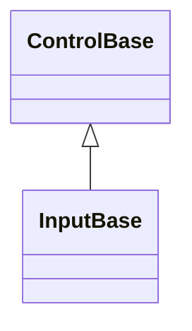

# InputBase authoring API

## Overview

`InputBase : ControlBase` is the public authoring base for a focusable control
that opts into one or more of the shared interaction primitives value editors,
text-captioned controls, and popup-backed inputs need: pointer/keyboard press
activation, a single owned text caption, an optional command, segmented temporal
editing, the Up/Down step-key translation, the shared drop-down disclosure
glyph, and an owned popup with its open/close lifecycle and modal composition.
Every capability is independent and opt-in through a verb-named `Enable*` method
called once, from the constructor; a control that never calls a given `Enable*`
method allocates none of that capability's state at all, with no forced caption,
no forced command, no forced popup, no forced segment engine, and no forced
press behavior for a control that does not use them.

Only the base contract is unconditional: every `InputBase` is `IsFocusable` and
`IsTabStop` by default, so `CanFocus` is effectively true without any `Enable*`
call. Calling an `Enable*` method a second time throws
`InvalidOperationException`; each capability is meant to be wired exactly once.

See [the caption and command capabilities page](pressable.md#overview) for the
single-text-caption authoring role (`EnableCaption`, `Text`, `TextControl`) and
the optional command (`EnableCommand`, `Command`, `CommandParameter`, and
`ExecuteCommandIfAny`) that controls whose entire content is one caption use - a
`Button`, a `CheckBox`, a `MenuItem`. A control whose owned content is richer
than a single caption - a drop-down field with a popup, a segmented date or time
field - never calls `EnableCaption` and calls only the `Enable*` methods it
needs, the way [`ComboBox`](input/combo-box.md#overview),
[`DateInput`](input/date-input.md#overview),
[`DateTimeInput`](input/date-time-input.md#overview), and
[`TimeInput`](input/time-input.md#overview) do. `NavigationViewItem` and the
internal `TabHeader` also skip `EnableCaption`, since each backs `Text` with its
own field and draws its label directly instead of through an owned caption
child. See the
[custom-input walkthrough](../walkthroughs/custom-controls.md#compose-input-capabilities)
for a complete external derivative.

## Inheritance



## API

| Member                                                       | Type                   | Default  | Description                                                                                                                                                 |
| ------------------------------------------------------------ | ---------------------- | -------- | ----------------------------------------------------------------------------------------------------------------------------------------------------------- |
| `InteractionBounds`                                          | `Rect`                 | `Bounds` | Protected virtual; the rectangle press interaction and `HitTest` evaluate. Override when a pressed face paints translated.                                  |
| `IsOpen`                                                     | `bool`                 | —        | Public; the owned popup's open state. Throws `InvalidOperationException` on get or set before `EnablePopup` runs.                                           |
| `DropDownIndicatorWidth` (constant)                          | `int`                  | `1`      | Protected; the cell width every drop-down field reserves for its disclosure indicator.                                                                      |
| `EnablePressActivation()`                                    | `void`                 | —        | Opts into the shared pointer-press and Enter/Space keyboard-activation state machine.                                                                       |
| `HandlePressActivation(RoutedEventArgs)`                     | `void`                 | —        | Routes one event through the press-activation state machine; a no-op before `EnablePressActivation` runs.                                                   |
| `Activate(ActivationCause)`                                  | `void`                 | —        | Protected virtual; a control that enables press activation overrides it to commit its action.                                                               |
| `EnableCaption()`                                            | `void`                 | —        | Opts into the single-text-caption authoring role: a lazily materialized owned caption child, ambient appearance tracking, and the shared access-key wiring. |
| `Text`                                                       | `string`               | `""`     | The non-null caption string. The getter never throws; the setter throws `InvalidOperationException` before `EnableCaption` runs.                            |
| `TextControl`                                                | `Display.Text?`        | `null`   | Protected, read-only; the lazily materialized owned caption child, or null before `Text` is first assigned.                                                 |
| `EnableCommand()`                                            | `void`                 | —        | Opts into an optional command a concrete control invokes on activation.                                                                                     |
| `Command`                                                    | `ICommand?`            | `null`   | Both accessors throw `InvalidOperationException` before `EnableCommand` runs.                                                                               |
| `CommandParameter`                                           | `object?`              | `null`   | Borrowed parameter passed to `Command` queries and execution; gated the same way as `Command`.                                                              |
| `ExecuteCommandIfAny()`                                      | `void`                 | —        | Protected; invokes `Command` with `CommandParameter` when a command is bound and allows execution.                                                          |
| `EnableSegmentEditing(...)` (in-assembly)                    | `SegmentFieldBehavior` | —        | Private protected; opts into the shared active-segment navigation, digit-entry buffering, and pointer hit-testing engine. In-assembly derivatives only.     |
| `TryGetStepDelta(KeyEventArgs, out int)`                     | `bool`                 | —        | Protected static; translates an Up key to `+1` and a Down key to `-1`, returning `false` for every other key.                                               |
| `ResolveDropDownGlyph(Rune)`                                 | `Rune`                 | —        | Resolves the shared disclosure chevron from the active theme's `InputStyle`, falling back to the supplied code-owned glyph.                                 |
| `DrawDropDownIndicator(TerminalCanvas, Rect, TerminalStyle)` | `void`                 | —        | Protected; draws the shared disclosure chevron via `ResolveDropDownGlyph`, right-aligned within `DropDownIndicatorWidth` at the content box's top row.      |
| `EnablePopup(...)`                                           | `Popup`                | —        | Opts into an owned popup: constructs it, registers its owned framework-part slot, and composes the shared open/close coordinator. Returns the popup.        |
| `OnDropDownOpened()`, `OnDropDownClosed()`                   | `void`                 | —        | Protected virtual, no-op by default; a control that enables the popup overrides these to raise its own public events.                                       |
| `VerifyMutable()`                                            | `void`                 | —        | Exposes `ControlBase`'s internal off-dispatcher/disposed guard under a protected name a third-party derivative can call directly.                           |

`CanExecuteChanged` may arrive from any thread. While attached, command-driven
render invalidation is marshaled to the owning dispatcher and is valid only for
that exact attachment generation. Detachment discards queued invalidation from
the former dispatcher, and notifications received while detached are inert.

`EnablePopup` accepts the popup's content control, its preferred
`PopupPlacement` (default `Below`), whether opening transfers focus to the first
eligible descendant of the content (`focusOnOpen`, default `false`), the popup's
own Tab-traversal boundary (`popupTabNavigation`, default `TabNavigation.None`),
and optional `beforeOpen`/`beforeCloseFocusRestore` hooks for owner-specific
work such as seeding a value or discarding in-progress state. The constructed
popup always anchors to the owning control, omits the frame edge adjoining it
(`ConnectsToAnchor`), and never tracks the anchor's own reflow independently -
the owner re-arranges its popup child from its own layout pass every time
instead.

## Example

```csharp
public sealed class TagField : InputBase
{
    private readonly ListView _suggestions;

    public TagField()
    {
        _suggestions = new ListView { IsTabStop = false };
        EnablePopup(_suggestions, focusOnOpen: false);
        EnablePressActivation();
    }

    protected override void Activate(ActivationCause cause) => IsOpen = !IsOpen;

    protected override void OnDropDownOpened() => DropDownOpened?.Invoke(this, EventArgs.Empty);

    protected override void OnDropDownClosed() => DropDownClosed?.Invoke(this, EventArgs.Empty);

    public event EventHandler? DropDownOpened;
    public event EventHandler? DropDownClosed;
}
```

## Expected behavior

| Scope                 | Observable evidence                                                                                                                                                                      |
| --------------------- | ---------------------------------------------------------------------------------------------------------------------------------------------------------------------------------------- |
| Public API            | Every `Enable*` method is idempotence-guarded, and each capability's state exists only after its own `Enable*` call runs.                                                                |
| Integrated behavior   | Composed capabilities (press activation driving an owned popup, segment editing alongside a popup) operate without collision, matching the concrete controls that ship with the library. |
| Complete runtime path | Attachment, focus restoration on popup close, and disposal complete without leaked subscriptions, whether zero, one, or every capability is enabled.                                     |

A derived control that never calls `EnablePopup` owns no popup framework-part
slot at all - `OwnedControlCount` and `FindOwnedSlot("drop-down")` reflect that
directly. A derived control that never calls `EnableSegmentEditing` never
constructs the shared segment engine. The unconditional
`IsFocusable`/`IsTabStop` default is the only cost every `InputBase` pays.
