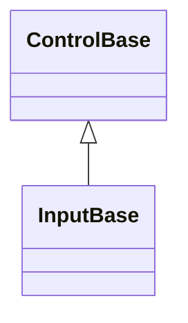

# InputBase authoring API

## Overview

`InputBase : ControlBase` is the public authoring base for a focusable control
that opts into one or more of the shared interaction primitives value editors,
text-captioned controls, and popup-backed inputs need: pointer/keyboard press
activation, a single owned text caption, an optional command, segmented temporal
editing, transient numeric editing for in-assembly decimal fields, the Up/Down
step-key translation, the shared drop-down disclosure glyph, and an owned popup
with its open/close lifecycle and modal composition. Every capability is
independent and opt-in through a verb-named `Enable*` method called once, from
the constructor; a control that never calls a given `Enable*` method allocates
none of that capability's state at all, with no forced caption, no forced
command, no forced popup, no forced segment engine, and no forced numeric engine
or press behavior for a control that does not use them.

The base contract is deliberately small but not appearance-neutral: every
`InputBase` is `IsFocusable` and `IsTabStop` by default, and resolves its
default appearance from `InputStyle` without allocating optional capability
state. `StartAffix` and `EndAffix` provide the inherited optional
edge-decoration contract; each concrete input decides how its layout reserves
those cells. A concrete typed Style still supersedes that fallback. Calling an
`Enable*` method a second time throws `InvalidOperationException`; each
capability is meant to be wired exactly once.

Press/keyboard activation (`EnablePressActivation`, `HandlePressActivation`,
`Activate`, `TryActivate`, `InteractionBounds`), pointer-driven drag
(`EnableDrag`, `TryStartDrag`, `CancelDrag`, `IsDragging`), and the owned popup
with its open/close lifecycle and modal composition (`EnablePopup`,
`IsPopupOpen`, `AcceptPopupAndClose`, `OnDropDownOpened`/`OnDropDownClosed`,
`OnPopupArranged`) are inherited straight from [`ControlBase`](control.md#api);
`InputBase` adds only the family's public `IsOpen` name for that open state.
Every capability on this page builds on top of a focusable `ControlBase`, but
none of press activation, drag, or the popup capability is InputBase-specific,
so a control that needs one without any of InputBase's caption or command
machinery - `Expander`, `ListItem`, `Pager`, the internal
`InfoBarDismissButton`, `NavigationViewGroup`, `SuggestionInput`,
`CommandPalette`, and `CommandBar` - calls it directly without deriving
`InputBase` at all. See [the pressable capabilities page](pressable.md#overview)
for the shared press/drag state machine and interaction contract, and
[Owned popups](control.md#owned-popups) for the popup capability's complete
authoring contract.

See [the caption and command capabilities page](pressable.md#overview) for the
single-text-caption authoring role (`EnableCaption`, `Text`, `TextControl`) and
the optional command (`EnableCommand`, `Command`, `CommandParameter`, and
`ExecuteCommandIfAny`) that controls whose entire content is one caption use - a
`Button`, a `CheckBox`, a `MenuItem`. A control whose owned content is richer
than a single caption - a drop-down field with a popup, a segmented date or time
field - never calls `EnableCaption` and calls only the `Enable*` methods it
needs, the way [`ComboBox`](input/combo-box.md#overview),
[`DateInput`](input/date-input.md#overview),
[`DateTimeInput`](input/date-time-input.md#overview), and
[`TimeInput`](input/time-input.md#overview) do.
[`NumericInputBase`](input/numeric-input-base.md#overview) - the shared base of
[`NumberInput`](input/number-input.md#overview) and
[`CurrencyInput`](input/currency-input.md#overview) - enables transient numeric
editing once for both, while each derivative retains only its own parsing,
formatting, and committed value policy. `NavigationViewItem` and the internal
`TabHeader` also skip `EnableCaption`, since each backs `Text` with its own
field and draws its label directly instead of through an owned caption child.
See the
[custom-input walkthrough](../walkthroughs/custom-controls.md#compose-input-capabilities)
for a complete external derivative.

## Inheritance



## API

| Member                                                       | Type                     | Default | Description                                                                                                                                                                                                             |
| ------------------------------------------------------------ | ------------------------ | ------- | ----------------------------------------------------------------------------------------------------------------------------------------------------------------------------------------------------------------------- |
| `GetDefaultAppearanceStates(Theme?)`                         | `AppearanceStates`       | Input   | Protected override; supplies the shared `InputStyle` appearance fallback for every derivative, including a capability-free one.                                                                                         |
| `StartAffix`                                                 | `Affix?`                 | `null`  | Public; optional leading edge-pinned application decoration. The concrete input owns its cell reservation.                                                                                                              |
| `EndAffix`                                                   | `Affix?`                 | `null`  | Public; optional trailing edge-pinned application decoration. The concrete input owns its cell reservation.                                                                                                             |
| `DropDownIndicatorWidth` (constant)                          | `int`                    | `1`     | Protected; the cell width every drop-down field reserves for its disclosure indicator.                                                                                                                                  |
| `GetSelectableTextSnapshot()`                                | `SelectableTextSnapshot` | —       | Override; includes the owned caption in the semantic text and visible grapheme geometry it returns as an owned snapshot.                                                                                                |
| `EnableCaption()`                                            | `void`                   | —       | Opts into the single-text-caption authoring role: a lazily materialized owned caption child, ambient appearance tracking, and contract-based shared access-key ownership.                                               |
| `Text`                                                       | `string`                 | `""`    | The non-null caption string. The getter never throws; the setter throws `InvalidOperationException` before `EnableCaption` runs.                                                                                        |
| `TextControl`                                                | `Display.Text?`          | `null`  | Protected, read-only; the lazily materialized owned caption child, or null before `Text` is first assigned.                                                                                                             |
| `EnableCommand()`                                            | `void`                   | —       | Opts into an optional command a concrete control invokes on activation.                                                                                                                                                 |
| `Command`                                                    | `ICommand?`              | `null`  | Both accessors throw `InvalidOperationException` before `EnableCommand` runs.                                                                                                                                           |
| `CommandParameter`                                           | `object?`                | `null`  | Borrowed parameter passed to `Command` queries and execution; gated the same way as `Command`.                                                                                                                          |
| `ExecuteCommandIfAny()`                                      | `void`                   | —       | Protected; invokes `Command` with `CommandParameter` when a command is bound and allows execution.                                                                                                                      |
| `EnableSegmentEditing(...)` (in-assembly)                    | `SegmentFieldBehavior`   | —       | Private protected; opts into shared routed key classification, active-segment navigation, digit-entry buffering, pointer hit testing, active/null rendering, and focus-safe continuation. In-assembly derivatives only. |
| `EnableNumericEditing(...)` (in-assembly)                    | `void`                   | —       | Private protected; opts into the shared transient numeric buffer's routed keys, focus lifecycle, selection, placeholder, affix-aware rendering, and cursor replay. In-assembly derivatives only.                        |
| `TryGetStepDelta(KeyEventArgs, out int)`                     | `bool`                   | —       | Protected static; translates scalar-eligible Up to `+1` and Down to `-1`; command-modified arrows return `false`.                                                                                                       |
| `ResolveDropDownGlyph(Rune)`                                 | `Rune`                   | —       | Resolves the shared disclosure chevron from the active theme's `InputStyle`, falling back to the supplied code-owned glyph.                                                                                             |
| `DrawDropDownIndicator(TerminalCanvas, Rect, TerminalStyle)` | `void`                   | —       | Protected; draws the shared disclosure chevron via `ResolveDropDownGlyph`, right-aligned within `DropDownIndicatorWidth` at the content box's top row.                                                                  |
| `VerifyMutable()`                                            | `void`                   | —       | Exposes `ControlBase`'s internal off-dispatcher/disposed guard under a protected name a third-party derivative can call directly.                                                                                       |

`CanExecuteChanged` may arrive from any thread. While attached, command-driven
render invalidation is marshaled to the owning dispatcher and is valid only for
that exact attachment generation. Detachment discards queued invalidation from
the former dispatcher, and notifications received while detached are inert.
Command replacement uses reference identity and reconciles one exact borrowed
event handler before publishing `PropertyChanged`. Nested replacement from a
property callback or event accessor is latest-wins; a superseded candidate is
detached, and a failed add or remove remains retryable without duplicating the
winning subscription. Assigning the identical healthy command reference is
silent and does not touch its event accessors.

Segment editing owns the focus-safe digit-buffer lifecycle, guarded pointer
selection, exact scalar modifier policy, recognized-without-change handling,
Up/Down translation, and rendering of the active segment and null placeholder.
The active segment uses Reverse while every other null segment uses Dim, with
all foreground, background, underline, underline-color, and hyperlink channels
preserved from the resolved input style. `DateInput` alone asks the base to
return to its first segment on each focus entry; `TimeInput` and `DateTimeInput`
retain the last active segment.

Public programmatic activation methods on concrete inputs call
`TryActivate(ActivationCause.Programmatic)`. The shared boundary verifies
dispatcher affinity and disposal, rejects unknown causes, and admits activation
only while the complete ancestor chain is effectively enabled and visible. The
concrete `Activate` override still owns state, event, and command ordering; the
base does not continue after that override returns, so callbacks may hide,
disable, detach, or dispose the control without a stale framework action.

## Keyboard

| Key            | Behavior                                                                                                   |
| -------------- | ---------------------------------------------------------------------------------------------------------- |
| Enter          | Activates immediately when the derived control enables press activation.                                   |
| Space          | Shows the pressed state on key down and activates on the matching key up when press activation is enabled. |
| Up / Down      | Can be mapped by a derived value control to increase or decrease its value.                                |
| Alt+access key | Focuses and activates the derived control when the caption capability declares that access key.            |

## Example

```csharp
public sealed class TagField : InputBase
{
    private readonly ListView _suggestions;

    public TagField()
    {
        _suggestions = new ListView { IsTabStop = false };
        EnablePopup(_suggestions, focusOnOpen: false);
        EnablePressActivation();
    }

    protected override void Activate(ActivationCause cause) => IsOpen = !IsOpen;

    protected override void OnDropDownOpened() => DropDownOpened?.Invoke(this, EventArgs.Empty);

    protected override void OnDropDownClosed() => DropDownClosed?.Invoke(this, EventArgs.Empty);

    public event EventHandler? DropDownOpened;
    public event EventHandler? DropDownClosed;
}
```

`EnablePopup`, `AcceptPopupAndClose`, and the `OnDropDownOpened`/
`OnDropDownClosed`/`OnPopupArranged` hooks used above are inherited from
`ControlBase`, and `IsOpen` is this family's name for the inherited
`IsPopupOpen`; see [Owned popups](control.md#owned-popups) for their complete
authoring contract, including base-owned layout and lifecycle forwarding.

## Expected behavior

| Scope                 | Observable evidence                                                                                                                                                                                                    |
| --------------------- | ---------------------------------------------------------------------------------------------------------------------------------------------------------------------------------------------------------------------- |
| Public API            | Every `Enable*` method is idempotence-guarded; `TryActivate` validates and gates semantic activation; capability state exists only after its own `Enable*` call.                                                       |
| Integrated behavior   | Composed capabilities (press activation driving an owned popup, segment editing alongside a popup, or transient numeric editing) operate without collision, matching the concrete controls that ship with the library. |
| Complete runtime path | Attachment, focus restoration on popup close, and disposal complete without leaked subscriptions, whether zero, one, or every capability is enabled.                                                                   |

A derived control that never calls `EnableSegmentEditing` never constructs the
shared segment engine, and one that never calls `EnableNumericEditing` never
constructs the transient numeric behavior. The unconditional
`IsFocusable`/`IsTabStop` default is the only cost every `InputBase` pays.
