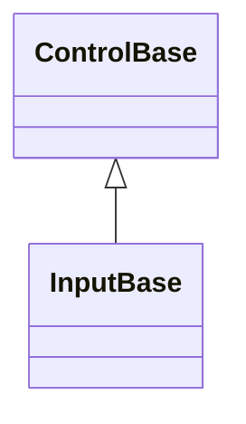

# InputBase authoring API

## Overview

`InputBase : ControlBase` is the public authoring base for a focusable control
that opts into one or more of the shared interaction primitives value editors,
text-captioned controls, and popup-backed inputs need: pointer/keyboard press
activation, a single owned text caption, an optional command, segmented temporal
editing, transient numeric editing for in-assembly decimal fields, the Up/Down
step-key translation, the shared drop-down disclosure glyph, and an owned popup
with its open/close lifecycle and modal composition. Every capability is
independent and opt-in through a verb-named `Enable*` method called once, from
the constructor; a control that never calls a given `Enable*` method allocates
none of that capability's state at all, with no forced caption, no forced
command, no forced popup, no forced segment engine, and no forced numeric engine
or press behavior for a control that does not use them.

The base contract is deliberately small but not appearance-neutral: every
`InputBase` is `IsFocusable` and `IsTabStop` by default, and resolves its
default appearance from `InputStyle` without allocating optional capability
state. `StartAffix` and `EndAffix` provide the inherited optional
edge-decoration contract; each concrete input decides how its layout reserves
those cells. A concrete typed Style still supersedes that fallback. Calling an
`Enable*` method a second time throws `InvalidOperationException`; each
capability is meant to be wired exactly once.

Press/keyboard activation (`EnablePressActivation`, `HandlePressActivation`,
`Activate`, `TryActivate`, `InteractionBounds`), pointer-driven drag
(`EnableDrag`, `TryStartDrag`, `CancelDrag`, `IsDragging`), and the owned popup
with its open/close lifecycle and modal composition (`EnablePopup`,
`EnablePopupNavigationSession`, `IsPopupOpen`, `AcceptPopupAndClose`,
`RestartPopupNavigationSession`, `PopupTransitionVersion`,
`PopupSessionGeneration`, `DropDownHeight`, `PopupChrome`, `ResetPopupChrome()`,
`DropDownOpened`/`DropDownClosed`, `OnDropDownOpened`/`OnDropDownClosed`,
`OnPopupArranged`) are inherited straight from [`ControlBase`](control.md#api);
`InputBase` adds only the family's public `IsOpen` name for that open state. See
[Owned popups](control.md#owned-popups) for the provisional navigation session's
callback contract - the same contract a `TagField`-style external derivative
opts into by calling `EnablePopupNavigationSession` instead of the plain
`EnablePopup`. Every capability on this page builds on top of a focusable
`ControlBase`, but none of press activation, drag, or the popup capability is
InputBase-specific, so a control that needs one without any of InputBase's
caption or command machinery - `Expander`, `ListItem`, `Pager`, the internal
`InfoBarDismissButton`, `NavigationViewGroup`, `SuggestionInput`,
`CommandPalette`, and `CommandBar` - calls it directly without deriving
`InputBase` at all. See [the pressable capabilities page](pressable.md#overview)
for the shared press/drag state machine and interaction contract, and
[Owned popups](control.md#owned-popups) for the popup capability's complete
authoring contract.

See [the caption and command capabilities page](pressable.md#overview) for the
single-text-caption authoring role (`EnableCaption`, `Text`, `TextControl`) and
the optional command (`EnableCommand`, `Command`, `CommandParameter`, and
`ExecuteCommandIfAny`) that controls whose entire content is one caption use - a
`Button`, a `CheckBox`, a `MenuItem`. A control whose owned content is richer
than a single caption - a drop-down field with a popup, a segmented date or time
field - never calls `EnableCaption` and calls only the `Enable*` methods it
needs, the way [`ComboBox`](input/combo-box.md#overview),
[`DateInput`](input/date-input.md#overview),
[`DateTimeInput`](input/date-time-input.md#overview), and
[`TimeInput`](input/time-input.md#overview) do.
[`NumericInputBase`](input/numeric-input-base.md#overview) - the shared base of
[`NumberInput`](input/number-input.md#overview) and
[`CurrencyInput`](input/currency-input.md#overview) - enables transient numeric
editing once for both, while each derivative retains only its own parsing,
formatting, and committed value policy.
[`TemporalInputBase<TValue>`](input/temporal-input-base.md#overview) does the
same for `EnableSegmentEditing`: it owns the nullable bounded value state, the
lazy dispatcher-clock seed, the shared segment-layout skeleton, and the typed
`ValueChanged` event once, calling `EnableSegmentEditing` itself from its own
constructor so a derivative implements only the calendar or clock arithmetic
seams the abstract class declares - without itself needing friend access to this
in-assembly capability. `NavigationViewItem` and the internal `TabHeader` also
skip `EnableCaption`, since each backs `Text` with its own field and draws its
label directly instead of through an owned caption child. See the
[custom-input walkthrough](../walkthroughs/custom-controls.md#compose-input-capabilities)
for a complete external derivative.

## Inheritance



## API

| Member                                                       | Type                     | Default | Description                                                                                                                                                                                                                                                                                                                                                                                                                                                                                                                                                                                                                                                                                           |
| ------------------------------------------------------------ | ------------------------ | ------- | ----------------------------------------------------------------------------------------------------------------------------------------------------------------------------------------------------------------------------------------------------------------------------------------------------------------------------------------------------------------------------------------------------------------------------------------------------------------------------------------------------------------------------------------------------------------------------------------------------------------------------------------------------------------------------------------------------- |
| `GetDefaultAppearanceStates(Theme?)`                         | `AppearanceStates`       | Input   | Protected override; supplies the shared `InputStyle` appearance fallback for every derivative, including a capability-free one.                                                                                                                                                                                                                                                                                                                                                                                                                                                                                                                                                                       |
| `StartAffix`                                                 | `Affix?`                 | `null`  | Public; optional leading edge-pinned application decoration. The concrete input owns its cell reservation.                                                                                                                                                                                                                                                                                                                                                                                                                                                                                                                                                                                            |
| `EndAffix`                                                   | `Affix?`                 | `null`  | Public; optional trailing edge-pinned application decoration. The concrete input owns its cell reservation.                                                                                                                                                                                                                                                                                                                                                                                                                                                                                                                                                                                           |
| `OnAffixChanged()`                                           | `void`                   | —       | Protected virtual, no-op by default; runs after either affix's own change has committed, so an override reads `StartAffix`/`EndAffix` at their new values to reconcile a cached, affix-dependent layout box.                                                                                                                                                                                                                                                                                                                                                                                                                                                                                          |
| `DropDownIndicatorWidth` (constant)                          | `int`                    | `1`     | Protected; the cell width every drop-down field reserves for its disclosure indicator glyph itself.                                                                                                                                                                                                                                                                                                                                                                                                                                                                                                                                                                                                   |
| `DropDownIndicatorReservedWidth` (constant)                  | `int`                    | `2`     | Protected; `DropDownIndicatorWidth` plus the one-cell gap kept before it - the full reservation `ComboBox`, `DateInput`, and `DateTimeInput` all subtract from their content box.                                                                                                                                                                                                                                                                                                                                                                                                                                                                                                                     |
| `GetSelectableTextSnapshot()`                                | `SelectableTextSnapshot` | —       | Override; includes the owned caption in the semantic text and visible grapheme geometry it returns as an owned snapshot.                                                                                                                                                                                                                                                                                                                                                                                                                                                                                                                                                                              |
| `EnableCaption()`                                            | `void`                   | —       | Opts into the single-text-caption authoring role: a lazily materialized owned caption child, ambient appearance tracking, and contract-based shared access-key ownership.                                                                                                                                                                                                                                                                                                                                                                                                                                                                                                                             |
| `Text`                                                       | `string`                 | `""`    | The non-null caption string. The getter never throws; the setter throws `InvalidOperationException` before `EnableCaption` runs.                                                                                                                                                                                                                                                                                                                                                                                                                                                                                                                                                                      |
| `TextControl`                                                | `Display.Text?`          | `null`  | Protected, read-only; the lazily materialized owned caption child, or null before `Text` is first assigned.                                                                                                                                                                                                                                                                                                                                                                                                                                                                                                                                                                                           |
| `MeasureSelectionMarkCaption(...)`                           | `Size`                   | —       | Protected; measures a fixed-width selection mark beside the owned caption (call after `EnableCaption`, or the caption side reports zero), plus inherited affixes outside that content. Takes the mark's cell width, the gap kept beside a present caption, and the gap kept beside each present affix. `CheckBox` and `RadioButton` call this from `MeasureOverride`.                                                                                                                                                                                                                                                                                                                                 |
| `ArrangeSelectionMarkCaption(...)`                           | `void`                   | —       | Protected; arranges the owned caption on the side opposite the mark, inside affix reservations. Takes the identical mark width, mark gap, and affix gap passed to the matching `MeasureSelectionMarkCaption` call, plus the validated mark edge.                                                                                                                                                                                                                                                                                                                                                                                                                                                      |
| `RenderSelectionMark(...)`                                   | `void`                   | —       | Protected; paints one already formatted mark plus inherited affixes over the control's resolved opaque fill. An affix draws only when its full width still fits beside the mark; a starved layout drops it rather than truncating it or the mark.                                                                                                                                                                                                                                                                                                                                                                                                                                                     |
| `EnableCommand()`                                            | `void`                   | —       | Opts into an optional command a concrete control invokes on activation.                                                                                                                                                                                                                                                                                                                                                                                                                                                                                                                                                                                                                               |
| `Command`                                                    | `ICommand?`              | `null`  | Both accessors throw `InvalidOperationException` before `EnableCommand` runs.                                                                                                                                                                                                                                                                                                                                                                                                                                                                                                                                                                                                                         |
| `CommandParameter`                                           | `object?`                | `null`  | Borrowed parameter passed to `Command` queries and execution; gated the same way as `Command`.                                                                                                                                                                                                                                                                                                                                                                                                                                                                                                                                                                                                        |
| `ExecuteCommandIfAny()`                                      | `void`                   | —       | Protected; invokes `Command` with `CommandParameter` when a command is bound and allows execution.                                                                                                                                                                                                                                                                                                                                                                                                                                                                                                                                                                                                    |
| `EnableSegmentEditing(...)` (in-assembly)                    | `SegmentFieldBehavior`   | —       | Private protected; opts into shared routed key classification, active-segment navigation, digit-entry buffering, pointer hit testing, active/null rendering, routed key/pointer dispatch, and focus-safe continuation. Takes the owner's `SegmentFieldKeyOptions`, whether it reserves the drop-down indicator, whether focus returns to the first segment, and an optional pre-routing callback. In-assembly derivatives only - `SegmentFieldBehavior`, `SegmentFieldKeyOptions`, and `SegmentDescriptor` stay internal engine types; [`TemporalInputBase<TValue>`](input/temporal-input-base.md#overview) calls this once from its own constructor so an out-of-assembly derivative never needs to. |
| `SwallowsInputWhilePopupOpen`                                | `bool`                   | `true`  | Protected virtual; when the popup capability is enabled, gates whether `OnEvent` swallows every routed event outright while the popup is open, before segment routing inspects it. A field with no popup never reaches this check.                                                                                                                                                                                                                                                                                                                                                                                                                                                                    |
| `ResolveSegmentBox()`                                        | `Rect`                   | —       | Protected; the content box minus `DropDownIndicatorReservedWidth` when reserved, deflated for `StartAffix`/`EndAffix`. Authoring surface once `EnableSegmentEditing` has run.                                                                                                                                                                                                                                                                                                                                                                                                                                                                                                                         |
| `MeasureSegmentedField()`                                    | `Size`                   | —       | Protected; the segmented field's full desired size on one content row - affixes, every segment's resolved width, and the indicator reservation when enabled. Authoring surface once `EnableSegmentEditing` has run.                                                                                                                                                                                                                                                                                                                                                                                                                                                                                   |
| `RenderSegmentedField(TerminalCanvas, bool)`                 | `void`                   | —       | Protected; renders affixes, the active-segment-highlighted value, and the drop-down indicator (when reserved) in one call. Authoring surface once `EnableSegmentEditing` has run.                                                                                                                                                                                                                                                                                                                                                                                                                                                                                                                     |
| `InvalidateSegmentLayout()`                                  | `void`                   | —       | Protected; clamps the active segment back into range and discards a partial digit after a layout-affecting property change - the pair every segmented field previously repeated by hand. Authoring surface once `EnableSegmentEditing` has run.                                                                                                                                                                                                                                                                                                                                                                                                                                                       |
| `EnableNumericEditing(...)` (in-assembly)                    | `void`                   | —       | Private protected; opts into the shared transient numeric buffer's routed keys, focus lifecycle, selection, placeholder, affix-aware rendering, and cursor replay. In-assembly derivatives only.                                                                                                                                                                                                                                                                                                                                                                                                                                                                                                      |
| `RenderInputPlaceholder(TerminalCanvas, Rect, string)`       | `void`                   | —       | Protected; draws a single-line hint as complete grapheme clusters with a dimmed variant of `ResolvedStyle`, stopping at the first line break or the first cluster that would cross the bounds. Call only while the field's live content is empty; needs no capability enabled first.                                                                                                                                                                                                                                                                                                                                                                                                                  |
| `TryGetStepDelta(KeyEventArgs, out int)`                     | `bool`                   | —       | Protected static; translates scalar-eligible Up to `+1` and Down to `-1`; command-modified arrows return `false`.                                                                                                                                                                                                                                                                                                                                                                                                                                                                                                                                                                                     |
| `ResolveDropDownGlyph(Rune)`                                 | `Rune`                   | —       | Resolves the shared disclosure chevron from the active theme's `InputStyle`, falling back to the supplied code-owned glyph.                                                                                                                                                                                                                                                                                                                                                                                                                                                                                                                                                                           |
| `DrawDropDownIndicator(TerminalCanvas, Rect, TerminalStyle)` | `void`                   | —       | Protected; draws the shared disclosure chevron via `ResolveDropDownGlyph`, right-aligned within `DropDownIndicatorWidth` at the content box's top row.                                                                                                                                                                                                                                                                                                                                                                                                                                                                                                                                                |
| `HandleDropDownOpeningCommand(KeyEventArgs)`                 | `bool?`                  | —       | Protected; requires the popup capability already enabled. Opens the popup on an exact Alt+Down or F4 key down, returning `true`; returns `false` for a candidate with extra modifiers, or `null` when the key is not an opening gesture at all. Opening runs the owner's `beforeOpen` hook and raises `DropDownOpened` synchronously before returning.                                                                                                                                                                                                                                                                                                                                                |

`CanExecuteChanged` may arrive from any thread. While attached, command-driven
render invalidation is marshaled to the owning dispatcher and is valid only for
that exact attachment generation. Detachment discards queued invalidation from
the former dispatcher, and notifications received while detached are inert.
Command replacement uses reference identity and reconciles one exact borrowed
event handler before publishing `PropertyChanged`. Nested replacement from a
property callback or event accessor is latest-wins; a superseded candidate is
detached, and a failed add or remove remains retryable without duplicating the
winning subscription. Assigning the identical healthy command reference is
silent and does not touch its event accessors.

Segment editing owns the focus-safe digit-buffer lifecycle, guarded pointer
selection, exact scalar modifier policy, recognized-without-change handling,
Up/Down translation, and rendering of the active segment and null placeholder.
The active segment uses Reverse while every other null segment uses Dim, with
all foreground, background, underline, underline-color, and hyperlink channels
preserved from the resolved input style. `DateInput` alone overrides
`TemporalInputBase<TValue>.ActivateFirstSegmentOnFocus` to return to its first
segment on each focus entry; `TimeInput` and `DateTimeInput` keep that seam's
default and retain the last active segment.

Once `EnableSegmentEditing` has run, `OnEvent` routes every key and pointer
event to the shared engine itself: an optional pre-routing callback runs first
(each shipped temporal field lazily seeds its value from the current clock
here), then a disabled or hidden control falls straight through to
`ControlBase.OnEvent`. Otherwise, when the popup capability is also enabled and
`SwallowsInputWhilePopupOpen` holds (the default), every event is swallowed
outright while the popup is open - `DateInput` and `DateTimeInput` never see a
key or pointer press reach their field while the calendar is showing.
`TimeInput` has no popup capability at all, so it never reaches that check and
always routes straight through. A recognized key or pointer hit is then
classified by the shared engine; an unhandled event still reaches press
activation (a no-op when that capability is not enabled) before falling through
to `ControlBase.OnEvent`.

Public programmatic activation methods on concrete inputs call
`TryActivate(ActivationCause.Programmatic)`. The shared boundary verifies
dispatcher affinity and disposal, rejects unknown causes, and admits activation
only while the complete ancestor chain is effectively enabled and visible. The
concrete `Activate` override still owns state, event, and command ordering; the
base does not continue after that override returns, so callbacks may hide,
disable, detach, or dispose the control without a stale framework action.

## Keyboard

| Key            | Behavior                                                                                                   |
| -------------- | ---------------------------------------------------------------------------------------------------------- |
| Enter          | Activates immediately when the derived control enables press activation.                                   |
| Space          | Shows the pressed state on key down and activates on the matching key up when press activation is enabled. |
| Up / Down      | Can be mapped by a derived value control to increase or decrease its value.                                |
| Alt+access key | Focuses and activates the derived control when the caption capability declares that access key.            |

## Example

```csharp
public sealed class TagField : InputBase
{
    private readonly ListView _suggestions;

    public TagField()
    {
        _suggestions = new ListView { IsTabStop = false };
        EnablePopup(_suggestions, focusOnOpen: false);
        EnablePressActivation();
    }

    protected override void Activate(ActivationCause cause) => IsOpen = !IsOpen;
}
```

`EnablePopup`, `AcceptPopupAndClose`, `DropDownHeight`, `PopupChrome`,
`ResetPopupChrome()`, `DropDownOpened`/`DropDownClosed`, and the
`OnDropDownOpened`/`OnDropDownClosed`/`OnPopupArranged` hooks are all inherited
from `ControlBase` - `TagField` needs no code of its own to expose the popup's
height cap, chrome, or open/close events, and `IsOpen` is this family's name for
the inherited `IsPopupOpen`. A derived field whose own opening or closing work
needs to run alongside the inherited events - synchronizing a provisional
selection, for example - overrides `OnDropDownOpened`/`OnDropDownClosed` and
calls the base implementation to keep publishing them. See
[Owned popups](control.md#owned-popups) for their complete authoring contract,
including base-owned layout and lifecycle forwarding.

## Expected behavior

| Scope                 | Observable evidence                                                                                                                                                                                                    |
| --------------------- | ---------------------------------------------------------------------------------------------------------------------------------------------------------------------------------------------------------------------- |
| Public API            | Every `Enable*` method is idempotence-guarded; `TryActivate` validates and gates semantic activation; capability state exists only after its own `Enable*` call.                                                       |
| Integrated behavior   | Composed capabilities (press activation driving an owned popup, segment editing alongside a popup, or transient numeric editing) operate without collision, matching the concrete controls that ship with the library. |
| Complete runtime path | Attachment, focus restoration on popup close, and disposal complete without leaked subscriptions, whether zero, one, or every capability is enabled.                                                                   |

A derived control that never calls `EnableSegmentEditing` never constructs the
shared segment engine, and one that never calls `EnableNumericEditing` never
constructs the transient numeric behavior. The unconditional
`IsFocusable`/`IsTabStop` default is the only cost every `InputBase` pays.
