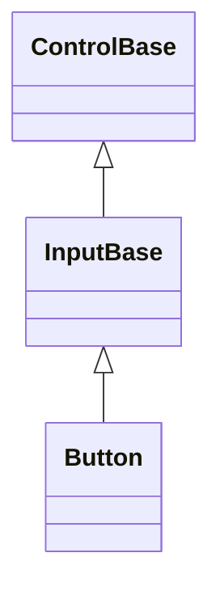

# Button

## Overview

`Button` is declared
`public sealed partial class Button : InputBase, IStyled<ButtonStyle>`. It is a
focusable command control whose caption is its inherited `Text`. Each completed
activation raises `Click` and, when a `Command` is bound and allows it, invokes
that command once, after `Click`.

## Inheritance



## API

| Member                       | Type                                | Default            | Description                                                                                                     |
| ---------------------------- | ----------------------------------- | ------------------ | --------------------------------------------------------------------------------------------------------------- |
| `Button()`                   | —                                   | —                  | Initializes an empty Button that inherits its presentation from the active Theme.                               |
| `Button(string text)`        | —                                   | —                  | Initializes a Button with the given caption; rejects `null`.                                                    |
| Inherited `Text`             | `string`                            | `""`               | The button's caption.                                                                                           |
| `TextAlignment`              | `Alignment`                         | `Alignment.Center` | Horizontal placement of the caption inside the style padding.                                                   |
| `StartAffix`                 | `Affix?`                            | `null`             | Optional leading edge-pinned decoration, reserved inside the face and outside the caption's own alignment box.  |
| `EndAffix`                   | `Affix?`                            | `null`             | Optional trailing edge-pinned decoration, reserved inside the face and outside the caption's own alignment box. |
| `Style`                      | `ButtonStyle?`                      | `null`             | Optional complete developer-authored presentation.                                                              |
| `ActualStyle`                | `ButtonStyle`                       | Resolved           | Read-only; the complete local, theme-owned, or code-owned presentation.                                         |
| Inherited `Command`          | `ICommand?`                         | `null`             | Runs after `Click`, when bound and `CanExecute` allows it.                                                      |
| Inherited `CommandParameter` | `object?`                           | `null`             | The borrowed parameter passed to `Command` queries and execution.                                               |
| `IsDefault`                  | `bool`                              | `false`            | Whether an owning Window treats Enter as a fallback activation for this button.                                 |
| `IsCancel`                   | `bool`                              | `false`            | Whether an owning Window treats Escape as a fallback activation for this button.                                |
| `PerformClick()`             | `void`                              | —                  | Activates an available, visible, enabled Button through its public API.                                         |
| `Click`                      | `EventHandler<ActivationEventArgs>` | No subscribers     | Raised after the released state commits and before command execution.                                           |

`ButtonStyle : InputStyle` is a complete immutable presentation: it carries
`Padding` alongside the inherited `Face`/`Border`/`Shadow`.
`ButtonStyle.Standard` is the flat bordered default with one horizontal padding
cell and Theme-owned state appearance; pressing changes its face without
changing border relief. `ButtonStyle.Filled` is a shadowed, borderless preset
with two horizontal padding cells and a fractional lower-right shadow. A `with`
expression creates a validated member-wise copy of `ButtonStyle.Default`
(`Standard`). Validation rejects any reachable state that combines a visible
shadow with enabled border sides. Button declares no `styles.*` theme key of its
own, so `Padding` is a fixed code-owned value (one horizontal cell) unless a
local `Style` assigns a different one. Assigning `Style` makes the whole style
local and authoritative, and assigning `null` hands ownership back to the Theme.
`ActualStyle` never returns null, and it changes when an inherited Theme changes
while `Style` is null.

`StartAffix` and `EndAffix` each reserve a fixed cell column pinned to a face
edge, inside the padding and outside the caption's own alignment box - setting
either never moves the caption, and `TextAlignment` never reaches into a
reserved affix column. The gap between a present affix and the caption comes
from the shared `InputStyle.AffixGap` (see
[styling.md](../../concepts/styling.md#instance-content-affix)). When the face
is too narrow for everything, the caption shrinks first, then the end affix
drops whole, then the start affix - never a partial cluster - and the decision
is re-evaluated against the control's actual bounds on every render. A
same-width content or color swap on either property repaints without
remeasuring, so an affix can animate (a spinner swapping frames, for example) at
render cost only.

Button does not expose the raw `Border` and `Shadow` properties, their reset
methods, or `SetAppearance`. Those remain protected seams for control authors,
because arbitrary chrome could break Button's border-or-shadow layout invariant.
The public `ActualBorder` and `ActualShadow` properties remain available for
inspection. A complete local `Style` may choose its own `Border.Relief` and
remains authoritative in every state. When the pointer hovers over a button, the
face fill excludes the border cells; a Theme may change any border member per
state, but a change to the face background alone never recolors the frame.

## Interaction

Pressing Space while focused starts a press on key down and activates on the
matching key up. Enter activates immediately. A primary pointer press focuses
the button and captures the pointer; releasing inside the bounds activates once.
Disabling, detaching, losing focus, or having capture cancelled clears the press
without activating. `PerformClick()` runs the same programmatic activation path.
It enters through [`InputBase.TryActivate`](../input-base.md#api), so direct or
ancestor-disabled/hidden state is a no-op while disposal and off-dispatcher
access retain their documented failures. Button still owns command gating and
raises `Click` before executing the captured command.

While pressed with a visible whole-cell shadow, the button paints its entire
face translated by the shadow offset instead of at its untranslated `Bounds`.
Button overrides [`InputBase.InteractionBounds`](../input-base.md#api) to return
that same translated rectangle, so press, drag, and release track the drawn
face: a cell the translated face newly covers activates on release, and a cell
it no longer covers does not — even where that cell lies inside or outside the
button's untranslated `Bounds`. `HitTest` still uses the untranslated `Bounds`,
which is the stable layout footprint before a press begins.

## Example


```csharp
var save = new Button { Text = "&Save" };
save.Click += (_, _) => Save();

var add = new Button
{
    Style = ButtonStyle.Filled,
    Text = "&Add"
};
```

## Expected behavior

| Scope               | Observable evidence                                                       |
| ------------------- | ------------------------------------------------------------------------- |
| Public API          | Validation, defaults, state changes, and deterministic output.            |
| Integrated behavior | Cross-component behavior through the real ownership and routing boundary. |

- A local `Style` wins over the Theme, assigning `null` restores Theme
  ownership, and replacing the Theme restyles buttons that have no local style.
- Style validation rejects invalid combinations, and the standard and filled
  styles render their exact documented cells.
- Standard buttons keep a flat border at rest, during pointer or Space holds,
  and after release or cancellation.
- Hovering and pressing may change the face background without changing border
  relief.
- Space, Enter, and pointer activation behave identically, capture cancellation
  clears a pending press, and the click event and command run in their
  documented order.
- Disabled buttons never activate, Unicode captions lay out correctly, and
  `ActualStyle` raises change notifications.
