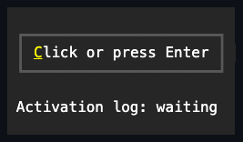
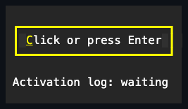

# Button

## Overview

`Button` is a sealed [`Pressable<ButtonStyle>`](../pressable.md#overview)
command control whose caption is its inherited `Text`. Each completed activation
raises `Click` and invokes the command once.

## API

| Member                        | Default       | Description                                                         |
| ----------------------------- | ------------- | ------------------------------------------------------------------- |
| `Style`                       | `null`        | Optional complete developer-authored `ButtonStyle`.                 |
| `ActualStyle`                 | Theme button  | The resolved style, taken from `Style`, the Theme, or the fallback. |
| `ButtonStyle.Standard`        | Bordered      | One horizontal padding cell with Theme-owned state appearance.      |
| `ButtonStyle.Filled`          | Shadowed fill | Two horizontal padding cells, no border, and a fractional shadow.   |
| Inherited `Text`              | `""`          | The button's caption.                                               |
| `TextAlignment`               | `Center`      | How the caption aligns within the style padding.                    |
| `Command`, `CommandParameter` | `null`        | Optional command and borrowed parameter.                            |
| `IsDefault`, `IsCancel`       | `false`       | Whether the button answers the window's Enter/Escape fallback.      |

A `ButtonStyle` is complete: it carries `Padding` alongside the inherited
`Face`/`Border`/`Shadow`. A `with` expression creates a validated member-wise
copy of `ButtonStyle.Default`. A theme document may additionally author a
`styles.button` section with `horizontalPadding`/`verticalPadding` integer
members; an active theme's section supplies `Padding` ahead of the code-owned
default whenever no local `Style` is assigned (see
[themes.md](../../concepts/themes.md#style-types)). Assigning `Style` makes the
whole style local and authoritative, and assigning `null` hands ownership back
to the Theme. `ActualStyle` never returns null, and it changes when an inherited
Theme changes while `Style` is null.

Button does not expose the raw `Border` and `Shadow` properties, their reset
methods, or `SetAppearance`. Those remain protected seams for control authors,
because arbitrary chrome could break Button's border-or-shadow layout invariant.
To customize the presentation, supply one validated `ButtonStyle`: validation
rejects any reachable state that combines a visible shadow with enabled border
sides. The public `ActualBorder` and `ActualShadow` properties remain available
for inspection.

When the pointer hovers over a button, the face fill excludes the border cells.
A Theme may change any border member per state, but a change to the face
background alone never recolors the frame.

## Interaction

Pressing Space while focused starts a press on key down and activates on the
matching key up. Enter activates immediately. A primary pointer press focuses
the button and captures the pointer; releasing inside the bounds activates once.
Disabling, detaching, losing focus, or having capture cancelled clears the press
without activating. `PerformClick()` runs the same programmatic activation path.

While pressed with a visible whole-cell shadow, the button paints its entire
face translated by the shadow offset instead of at its untranslated `Bounds`.
Button overrides
[`PressableBase.InteractionBounds`](../pressable.md#interaction) to return that
same translated rectangle, so press, drag, and release track the drawn face: a
cell the translated face newly covers activates on release, and a cell it no
longer covers does not - even where that cell lies inside or outside the
button's untranslated `Bounds`. `HitTest` still uses the untranslated `Bounds`,
which is the stable layout footprint before a press begins.

## Example





```csharp
var save = new Button { Text = "&Save" };
save.Click += (_, _) => Save();

var add = new Button
{
    Style = ButtonStyle.Filled,
    Text = "&Add"
};
```

## Expected behavior

A local `Style` wins over the Theme, assigning `null` restores Theme ownership,
and replacing the Theme restyles buttons that have no local style. Style
validation rejects invalid combinations, and the standard and filled styles
render their exact documented cells. Hovering changes the face background
without recoloring the border. Space, Enter, and pointer activation behave
identically, capture cancellation clears a pending press, and the click event
and command run in their documented order. Disabled buttons never activate,
Unicode captions lay out correctly, and `ActualStyle` raises change
notifications.
