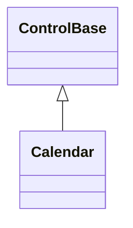

# Calendar

## Overview

`Calendar` is declared
`public sealed class Calendar : ControlBase, IStyled<CalendarStyle>`. It is a
single focusable, direct-rendered control for choosing either one Gregorian date
or one inclusive Gregorian date interval. It owns a fixed six-week month grid
and occupies one Tab stop; the individual day faces are not child controls.

## Inheritance



## API

| Member                                    | Type                                              | Default                              | Description                                                                             |
| ----------------------------------------- | ------------------------------------------------- | ------------------------------------ | --------------------------------------------------------------------------------------- |
| `SelectionMode`                           | `CalendarSelectionMode`                           | `CalendarSelectionMode.Select`       | Chooses the single-day or two-activation interval state machine.                        |
| `Selection`                               | `DateInterval?`                                   | `null`                               | The nullable committed inclusive date interval.                                         |
| `DisplayMonth`                            | `DateOnly`                                        | First day of the current local month | The displayed Gregorian month; assigned dates normalize to day one.                     |
| `ActiveDate`                              | `DateOnly`                                        | Current local date                   | Read-only; the current keyboard-navigation date.                                        |
| `MinimumDate`                             | `DateOnly`                                        | `DateOnly.MinValue`                  | The inclusive lower selection bound.                                                    |
| `MaximumDate`                             | `DateOnly`                                        | `DateOnly.MaxValue`                  | The inclusive upper selection bound.                                                    |
| `Culture`                                 | `CultureInfo`                                     | Current Gregorian culture            | Supplies month text, weekday names, and the culture's first weekday.                    |
| `FirstDayOfWeek`                          | `DayOfWeek`                                       | Culture default                      | Overrides the first weekday column.                                                     |
| `BlockedDates`                            | `CalendarBlockedDateCollection`                   | Empty                                | Read-only; the owned normalized collection of unavailable inclusive date ranges.        |
| `Style`                                   | `CalendarStyle?`                                  | `null`                               | Optional complete developer-authored presentation.                                      |
| `ActualStyle`                             | `CalendarStyle`                                   | Resolved                             | Read-only; the complete local, theme-owned, or code-owned presentation.                 |
| `Select(DateOnly date)`                   | `bool`                                            | —                                    | Commits one selectable day using the current selection contract.                        |
| `Select(DateOnly start, DateOnly end)`    | `bool`                                            | —                                    | Commits one ordered selectable inclusive interval using the current selection contract. |
| `ClearSelection()`                        | `bool`                                            | —                                    | Clears the committed selection without changing the active date.                        |
| `GoToToday()`                             | `bool`                                            | —                                    | Moves to the current local date when available and reports success.                     |
| `SetMarkup(DateOnly date, string markup)` | `void`                                            | —                                    | Sets the complete trusted markup face for one date.                                     |
| `RemoveMarkup(DateOnly date)`             | `bool`                                            | —                                    | Removes the authored markup face for one date, reporting whether one was removed.       |
| `ClearMarkup()`                           | `void`                                            | —                                    | Removes every authored date face.                                                       |
| `SelectionChanged`                        | `EventHandler<CalendarSelectionChangedEventArgs>` | No subscribers                       | Raised after the selection and related display/active state commit.                     |

`CalendarSelectionMode` chooses the interaction state machine:

- `Select` is the default: one activation commits a one-day `DateInterval`.
- `Interval` treats the first activation as a pending anchor and the second as
  the opposite endpoint. The endpoints are put in order before the interval
  commits.

`DateInterval` is an immutable inclusive value with `Start`, `End`, `Days`,
`Contains`, and `Intersects`. Its constructor rejects an end that precedes the
start; a one-day interval is valid.

`Selection` stores the committed value as a `DateInterval?` in both modes.
`Select(DateOnly)`, `Select(DateOnly, DateOnly)`, and `ClearSelection()` are
atomic convenience methods over the same property. Select mode rejects a
multi-day interval with `ArgumentException`. Every selection is checked before
any state changes: the dates must fall inside `MinimumDate` through
`MaximumDate` (`ArgumentOutOfRangeException` otherwise), and an interval may not
contain a blocked date (`ArgumentException` otherwise).

`SelectionChanged` is raised after the property and all related active and
display state have committed. `CalendarSelectionChangedEventArgs` exposes
`PreviousSelection` and `Selection`; assigning the current value again raises
nothing. A programmatic selection or clear cancels any pending interval anchor
before the committed state is published. Changing `SelectionMode` clears the
committed selection and the pending anchor, so state from one interaction model
never leaks into the other.

In interval mode, an anchor renders a provisional range through the active
keyboard date or the directly hovered selectable date. This preview does not
change `Selection` and does not raise `SelectionChanged`. A second endpoint
whose inclusive span contains a blocked date is ignored, and the anchor is
preserved. After an interval completes, the next activation clears it and starts
a fresh anchor.

## Dates, bounds, and culture

`ActiveDate` and `DisplayMonth` resolve to the local date on first read rather
than at construction, so a calendar mounted under a dispatcher with its own
clock observes that clock; once resolved, the control does not advance itself at
midnight. `Culture` must use an active `GregorianCalendar` — assigning one that
does not throws `ArgumentException`, because mixing another calendar system's
month labels with `DateOnly` day geometry would display false dates. Changing
the culture rerenders the localized month and weekday text without changing the
selection.

Assigning `DisplayMonth` before `ActiveDate` is ever read, assigned, or
established by a committed selection also seeds the active date to the first day
of the assigned month, so keyboard navigation starts in the month the caller
pointed the display at. Once the active date is established, later
`DisplayMonth` assignments only browse the display, the same as header and wheel
navigation.

`FirstDayOfWeek` overrides the culture's first weekday without changing the
selected date. `GoToToday()` moves `ActiveDate` and `DisplayMonth` to the
current local date when today is inside the bounds and not blocked; it returns
`false` when today is unavailable.

The bounds must stay ordered — `MinimumDate` rejects a value exceeding
`MaximumDate`, and `MaximumDate` rejects a value preceding `MinimumDate`, each
with `ArgumentException`. Tightening them clears a selection or anchor that no
longer fits and moves `ActiveDate` to the nearest selectable value. Display and
movement remain safe at `DateOnly.MinValue` and `DateOnly.MaxValue`. These
dependent repairs complete before a throwing bound, selection, or anchor
observer is rethrown, so callback failure cannot leave public calendar state
outside the committed bounds.

## Blocked dates

`CalendarBlockedDateCollection` owns normalized, ascending, non-touching
inclusive ranges. Overlapping or adjacent additions coalesce into one range, and
unblocking can trim or split a range; a long interval is never expanded into
per-date storage.

| Member                           | Type   | Default | Description                                                                 |
| -------------------------------- | ------ | ------- | --------------------------------------------------------------------------- |
| `Count`                          | `int`  | `0`     | Read-only; the number of normalized non-touching ranges.                    |
| `Block(DateOnly date)`           | `void` | —       | Blocks one date.                                                            |
| `Block(DateInterval interval)`   | `void` | —       | Blocks one inclusive range, coalescing overlapping or adjacent ranges.      |
| `Unblock(DateOnly date)`         | `void` | —       | Makes one date selectable again.                                            |
| `Unblock(DateInterval interval)` | `void` | —       | Makes one inclusive range selectable again, splitting ranges when required. |
| `Contains(DateOnly date)`        | `bool` | —       | Determines whether one date is blocked.                                     |
| `Clear()`                        | `void` | —       | Removes every blocked range.                                                |

Blocked dates stay visible with the disabled theme state. Keyboard movement
skips them, pointer activation on them is consumed without selecting, and a
committed interval may not cross one. Blocking a date inside the current
selection clears the selection and raises one ordered `SelectionChanged`;
blocking a pending anchor clears the anchor. Mutations on an attached control
are dispatcher-affine. Selection, anchor, active-date, and invalidation repair
all complete before a callback failure from the blocked-date transaction is
rethrown.

## Authored date faces

`SetMarkup(DateOnly, string)` replaces one date's complete four-cell numeric
face with trusted SharpVision inline markup. `RemoveMarkup` restores one default
numeric face and `ClearMarkup` restores them all. The markup must produce
visible text (`ArgumentException` otherwise), and it is parsed before it
replaces any existing state. Rendering clips at complete grapheme boundaries,
never draws half of a wide cluster, and never changes the grid geometry.

Calendar state takes precedence over authored markup. Adjacent-month muting, the
today marker, hover and interval preview, the committed selection, blocked and
out-of-range state, and the focused active indicator are applied after authored
faces, so a marked blocked date cannot use markup to appear available.

## Layout and visual states

The content measures 28 by 8 cells:

1. one header row with previous/next month targets and a centered localized
   month/year;
2. one row of seven localized two-cell weekday headings; and
3. six rows of seven four-cell day faces.

The default rounded one-cell border plus one horizontal padding cell produces a
32 by 10 desired border box. Adjacent-month dates fill the leading and trailing
week slots and remain selectable while they are inside the bounds; selecting one
navigates to its month. Smaller explicit bounds clip safely, and zero content
draws nothing.

`CalendarStyle : InputStyle` is a complete immutable presentation. It owns every
day-grid color, the navigation-arrow glyphs, and the content inset, alongside
the inherited `Face`/`Border`/`Shadow`:

| Member                  | Type           | Default                         | Description                                                                              |
| ----------------------- | -------------- | ------------------------------- | ---------------------------------------------------------------------------------------- |
| `SelectedDayColor`      | `ControlColor` | `SemanticColor.SelectedText`    | The foreground for a date inside the committed selection.                                |
| `TodayMarkerColor`      | `ControlColor` | `SemanticColor.ActiveText`      | The foreground for today's date, the hovered date, and a pending interval preview.       |
| `OutOfMonthDayColor`    | `ControlColor` | `SemanticColor.Muted`           | The foreground for a date outside the displayed month.                                   |
| `WeekdayHeaderColor`    | `ControlColor` | `SemanticColor.Muted`           | The foreground for the abbreviated weekday row.                                          |
| `DisabledDayColor`      | `ControlColor` | `SemanticColor.DisabledText`    | The foreground for a blocked, out-of-range, or disabled date.                            |
| `NavigationColor`       | `ControlColor` | `SemanticColor.Accent`          | The month-navigation arrow foreground.                                                   |
| `PreviousMonthGlyph`    | `Rune`         | `'<'`                           | The one-cell previous-month arrow.                                                       |
| `NextMonthGlyph`        | `Rune`         | `'>'`                           | The one-cell next-month arrow.                                                           |
| `ActiveDayBackground`   | `ControlColor` | `SemanticColor.ActiveControl`   | The hover and interval-preview background.                                               |
| `SelectedDayBackground` | `ControlColor` | `SemanticColor.SelectedControl` | The committed-selection background.                                                      |
| `DisabledDayBackground` | `ControlColor` | `SemanticColor.DisabledControl` | The unavailable-date background.                                                         |
| `ContentInset`          | `Thickness`    | One horizontal cell             | The internal content inset; consumed directly by the calendar, independent of `Padding`. |

Each color accepts either a concrete `Color` or a `SemanticColor` role, and
every color and glyph member is required and validated (a transparent color or a
non-single-cell glyph throws `ArgumentException`). A `with` expression creates a
validated member-wise copy of `CalendarStyle.Default` or of any resolved style.
Theme JSON remains semantic-only. Assigning `Style` replaces the entire
Theme-owned day-grid presentation, and assigning `null` restores it; restyling
`ContentInset` remeasures the control.

> [!NOTE]
>
> Every calendar color and both navigation glyphs live on `CalendarStyle` today
> and are fully overridable per instance through `Style`/`ActualStyle` — none of
> them fall back to unstyleable Theme roles that only a custom `Theme` document
> can reach.

Today's date renders with `TodayMarkerColor` as its foreground. The marker
applies only inside the displayed month — an adjacent-month padding cell keeps
its out-of-month muting even when it is today — and hover, interval preview, the
committed selection, and disabled/out-of-range state all override it — a
selected today renders as selected, not as today. The marker reflects the date
as of the control's last render and moves to the new date on the next redraw, so
an idle Calendar keeps the previous day's marker across midnight until something
repaints it. The focused active date renders with an underline.

## Keyboard and pointer input

The Calendar is one focus stop with `TabNavigation.None`.

| Input                | Action                                                         |
| -------------------- | -------------------------------------------------------------- |
| Left / Right         | Move to the previous / next selectable date.                   |
| Up / Down            | Move one week, continuing in that direction past blocked days. |
| Home / End           | Move inward to the first / last selectable date of the week.   |
| Page Up / Page Down  | Move to the corresponding date in the adjacent month.          |
| Enter / Space        | Activate `ActiveDate` through the current mode.                |
| Header arrow press   | Change only `DisplayMonth`.                                    |
| Selectable day press | Focus, make active, and activate the mapped date.              |
| Blocked day press    | Consume the press without changing selection.                  |
| Pointer move / leave | Update or clear direct date hover and interval preview.        |
| Wheel up / down      | Display the previous / next month.                             |

Initial key presses and navigation repeats are accepted; release is ignored.
Enter and Space activate only on the initial press, so one held key cannot
advance the interval state machine more than once. A movement or wheel command
that cannot move within the bounds is left unhandled so an ancestor can respond.
Keys outside the Calendar command set also remain available to inherited routed
input. Header and day hit testing uses the committed `ContentBounds`, so border,
padding, clipping, and tiny allocations never create invisible targets.

## Example


```csharp
var booking = new Calendar
{
    SelectionMode = CalendarSelectionMode.Interval,
    DisplayMonth = new DateOnly(2026, 7, 1),
};

booking.BlockedDates.Block(
    new DateInterval(new DateOnly(2026, 7, 12), new DateOnly(2026, 7, 14)));
booking.SetMarkup(new DateOnly(2026, 7, 19), "<accent><b>19★ </b></accent>");
booking.SelectionChanged += (_, change) => SaveBooking(change.Selection);
```

## Expected behavior

| Scope               | Observable evidence                                                       |
| ------------------- | ------------------------------------------------------------------------- |
| Public API          | Validation, defaults, state changes, and deterministic output.            |
| Integrated behavior | Cross-component behavior through the real ownership and routing boundary. |

- Values and enum assignments are validated before any state changes.
- Interval transitions raise their events in the documented order, blocked
  ranges coalesce and split correctly, and blocking a selected date clears the
  selection.
- Bounds, culture handling, month arithmetic, leap years, and the `DateOnly`
  limits behave as described; headings are localized; and the six-week grid
  renders its exact cells.
- Authored markup follows the documented precedence and clips Unicode safely,
  and zero or tiny bounds stay contained.
- Keyboard and pointer input behave identically; hover, focus, Tab, header, and
  wheel navigation work as documented; and disabling the control cleans up its
  transient state.
- Mounted output is semantically correct, the control passes the shared
  exported-control and common box-model checks, and the interactive showcase
  page exercises it.
