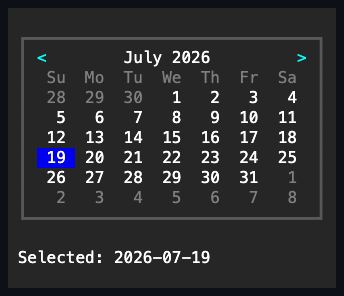

# Calendar

## Overview

`Calendar` is a single focusable, direct-rendered control for choosing either
one Gregorian date or one inclusive Gregorian date interval. It owns a fixed
six-week month grid and occupies one Tab stop; the individual day faces are not
child controls.

## API

| Member                       | Default                        | Description                                                         |
| ---------------------------- | ------------------------------ | ------------------------------------------------------------------- |
| `SelectionMode`              | `CalendarSelectionMode.Select` | Chooses the single-day or two-activation interval state machine.    |
| `Selection`                  | `null`                         | The nullable committed inclusive `DateInterval`.                    |
| `SelectionChanged`           | no subscribers                 | Raised after the selection and related display/active state commit. |
| `Select(DateOnly)`           | —                              | Commits one selectable day.                                         |
| `Select(DateOnly, DateOnly)` | —                              | Commits one ordered selectable inclusive interval.                  |
| `ClearSelection()`           | —                              | Clears the committed selection and any pending interval anchor.     |
| `GoToToday()`                | —                              | Moves to the current local date when available and reports success. |
| `Style`                      | `null`                         | Optional complete developer-authored `CalendarStyle`.               |
| `ActualStyle`                | Theme calendar                 | The resolved style; always present.                                 |

`CalendarSelectionMode` chooses the interaction state machine:

- `Select` is the default: one activation commits a one-day `DateInterval`.
- `Interval` treats the first activation as a pending anchor and the second as
  the opposite endpoint. The endpoints are put in order before the interval
  commits.

`DateInterval` is an immutable inclusive value with `Start`, `End`, `Days`,
`Contains`, and `Intersects`. Its constructor rejects an end that precedes the
start; a one-day interval is valid.

`Selection` stores the committed value as a `DateInterval?` in both modes.
`Select(DateOnly)`, `Select(DateOnly, DateOnly)`, and `ClearSelection()` are
atomic convenience methods over the same property. Select mode rejects a
multi-day interval. Every selection is checked before any state changes: the
dates must fall inside `MinimumDate` through `MaximumDate`, and an interval may
not contain a blocked date.

`SelectionChanged` is raised after the property and all related active and
display state have committed. `CalendarSelectionChangedEventArgs` exposes
`PreviousSelection` and `Selection`; assigning the current value again raises
nothing. A programmatic selection or clear cancels any pending interval anchor
before the committed state is published. Changing `SelectionMode` clears the
committed selection and the pending anchor, so state from one interaction model
never leaks into the other.

In interval mode, an anchor renders a provisional range through the active
keyboard date or the directly hovered selectable date. This preview does not
change `Selection` and does not raise `SelectionChanged`. A second endpoint
whose inclusive span contains a blocked date is ignored, and the anchor is
preserved. After an interval completes, the next activation clears it and starts
a fresh anchor.

## Dates, bounds, and culture

| Member           | Default                          | Purpose                                              |
| ---------------- | -------------------------------- | ---------------------------------------------------- |
| `DisplayMonth`   | first day of current local month | Chooses the rendered month; assigned dates normalize |
| `ActiveDate`     | current local date               | Reports the keyboard cursor                          |
| `MinimumDate`    | `DateOnly.MinValue`              | Sets the inclusive lower selection bound             |
| `MaximumDate`    | `DateOnly.MaxValue`              | Sets the inclusive upper selection bound             |
| `Culture`        | current Gregorian culture        | Supplies month text, weekday names, and week start   |
| `FirstDayOfWeek` | culture default                  | Overrides the first weekday column                   |
| `BlockedDates`   | empty                            | Owns normalized unavailable inclusive ranges         |

The parameterless constructor captures the local date and culture once; the
control does not advance itself at midnight. `Culture` must use an active
`GregorianCalendar`, because mixing another calendar system's month labels with
`DateOnly` day geometry would display false dates. Changing the culture
rerenders the localized month and weekday text without changing the selection.

`FirstDayOfWeek` overrides the culture's first weekday without changing the
selected date. `GoToToday()` moves `ActiveDate` and `DisplayMonth` to the
current local date when today is inside the bounds and not blocked; it returns
`false` when today is unavailable.

The bounds must stay ordered. Tightening them clears a selection or anchor that
no longer fits and moves `ActiveDate` to the nearest selectable value. Display
and movement remain safe at `DateOnly.MinValue` and `DateOnly.MaxValue`.

## Blocked dates

`CalendarBlockedDateCollection` exposes `Block(DateOnly)`,
`Block(DateInterval)`, `Unblock(DateOnly)`, `Unblock(DateInterval)`,
`Contains(DateOnly)`, and `Clear()`. It stores ascending, non-touching ranges:
overlapping or adjacent additions coalesce into one range, and unblocking can
trim or split a range. A long interval is never expanded into per-date storage.

Blocked dates stay visible with the disabled theme state. Keyboard movement
skips them, pointer activation on them is consumed without selecting, and a
committed interval may not cross one. Blocking a date inside the current
selection clears the selection and raises one ordered `SelectionChanged`;
blocking a pending anchor clears the anchor. Mutations on an attached control
are dispatcher-affine.

## Authored date faces

`SetMarkup(DateOnly, string)` replaces one date's complete four-cell numeric
face with trusted SharpVision inline markup. `RemoveMarkup` restores one default
numeric face and `ClearMarkup` restores them all. The markup must produce
visible text, and it is parsed before it replaces any existing state. Rendering
clips at complete grapheme boundaries, never draws half of a wide cluster, and
never changes the grid geometry.

Calendar state takes precedence over authored markup. Adjacent-month muting,
hover and interval preview, the committed selection, blocked and out-of-range
state, and the focused active indicator are applied after authored faces, so a
marked blocked date cannot use markup to appear available.

## Layout and visual states

The content measures 28 by 8 cells:

- one header row with previous/next month targets and a centered localized
  month/year;
- one row of seven localized two-cell weekday headings; and
- six rows of seven four-cell day faces.

The default rounded one-cell border plus one horizontal padding cell produces a
32 by 10 desired border box. Adjacent-month dates fill the leading and trailing
week slots and remain selectable while they are inside the bounds; selecting one
navigates to its month. Smaller explicit bounds clip safely, and zero content
draws nothing.

A `CalendarStyle` holds five `ColorValue` day-grid foregrounds —
`SelectedDayColor`, `TodayMarkerColor` (the hovered date and pending interval
preview), `OutOfMonthDayColor`, `WeekdayHeaderColor`, and `DisabledDayColor` —
plus the `ContentInset` `Thickness` and a complete appearance profile. Each
color accepts either a concrete `Color` or a `ThemeColor` role and defaults to
`SelectedText`, `ActiveText`, `Muted`, `Muted`, and `DisabledText` respectively.
`NavigationColor`, `ActiveDayBackground`, `SelectedDayBackground`, and
`DisabledDayBackground` own the remaining semantic paint channels.
`ContentInset` defaults to one horizontal cell and is consumed directly by the
calendar; it does not overwrite the caller's independent `Padding` value. Use
`CalendarStyle.With(...)` for validated member-wise copies and appearance
overlays. Theme JSON remains semantic-only. Assigning `Style` replaces the
entire Theme-owned day-grid foreground and inset presentation, and assigning
`null` restores it; restyling `ContentInset` remeasures the control.

The selected, hovered/preview, and disabled day-cell backgrounds, and the header
arrow foreground, still resolve directly against the active Theme's
`SelectedControl`, `ActiveControl`, `DisabledControl`, and `Accent` roles rather
than through `CalendarStyle` — they remain themeable through a custom `Theme`,
just not overridable per instance in this pass. The focused active date still
renders with an underline.

## Keyboard and pointer input

The Calendar is one focus stop with `TabNavigation.None`.

| Input                | Action                                                        |
| -------------------- | ------------------------------------------------------------- |
| Left / Right         | move to the previous / next selectable date                   |
| Up / Down            | move one week, continuing in that direction past blocked days |
| Home / End           | move inward to the first / last selectable date of the week   |
| Page Up / Page Down  | move to the corresponding date in the adjacent month          |
| Enter / Space        | activate `ActiveDate` through the current mode                |
| Header arrow press   | change only `DisplayMonth`                                    |
| Selectable day press | focus, make active, and activate the mapped date              |
| Blocked day press    | consume the press without changing selection                  |
| Pointer move / leave | update or clear direct date hover and interval preview        |
| Wheel up / down      | display the previous / next month                             |

Key press and repeat are accepted; release is ignored. A movement or wheel
command that cannot move within the bounds is left unhandled so an ancestor can
respond. Keys outside the Calendar command set also remain available to
inherited routed input. Header and day hit testing uses the committed
`ContentBounds`, so border, padding, clipping, and tiny allocations never create
invisible targets.

## Example



```csharp
var booking = new Calendar
{
    SelectionMode = CalendarSelectionMode.Interval,
    DisplayMonth = new DateOnly(2026, 7, 1),
};

booking.BlockedDates.Block(
    new DateInterval(new DateOnly(2026, 7, 12), new DateOnly(2026, 7, 14)));
booking.SetMarkup(new DateOnly(2026, 7, 19), "<accent><b>19★ </b></accent>");
booking.SelectionChanged += (_, change) => SaveBooking(change.Selection);
```

## Expected behavior

Values and enum assignments are validated before any state changes. Interval
transitions raise their events in the documented order, blocked ranges coalesce
and split correctly, and blocking a selected date clears the selection. Bounds,
culture handling, month arithmetic, leap years, and the `DateOnly` limits behave
as described; headings are localized; and the six-week grid renders its exact
cells. Authored markup follows the documented precedence and clips Unicode
safely, and zero or tiny bounds stay contained. Keyboard and pointer input
behave identically; hover, focus, Tab, header, and wheel navigation work as
documented; and disabling the control cleans up its transient state. Mounted
output is semantically correct, the control passes the shared exported-control
and common box-model checks, and the interactive showcase page exercises it.
