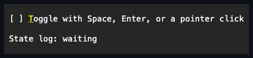
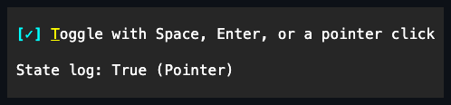

# CheckBox

## CheckBox contract

`CheckBox` is a sealed [`Pressable`](../pressable.md#pressable-contract) toggle
with optional retained `Content` and two- or three-state behavior.

## API

| Member                         | Default        | Contract                                                     |
| ------------------------------ | -------------- | ------------------------------------------------------------ |
| `IsChecked`                    | `false`        | `false`, `true`, or `null` when three-state mode permits it. |
| `IsThreeState`                 | `false`        | Selects the two-state or three-state activation cycle.       |
| `Style`                        | `null`         | Optional complete developer-authored `CheckBoxStyle`.        |
| `ActualStyle`                  | Theme checkbox | Always-present resolved style.                               |
| `CheckBoxStyle.Brackets`       | Theme default  | Fixed-width `[ ]`, `[✓]`, and `[─]` presentation.            |
| `CheckBoxStyle.Tick`, `Square` | Presets        | Complete one-cell presentations.                             |
| `Content`                      | `null`         | Owns the optional label or richer visual.                    |
| State events                   | No subscribers | Report committed transitions in deterministic order.         |

`CheckBoxStyle` contains a `CheckBoxMarkStyle`, complete `CheckBoxGlyphs`, and
the full appearance profile. `CheckBoxStyleSet` is the partial Theme-file type.
Assigning `Style` replaces the complete Theme-owned presentation; assigning null
restores it. Every glyph is printable and one cell under the normal width
policy. Brackets reserve three cells; other styles reserve one.

Raw border/shadow/state-appearance authoring remains protected. Inspect
`ActualStyle`, `ActualBorder`, and `ActualShadow` when composing a third-party
control around a CheckBox.

## Behavior

Two-state activation cycles `false ↔ true`; three-state activation cycles
`false → true → null → false`. Disabling three-state mode while indeterminate
commits `false` before publishing notifications. Space and primary-pointer
activation share the same transition path. Disabled wins over all interactive
states, and focused/selected styling applies to the mark and content as one
semantic item.

## Example





```csharp
var option = new CheckBox
{
    Content = new Text("Include &hidden files"),
    Style = CheckBoxStyle.Square
};
```

## Expected behavior

Cover both cycles, event order, invalid null assignment, style validation and
precedence, null restoration, Theme replacement, Space/pointer parity, disabled
and focused states, mark width changes, Unicode fallback, and exact cells.
