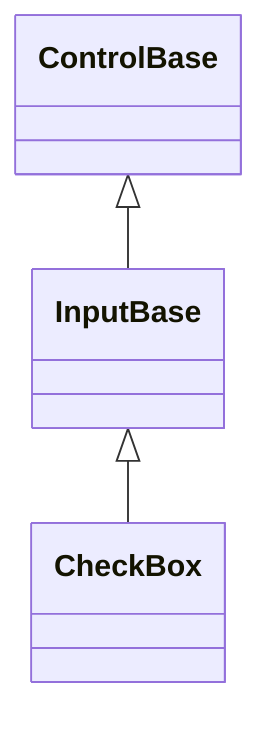

# CheckBox

## Overview

`CheckBox` is declared
`public sealed class CheckBox : InputBase, IStyled<CheckBoxStyle>`. It is a
focusable toggle whose caption is its inherited `Text`, with either two-state or
three-state activation.

## Inheritance



## API

| Member                       | Type                                  | Default        | Description                                                                      |
| ---------------------------- | ------------------------------------- | -------------- | -------------------------------------------------------------------------------- |
| `CheckBox()`                 | —                                     | —              | Initializes an unchecked two-state CheckBox.                                     |
| `CheckBox(string text)`      | —                                     | —              | Initializes an unchecked two-state CheckBox with the given text; rejects `null`. |
| Inherited `Text`             | `string`                              | `""`           | The checkbox's label.                                                            |
| `IsChecked`                  | `bool?`                               | `false`        | `false`, `true`, or `null` when three-state mode permits it.                     |
| `ThreeState`                 | `bool`                                | `false`        | Selects the two-state or three-state activation cycle.                           |
| `StartAffix`                 | `Affix?`                              | `null`         | Optional leading edge-pinned decoration, reserved before the mark glyph.         |
| `EndAffix`                   | `Affix?`                              | `null`         | Optional trailing edge-pinned decoration, reserved after the caption.            |
| `Style`                      | `CheckBoxStyle?`                      | `null`         | Optional complete developer-authored presentation.                               |
| `ActualStyle`                | `CheckBoxStyle`                       | Resolved       | Read-only; the complete local, theme-owned, or code-owned presentation.          |
| Inherited `Command`          | `ICommand?`                           | `null`         | Runs after the toggle commits, when bound and `CanExecute` allows it.            |
| Inherited `CommandParameter` | `object?`                             | `null`         | The borrowed parameter passed to `Command` queries and execution.                |
| `PerformClick()`             | `void`                                | —              | Activates an available, visible, enabled CheckBox through its public API.        |
| `Checked`                    | `EventHandler<CheckChangedEventArgs>` | No subscribers | Raised after a `true` state commits.                                             |
| `Unchecked`                  | `EventHandler<CheckChangedEventArgs>` | No subscribers | Raised after a `false` state commits.                                            |
| `Indeterminate`              | `EventHandler<CheckChangedEventArgs>` | No subscribers | Raised after a `null` (indeterminate) state commits.                             |
| `StateChanged`               | `EventHandler<CheckChangedEventArgs>` | No subscribers | Raised after the state-specific event, for every committed transition.           |

Completing an activation always commits the toggle and raises the state events
first; the bound command, if any and if `CanExecute` allows it, runs last. A
command that cannot execute never suppresses the toggle itself. Assigning `null`
to `IsChecked` while `ThreeState` is `false` throws `ArgumentException`. Turning
three-state mode off while the value is indeterminate commits `false` before any
notifications are published.

`CheckBoxStyle : InputStyle` is a complete immutable presentation: it bundles a
`CheckBoxMarkStyle`, a complete `CheckBoxGlyphs` triple (unchecked, checked, and
indeterminate), and the inherited `Face`/`Border`/`Shadow`.
`CheckBoxStyle.Brackets` is the default fixed-width `[ ]`/`[✓]`/`[─]`
presentation reserving three cells; `Tick` and `Square` are one-cell presets. A
`with` expression creates a validated member-wise copy of
`CheckBoxStyle.Default` (`Brackets`). A theme document may additionally author a
`styles.checkBox` section with a `markStyle` string member (`"square"`,
`"brackets"`, or `"tick"`); an active theme's section supplies `MarkStyle` ahead
of the code-owned default whenever no local `Style` is assigned (see
[themes.md](../../concepts/themes.md#style-types)). The glyph family remains
code-owned. Assigning `Style` replaces the complete Theme-owned presentation,
and assigning `null` restores it. `ActualStyle` never returns null. Every glyph
is printable and one cell wide under the normal width policy.

> [!NOTE]
>
> `CheckBox` exposes no per-glyph properties or reset method for the mark: the
> mark glyphs live only on `CheckBoxStyle`, reached through
> `Style`/`ActualStyle`. To override a mark, assign a complete local `Style`
> whose `Glyphs` carries the replacement, rather than looking for a single-glyph
> property or a reset method.

`StartAffix` and `EndAffix` each reserve a fixed cell column for
application-owned, per-instance content - never theme-authored - outside the
mark and the caption's own alignment box: `StartAffix` sits before the mark
glyph, `EndAffix` sits after the caption. The gap between a present affix and
its neighbor comes from the shared `InputStyle.AffixGap` (see
[styling.md](../../concepts/styling.md#instance-content-affix)). When the
control is too narrow for everything, the caption shrinks first, then the end
affix drops whole, then the start affix - never a partial cluster - and the
decision is re-evaluated against the control's actual bounds on every render. A
same-width content or color swap on either property repaints without
remeasuring, so an affix can animate (a spinner swapping frames, for example) at
render cost only.

CheckBox does not expose raw border, shadow, or state-appearance mutation. For
third-party composition, inspect `ActualStyle`, `ActualBorder`, and
`ActualShadow` instead.

## Behavior

Two-state activation cycles between `false` and `true`; three-state activation
cycles `false → true → null → false`. Space and primary-pointer activation share
the same transition path. The disabled state wins over all interactive states,
and focused or selected styling applies to the mark and content together as one
semantic item.

## Example


```csharp
var option = new CheckBox
{
    Text = "Include &hidden files",
    Style = CheckBoxStyle.Square
};
```

## Expected behavior

| Scope               | Observable evidence                                                       |
| ------------------- | ------------------------------------------------------------------------- |
| Public API          | Validation, defaults, state changes, and deterministic output.            |
| Integrated behavior | Cross-component behavior through the real ownership and routing boundary. |

- Both activation cycles behave as documented, and state events arrive in their
  committed order.
- Assigning `null` while three-state mode is disabled is rejected.
- Style validation and precedence hold, assigning `null` restores the Theme
  style, and a Theme replacement restyles checkboxes that have no local style.
- Space and pointer activation behave identically, disabled and focused states
  render correctly, and a change in mark width relayouts as expected.
- Unicode glyphs fall back safely, and rendering produces the exact documented
  cells.
