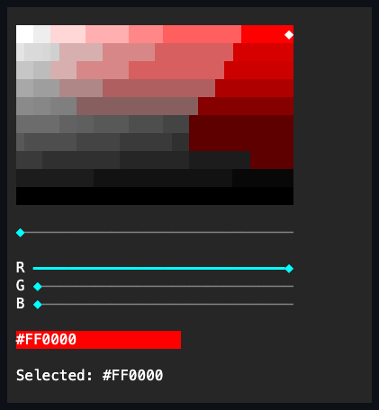

# ColorPicker

## Overview

`ColorPicker` is a retained
[`CompositeControl`](../composite-control.md#overview) that edits one stable RGB
color independently of the terminal's output depth. Its constructor builds one
permanent layout tree from `Grid`, `Stack`, `Dock`, `Overlay`, `Slider`, and
focused color surfaces; measure and render never rebuild it.

## API

`Value` is a concrete RGB or terminal-default `Color`. Attachment and runtime
capability changes never rewrite the authored value:

| Active depth                       | Committed representation | Presentation                                                |
| ---------------------------------- | ------------------------ | ----------------------------------------------------------- |
| `TrueColor`/`Indexed256`/`Basic16` | RGB                      | saturation/value plane, hue ramp, RGB sliders, preview, hex |
| `Monochrome`                       | RGB or `Color.Default`   | disabled default-only surface                               |

Only the frame encoder projects RGB through the xterm-compatible cube, the
grayscale ramp, or the ANSI reference colors. A presentation downgrade is lossy
on the wire but never changes `Value`, so a later capability upgrade
automatically presents the original authored RGB.

`EffectiveColorDepth` exposes the inherited tier. A changed direct assignment or
user selection commits `Value`, synchronizes every retained part, and then
raises one `ValueChanged` event with immutable `ColorChangedEventArgs`.
Capability changes alter the presentation without raising a value event. No-op
changes raise nothing. All mutation of an attached control is dispatcher-affine.

## Layout and input

The RGB editor stretches its saturation/value plane into the remaining space.
The hue ramp and the horizontal hue `Slider` share one `Overlay`; exact red,
green, and blue sliders occupy retained rows below it. The selected-color
preview and the uppercase `#RRGGBB` readout share the final row, with
contrast-aware text drawn over the selected color.

The plane is one focus stop. Left/Right adjust saturation by one percentage
point, Up/Down adjust value, and Home/End jump to the saturation endpoints. A
primary press, and captured movement after it, map the committed cell
coordinates to both normalized axes. The hue and RGB parts use the complete
[`Slider` input contract](slider.md#input-and-visual-states).

Every color is drawn to the semantic canvas. The picker never emits escape
sequences itself, and terminal output still passes through capability projection
at the frame boundary.

## Example



```csharp
var picker = new ColorPicker
{
    Value = Color.Rgb(255, 72, 128),
    Width = Length.Cells(40),
    Height = Length.Cells(18),
};

picker.ValueChanged += (_, change) =>
{
    var face = preview.Face;
    preview.Face = new Face(
        face.Foreground,
        change.Value,
        face.Attributes,
        face.Underline,
        face.UnderlineColor);
};
```

## Expected behavior

`Value` can be assigned while the control is detached, every capability tier
presents as documented, and the authored RGB survives attachment and runtime
capability changes. Events are raised in committed order, and the RGB and HSV
parts stay synchronized. The preview renders its exact cells, the plane's
keyboard and pointer mapping behave as described, and capture cancellation ends
a drag without a stray commit. Focus and disabled states render correctly; zero,
tiny, and resized bounds stay contained; and the dedicated showcase page
exercises the interaction.
