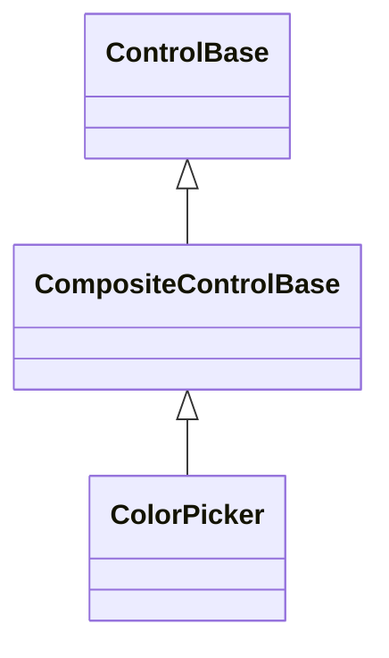

# ColorPicker

## Overview

`ColorPicker` is declared
`public sealed class ColorPicker : CompositeControlBase, IStyled<ColorPickerStyle>`.
It is a retained [`CompositeControlBase`](../composite-control.md#overview) that
edits one stable RGB color independently of the terminal's output depth. The
retained value field accepts hexadecimal, functional, decimal-component, and
`DEFAULT` text directly while keeping invalid intermediate input editable. Its
constructor builds one permanent layout tree from `Grid`, `Stack`, `Dock`,
`Overlay`, `Slider`, `TextInput`, and focused color surfaces; measure and render
never rebuild it.

## Inheritance



## API

| Member                | Type                                  | Default                | Description                                                                         |
| --------------------- | ------------------------------------- | ---------------------- | ----------------------------------------------------------------------------------- |
| `Value`               | `Color`                               | `Color.Rgb(255, 0, 0)` | The concrete RGB or terminal-default selected color; rejects a transparent color.   |
| `EffectiveColorDepth` | `ColorDepth`                          | Inherited capability   | Read-only; the active terminal color depth the picker presents against.             |
| `Style`               | `ColorPickerStyle?`                   | `null`                 | Optional part-style overrides for the owned Sliders, value field, and plane marker. |
| `ActualStyle`         | `ColorPickerStyle`                    | Resolved               | Read-only; the resolved presentation currently applied to the owned parts.          |
| `ValueChanged`        | `EventHandler<ColorChangedEventArgs>` | No subscribers         | Raised after a changed color commits.                                               |

`Value` is a concrete RGB or terminal-default `Color`. Attachment and runtime
capability changes never rewrite the authored value; only the frame encoder
projects RGB through the xterm-compatible cube, the grayscale ramp, or the ANSI
reference colors for a lower-depth terminal — see
[Color depth and presentation](#color-depth-and-presentation) for exactly what
each depth commits and shows. A changed direct assignment or user selection
commits `Value`, synchronizes every retained part, and then raises one
`ValueChanged` event with immutable `ColorChangedEventArgs`. Capability changes
alter the presentation without raising a value event. No-op changes raise
nothing. If `PropertyChanged(Value)` commits a newer color synchronously, the
newer color owns every retained slider, swatch, value field, and typed event;
the superseded transition publishes nothing further. All mutation of an attached
control is dispatcher-affine.

`ColorPickerStyle : ControlStyle` is a secondary (part) style, not a primary
themed control style: it owns no `styles.*` theme key of its own. It exposes
only the presentation applied to the owned hue and RGB `Slider`s, the value
field, and the saturation/value plane's selection marker, without exposing the
parts themselves. `SliderStyle` (`SliderStyle?`) is applied to all three RGB
`Slider`s. `HueSliderStyle` (`SliderStyle?`) independently styles the retained
hue slider; when unset, it derives from `SliderStyle`, and its background is
always made transparent so the rainbow ramp remains visible. `StatusFace`
(`Face?`) styles the value field's attributes and underline. For an RGB value,
`ColorPicker` replaces both face colors with the selected RGB background and a
contrasting foreground on every commit; authored colors apply when the value is
`Color.Default`. Invalid text temporarily replaces both colors with the active
theme's error background and contrast while preserving authored decorations.
`SelectedMarker` (`Rune?`) replaces the printable glyph the plane draws over the
currently selected coordinate; a value that cannot occupy exactly one cell under
the active width policy falls back to the same code-owned repair glyph as an
unset marker.

`null` for any member lets the corresponding part use its own default. A style
set while the monochrome fallback is active still applies and is retained across
a later color-capable depth upgrade; the preview swatch and the plane's
saturation/value fill are not covered by `ColorPickerStyle` today - only its
selection marker is. `ActualStyle` reports the values actually applied to every
covered retained part, including the separately normalized hue slider and the
value-dependent or error-state field face.

## Keyboard

| Key            | Behavior                                                                                    |
| -------------- | ------------------------------------------------------------------------------------------- |
| Left / Right   | Decreases or increases saturation by one percentage point while the color plane is focused. |
| Down / Up      | Decreases or increases value by one percentage point while the color plane is focused.      |
| Home / End     | Sets saturation to zero or one while the color plane is focused.                            |
| Slider keys    | The hue and RGB sliders use the `Slider` keyboard contract.                                 |
| TextInput keys | The value field uses the `TextInput` editing, selection, and focus-traversal contract.      |

## Color depth and presentation

`Value` always stores the authored RGB (or `Color.Default`); only the presented
surface changes with the active `EffectiveColorDepth`:

| IsActive depth                     | Committed representation | Presentation                                                         |
| ---------------------------------- | ------------------------ | -------------------------------------------------------------------- |
| `TrueColor`/`Indexed256`/`Basic16` | RGB                      | Saturation/value plane, hue ramp, RGB sliders, preview, value field. |
| `Monochrome`                       | RGB or `Color.Default`   | Disabled default-only surface.                                       |

A presentation downgrade is lossy on the wire but never changes `Value`, so a
later capability upgrade automatically presents the original authored RGB.

## Layout and input

The RGB editor stretches its saturation/value plane into the remaining space.
The hue ramp and the horizontal hue `Slider` share one `Overlay`; exact red,
green, and blue sliders occupy retained rows below it. The selected-color
preview and a borderless 19-cell value field share the final row, with
contrast-aware text drawn over the selected color. The editor retains at most 18
graphemes, leaving one cell for its caret. The plane and hue ramp shade only
their intersection with the current canvas clip while deriving hue, saturation,
value, edge focus, and marker positions from the complete logical bounds.

The value field parses every `TextChanged` commit. It accepts exactly six ASCII
hexadecimal digits with an optional leading `#`, case-insensitive
`rgb(r, g, b)`, bare `r, g, b`, and case-insensitive `DEFAULT`. Decimal
components use invariant ASCII digits in the range 0 through 255; ASCII spaces
may appear only after commas. A valid edit immediately updates `Value`, the
plane, sliders, preview, and canonical field text (`#RRGGBB` or `DEFAULT`). An
equivalent edit raises no `ValueChanged` event. Shorthand hex, color names,
signs, percentages, fractions, extra components, outer whitespace, and
incomplete input remain raw and focused with an error face; they do not change
the last valid color or any graphical part. A later direct `Value` assignment or
graphical edit replaces invalid text with the canonical value.

The plane is the first of six retained focus stops, followed by the hue, red,
green, and blue sliders and the value field. Left/Right adjust saturation by one
percentage point, Up/Down adjust value, and Home/End jump to the saturation
endpoints. A movement key accepts lock state but no Shift or application-command
modifier. A primary press, and captured movement after it, map the committed
cell coordinates to both normalized axes. Other keys remain unhandled for
inherited routing and focus traversal. The hue and RGB parts use the complete
[`Slider` input contract](slider.md#input-and-visual-states).

Every color is drawn to the semantic canvas. The picker never emits escape
sequences itself, and terminal output still passes through capability projection
at the frame boundary.

## Example


```csharp
var picker = new ColorPicker
{
    Value = Color.Rgb(255, 72, 128),
    Width = Length.Cells(40),
    Height = Length.Cells(18),
};

picker.ValueChanged += (_, change) =>
{
    var face = preview.Face;
    preview.Face = new Face(
        face.Foreground,
        change.Value,
        face.Attributes,
        face.Underline,
        face.UnderlineColor);
};

// Tab to the final retained field and type, for example, rgb(255, 72, 128).
```

## Expected behavior

| Scope               | Observable evidence                                                       |
| ------------------- | ------------------------------------------------------------------------- |
| Public API          | Validation, defaults, state changes, and deterministic output.            |
| Integrated behavior | Cross-component behavior through the real ownership and routing boundary. |

- `Value` can be assigned while the control is detached, every capability tier
  presents as documented, and the authored RGB survives attachment and runtime
  capability changes.
- Events are raised in committed order, and the RGB and HSV parts stay
  synchronized.
- Direct value text accepts only the documented invariant forms; valid edits
  canonicalize immediately, while incomplete or invalid text retains focus and
  an error face without moving the last valid selection.
- The preview renders its exact cells, the plane's keyboard and pointer mapping
  behave as described, and capture cancellation ends a drag without a stray
  commit.
- Focus and disabled states render correctly; zero, tiny, and resized bounds
  stay contained; and the dedicated showcase page exercises the interaction.
