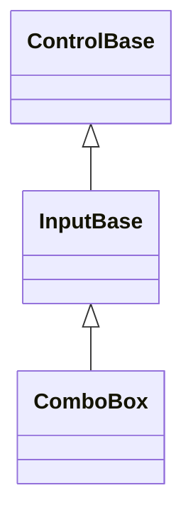
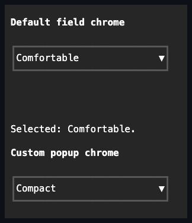
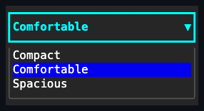

# ComboBox

## Overview

`ComboBox` derives directly from [`InputBase`](../input-base.md#overview),
enabling press activation and an owned popup. It shows the selected value in a
compact field and owns a private [Popup](../popups/popup.md#overview) containing
a [ListView](../collections/list-view.md#overview) that opens immediately below
the field. The Popup clears its surface before the list renders, so choices
never show through content behind the drop-down. The connected frame omits the
edge that adjoins the field: with below placement the first ListView row sits at
`ComboBox.Bounds.Bottom`, while the above fallback omits the bottom edge and
puts the last ListView row immediately before `ComboBox.Bounds.Y`. The other
three frame edges stay visible.

The list uses the same keyboard, pointer, selection, and scrolling semantics as
a standalone list. When the resolved appearance supplies a
`VisualState.Selected` background, the selected choice fills the complete
interior row, including trailing blank cells, following the
[ListView row rendering contract](../collections/list-view.md#overview).

The selected value is the field's face, so `ComboBox` exposes neither `Content`
nor `Children`. It owns exactly one popup-layer framework part, and that
`Popup.Content` owns the private ListView. Keyboard and pointer press mechanics
come from [`InputBase.EnablePressActivation`](../input-base.md#api), the same
capability `Button` and the other
[caption-and-command controls](../pressable.md#overview) enable in their own
constructors, without taking on their `EnableCaption` single-text-caption role.

## Inheritance



## API

| Member                  | Type                                          | Default                          | Description                                                                                                              |
| ----------------------- | --------------------------------------------- | -------------------------------- | ------------------------------------------------------------------------------------------------------------------------ |
| `Items`                 | `IReadOnlyList<object?>`                      | Empty snapshot                   | Copies the available choices into the private single-selection list.                                                     |
| `SelectedIndex`         | `int`                                         | `-1`                             | Selects one choice or clears the selection.                                                                              |
| `SelectedItem`          | `object?`                                     | `null`                           | The selected item, or null when no value is selected; assignment resolves to the matching item.                          |
| `AllowNull`             | `bool`                                        | `true`                           | Allows Delete/Backspace to clear the selection.                                                                          |
| `Placeholder`           | `string`                                      | `"Select…"`                      | Face text shown when no item is selected.                                                                                |
| `DropDownHeight`        | `int`                                         | `8` cells                        | Caps the ListView interior; the connected Popup's three visible frame edges are additional.                              |
| `IsOpen`                | `bool`                                        | `false`                          | Controls popup layout, rendering, and hit testing.                                                                       |
| `ScrollBars`            | `ScrollBars`                                  | ListView default                 | Configures overflow axes in the private list.                                                                            |
| `ShowScrollBars`        | `ShowScrollBars`                              | ListView default                 | Configures the scrollbar reservation policy in the private list.                                                         |
| `ScrollBarStyle`        | `ScrollBarStyle?`                             | `null`                           | Overrides the private list's complete rail presentation.                                                                 |
| `ActualScrollBarStyle`  | `ScrollBarStyle`                              | Resolved                         | Read-only; the local, theme-owned, or code-owned rail presentation.                                                      |
| `RowHeight`             | `int?`                                        | `null`                           | Forwards to the private list's fixed row height, or `null` to size each row to its content.                              |
| `PopupChrome`           | `PopupChrome`                                 | `default`                        | Overrides the private Popup's border and shadow together (see [Popup](../popups/popup.md#overview)).                     |
| `ResetPopupChrome()`    | `void`                                        | —                                | Returns the private Popup's border and shadow to `PopupChrome` ownership.                                                |
| `ItemTemplate`          | `ItemTemplate`                                | ListView default                 | Forwards directly to the private ListView's own `ItemTemplate`, realizing each popup row.                                |
| `TextSelector`          | `Func<object?, string>?`                      | `null`                           | Projects an item to its closed-field and type-ahead text; falls back to `Convert.ToString`.                              |
| `StartAffix`            | `Affix?`                                      | `null`                           | Optional leading edge-pinned decoration, reserved inside the field box and strictly inboard of the drop-down indicator.  |
| `EndAffix`              | `Affix?`                                      | `null`                           | Optional trailing edge-pinned decoration, reserved inside the field box and strictly inboard of the drop-down indicator. |
| Themed disclosure glyph | —                                             | `InputStyle.DropDownGlyph` (`▼`) | Authored once for every drop-down input via a theme's `styles.input` section.                                            |
| `SelectionChanged`      | `EventHandler<ListSelectionChangedEventArgs>` | No subscribers                   | Reports the selection after `SelectedIndex` commits.                                                                     |
| `DropDownOpened`        | `EventHandler`                                | No subscribers                   | Raised after the drop-down list opens.                                                                                   |
| `DropDownClosed`        | `EventHandler`                                | No subscribers                   | Raised after the drop-down list closes.                                                                                  |

`TextSelector` drives both the closed field's displayed text and keyboard
type-ahead matching through the same projection, so the two cannot drift from
each other or from a separately assigned `ItemTemplate`. Leave it unset to keep
the default `Convert.ToString(item, CultureInfo.InvariantCulture)` behavior for
items whose `ToString` override is already display-ready.

## Default field chrome

The closed field resolves the shared `InputStyle` (`styles.input`). Bundled
themes paint its normal face with `SemanticColor.Surface` and provide a one-cell
border on every edge. The intrinsic
[shared chrome](../../concepts/styling.md#shared-chrome) reserves those cells
before the selected label and the drop-down indicator. ComboBox owns that
chrome; applications do not assign raw borders to the specialized control.

The private ListView opts out of its standalone default border because the Popup
owns the connected drop-down frame. This avoids nested chrome while keeping the
ListView's selection, scrolling, and surface appearance inside the Popup.

## Behavior

- `Items` copies the non-null choices into the owned single-selection list. When
  no selection exists yet, assigning a non-empty list selects the first item and
  raises `SelectionChanged`. An items binding accepts incremental changes only
  from the current source identity and source-path revision; replacement while
  an old delta is queued or retained across detachment forces a complete
  replacement snapshot instead.
- `SelectedIndex` is `-1` or an index within `Items`; a committed selection
  publishes `PropertyChanged(SelectedIndex)` before `SelectionChanged`.
  Publication is versioned under synchronous reentry: a `PropertyChanged`
  observer that commits a newer selection owns `SelectionChanged`, and the
  interrupted commit raises no further typed event.
- Item invocation closes the popup only if its synchronous selection callbacks
  leave the same selection and popup transition current. A callback that reopens
  or closes the popup, selects another item, or disposes the ComboBox owns that
  newer decision; the interrupted invocation performs no stale close.
- `AllowNull` enables clearing with Delete or Backspace, and `Placeholder`
  supplies the closed-face text while the selection is empty.
- `DropDownHeight` is a positive maximum, in terminal cells, for the visible
  list.
- `ScrollBars`, `ShowScrollBars`, and `ScrollBarStyle` forward the common
  overflow policy to the owned ListView, so long choice popups use the same
  rails as standalone lists and viewports.
- `IsOpen` controls Popup layout, rendering, hit testing, and one
  `OutsideInteraction.Dismiss` plane rooted at the ComboBox while the field
  keeps focus. The popup is at least as wide as the field, and `DropDownHeight`
  limits only the list interior; the Popup adds its three visible frame edges
  outside that limit and keeps the open list above later page content, as
  defined by the [Popup contract](../popups/popup.md#overview).

`ComboBox` has no typed-text input path; it only selects from `Items`. For an
editable suggestion field, compose `TextInput` with a `Popup` directly.

`StartAffix` and `EndAffix` each reserve a fixed cell column inside the field
box, strictly inboard of the drop-down indicator - setting either never moves
the indicator, and the selected label's own box deflates around both. The gap
between a present affix and the label comes from the shared
`InputStyle.AffixGap` (see
[styling.md](../../concepts/styling.md#instance-content-affix)), the same member
`Button` and `TextInput` read. When the field box is too narrow for everything,
the label shrinks first, then the end affix drops whole, then the start affix -
never a partial cluster - and the decision is re-evaluated against the control's
actual bounds on every render.

## Disclosure glyph

The closed-field indicator is `InputStyle.DropDownGlyph`, so a theme's
`styles.input` section sets it once for `ComboBox`, `DateInput`, and
`DateTimeInput` together. That is what a terminal without dependable arrow
coverage needs: one answer for every drop-down input, rather than a property to
set on each instance. Replacing the Theme repaints every affected field.

## Interaction

Enter, Space, or a primary pointer click toggles the list. The ComboBox stays
focused while the arrow keys move the private current item, Enter chooses it and
closes the list, and Escape closes without changing the selection. Pointer
clicks route through the Popup frame to the realized ListView item and use the
same semantic invocation path as Enter. Closed list cells neither render nor hit
test. When a close begins in the list, keyboard focus returns to the visible
ComboBox field during [Popup closing](../popups/popup.md#api), before the list
becomes unavailable.

The private ListView receives wheel input first. A wheel that changes its scroll
offset keeps the drop-down open. A wheel over the open drop-down that cannot
scroll any further is swallowed without closing it, while a wheel aimed outside
the ComboBox plane closes the drop-down and is consumed.

### Keyboard navigation inside the popup

The popup and the inner ListView never enter sequential traversal. Plain Tab or
Shift+Tab, with optional Caps Lock or Num Lock state, closes or commits the
popup and then continues once through application traversal. A Tab carrying
Control, Alt, Super, Hyper, or Meta remains unhandled and leaves the popup open.
The arrow keys (Up/Down/Left/Right), Home, End, Page Up, and Page Down move
between items through the ListView's own keyboard handler. Initial and repeated
key-down input share that path, so holding a navigation key continues moving the
current row and keeps it visible while the ComboBox retains focus.

Printable Unicode scalars provide basic case-insensitive type-to-select. The
search starts after the current item, wraps around once, and falls back to the
latest character when a longer prefix has no match. Closing the popup clears the
prefix so a later popup session starts fresh. Type-ahead follows the shared
[keyboard modifier policy](../../concepts/input-routing.md#keyboard-modifier-policy):
Shift and lock state may accompany text, while Control, Alt, Super, Hyper, and
Meta chords remain unhandled.

## Example





```csharp
var density = new ComboBox
{
    Items = ["Compact", "Comfortable", "Spacious"],
    SelectedIndex = 1,
    DropDownHeight = 5,
};
```

## Expected behavior

| Scope                 | Observable evidence                                                          |
| --------------------- | ---------------------------------------------------------------------------- |
| Public API            | Validation, defaults, state changes, and deterministic output.               |
| Integrated behavior   | Cross-component behavior through the real ownership and routing boundary.    |
| Complete runtime path | Final cells, bytes, lifecycle ordering, cleanup, or pseudoterminal behavior. |

- Assigned items are copied, indices are validated, and the connected popup
  renders its exact cells in both below and above placement.
- The popup renders opaquely and hit tests only what is visible. Popup
  arrangement, Escape, and mouse selection through the Popup behave as
  documented, and keyboard focus, navigation, and activation follow the rules
  above.
- A wheel left unhandled inside the list, or aimed outside the plane, dismisses
  the drop-down without scrolling a parent, while a scrollable list keeps it
  open.
- Resize and style states are handled, and rendering produces the exact
  documented cells.
