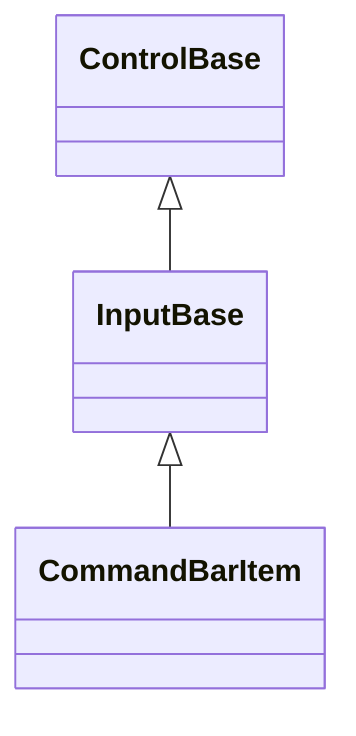
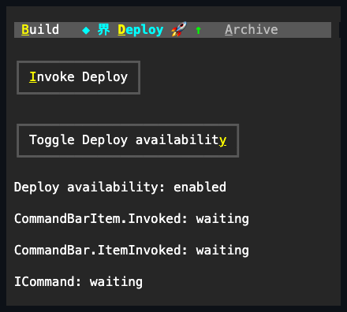

# CommandBarItem

## Overview

`CommandBarItem` is declared
`public sealed class CommandBarItem : InputBase, IStyled<CommandBarItemStyle>`.
It is one mnemonic-aware semantic command face retained by a
[`CommandBar`](command-bar.md#overview). The item keeps its caption, optional
affixes, availability, complete local style, activation event, and borrowed
command binding when the owner projects it into overflow.

The caller creates the item and keeps its reference. Adding it transfers tree
ownership to the bar until removal; removal does not dispose it, while disposing
the bar disposes an item still owned there. Public mutation is dispatcher-affine
while attached. Invalid lifetime or thread access fails before state changes,
and an effectively disabled or hidden item does not activate.

## Inheritance



## API

| Member                       | Type                                | Default  | Description                                                                                  |
| ---------------------------- | ----------------------------------- | -------- | -------------------------------------------------------------------------------------------- |
| Inherited `Text`             | `string`                            | `""`     | Mnemonic-aware caption; an ampersand marks an access key and an empty caption remains valid. |
| Inherited `Command`          | `ICommand?`                         | `null`   | Borrowed optional command queried before either invocation event.                            |
| Inherited `CommandParameter` | `object?`                           | `null`   | Borrowed value captured with `Command` for one accepted activation.                          |
| `StartAffix`                 | `Affix?`                            | `null`   | Optional leading edge-pinned decoration using whole-grapheme reservation.                    |
| `EndAffix`                   | `Affix?`                            | `null`   | Optional trailing edge-pinned decoration that yields before the start affix at tiny widths.  |
| `IsOverflowed`               | `bool`                              | `false`  | Read-only live layout fact; true only while overflow represents this visible item.           |
| `Style`                      | `CommandBarItemStyle?`              | `null`   | Optional complete local command-face presentation.                                           |
| `ActualStyle`                | `CommandBarItemStyle`               | Resolved | Read-only complete local, theme-owned, or code-owned presentation.                           |
| `PerformInvoke()`            | `void`                              | —        | Attempts programmatic activation; unavailable items are a no-op.                             |
| `Invoked`                    | `EventHandler<ActivationEventArgs>` | —        | Raised first for an accepted activation with its input cause.                                |

`PerformInvoke()` validates current dispatcher access and lifetime. A disposed
item throws `ObjectDisposedException`; an attached off-dispatcher call throws
`InvalidOperationException`. Effective disabled or hidden state is a no-op and
does not query the command or raise an event.

`CommandBarItemStyle` is a complete immutable `InputStyle`. Its `Padding` uses
terminal-cell units, and its inherited `AffixGap` separates present affixes from
the caption. Changing either geometry value invalidates measure; clearing local
`Style` resumes the inherited theme or code-owned fallback.

## Keyboard

| Key            | Behavior                                                                                       |
| -------------- | ---------------------------------------------------------------------------------------------- |
| Enter          | Invokes this item when it is the owner's selected primary command.                             |
| Space          | Shows held state and invokes on matching release; press-only terminals complete at press.      |
| Alt+access key | Selects and invokes this item while primary, or opens overflow and selects its matching entry. |

The item is not an independent Tab stop while owned. The bar owns Left, Right,
Home, End, and Tab behavior and keeps one focus target for all retained items.
Pointer release and `PerformInvoke()` enter the same activation path.

## Ownership and activation

`IsOverflowed` is owner-managed. A visible item is represented exactly once by
its primary face or a private overflow-menu projection; projection never changes
the item's parent, command binding, or event identity. Hidden and Collapsed
items are not projected, and unavailable items cannot be selected or invoked.

An accepted activation proceeds in this order:

1. The owner selects the source item and publishes `SelectedIndex` and
   `SelectedItem` property notifications.
2. Capture `Command` and `CommandParameter`, then query `CanExecute`.
3. Raise this item's `Invoked` event with the keyboard, pointer, or programmatic
   cause.
4. Let the owner raise `CommandBar.ItemInvoked` for this same item.
5. Execute the captured command if the item is still owned, available, and on
   the same activation generation.

After command capture, changing selection or style during an activation callback
does not redirect the action. Selection-notification callbacks run before that
capture and may therefore update the binding chosen for the attempt. Removing,
replacing, hiding, collapsing, disabling, detaching, or disposing the item
cancels stale later stages. A newer nested activation also supersedes an older
one.

## Appearance and Unicode

`CommandBarItemStyle.Default` is a compact borderless input presentation with
one horizontal cell of padding and a `SemanticColor.Bar` normal background.
Focused, selected, and pressed fallback contributions may replace that normal
plane. Disabled fallback contributions restore Bar while retaining every other
authored member. A complete local `Style` wins in every state without receiving
fallback state overlays. Caption and affix drawing uses the shared
[Unicode cell geometry](../../concepts/unicode-cell-geometry.md#overview):
extended grapheme clusters are never split, caption cells clip before a trailing
affix, the trailing affix drops whole next, and the leading affix drops last.
The current cell-width policy re-evaluates this reservation on every render.

## Example



```csharp
var item = new CommandBarItem
{
    Text = "界 &Deploy 🚀",
    StartAffix = new Affix("◆", "*"),
    EndAffix = new Affix("↑", "^"),
    Command = deployCommand,
    CommandParameter = "preview"
};
item.Invoked += (_, eventArgs) => Log(eventArgs.Cause);

var commands = new CommandBar();
commands.Items.Add(item);
```

## Expected behavior

| Scope                 | Observable evidence                                                                  |
| --------------------- | ------------------------------------------------------------------------------------ |
| Public API            | Defaults, validation, style resolution, availability, and event payloads.            |
| Integrated behavior   | Owner selection, access keys, pointer capture, overflow identity, and command order. |
| Complete runtime path | Whole-grapheme caption and affix cells across normal, narrow, and fallback widths.   |

- Primary and overflow activation publish the same item identity and ordering.
- Unavailable items publish no activation event and execute no command.
- Local style, affix, caption, and availability changes reach an existing
  overflow projection without copying the command binding.
- Tiny bounds drop complete affixes in priority order and never draw a partial
  grapheme cluster.
