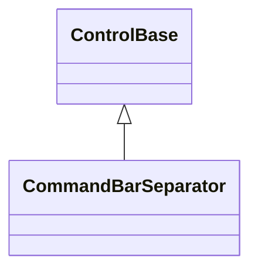
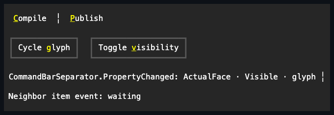

# CommandBarSeparator

## Overview

`CommandBarSeparator` is declared
`public sealed class CommandBarSeparator : ControlBase, IStyled<CommandBarSeparatorStyle>`.
It is one passive semantic divider retained by a
[`CommandBar`](command-bar.md#overview). The separator measures one terminal
cell and lets the owner normalize visible dividers independently in its primary
row and overflow menu.

The caller creates the separator and keeps its reference. Adding it transfers
tree ownership to the bar until removal; removal does not dispose it, while
disposing the bar disposes a separator still owned there. It defaults to
non-focusable, outside the Tab sequence, and not hit-testable. Public mutation
is dispatcher-affine while attached, and invalid lifetime or thread access fails
before state changes.

## Inheritance



## API

| Member        | Type                        | Default  | Description                                           |
| ------------- | --------------------------- | -------- | ----------------------------------------------------- |
| `Style`       | `CommandBarSeparatorStyle?` | `null`   | Optional complete local passive-divider presentation. |
| `ActualStyle` | `CommandBarSeparatorStyle`  | Resolved | Read-only local, theme, or code-owned presentation.   |

Assigning `Style` while attached off-dispatcher throws
`InvalidOperationException`; assigning it after disposal throws
`ObjectDisposedException`. `CommandBarSeparatorStyle` is a complete immutable
`ControlStyle` with one required `Glyph`. Its preferred and fallback runes must
both be printable one-cell values; invalid values throw `ArgumentException`
before the style is created. Clearing local `Style` resumes the theme or
code-owned fallback.

## Keyboard

| Key | Behavior                                                |
| --- | ------------------------------------------------------- |
| —   | This control has no control-specific keyboard commands. |

The separator never becomes the bar's selected item and exposes no activation
event. With its documented default input properties, owner navigation and
pointer hit testing move directly between available command items or the
overflow trigger.

## Participation and normalization

Visible separators participate in the bar's source-order measurement. The owner
removes leading, trailing, and adjacent separators independently from the
primary and overflow representations, so each visible group contains dividers
only between command entries. Hidden separators retain their authored measured
slot without painting; Collapsed separators consume no layout space.

Changing inherited `Visibility` or local `Style` publishes the ordinary
`ControlBase.PropertyChanged` event on this separator. It never publishes an
activation event because no activation surface exists.

## Appearance and Unicode

`CommandBarSeparatorStyle.Default` uses the vertical separator glyph family. At
render time the preferred glyph is selected only when it occupies one terminal
cell under the live ambiguous-width policy; otherwise the validated portable
fallback is used. The resolved `Face` supplies semantic color and attributes,
using `SemanticColor.Bar` for its normal background, and drawing never extends
beyond the separator's single arranged cell. A complete local `Style` remains
authoritative.

## Example



```csharp
var separator = new CommandBarSeparator
{
    Style = CommandBarSeparatorStyle.Default with
    {
        Glyph = new ControlGlyph(new Rune('╎'), new Rune('|'))
    }
};
separator.PropertyChanged += (_, eventArgs) => Log(eventArgs.PropertyName);

var commands = new CommandBar();
commands.Items.Add(new CommandBarItem { Text = "&Build" });
commands.Items.Add(separator);
commands.Items.Add(new CommandBarItem { Text = "&Publish" });
```

## Expected behavior

| Scope                 | Observable evidence                                                        |
| --------------------- | -------------------------------------------------------------------------- |
| Public API            | Passive defaults, style validation, visibility changes, and style events.  |
| Integrated behavior   | Owner normalization, layout participation, and selection exclusion.        |
| Complete runtime path | Exact one-cell preferred or fallback glyph output without pointer targets. |

- The separator defaults to non-focusable, outside the Tab sequence, and not
  hit-testable; the bar never selects or invokes it.
- Primary and overflow planes independently omit edge and adjacent separators.
- Style and visibility changes invalidate only the required phase and publish
  observable state from the separator itself.
- Ambiguous-width changes select the portable fallback rather than overwriting
  an adjacent cell.
