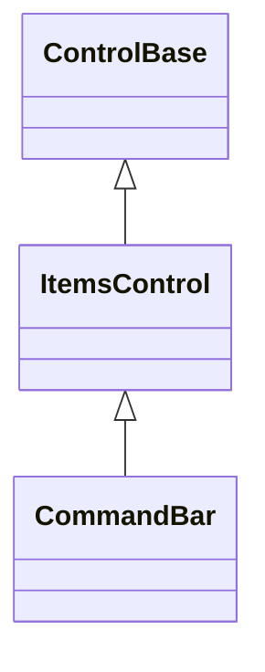
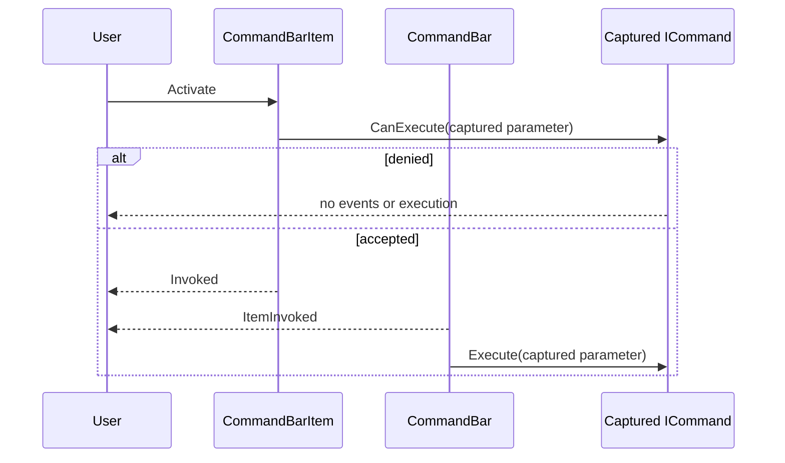
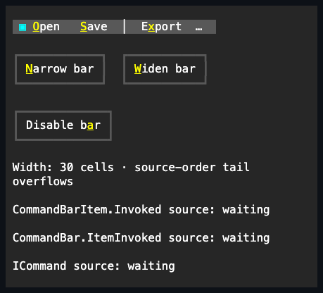
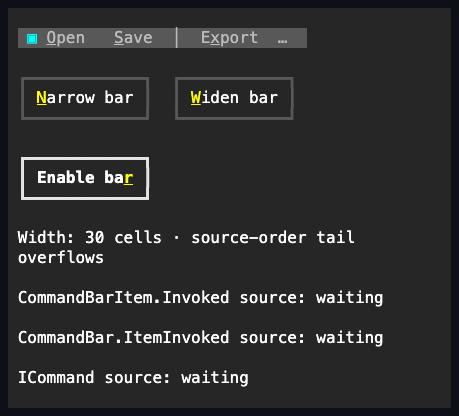
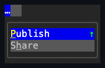

# CommandBar

## Overview

`CommandBar` is declared `public sealed class CommandBar : ItemsControl`. It
presents one row of typed commands and separators, keeps the longest fitting
source-order command prefix on that row, and moves the remaining visible command
tail into a private overflow menu.

The bar owns every [`CommandBarItem`](command-bar-item.md#overview) and
[`CommandBarSeparator`](command-bar-separator.md#overview) added to `Items`.
Overflow never reparents those controls: private menu projections borrow current
presentation and availability while activation keeps the original semantic item
and command identity. Removed entries detach without disposal; disposing the bar
disposes entries it still owns.

The bar is one dispatcher-affine focus and Tab stop. Its semantic faces and
overflow trigger are private navigation targets, so keyboard traversal does not
stop once per command. Invalid entries, unavailable authored selection, negative
spacing, and invalid style values are rejected before observable state changes.

## Inheritance



## API

| Member           | Type                                           | Default  | Description                                                                                             |
| ---------------- | ---------------------------------------------- | -------- | ------------------------------------------------------------------------------------------------------- |
| `Items`          | `CommandBarEntryCollection`                    | Empty    | Typed source-order ownership of detached `CommandBarItem` and `CommandBarSeparator` controls.           |
| `Spacing`        | `int`                                          | `1`      | Non-negative cells between participating primary entries and before a visible overflow trigger.         |
| `SelectedIndex`  | `int`                                          | `-1`     | Source index of the selected visible enabled command, or `-1`; separators and unavailable items reject. |
| `SelectedItem`   | `CommandBarItem?`                              | `null`   | Selected owned visible enabled command; null or a foreign item clears selection.                        |
| `IsOverflowOpen` | `bool`                                         | `false`  | Read-only; true while the private overflow popup session is open.                                       |
| `Style`          | `CommandBarStyle?`                             | `null`   | Optional complete local bar presentation.                                                               |
| `ActualStyle`    | `CommandBarStyle`                              | Resolved | Read-only complete local, theme-owned, or code-owned presentation.                                      |
| `ItemInvoked`    | `EventHandler<CommandBarItemInvokedEventArgs>` | —        | Raised after the semantic item event and before its captured command executes.                          |

`SelectedIndex` accepts `-1`. An out-of-range value throws
`ArgumentOutOfRangeException`; a separator position throws `ArgumentException`;
and an owned disabled, Hidden, or Collapsed command throws
`InvalidOperationException`. When an available selected item is removed or
becomes unavailable, selection moves to the nearest available sibling, looking
forward before backward, or clears when none remains. Moving another entry
preserves selected identity and silently adjusts only its numeric source index.

`CommandBarItemInvokedEventArgs` exposes non-null `Item` and defined `Cause`
properties. Its constructor throws `ArgumentNullException` for a null item and
`ArgumentOutOfRangeException` for an undefined `ActivationCause` before either
value is published.

`CommandBarStyle` is a complete immutable style record. It adds `Padding`, a
printable one-cell `OverflowGlyph` with portable fallback, and non-transparent
`OverflowColor`. A theme-owned overflow trigger uses that color in Normal and
its resolved foreground in every non-normal state (`SemanticColor.DisabledText`
by default when disabled). A complete local style remains authoritative,
including its `OverflowColor`; clearing it resumes the theme or code-owned
fallback.

### CommandBarEntryCollection

| Member                     | Type                       | Default | Description                                                               |
| -------------------------- | -------------------------- | ------- | ------------------------------------------------------------------------- |
| `this[int index]`          | `ControlBase`              | —       | Gets or replaces one retained entry without changing its source position. |
| `Count`                    | `int`                      | `0`     | Gets the number of retained semantic entries.                             |
| `Add(item)`                | `void`                     | —       | Appends one detached command item.                                        |
| `Add(separator)`           | `void`                     | —       | Appends one detached separator.                                           |
| `Insert(index, item)`      | `void`                     | —       | Inserts one detached command item at a validated position.                |
| `Insert(index, separator)` | `void`                     | —       | Inserts one detached separator at a validated position.                   |
| `Remove(item)`             | `bool`                     | —       | Detaches an identical command item without disposing it.                  |
| `Remove(separator)`        | `bool`                     | —       | Detaches an identical separator without disposing it.                     |
| `RemoveAt(index)`          | `void`                     | —       | Detaches the entry at a validated position without disposal.              |
| `Move(oldIndex, newIndex)` | `void`                     | —       | Reorders one retained identity without detaching it.                      |
| `IndexOf(entry)`           | `int`                      | —       | Returns the identity position, or `-1` for a foreign entry.               |
| `Clear()`                  | `void`                     | —       | Detaches every retained entry without disposal.                           |
| `GetEnumerator()`          | `IEnumerator<ControlBase>` | —       | Enumerates the live source-order entries.                                 |

The collection implements `IReadOnlyList<ControlBase>`. Null, arbitrary
controls, disposed entries, duplicates, cycles, and cross-parent insertion are
rejected before the current snapshot changes. Replacement, removal, and clear
detach outgoing controls without disposal.

## Keyboard

| Key             | Behavior                                                                                           |
| --------------- | -------------------------------------------------------------------------------------------------- |
| Left / Right    | Moves through available primary commands and the overflow trigger, wrapping at either end.         |
| Home / End      | Selects the first or last available primary target, including the trigger when overflow exists.    |
| Enter           | Invokes the selected primary command, or opens overflow for an overflowed item or trigger.         |
| Space           | Shows held state and invokes or opens on matching release; press-only terminals complete at press. |
| Alt+access key  | Selects and invokes a primary command, or opens overflow and selects its matching projection.      |
| Escape          | Dismisses open overflow and restores focus to the bar.                                             |
| Tab / Shift+Tab | Remains unhandled so global traversal leaves the bar's single Tab stop.                            |

Command-modified movement is left unhandled. Incidental lock modifiers remain
eligible. Pointer press on a primary command selects it and focuses the bar;
release routes through the same activation sequence as keyboard input.

## Ownership and overflow

| Entry state                      | Width and spacing                         | Representation                               | Selectable |
| -------------------------------- | ----------------------------------------- | -------------------------------------------- | ---------- |
| Visible and enabled              | Participates                              | One primary face or enabled menu projection  | Yes        |
| Visible and effectively disabled | Participates                              | One primary face or disabled menu projection | No         |
| Hidden                           | Retains measured primary slot and spacing | No cells and no overflow projection          | No         |
| Collapsed                        | Consumes nothing                          | No primary face or overflow projection       | No         |

Arrangement applies the following deterministic algorithm:

1. Measure retained entries in source order and exclude Collapsed entries.
2. Normalize primary and overflow separators independently, removing leading,
   trailing, and adjacent visible separators. Visible disabled commands count as
   rows; Hidden and Collapsed commands do not.
3. If every visible command fits, keep all of them primary and omit the trigger.
4. Otherwise reserve Hidden primary-only slots, spacing, and the whole one-cell
   trigger, then retain the longest visible source prefix that fits.
5. Arrange the remaining semantic items to empty primary bounds, update each
   item's overflow fact, and publish a complete private menu projection of the
   normalized tail.

A zero- or one-cell content box saturates without drawing outside its bounds.
When no primary command fits, every visible command remains represented by the
overflow snapshot; the trigger receives bounds only when one complete cell is
available. Restoring width deterministically returns the same source identities
to the primary plane.

The control deliberately has no arbitrary child entries, nested command groups,
overflow priorities, drag reordering, vertical mode, customization persistence,
or `Toolbar` alias. Use `Stack` for an arbitrary fixed strip and `Menu` for
nested commands.

## Activation and popup lifecycle



After owner selection and its property notifications commit, the item captures
`Command` and `CommandParameter` before the query. Replacing either captured
value, changing selection or style, or closing overflow from a later activation
callback does not redirect or cancel the accepted action. Removing, replacing,
hiding, collapsing, disabling, detaching, or disposing the source cancels stale
later stages. A newer nested activation likewise supersedes the older action.
Required cleanup and still-current stages complete before the earliest callback
failure is rethrown.

Overflow uses one stable private trigger, one vertical `Menu` with the shared
15-cell default minimum width, one anchored framed `Popup`, and one dismissing
modal coordinator for the bar's lifetime. The overflow keeps every frame edge
when it opens below or flips above the trigger; it is a submenu surface, not a
connected input dropdown. Opening transfers focus into the menu. Escape, outside
interaction, a layout-generation change, or direct unavailability of the
`CommandBar` closes it and restores focus according to the shared
[popup modality rules](../../concepts/modality.md#popup-and-window-presentations).
Ancestor unavailability instead suspends the modal scope while the popup stays
logically open, then restores that scope once the ancestor becomes available.
Invoking a projection completes semantic activation before the popup closes.

## Appearance and Unicode

The bar's padding, overflow glyph, and overflow color resolve through
`ActualStyle`. Item-specific captions, affixes, and presentation belong to the
[`CommandBarItem` appearance rules](command-bar-item.md#appearance-and-unicode),
and passive divider glyph fallback belongs to
[`CommandBarSeparator`](command-bar-separator.md#appearance-and-unicode). The
bar, normal primary entries, overflow trigger, separators, gaps, and unused
cells use `SemanticColor.Bar`. Physical hover retains that continuous background
while changing the active foreground. Disablement restores Bar while retaining
every other theme-authored state member. A complete local style bypasses those
theme overlays and wins unchanged in every state.

## Example







```csharp
var commands = new CommandBar
{
    Width = Length.Cells(30)
};
var open = new CommandBarItem { Text = "&Open" };
var publish = new CommandBarItem
{
    Text = "&Publish",
    Command = publishCommand,
    CommandParameter = currentDocument
};

commands.Items.Add(open);
commands.Items.Add(new CommandBarSeparator());
commands.Items.Add(publish);
commands.ItemInvoked += (_, eventArgs) => Log(eventArgs.Item, eventArgs.Cause);
var toggle = new Button { Text = "Toggle bar" };
toggle.Click += (_, _) => commands.IsEnabled = !commands.IsEnabled;
```

## Expected behavior

| Scope                 | Observable evidence                                                                       |
| --------------------- | ----------------------------------------------------------------------------------------- |
| Public API            | Defaults, validation before mutation, typed ownership, selection, and event payloads.     |
| Integrated behavior   | Single-stop input, source identity, popup modality, focus restoration, and command order. |
| Complete runtime path | Exact primary/menu cells, Unicode repair, tiny widths, resize transitions, and capture.   |

- Every visible command appears exactly once across the primary and overflow
  planes, while semantic parent and command identity remain stable.
- Disabled rows remain visible and consume width without becoming selectable;
  Hidden rows retain only primary layout space and Collapsed rows consume none.
- The longest fitting visible source prefix remains primary; normalized
  separators and bounded geometry produce a deterministic overflow tail.
- Primary access-key, keyboard, pointer, and overflow invocation follow the same
  semantic item and command sequence.
