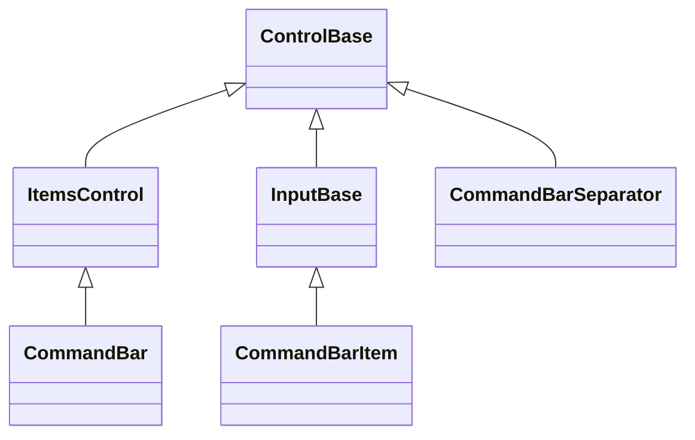
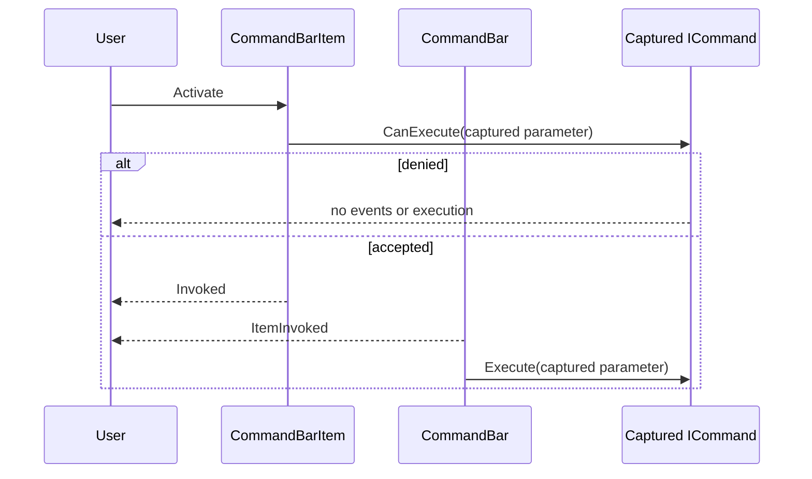

# CommandBar, CommandBarItem, and CommandBarSeparator

## Overview

`CommandBar` is declared `public sealed class CommandBar : ItemsControl`. It
presents a single row of typed commands and separators, keeps the longest
fitting source-order command prefix in that row, and moves the remaining visible
command tail into a private overflow menu.

The bar owns each semantic `CommandBarItem` or `CommandBarSeparator` added to
`Items`. Overflow does not reparent those controls: private `MenuItem`
projections borrow their current caption, affixes, availability, and local
presentation while every activation still uses the original semantic item and
its command. Removed entries detach without disposal; disposing the bar disposes
entries it still owns.

The bar is one dispatcher-affine focus and Tab stop. Its semantic faces and
overflow trigger are private navigation targets, so keyboard traversal does not
stop once per command. Invalid entries, unavailable authored selection, negative
spacing, and invalid style glyphs or colors are rejected before observable state
changes.

## Inheritance



## API

### CommandBar

| Member           | Type                                           | Default  | Description                                                                                             |
| ---------------- | ---------------------------------------------- | -------- | ------------------------------------------------------------------------------------------------------- |
| `Items`          | `CommandBarEntryCollection`                    | Empty    | Typed source-order ownership of detached `CommandBarItem` and `CommandBarSeparator` controls.           |
| `Spacing`        | `int`                                          | `1`      | Non-negative cells between participating primary entries and before a visible overflow trigger.         |
| `SelectedIndex`  | `int`                                          | `-1`     | Source index of the selected visible enabled command, or `-1`; separators and unavailable items reject. |
| `SelectedItem`   | `CommandBarItem?`                              | `null`   | Selected owned visible enabled command; null or a foreign item clears selection.                        |
| `IsOverflowOpen` | `bool`                                         | `false`  | Read-only; true while the private overflow popup session is open.                                       |
| `Style`          | `CommandBarStyle?`                             | `null`   | Optional complete local bar presentation.                                                               |
| `ActualStyle`    | `CommandBarStyle`                              | Resolved | Read-only complete local, theme-owned, or code-owned presentation.                                      |
| `ItemInvoked`    | `EventHandler<CommandBarItemInvokedEventArgs>` | —        | Raised after the semantic item event and before its captured command executes.                          |

`SelectedIndex` accepts `-1`. An out-of-range value throws
`ArgumentOutOfRangeException`; a separator position throws `ArgumentException`;
and an owned disabled, Hidden, or Collapsed command throws
`InvalidOperationException`. When an available selected item is removed or
becomes unavailable, selection moves to the nearest available sibling, looking
forward before backward, or clears when none remains. Moving another entry
preserves selected identity and silently adjusts only its numeric source index.

### CommandBarItem

| Member             | Type                                | Default  | Description                                                                                     |
| ------------------ | ----------------------------------- | -------- | ----------------------------------------------------------------------------------------------- |
| `Text`             | `string`                            | `""`     | Inherited caption; ampersand marks an access key and the empty caption remains valid.           |
| `Command`          | `ICommand?`                         | `null`   | Borrowed optional command queried before either invocation event.                               |
| `CommandParameter` | `object?`                           | `null`   | Borrowed value captured with `Command` for one accepted activation.                             |
| `StartAffix`       | `Affix?`                            | `null`   | Optional leading edge-pinned decoration using shared whole-grapheme reservation.                |
| `EndAffix`         | `Affix?`                            | `null`   | Optional trailing edge-pinned decoration that yields before the start affix at tiny widths.     |
| `IsOverflowed`     | `bool`                              | `false`  | Read-only live layout fact; true only while a visible command is represented in overflow.       |
| `Style`            | `CommandBarItemStyle?`              | `null`   | Optional complete local command-face presentation.                                              |
| `ActualStyle`      | `CommandBarItemStyle`               | Resolved | Read-only complete local, theme-owned, or code-owned presentation.                              |
| `PerformInvoke()`  | `void`                              | —        | Attempts the programmatic activation path; unavailable items are a no-op.                       |
| `Invoked`          | `EventHandler<ActivationEventArgs>` | —        | Raised first for an accepted activation, carrying its keyboard, pointer, or programmatic cause. |

`PerformInvoke()` validates current dispatcher access and lifetime. A disposed
item throws `ObjectDisposedException`; an attached off-dispatcher call throws
`InvalidOperationException`. Effective disabled or hidden state is a no-op and
does not query the command or raise an event.

### CommandBarSeparator and collection

| Member        | Type                        | Default  | Description                                                        |
| ------------- | --------------------------- | -------- | ------------------------------------------------------------------ |
| `Style`       | `CommandBarSeparatorStyle?` | `null`   | Optional complete local passive divider presentation.              |
| `ActualStyle` | `CommandBarSeparatorStyle`  | Resolved | Read-only complete local, theme-owned, or code-owned presentation. |

`CommandBarEntryCollection` implements `IReadOnlyList<ControlBase>` and exposes
a settable indexer plus typed `Add`, `Insert`, and `Remove` overloads for items
and separators. It also supplies `RemoveAt`, identity-preserving `Move`,
`IndexOf`, `Clear`, and enumeration. Null, arbitrary controls, disposed entries,
duplicates, cycles, and cross-parent insertion are rejected before the current
snapshot changes. Replacement, removal, and clear detach outgoing controls
without disposal.

`CommandBarItemInvokedEventArgs` exposes non-null `Item` and defined `Cause`
properties. Its constructor throws `ArgumentNullException` for a null item and
`ArgumentOutOfRangeException` for an undefined `ActivationCause` before either
value is published.

`CommandBarStyle`, `CommandBarItemStyle`, and `CommandBarSeparatorStyle` are
complete immutable style records. The bar style adds `Padding`, a printable
one-cell `OverflowGlyph` with portable fallback, and non-transparent
`OverflowColor`. The item style adds compact horizontal `Padding` and inherits
the shared input `AffixGap`; either geometry member invalidates measure. The
separator style adds one validated one-cell `Glyph`. None of these leaf styles
creates a separate theme section: clearing local `Style` resumes its
`ControlStyle` or `InputStyle` fallback.

## Keyboard

| Key             | Behavior                                                                                           |
| --------------- | -------------------------------------------------------------------------------------------------- |
| Left / Right    | Moves through available primary commands and the overflow trigger, wrapping at either end.         |
| Home / End      | Selects the first or last available primary target, including the trigger when overflow exists.    |
| Enter           | Invokes the selected primary command, or opens overflow for an overflowed item or trigger.         |
| Space           | Shows held state and invokes or opens on matching release; press-only terminals complete at press. |
| Alt+access key  | Selects and invokes a primary command, or opens overflow and selects its matching projection.      |
| Escape          | Dismisses open overflow and restores focus to the bar.                                             |
| Tab / Shift+Tab | Remains unhandled so global traversal leaves the bar's single Tab stop.                            |

Command-modified movement is left unhandled. Incidental lock modifiers remain
eligible. Pointer press on a primary command selects it and focuses the bar
while the semantic face owns held state and capture; release routes through the
same activation sequence as keyboard input.

## Ownership and overflow

| Entry state                      | Width and spacing                         | Representation                               | Selectable |
| -------------------------------- | ----------------------------------------- | -------------------------------------------- | ---------- |
| Visible and enabled              | Participates                              | One primary face or enabled menu projection  | Yes        |
| Visible and effectively disabled | Participates                              | One primary face or disabled menu projection | No         |
| Hidden                           | Retains measured primary slot and spacing | No cells and no overflow projection          | No         |
| Collapsed                        | Consumes nothing                          | No primary face or overflow projection       | No         |

Arrangement applies the following deterministic algorithm:

1. Measure retained entries in source order and exclude Collapsed entries.
2. Normalize primary and overflow separators independently, removing leading,
   trailing, and adjacent visible separators. Visible disabled commands count as
   rows; Hidden and Collapsed commands do not.
3. If every visible command fits, keep all of them primary and omit the trigger.
4. Otherwise reserve Hidden primary-only slots, spacing, and the whole one-cell
   trigger, then retain the longest visible source prefix that fits.
5. Arrange the remaining semantic items to empty primary bounds, set their
   read-only `IsOverflowed` fact, and publish a complete private menu projection
   of the normalized tail.

A zero- or one-cell content box saturates without drawing outside its bounds.
When no primary command fits, every visible command remains represented by the
overflow snapshot; the trigger receives bounds only when one complete cell is
available. Restoring width deterministically returns the same source identities
to the primary plane.

The control deliberately has no arbitrary child entries, nested command groups,
overflow priorities, drag reordering, vertical mode, customization persistence,
or `Toolbar` alias. Use `Stack` for an arbitrary fixed strip and `Menu` for
nested commands.

## Activation and popup lifecycle



The item captures `Command` and `CommandParameter` before the query. Replacing
either value, changing selection or style, or closing overflow from a callback
does not redirect or cancel the accepted action. Removing, replacing, hiding,
collapsing, disabling, detaching, or disposing the source does cancel stale
later stages. A newer nested activation likewise supersedes the older action.
Required cleanup and still-current stages complete before the earliest callback
failure is rethrown.

Overflow uses one stable private trigger, one vertical `Menu`, one anchored
`Popup`, and one dismissing modal coordinator for the bar's entire lifetime.
Opening transfers focus into the menu. Escape, outside interaction,
unavailability, or a layout-generation change closes it, cancels held trigger
state, and restores focus according to the shared
[popup modality rules](../../concepts/modality.md#popup-and-window-presentations).
Invoking a projection completes the semantic activation before the popup closes.

## Appearance and Unicode

`CommandBarItemStyle.Default` is a compact borderless input presentation with
one horizontal cell of padding. Caption and affix drawing uses the shared
[Unicode cell geometry](../../concepts/unicode-cell-geometry.md#overview):
extended grapheme clusters are never split, caption cells clip before a trailing
affix, the trailing affix then drops whole, and the leading affix drops last.
The overflow and separator styles validate preferred and fallback glyphs as
printable one-cell values. A changed ambiguous-width policy selects the portable
fallback instead of overwriting an adjacent cell.

## Example


```csharp
var commands = new CommandBar
{
    Width = Length.Cells(30)
};
var open = new CommandBarItem
{
    Text = "&Open",
    StartAffix = new Affix("▣", "#")
};
var publish = new CommandBarItem
{
    Text = "&Publish",
    Command = publishCommand,
    CommandParameter = currentDocument
};

commands.Items.Add(open);
commands.Items.Add(new CommandBarSeparator());
commands.Items.Add(publish);
commands.ItemInvoked += (_, eventArgs) => Log(eventArgs.Item, eventArgs.Cause);
```

## Expected behavior

| Scope                 | Observable evidence                                                                       |
| --------------------- | ----------------------------------------------------------------------------------------- |
| Public API            | Defaults, validation before mutation, typed ownership, selection, and event payloads.     |
| Integrated behavior   | Single-stop input, source identity, popup modality, focus restoration, and command order. |
| Complete runtime path | Exact primary/menu cells, Unicode repair, tiny widths, resize transitions, and capture.   |

- Every visible command appears exactly once across the primary and overflow
  planes, while semantic parent and command identity remain stable.
- Disabled rows remain visible and consume width without becoming selectable;
  Hidden rows retain only primary layout space and Collapsed rows consume none.
- Fixed-seed randomized layout proves tail-first overflow, normalized
  separators, bounded primary geometry, and deterministic resize recovery.
- The Showcase specimen exposes commands, a separator, a disabled action, access
  keys, separate item/command logs, and live width changes through the same
  public API an application uses.
