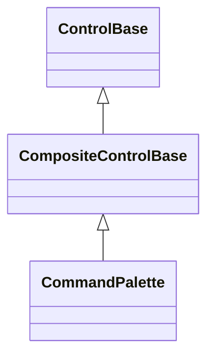
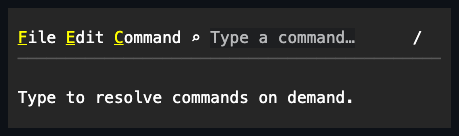
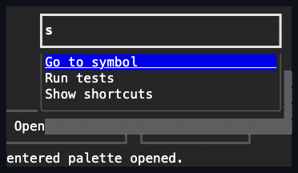
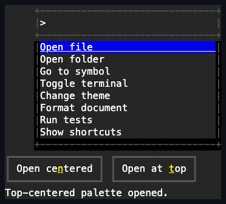

# CommandPalette

## Overview

`CommandPalette` is declared
`public sealed class CommandPalette : CompositeControlBase`. It retains one
grapheme-safe `TextInput` and one popup `ListView`, keeps focus in the editor,
and asks a caller-supplied resolver for a fresh result snapshot whenever the
search text changes.

The resolver may complete synchronously or asynchronously. A newer query cancels
and supersedes the prior request; a stale completion never replaces the current
items. Resolver results are copied by the retained list before they are
published. The palette remains dispatcher-affine while attached.

## Inheritance



## API

| Member               | Type                                                    | Default          | Description                                                                                          |
| -------------------- | ------------------------------------------------------- | ---------------- | ---------------------------------------------------------------------------------------------------- |
| `Resolver`           | `CommandPaletteResolver?`                               | `null`           | Resolves a fresh borrowed item snapshot for the current text and cancellation token.                 |
| `Text`               | `string`                                                | `""`             | Freely editable search text forwarded to the retained `TextInput`.                                   |
| `Items`              | `IReadOnlyList<object?>`                                | Empty            | Read-only copied snapshot from the latest current successful resolution.                             |
| `IsResolving`        | `bool`                                                  | `false`          | Read-only; true between starting and committing the current asynchronous request.                    |
| `ItemTemplate`       | `ItemTemplate`                                          | Text template    | Realizes each resolved item as one detached result-row control.                                      |
| `RowHeight`          | `int?`                                                  | `null`           | Optional positive fixed result-row height; null keeps content-sized rows.                            |
| `Placeholder`        | `string?`                                               | `null`           | Placeholder shown while the retained editor is empty.                                                |
| `StartAffix`         | `Affix?`                                                | `null`           | Optional leading edge-pinned editor decoration.                                                      |
| `EndAffix`           | `Affix?`                                                | `null`           | Optional trailing edge-pinned editor decoration.                                                     |
| `FieldBorder`        | `Border`                                                | Input appearance | Complete local border for the retained editor; `BorderSide.None` supports menu-bar embedding.        |
| `FieldShadow`        | `Shadow`                                                | Input appearance | Complete local shadow for the retained editor.                                                       |
| `PopupChrome`        | `PopupChrome`                                           | Popup appearance | Complete local border/shadow fragments for the retained result popup.                                |
| `DropDownHeight`     | `int`                                                   | `8` cells        | Positive maximum result-list height.                                                                 |
| `IsOpen`             | `bool`                                                  | `false`          | Opens non-empty results or starts a resolution; false closes results without clearing text.          |
| `Open()`             | `bool`                                                  | —                | Opens current or fresh results, focuses the retained editor, and reports whether focus was acquired. |
| `Close()`            | `void`                                                  | —                | Closes the result popup while preserving text and items.                                             |
| `Refresh()`          | `void`                                                  | —                | Starts a fresh current-text resolution and makes non-empty results eligible to open.                 |
| `ResetFieldBorder()` | `void`                                                  | —                | Returns the retained editor border to the active input appearance.                                   |
| `ResetFieldShadow()` | `void`                                                  | —                | Returns the retained editor shadow to the active input appearance.                                   |
| `ResetPopupChrome()` | `void`                                                  | —                | Returns result popup border and shadow to the active popup appearance.                               |
| `Opened`             | `EventHandler`                                          | —                | Raised after the non-empty result popup opens.                                                       |
| `Closed`             | `EventHandler`                                          | —                | Raised after the result popup closes.                                                                |
| `ResultsChanged`     | `EventHandler`                                          | —                | Raised after current results commit or clear.                                                        |
| `ResolutionFailed`   | `EventHandler<CommandPaletteResolutionFailedEventArgs>` | —                | Raised after a still-current resolver failure clears the results.                                    |
| `ItemInvoked`        | `EventHandler<ItemInvokedEventArgs>`                    | —                | Raised after pointer or keyboard activation; carries index, borrowed item, and activation cause.     |

`CommandPaletteResolver` receives the current non-null search string and a
cancellation token. It returns a `ValueTask<IReadOnlyList<object?>>`; returning
null is a resolver contract violation and is reported through
`ResolutionFailed`. Resolver exceptions clear results and close the result popup
only when the failing request is still current.

## Resolution and interaction

1. A text change cancels the previous request, increments the current
   generation, sets `IsResolving`, and invokes `Resolver`.
2. A current successful completion copies and publishes `Items`, raises
   `ResultsChanged`, and opens the popup when results are non-empty.
3. A cancelled or stale completion has no observable effect.
4. Detachment increments the generation, cancels the request, and clears
   `IsResolving`; a resolver that ignores cancellation still cannot mutate or
   publish into the detached palette.
5. Opening non-empty results selects the first available row and makes that same
   row the list's current item while focus stays in the editor. The opening also
   snapshots the prior selected and current rows so a close without acceptance
   can restore them.

| Input                                     | Open-session behavior                                                                                     |
| ----------------------------------------- | --------------------------------------------------------------------------------------------------------- |
| Up or Left, initial or repeat             | Moves selection and current state to the previous available result.                                       |
| Down or Right, initial or repeat          | Moves selection and current state to the next available result.                                           |
| Home or End, initial or repeat            | Moves selection and current state to the first or last available result.                                  |
| Page Up or Page Down, initial or repeat   | Moves selection and current state by one visible page and keeps the result visible.                       |
| Enter, initial activation-eligible press  | Accepts the current result, closes the popup, then publishes `ItemInvoked`.                               |
| Space                                     | Remains editable query text while the retained editor has focus; it is not a palette acceptance shortcut. |
| Escape, initial activation-eligible press | Cancels and closes the popup.                                                                             |

The navigation rows above use the
[shared focus-independent delegation rule](../../concepts/input-routing.md#popup-navigation-delegation).
They run exactly once whether focus remains in the retained editor or is moved
into the result list. Selection and current state are provisional until Enter or
a primary pointer activation accepts a result. `Close()`, `IsOpen = false`,
Escape, direct popup closure, light dismissal, and unavailability cancel instead
and restore the opening rows. If refreshed results no longer contain an opening
index, rollback uses the stable unselected state. A later session is not closed,
invoked, or rolled back by a stale activation from an earlier one.

Every public callback is a generation boundary. If `ResultsChanged`, popup
lifecycle, or property notification code starts another query or disposes the
palette, the older completion stops before changing later popup or failure
state. A throwing `Text` or initial `IsResolving` property observer is rethrown
only after the already-committed query has been admitted to its resolver, so no
busy state is left without work capable of completing it.

The result popup uses the shared dismissing modal scope, so outside input closes
it and restores the focus that preceded `Open()`. The retained editor is the
modal plane's initial focus target even though the public composite itself is
not focusable.

## Placement and appearance

Placement belongs to the parent layout rather than a second command-palette
state machine. Embed the palette in a horizontal menu-bar composition, or place
it in an `Overlay` with `HorizontalAlignment.Center` and either
`VerticalAlignment.Top` or `VerticalAlignment.Center`. Calling `Open()` after
making a transient instance visible transfers focus to the editor.

`FieldBorder`, `FieldShadow`, affixes, and `PopupChrome` are independent. A
menu-bar palette can remove the field border and use compact start/end glyphs,
while a centered transient palette can retain a full field border and give the
result popup its own border and shadow.

## Example







```csharp
var palette = new CommandPalette
{
    Width = Length.Cells(36),
    Placeholder = "Type a command…",
    StartAffix = new Affix("⌕", "?"),
    Resolver = ResolveCommands,
};

palette.HorizontalAlignment = HorizontalAlignment.Center;
palette.VerticalAlignment = VerticalAlignment.Top;
palette.ItemInvoked += (_, eventArgs) => Run(eventArgs.Item);
_ = palette.Open();
```

## Expected behavior

| Scope                 | Observable evidence                                                          |
| --------------------- | ---------------------------------------------------------------------------- |
| Public API            | Validation, defaults, state changes, cancellation, and latest-query results. |
| Integrated behavior   | Editor focus, modal dismissal, popup rows, keyboard, and pointer activation. |
| Complete runtime path | Final field, affix, popup, border, shadow, and result cells.                 |

- Freely edited Unicode text is retained by `TextInput`; the palette never
  implements a competing edit model.
- A stale, cancelled, or detached resolver completion cannot replace newer
  results, and reentrant callbacks cannot resume an older completion afterward.
- Opening an embedded or overlay-positioned palette focuses the retained editor,
  while invoking a result closes the popup and preserves the query.
- Result selection and current-item state identify the same row; holding Up or
  Down continues navigation and keeps the popup scrollbar synchronized.
- Initial and repeated navigation is delivered once regardless of focus
  placement; accepting invokes the current result, while cancellation restores
  the opening list state.
