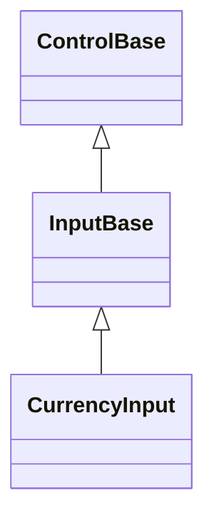
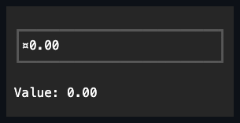

# CurrencyInput

## Overview

`CurrencyInput` is declared `public sealed class CurrencyInput : InputBase`. It
edits a nullable monetary value through a transient typed buffer that commits on
Enter or when focus leaves the control, formatted and parsed against a culture's
currency-specific globalization data rather than a maintained currency database.

`CurrencyInput` shares its buffer-then-commit editing model with
[`NumberInput`](number-input.md#overview), including one shared routed editing
lifecycle, one authoritative nullable value/range state, and the same
grapheme-safe primitive for digit, separator, and sign buffering. Up/Down step
by `Step` and Home/End jump directly to `Minimum`/`Maximum` - both commit
immediately, bypassing the buffer entirely, matching `NumberInput` and
[`Slider`](slider.md#overview). Escape reverts any uncommitted edit back to the
committed value's formatting.

`CurrencyInput` derives from [`InputBase`](../input-base.md#overview) but opts
into none of its popup or press-activation capabilities - only the base
focusable, Tab-stopping contract, the same as `NumberInput`.

The edited buffer never contains the currency symbol or code: while focused, the
rendered text composes the resolved currency identity around the buffered
numeric core using the culture's own `CurrencyPositivePattern` or
`CurrencyNegativePattern` layout template, never a hand-built "symbol, space,
sign, number" assumption. Digit grouping walks the culture's
`CurrencyGroupSizes` sequence, not a hardcoded run of three, so cultures such as
Hindi/English (India) that group in twos after the first three digits render
correctly. `DecimalPlaces` left unset derives from `CurrencyDecimalDigits` and
re-derives every time it is needed, so it automatically tracks a runtime
`Culture` change - for example, Japanese yen has no minor unit, so an unset
`DecimalPlaces` rejects the decimal-separator keystroke outright once `Culture`
is Japanese. `RoundingMode` is applied only at commit. Effective precision from
zero through 28 uses the three-argument
`Math.Round(decimal, int, MidpointRounding)` overload; larger accepted explicit
or culture-derived precision preserves Decimal's available value instead of
throwing during Enter or stepping. `Culture` uses reference identity, so
assigning a distinct same-name clone refreshes customized currency symbols,
patterns, separators, grouping, derived decimal places, and any active edit
buffer; only the identical instance is a no-op.

Dependent policy repair reads the live `AllowNull` state after
`PropertyChanged`. If an observer restores nullable input synchronously, the
superseded outer assignment does not seed the value to zero or rewrite its
formatted buffer.

## Inheritance



## API

| Member             | Type                                               | Default                         | Description                                                                                                                                  |
| ------------------ | -------------------------------------------------- | ------------------------------- | -------------------------------------------------------------------------------------------------------------------------------------------- |
| `Value`            | `decimal?`                                         | `null`                          | The nullable value. Assignment clamps silently into `Minimum`/`Maximum`.                                                                     |
| `AllowNull`        | `bool`                                             | `true`                          | Allows the value to be cleared to null; disabling it while already null eagerly reseeds to zero, clamped into bounds.                        |
| `Minimum`          | `decimal`                                          | `decimal.MinValue`              | The inclusive lower bound (equal to `Maximum` allowed) that repairs the current value.                                                       |
| `Maximum`          | `decimal`                                          | `decimal.MaxValue`              | The inclusive upper bound (equal to `Minimum` allowed) that repairs the current value.                                                       |
| `Step`             | `decimal`                                          | `1`                             | The positive increment Up/Down apply, and the jump Home/End commit to `Minimum`/`Maximum` land on directly.                                  |
| `DecimalPlaces`    | `int?`                                             | `null`                          | A non-negative explicit digit count, or null for culture-derived precision; effective values above 28 preserve Decimal's available value.    |
| `AllowGrouping`    | `bool`                                             | `true`                          | Whether the idle and freshly focused display groups digits under `Culture`'s currency group separator and sizes; parsing always accepts one. |
| `RoundingMode`     | `MidpointRounding`                                 | `MidpointRounding.AwayFromZero` | The rounding applied to a typed value only at commit.                                                                                        |
| `Culture`          | `CultureInfo`                                      | `CultureInfo.InvariantCulture`  | The culture supplying currency-specific separators, sign, group sizes, and positive/negative pattern for display and parsing.                |
| `DisplayMode`      | `CurrencyDisplayMode`                              | `CurrencyDisplayMode.Symbol`    | Chooses how the currency identity is resolved and composed around the formatted number.                                                      |
| `CurrencyOverride` | `string?`                                          | `null`                          | Caller-supplied currency identity text that takes precedence over every `DisplayMode` resolution rule.                                       |
| `StartAffix`       | `Affix?`                                           | `null`                          | Optional leading edge-pinned decoration, reserved inboard of the border and outboard of the value's own composed text.                       |
| `EndAffix`         | `Affix?`                                           | `null`                          | Optional trailing edge-pinned decoration, reserved inboard of the border and outboard of the value's own composed text.                      |
| `ValueChanged`     | `EventHandler<CurrencyInputValueChangedEventArgs>` | No subscribers                  | Raised after a committed value transition.                                                                                                   |

`StartAffix` and `EndAffix` each reserve a fixed cell column inboard of the
border, deflated away from the composed currency display and caret before either
draws - distinct from the currency symbol itself, which is part of the composed
value text, not an affix. Setting either never moves the value or its caret into
a reserved affix column. The gap between a present affix and the value comes
from the shared `InputStyle.AffixGap` (see
[styling.md](../../concepts/styling.md#instance-content-affix)), the same member
`NumberInput`, `TextInput`, and `Button` read. When the content box is too
narrow for everything, the value's own box shrinks first, then the end affix
drops whole, then the start affix - never a partial cluster - and the decision
is re-evaluated against the control's actual bounds on every render.

## Currency identity resolution

`DisplayMode` chooses which text `CurrencyOverride`, when unset, falls back to:

| `DisplayMode` | Resolution when `CurrencyOverride` is null                 |
| ------------- | ---------------------------------------------------------- |
| `Symbol`      | `Culture.NumberFormat.CurrencySymbol` - always resolvable. |
| `IsoCode`     | `RegionInfo(Culture).ISOCurrencySymbol`.                   |
| `Name`        | `RegionInfo(Culture).CurrencyNativeName`.                  |
| `Custom`      | Not applicable - `CurrencyOverride` must be set.           |

`NumberFormatInfo` does not reliably expose an ISO code or a localized currency
name, so `IsoCode` and `Name` resolve through `RegionInfo` instead. Setting
`DisplayMode`, `Culture`, or `CurrencyOverride` to a combination that cannot
resolve a currency identity throws `InvalidOperationException` immediately,
before the property changes - it never silently renders the generic currency
sign.

> [!NOTE]
>
> `RegionInfo` has no entry for `CultureInfo.InvariantCulture` or other
> region-less cultures. `DisplayMode.IsoCode` or `DisplayMode.Name` under such a
> culture requires `CurrencyOverride`; without it, the setter throws rather than
> falling back to a placeholder.

<!-- markdownlint-disable-next-line MD028 -->

> [!NOTE]
>
> Localized native digit glyphs (`NumberFormatInfo.NativeDigits`) are outside
> this control's input contract: only ASCII digits are accepted and rendered,
> the same limitation `NumberInput` and the segmented temporal fields share.

## Example



```csharp
var currencyInput = new CurrencyInput { Minimum = 0m, Maximum = 1000m, Step = 5m };
currencyInput.ValueChanged += (_, e) => Console.Write(e.Value);
```

## Expected behavior

| Scope                 | Observable evidence                                                                                                                                                                                                                     |
| --------------------- | --------------------------------------------------------------------------------------------------------------------------------------------------------------------------------------------------------------------------------------- |
| Public API            | Defaults, bounds, the null policy, precision derivation, the rounding matrix, overflow guarding, and event order behave as documented.                                                                                                  |
| Integrated behavior   | Keyboard editing, pasting, and mid-edit Culture changes work end to end without migrating a half-parsed buffer or a stale currency identity.                                                                                            |
| Complete runtime path | Typed display transitions, culture-aware currency separators, group sizes, and sign patterns, Enter/Escape/focus-loss commit paths, keyboard stepping, pointer caret placement, the disabled state, and tiny clipping render correctly. |

- Direct character edits follow the shared
  [keyboard modifier policy](../../concepts/input-routing.md#keyboard-modifier-policy):
  Shift and lock state may produce text, while command-modified characters stay
  out of the transient buffer and remain unhandled.
- The buffer accepts both a culture's own negative sign and the ASCII
  hyphen-minus, normalizing whichever was typed at commit.
- A negative amount under a culture whose `CurrencyNegativePattern` wraps the
  number in parentheses - `CultureInfo.InvariantCulture` by default - renders
  that way instead of with a literal minus sign, even though the buffer itself
  still holds a typed sign character.
