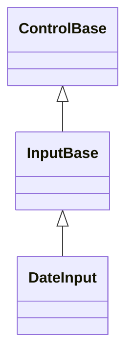
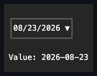

# DateInput

## Overview

`DateInput` displays a formatted date, supports inline segment editing, and
offers an optional Calendar popup.

While the popup is open, arrow, Page Up, Page Down, Home, and End keys navigate
the calendar. Enter or Space commits its active date, and Escape closes the
popup without changing the value.

Plain Tab or Shift+Tab closes the open popup and continues application
traversal. Caps Lock and Num Lock are incidental state; a Tab carrying Control,
Alt, Super, Hyper, or Meta remains unhandled and leaves the popup open.

Exact Alt+Down or unmodified F4 opens the popup; lock-key state is ignored, but
any additional command modifier leaves the chord unhandled for an application or
host shortcut.

Custom date formats follow .NET quoting and escaping rules. Date letters inside
quoted or escaped literals remain display text and never become editable
segments. When a format contains no editable segments, segment-editing keys are
left unhandled while popup and clearing commands remain available.

`Culture` accepts only cultures whose active calendar is Gregorian, keeping the
typed field's formatted segments, Gregorian `DateOnly` arithmetic, and the owned
Calendar popup on one calendar system. Culture transitions use reference
identity: assigning a distinct customized clone commits even when
`CultureInfo.Equals` considers its culture name equal, while assigning the
identical instance is silent. The committed instance is also forwarded to the
owned Calendar before `PropertyChanged` is published.

`DateInput` derives from [`InputBase`](../input-base.md#overview), enabling
press activation, an owned Calendar popup, and segment editing. It shares its
complete routed key and pointer editing engine - including active-segment
navigation, digit-entry buffering, recognized-without-change handling, popup
precedence, and focus continuation - with [`TimeInput`](time-input.md) and
[`DateTimeInput`](date-time-input.md) through
[`InputBase.EnableSegmentEditing`](../input-base.md#api). Each control keeps its
own calendar/clock arithmetic and pattern (`ResolveDatePattern` here) on top of
that shared engine.

The three temporal fields also use one generic nullable value state for lazy
dispatcher-clock seeding, inclusive bounds, endpoint repair, and reentrant-safe
`ValueChanged` publication. `DateInput` and `DateTimeInput` additionally share
one Calendar drop-down coordinator: it owns the retained Calendar, programmatic
synchronization depth, open-session snapshots, acceptance, rollback, and event
detachment. Calendar navigation remains provisional until explicit acceptance.

Disabling `AllowNull` repairs an existing null only if that policy remains live
after `PropertyChanged`. A synchronous observer that restores `AllowNull`
prevents obsolete clock-derived seeding and preserves the null value.

## Inheritance



## API

| Member                             | Type                                           | Default                                         | Description                                                                                                              |
| ---------------------------------- | ---------------------------------------------- | ----------------------------------------------- | ------------------------------------------------------------------------------------------------------------------------ |
| `Value`                            | `DateOnly?`                                    | current local date                              | The nullable committed date, clamped to the inclusive bounds.                                                            |
| `AllowNull`                        | `bool`                                         | `true`                                          | Allows clearing the value; disabling it repairs a null value.                                                            |
| `Culture`                          | `CultureInfo`                                  | current Gregorian culture or invariant fallback | Supplies the segment order and formatting; rejects cultures whose active calendar is not Gregorian.                      |
| `Format`                           | `string`                                       | `"d"`                                           | A non-null, non-empty date format string.                                                                                |
| `Minimum`                          | `DateOnly`                                     | `DateOnly.MinValue`                             | The inclusive lower bound that repairs the current value.                                                                |
| `Maximum`                          | `DateOnly`                                     | `DateOnly.MaxValue`                             | The inclusive upper bound that repairs the current value.                                                                |
| `DropDownHeight`                   | `Length`                                       | `Length.Cells(10)`                              | The automatic, fixed-cell, or placement-relative maximum visible calendar height.                                        |
| `IsOpen`                           | `bool`                                         | `false`                                         | Opens or closes the retained Calendar popup.                                                                             |
| `CalendarStyle`                    | `CalendarStyle?`                               | `null`                                          | Overrides the owned Calendar's complete local presentation.                                                              |
| `ActualCalendarStyle`              | `CalendarStyle`                                | Resolved                                        | Read-only; the resolved presentation of the owned Calendar.                                                              |
| `PopupChrome`                      | `PopupChrome`                                  | `default`                                       | Overrides the owned Calendar popup's border and shadow together.                                                         |
| `ResetPopupChrome()`               | `void`                                         | —                                               | Returns the Calendar popup's border and shadow to `PopupChrome` ownership.                                               |
| `StartAffix`                       | `Affix?`                                       | `null`                                          | Optional leading edge-pinned decoration, reserved inside the field box and strictly inboard of the drop-down indicator.  |
| `EndAffix`                         | `Affix?`                                       | `null`                                          | Optional trailing edge-pinned decoration, reserved inside the field box and strictly inboard of the drop-down indicator. |
| Themed disclosure glyph            | —                                              | `InputStyle.DropDownGlyph` (`▼`)                | Authored once for every drop-down input via `styles.input`.                                                              |
| `ValueChanged`                     | `EventHandler<DateInputValueChangedEventArgs>` | no subscribers                                  | Raised after a committed value transition.                                                                               |
| `DropDownOpened`, `DropDownClosed` | `EventHandler`                                 | no subscribers                                  | Raised after the Calendar popup opens or closes.                                                                         |

`DropDownHeight` constrains only the Calendar interior and never stretches a
shorter Calendar to the cap. `Length.Auto` uses its intrinsic height, positive
`Cells` values set a fixed maximum, and positive `Percent` values resolve
against the usable extent on the popup's chosen placement side after its frame
is removed. Root resize and placement fallback resolve that percentage again.
Star lengths and zero-valued fixed or percentage limits are rejected before
mutation.

`StartAffix` and `EndAffix` each reserve a fixed cell column inside the field
box, strictly inboard of the drop-down indicator - the segment layout deflates
around both, and neither ever draws over the `▼` glyph. The gap between a
present affix and the segments comes from the shared `InputStyle.AffixGap` (see
[styling.md](../../concepts/styling.md#instance-content-affix)), the same member
`ComboBox` reads. When the field box is too narrow for everything, the segment
layout shrinks first, then the end affix drops whole, then the start affix -
never a partial cluster - re-evaluated against the control's actual bounds on
every render.

## Keyboard

| Key                 | Behavior                                                                                                           |
| ------------------- | ------------------------------------------------------------------------------------------------------------------ |
| Left / Right        | Moves between editable date segments while the popup is closed; moves by one day while it is open.                 |
| Up / Down           | Changes the active segment while closed; moves by one week while open.                                             |
| Home / End          | Moves to the first or last segment while closed; moves to the first or last selectable day of the week while open. |
| Page Up / Page Down | Moves the open Calendar by one month.                                                                              |
| Digits              | Replaces or advances the active date segment while the popup is closed.                                            |
| Backspace           | Clears the active segment while the popup is closed.                                                               |
| Delete              | Clears the complete value when `AllowNull` is `true`.                                                              |
| Alt+Down / F4       | Opens the Calendar popup.                                                                                          |
| Enter / Space       | Accepts the active date and closes the open popup.                                                                 |
| Escape              | Cancels the open popup and restores its opening state.                                                             |
| Tab / Shift+Tab     | Cancels the open popup, then continues focus traversal.                                                            |

## Popup navigation session

Opening snapshots the committed `Value`, `Calendar.ActiveDate`, and Calendar
selection, then seeds the Calendar from the accepted value. Calendar browsing is
provisional: it changes `ActiveDate` without changing `Value` until an explicit
activation accepts the session.

A primary pointer activation accepts that date, including the already-active
date, and closes the popup. Repeated Alt+Down is consumed by the already-open
session without reopening or moving the Calendar.

The navigation and acceptance keys use the
[shared focus-independent delegation rule](../../concepts/input-routing.md#popup-navigation-delegation),
so owner focus and Calendar focus produce one movement or acceptance. Escape,
plain Tab, `IsOpen = false`, direct popup closure, light dismissal, and owner
unavailability restore the opening Calendar state without changing `Value`.
Rollback runs exactly once, and a close callback that reopens the popup creates
a replacement session that the older acceptance or rollback cannot disturb.

## Example



```csharp
var dateInput = new DateInput();
```

## Expected behavior

| Scope                 | Observable evidence                                                                                                                                   |
| --------------------- | ----------------------------------------------------------------------------------------------------------------------------------------------------- |
| Public API            | Defaults, bounds, the null policy, format and culture validation, segment editing, and event order behave as documented.                              |
| Integrated behavior   | Keyboard and pointer editing, Calendar selection, light dismiss, and focus restoration work end to end.                                               |
| Complete runtime path | The field and active segment render in their exact cells, the popup places correctly, focused and disabled states apply, and tiny bounds clip safely. |

- Direct digit entry follows the shared
  [keyboard modifier policy](../../concepts/input-routing.md#keyboard-modifier-policy),
  leaving command-modified characters unhandled without changing a segment.
- Initial and repeated Calendar navigation is delivered once regardless of focus
  placement, remains provisional until Enter, Space, or pointer acceptance, and
  restores the opening active date on cancellation.
- Reading `Value` after disposal always throws, including every read after a
  failed attempt to seed the lazy default.
