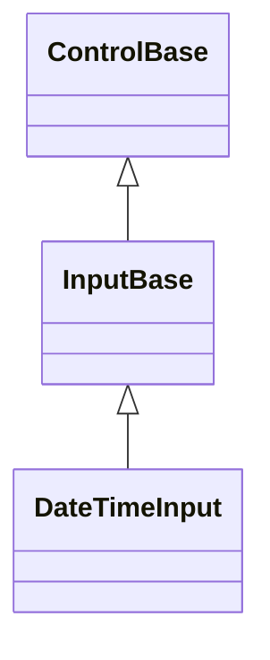

# DateTimeInput

## Overview

`DateTimeInput` combines date and time segment editing with an optional Calendar
popup.

The time portion supports `TimeStep`, a positive whole-minute increment that
Up/Down applies while the minute segment is active. The embedded calendar
exposes the same basic date navigation options as `Calendar`. Selecting a date
preserves the current time and `DateTimeKind`.

`DateTimeInput` derives from [`InputBase`](../input-base.md#overview), enabling
press activation, an owned Calendar popup, and segment editing. It shares its
active-segment navigation, digit-entry buffering, and pointer hit-testing engine
with [`DateInput`](date-input.md) and [`TimeInput`](time-input.md) through
[`InputBase.EnableSegmentEditing`](../input-base.md#api). It also shares its
AM/PM designator toggle, pointer-driven segment activation, and digit/AM-PM
keystroke classification with [`TimeInput`](time-input.md) alone, through the
internal `TemporalSegmentClassification` toolkit; each control still owns its
own value type and clamping. `Culture` now drives both the popup calendar's
month/day names _and_ the typed field's own date segment order, widths, and
separators - the same way `DateInput.Culture` does, deriving the layout from
`DateTimeFormatInfo.ShortDatePattern` - so a German culture, for example,
renders day before month with a period separator. The time portion keeps the
fixed hour/minute/[second]/[AM-PM] structure `Use24HourFormat` and `ShowSeconds`
already select, localizing only its separator, AM/PM designator text, and digit
glyphs. Set `Format` to a custom combined pattern (for example
`"yyyy/MM/dd hh:mm tt"`) to override that structure directly; pair a 12-hour
`h`/`hh` hour token with a `t`/`tt` AM/PM designator token for correct 12-hour
clamping, since a 12-hour hour token without a designator is treated as a
24-hour segment for editing purposes.

## Inheritance



## API

| Member                             | Type                                               | Default                          | Description                                                                                                                                 |
| ---------------------------------- | -------------------------------------------------- | -------------------------------- | ------------------------------------------------------------------------------------------------------------------------------------------- |
| `Value`                            | `DateTime?`                                        | current local date and time      | The nullable value, clamped to the inclusive bounds.                                                                                        |
| `AllowNull`                        | `bool`                                             | `true`                           | Allows Delete or Backspace to clear the value; disabling it repairs a null value.                                                           |
| `Culture`                          | `CultureInfo`                                      | `CultureInfo.InvariantCulture`   | Localizes both the popup calendar and the typed field's date order, separators, designator text, and digits; must use a Gregorian calendar. |
| `Use24HourFormat`                  | `bool`                                             | `true`                           | Selects 24-hour or AM/PM segments.                                                                                                          |
| `ShowSeconds`                      | `bool`                                             | `false`                          | Adds the seconds segment.                                                                                                                   |
| `Format`                           | `string?`                                          | `null`                           | A custom combined pattern overriding the derived segment order and count.                                                                   |
| `TimeStep`                         | `TimeSpan`                                         | one minute                       | The positive whole-minute increment for the minute segment.                                                                                 |
| `Minimum`                          | `DateTime`                                         | `DateTime.MinValue`              | The inclusive lower bound that repairs the current value.                                                                                   |
| `Maximum`                          | `DateTime`                                         | `DateTime.MaxValue`              | The inclusive upper bound that repairs the current value.                                                                                   |
| `DropDownHeight`                   | `int`                                              | `10` cells                       | The positive maximum visible calendar height.                                                                                               |
| `IsOpen`                           | `bool`                                             | `false`                          | Opens or closes the retained Calendar popup.                                                                                                |
| `CalendarStyle`                    | `CalendarStyle?`                                   | `null`                           | Overrides the owned Calendar's complete local presentation.                                                                                 |
| `ActualCalendarStyle`              | `CalendarStyle`                                    | Resolved                         | Read-only; the resolved presentation of the owned Calendar.                                                                                 |
| `PopupChrome`                      | `PopupChrome`                                      | `default`                        | Overrides the owned Calendar popup's border and shadow together.                                                                            |
| `ResetPopupChrome()`               | `void`                                             | —                                | Returns the Calendar popup's border and shadow to `PopupChrome` ownership.                                                                  |
| `StartAffix`                       | `Affix?`                                           | `null`                           | Optional leading edge-pinned decoration, reserved inside the field box and strictly inboard of the drop-down indicator.                     |
| `EndAffix`                         | `Affix?`                                           | `null`                           | Optional trailing edge-pinned decoration, reserved inside the field box and strictly inboard of the drop-down indicator.                    |
| Themed disclosure glyph            | —                                                  | `InputStyle.DropDownGlyph` (`▼`) | Authored once for every drop-down input through a theme's `styles.input` section.                                                           |
| `ValueChanged`                     | `EventHandler<DateTimeInputValueChangedEventArgs>` | no subscribers                   | Raised after a committed value transition.                                                                                                  |
| `DropDownOpened`, `DropDownClosed` | `EventHandler`                                     | no subscribers                   | Raised after the Calendar popup opens or closes.                                                                                            |

`StartAffix` and `EndAffix` each reserve a fixed cell column inside the field
box, strictly inboard of the drop-down indicator - the segment layout deflates
around both, and neither ever draws over the `▼` glyph. The gap between a
present affix and the segments comes from the shared `InputStyle.AffixGap` (see
[styling.md](../../concepts/styling.md#instance-content-affix)), the same member
`ComboBox` and `DateInput` read. When the field box is too narrow for
everything, the segment layout shrinks first, then the end affix drops whole,
then the start affix - never a partial cluster - re-evaluated against the
control's actual bounds on every render.

## Example


```csharp
var dateTimeInput = new DateTimeInput { TimeStep = TimeSpan.FromMinutes(15) };
```

## Expected behavior

| Scope                 | Observable evidence                                                                                                                                               |
| --------------------- | ----------------------------------------------------------------------------------------------------------------------------------------------------------------- |
| Public API            | Defaults, bounds, culture, the null policy, the time step, glyph validation, segment edits, and event order behave as documented.                                 |
| Integrated behavior   | Keyboard and pointer editing, Calendar selection, light dismiss, and focus restoration work end to end.                                                           |
| Complete runtime path | Date and time formats, culture-driven segment order and separators, the active segment, the popup, focus, the disabled state, and tiny clipping render correctly. |
