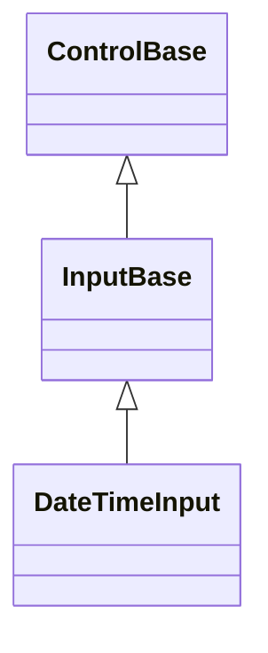
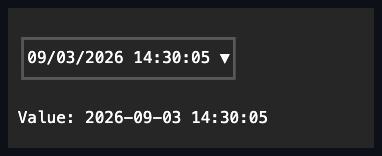

# DateTimeInput

## Overview

`DateTimeInput` combines date and time segment editing with an optional Calendar
popup.

Plain Tab or Shift+Tab closes the open popup and continues application
traversal. Caps Lock and Num Lock are incidental state; a Tab carrying Control,
Alt, Super, Hyper, or Meta remains unhandled and leaves the popup open.

Exact Alt+Down opens the popup; lock-key state is ignored, but every additional
command modifier leaves the chord unhandled for an application or host shortcut.

The time portion supports `TimeStep`, a positive whole-minute increment that
Up/Down applies while the minute segment is active. The embedded calendar
exposes the same basic date navigation options as `Calendar`. Selecting a date
preserves the current time and `DateTimeKind`.

`DateTimeInput` derives from [`InputBase`](../input-base.md#overview), enabling
press activation, an owned Calendar popup, and segment editing. It shares its
complete routed key and pointer editing engine - active-segment navigation,
digit-entry buffering, popup precedence, AM/PM commands, and focus
continuation - with [`DateInput`](date-input.md) and
[`TimeInput`](time-input.md) through
[`InputBase.EnableSegmentEditing`](../input-base.md#api). The three controls use
one generic nullable value state for dispatcher-clock seeding, bounds, repair,
and current-aware event publication. `DateInput` and `DateTimeInput` also use
one Calendar drop-down coordinator for Calendar ownership, culture/bounds/value
synchronization, open-session rollback, user acceptance, and cleanup. The
date-time combiner preserves the current time, sub-second ticks, and
`DateTimeKind` when a date is accepted. `Culture` drives both the popup
calendar's month/day names _and_ the typed field's own date segment order,
widths, and separators - the same way `DateInput.Culture` does, deriving the
layout from `DateTimeFormatInfo.ShortDatePattern` - so a German culture, for
example, renders day before month with a period separator. A distinct customized
same-name `CultureInfo` clone is a real transition: it refreshes the segments
and synchronizes the retained Calendar before publication; only the identical
instance is silent. The time portion keeps the fixed
hour/minute/[second]/[AM-PM] structure `Use24HourFormat` and `ShowSeconds`
already select, localizing only its separator, AM/PM designator text, and digit
glyphs. Set `Format` to a custom combined pattern (for example
`"yyyy/MM/dd hh:mm tt"`) to override that structure directly; pair a 12-hour
`h`/`hh` hour token with a `t`/`tt` AM/PM designator token for correct 12-hour
clamping and rendering. A lowercase hour token without a designator is treated
as a 24-hour segment for both editing and display, so committed values above 12
round-trip through the visible digits unchanged.

Disabling `AllowNull` repairs an existing null only if that policy remains live
after `PropertyChanged`. A synchronous observer that restores `AllowNull`
prevents obsolete clock-derived seeding and preserves the null value.

## Inheritance



## API

| Member                             | Type                                               | Default                          | Description                                                                                                                                 |
| ---------------------------------- | -------------------------------------------------- | -------------------------------- | ------------------------------------------------------------------------------------------------------------------------------------------- |
| `Value`                            | `DateTime?`                                        | current local date and time      | The nullable value, clamped to the inclusive bounds.                                                                                        |
| `AllowNull`                        | `bool`                                             | `true`                           | Allows Delete or Backspace to clear the value; disabling it repairs a null value.                                                           |
| `Culture`                          | `CultureInfo`                                      | `CultureInfo.InvariantCulture`   | Localizes both the popup calendar and the typed field's date order, separators, designator text, and digits; must use a Gregorian calendar. |
| `Use24HourFormat`                  | `bool`                                             | `true`                           | Selects 24-hour or AM/PM segments.                                                                                                          |
| `ShowSeconds`                      | `bool`                                             | `false`                          | Adds the seconds segment.                                                                                                                   |
| `Format`                           | `string?`                                          | `null`                           | A custom combined pattern overriding the derived segment order and count.                                                                   |
| `TimeStep`                         | `TimeSpan`                                         | one minute                       | The positive whole-minute increment for the minute segment.                                                                                 |
| `Minimum`                          | `DateTime`                                         | `DateTime.MinValue`              | The inclusive lower bound that repairs the current value.                                                                                   |
| `Maximum`                          | `DateTime`                                         | `DateTime.MaxValue`              | The inclusive upper bound that repairs the current value.                                                                                   |
| `DropDownHeight`                   | `Length`                                           | `Length.Cells(10)`               | The automatic, fixed-cell, or placement-relative maximum visible calendar height.                                                           |
| `IsOpen`                           | `bool`                                             | `false`                          | Opens or closes the retained Calendar popup.                                                                                                |
| `CalendarStyle`                    | `CalendarStyle?`                                   | `null`                           | Overrides the owned Calendar's complete local presentation.                                                                                 |
| `ActualCalendarStyle`              | `CalendarStyle`                                    | Resolved                         | Read-only; the resolved presentation of the owned Calendar.                                                                                 |
| `PopupChrome`                      | `PopupChrome`                                      | `default`                        | Overrides the owned Calendar popup's border and shadow together.                                                                            |
| `ResetPopupChrome()`               | `void`                                             | —                                | Returns the Calendar popup's border and shadow to `PopupChrome` ownership.                                                                  |
| `StartAffix`                       | `Affix?`                                           | `null`                           | Optional leading edge-pinned decoration, reserved inside the field box and strictly inboard of the drop-down indicator.                     |
| `EndAffix`                         | `Affix?`                                           | `null`                           | Optional trailing edge-pinned decoration, reserved inside the field box and strictly inboard of the drop-down indicator.                    |
| Themed disclosure glyph            | —                                                  | `InputStyle.DropDownGlyph` (`▼`) | Authored once for every drop-down input through a theme's `styles.input` section.                                                           |
| `ValueChanged`                     | `EventHandler<DateTimeInputValueChangedEventArgs>` | no subscribers                   | Raised after a committed value transition.                                                                                                  |
| `DropDownOpened`, `DropDownClosed` | `EventHandler`                                     | no subscribers                   | Raised after the Calendar popup opens or closes.                                                                                            |

`DropDownHeight` constrains only the Calendar interior and never stretches a
shorter Calendar to the cap. `Length.Auto` uses its intrinsic height, positive
`Cells` values set a fixed maximum, and positive `Percent` values resolve
against the usable extent on the popup's chosen placement side after its frame
is removed. Root resize and placement fallback resolve that percentage again.
Star lengths and zero-valued fixed or percentage limits are rejected before
mutation.

`StartAffix` and `EndAffix` each reserve a fixed cell column inside the field
box, strictly inboard of the drop-down indicator - the segment layout deflates
around both, and neither ever draws over the `▼` glyph. The gap between a
present affix and the segments comes from the shared `InputStyle.AffixGap` (see
[styling.md](../../concepts/styling.md#instance-content-affix)), the same member
`ComboBox` and `DateInput` read. When the field box is too narrow for
everything, the segment layout shrinks first, then the end affix drops whole,
then the start affix - never a partial cluster - re-evaluated against the
control's actual bounds on every render.

## Keyboard

| Key                 | Behavior                                                                                                           |
| ------------------- | ------------------------------------------------------------------------------------------------------------------ |
| Left / Right        | Moves between editable segments while the popup is closed; moves by one day while it is open.                      |
| Up / Down           | Changes the active segment while closed; moves by one week while open.                                             |
| Home / End          | Moves to the first or last segment while closed; moves to the first or last selectable day of the week while open. |
| Page Up / Page Down | Moves the open Calendar by one month.                                                                              |
| Digits              | Replaces or advances the active date or time segment while the popup is closed.                                    |
| A / P               | Selects AM or PM when an AM/PM segment is present.                                                                 |
| Backspace           | Clears the active segment while the popup is closed.                                                               |
| Delete              | Clears the complete value when `AllowNull` is `true`.                                                              |
| Alt+Down            | Opens the Calendar popup.                                                                                          |
| Enter / Space       | Accepts the active date and closes the open popup.                                                                 |
| Escape              | Cancels the open popup and restores its opening state.                                                             |
| Tab / Shift+Tab     | Cancels the open popup, then continues focus traversal.                                                            |

## Popup navigation session

Opening snapshots the committed `Value`, `Calendar.ActiveDate`, and Calendar
selection, then seeds the Calendar from the date portion of the accepted value.
Calendar browsing is provisional: it changes `ActiveDate` without changing any
date, time, tick, or `DateTimeKind` component of `Value` until an explicit
activation accepts the session.

A primary pointer activation accepts that date, including the already-active
date, preserves the time and `DateTimeKind`, and closes the popup. Repeated
Alt+Down is consumed by the already-open session without reopening or moving the
Calendar.

The Calendar operates at day granularity, so its `Minimum`/`Maximum` bounds are
the date portions of `Minimum`/`Maximum`, and the `Minimum` or `Maximum`
boundary day itself can therefore render as a fully selectable cell even when
only part of that day actually falls within range. Accepting that boundary day
combines it with the preserved time as usual whenever the result stays within
`[Minimum, Maximum]`. When it would not - the preserved time falls before
`Minimum`'s time on the `Minimum` day, or after `Maximum`'s time on the
`Maximum` day - the accepted date shifts by one day toward the valid range
instead, keeping the preserved time intact, provided that shifted combination is
itself within `[Minimum, Maximum]`. No other selectable day needs this
adjustment, because every other day lies strictly inside `[Minimum, Maximum]`
regardless of time of day. If `Minimum` and `Maximum` are less than a day apart,
the one-day shift can itself fall outside the range - in that narrow case the
preserved time is not kept; the combined value falls back to the same
boundary-clamping behavior as direct `Value`/`Minimum`/`Maximum` assignment.

The navigation and acceptance keys use the
[shared focus-independent delegation rule](../../concepts/input-routing.md#popup-navigation-delegation),
so owner focus and Calendar focus produce one movement or acceptance. Escape,
plain Tab, `IsOpen = false`, direct popup closure, light dismissal, and owner
unavailability restore the opening Calendar state and leave the complete `Value`
unchanged. Rollback runs exactly once, and a close callback that reopens the
popup creates a replacement session that the older acceptance or rollback cannot
disturb.

## Example



```csharp
var dateTimeInput = new DateTimeInput { TimeStep = TimeSpan.FromMinutes(15) };
```

## Expected behavior

| Scope                 | Observable evidence                                                                                                                                               |
| --------------------- | ----------------------------------------------------------------------------------------------------------------------------------------------------------------- |
| Public API            | Defaults, bounds, culture, the null policy, the time step, glyph validation, segment edits, and event order behave as documented.                                 |
| Integrated behavior   | Keyboard and pointer editing, Calendar selection, light dismiss, and focus restoration work end to end.                                                           |
| Complete runtime path | Date and time formats, culture-driven segment order and separators, the active segment, the popup, focus, the disabled state, and tiny clipping render correctly. |

- Direct digit and AM/PM entry follows the shared
  [keyboard modifier policy](../../concepts/input-routing.md#keyboard-modifier-policy),
  leaving command-modified characters unhandled without changing a segment.
- Initial and repeated Calendar navigation is delivered once regardless of focus
  placement, remains provisional until Enter, Space, or pointer acceptance, and
  restores the opening active date and complete date-time on cancellation.
- Reading `Value` after disposal always throws, including every read after a
  failed attempt to seed the lazy default.
