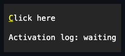

# HyperlinkButton

## Overview

`HyperlinkButton` is a focusable, clickable text control styled like a classic
hyperlink, with an accent foreground and an underline.

## API

| Member                        | Default        | Description                                                              |
| ----------------------------- | -------------- | ------------------------------------------------------------------------ |
| Inherited `Text`              | `""`           | The link's caption; assigning null is rejected.                          |
| `Command`, `CommandParameter` | `null`, `null` | Optional command and borrowed parameter.                                 |
| `Click`                       | no subscribers | Raised after the released state commits and before the command executes. |
| `PerformClick()`              | —              | Runs programmatic activation when visible, enabled, and executable.      |

## Example



```csharp
var link = new HyperlinkButton { Text = "Visit site" };
link.Click += (_, _) => OpenUrl("https://example.com");
```

## Expected behavior

| Layer       | Observable evidence                                                                                                                           |
| ----------- | --------------------------------------------------------------------------------------------------------------------------------------------- |
| Unit        | Constructors, text updates in place, command gating, event order, disposal, and validation behave as documented.                              |
| Surface     | The accent underline and the hover, focus, pressed, and disabled states render correctly, Unicode text lays out, and tiny bounds clip safely. |
| Integration | Space, Enter, pointer capture, the access key, and programmatic activation behave identically.                                                |
