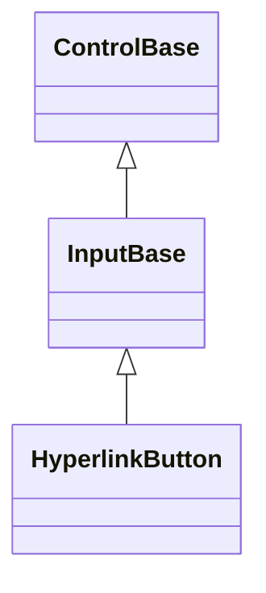

# HyperlinkButton

## Overview

`HyperlinkButton` is declared
`public sealed class HyperlinkButton : InputBase, IStyled<HyperlinkButtonStyle>`.
It is a focusable clickable text control styled like a classic hyperlink, with
an accent foreground and an underline, resolved through its own
`Style`/`ActualStyle` slot like `Button`, `CheckBox`, and `RadioButton`.

## Inheritance



## API

| Member                         | Type                                | Default        | Description                                                                                                        |
| ------------------------------ | ----------------------------------- | -------------- | ------------------------------------------------------------------------------------------------------------------ |
| `HyperlinkButton()`            | —                                   | —              | Initializes an empty focusable HyperlinkButton.                                                                    |
| `HyperlinkButton(string text)` | —                                   | —              | Initializes a HyperlinkButton with the given caption; rejects `null`.                                              |
| Inherited `Text`               | `string`                            | `""`           | The link's caption.                                                                                                |
| Inherited `Command`            | `ICommand?`                         | `null`         | Runs after `Click`, when bound and `CanExecute` allows it.                                                         |
| Inherited `CommandParameter`   | `object?`                           | `null`         | The borrowed parameter passed to `Command` queries and execution.                                                  |
| `StartAffix`                   | `Affix?`                            | `null`         | Optional leading edge-pinned decoration, reserved inside the content box and outside the caption.                  |
| `EndAffix`                     | `Affix?`                            | `null`         | Optional trailing edge-pinned decoration, reserved inside the content box and outside the caption.                 |
| `Style`                        | `HyperlinkButtonStyle?`             | `null`         | Optional complete developer-authored presentation.                                                                 |
| `ActualStyle`                  | `HyperlinkButtonStyle`              | Resolved       | Read-only; the complete local, theme-owned, or code-owned presentation.                                            |
| `PerformClick()`               | `void`                              | —              | Enters the shared `InputBase.TryActivate` gate, then activates an effectively enabled and visible HyperlinkButton. |
| `Click`                        | `EventHandler<ActivationEventArgs>` | No subscribers | Raised after the released state commits and before command execution.                                              |

`HyperlinkButtonStyle : ControlStyle` is a complete immutable presentation: it
declares no `styles.*` theme key of its own and falls back to the standard
borderless interactive appearance, with the coded `Normal` state defaulting to
an accent foreground, `SemanticDecoration.NormalText` attributes, and a straight
accent-colored underline. A locally assigned `Style` is the only way to restyle
the link color directly; a `with` expression creates a validated member-wise
copy of `HyperlinkButtonStyle.Default`; assigning `null` to `Style` restores the
Theme-owned presentation, and `ActualStyle` never returns null.

`StartAffix` and `EndAffix` each reserve a fixed cell column beside the caption,
the same seam `Button` and `TextInput` expose (see
[styling.md](../../concepts/styling.md#instance-content-affix)). Because
`HyperlinkButtonStyle` declares no `AffixGap` member of its own, the gap between
a present affix and the caption comes from the active theme's shared
`InputStyle.AffixGap` directly. When the content box is too narrow for
everything, the caption shrinks first, then the end affix drops whole, then the
start affix - never a partial cluster - re-evaluated against the control's
actual bounds on every render.

## Keyboard

| Key            | Behavior                                                                  |
| -------------- | ------------------------------------------------------------------------- |
| Enter          | Activates the link immediately.                                           |
| Space          | Shows the pressed state on key down and activates on the matching key up. |
| Alt+access key | Focuses and activates the link when `Text` declares that access key.      |

## Example


```csharp
var link = new HyperlinkButton { Text = "Visit site" };
link.Click += (_, _) => OpenUrl("https://example.com");
```

## Expected behavior

| Scope               | Observable evidence                                                       |
| ------------------- | ------------------------------------------------------------------------- |
| Public API          | Validation, defaults, state changes, and deterministic output.            |
| Integrated behavior | Cross-component behavior through the real ownership and routing boundary. |

- Constructors, text updates in place, command gating, event order, disposal,
  and validation behave as documented.
- The accent underline and the hover, focus, pressed, and disabled states render
  correctly, Unicode text lays out, and tiny bounds clip safely.
- Space, Enter, pointer capture, the access key, and programmatic activation
  behave identically.
- Programmatic activation shares `InputBase` mutation and effective-availability
  validation while HyperlinkButton retains command-gated `Click` ordering.
