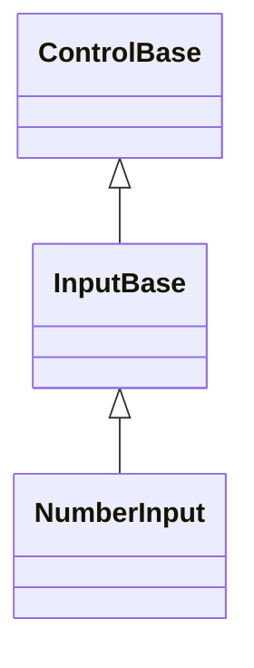

# NumberInput

## Overview

`NumberInput` edits an integer or decimal value through a transient typed buffer
that commits on Enter or when focus leaves the control.

Unlike the segmented temporal fields ([`DateInput`](date-input.md),
[`TimeInput`](time-input.md), [`DateTimeInput`](date-time-input.md)), which
commit their value on every keystroke, `NumberInput` edits a private
text-and-selection buffer while typing and only parses and commits it on Enter
or focus loss. Up/Down step by `Step` and Home/End jump directly to
`Minimum`/`Maximum` - both commit immediately, bypassing the buffer entirely,
matching [`Slider`](slider.md#overview). Escape reverts any uncommitted edit
back to the committed value's formatting.

`NumberInput` derives from [`InputBase`](../input-base.md#overview) but opts
into none of its popup or press-activation capabilities - only the base
focusable, Tab-stopping contract, the same as `TimeInput`.

`Mode` chooses between `Integer` and `Decimal` editing. In `Integer` mode the
decimal-separator keystroke is rejected outright - it never appears in the
buffer - and a fractional value can never commit: `DecimalPlaces` is treated as
zero, and switching into `Integer` mode with an already-fractional committed
value repairs it by rounding to zero places with `RoundingMode`. `Minimum` and
`Maximum` bound the committed value the same way, repairing it by clamping
whenever either endpoint moves; the two endpoints may be equal. `AllowGrouping`
is a display-only concern - a typed or pasted group separator is always accepted
and stripped while parsing, regardless of the setting. `RoundingMode` is applied
only at commit, through the three-argument
`Math.Round(decimal, int, MidpointRounding)` overload, never the two-argument
overload that silently rounds to even. `Culture` supplies the decimal separator,
group separator, sign, and digit grouping used for both display and parsing;
changing `Culture` or `Mode` while a buffer is mid-edit discards the transient
text back to the committed value's formatting under the new settings, rather
than migrating a half-parsed string across the switch.

## Inheritance



## API

| Member          | Type                                             | Default                         | Description                                                                                                                      |
| --------------- | ------------------------------------------------ | ------------------------------- | -------------------------------------------------------------------------------------------------------------------------------- |
| `Value`         | `decimal?`                                       | `null`                          | The nullable value. Assignment clamps silently into `Minimum`/`Maximum`; a fractional assignment throws under `Integer` mode.    |
| `AllowNull`     | `bool`                                           | `true`                          | Allows the value to be cleared to null; disabling it while already null eagerly reseeds to zero, clamped into bounds.            |
| `Minimum`       | `decimal`                                        | `decimal.MinValue`              | The inclusive lower bound (equal to `Maximum` allowed) that repairs the current value.                                           |
| `Maximum`       | `decimal`                                        | `decimal.MaxValue`              | The inclusive upper bound (equal to `Minimum` allowed) that repairs the current value.                                           |
| `Step`          | `decimal`                                        | `1`                             | The positive increment Up/Down apply, and the jump Home/End commit to `Minimum`/`Maximum` land on directly.                      |
| `Mode`          | `NumberInputMode`                                | `NumberInputMode.Decimal`       | Chooses whole-number-only or fractional editing; switching to `Integer` repairs a fractional committed value.                    |
| `DecimalPlaces` | `int`                                            | `2`                             | The fractional digits displayed and accepted while `Mode` is `Decimal`; treated as zero under `Integer`.                         |
| `AllowGrouping` | `bool`                                           | `true`                          | Whether the idle and freshly focused display groups digits under `Culture`; parsing always accepts a group separator.            |
| `RoundingMode`  | `MidpointRounding`                               | `MidpointRounding.AwayFromZero` | The rounding applied to a typed value only at commit.                                                                            |
| `Culture`       | `CultureInfo`                                    | `CultureInfo.InvariantCulture`  | The culture supplying separators, sign, and grouping for display and parsing; unlike `DateInput.Culture`, defaults to invariant. |
| `StartAffix`    | `Affix?`                                         | `null`                          | Optional leading edge-pinned decoration, reserved inboard of the border and outboard of the value's own text.                    |
| `EndAffix`      | `Affix?`                                         | `null`                          | Optional trailing edge-pinned decoration, reserved inboard of the border and outboard of the value's own text.                   |
| `ValueChanged`  | `EventHandler<NumberInputValueChangedEventArgs>` | No subscribers                  | Raised after a committed value transition.                                                                                       |

`StartAffix` and `EndAffix` each reserve a fixed cell column inboard of the
border, deflated away from the value's own text and caret before either draws -
setting either never moves the value or its caret into a reserved affix column.
The gap between a present affix and the value comes from the shared
`InputStyle.AffixGap` (see
[styling.md](../../concepts/styling.md#instance-content-affix)), the same member
`TextInput` and `Button` read. When the content box is too narrow for
everything, the value's own box shrinks first, then the end affix drops whole,
then the start affix - never a partial cluster - and the decision is
re-evaluated against the control's actual bounds on every render.

## Example


```csharp
var numberInput = new NumberInput { Minimum = 0m, Maximum = 100m, Step = 5m };
numberInput.ValueChanged += (_, e) => Console.Write(e.Value);
```

## Expected behavior

| Scope                 | Observable evidence                                                                                                                                                                                         |
| --------------------- | ----------------------------------------------------------------------------------------------------------------------------------------------------------------------------------------------------------- |
| Public API            | Defaults, bounds, the null policy, integer-mode restrictions, the rounding matrix, overflow guarding, and event order behave as documented.                                                                 |
| Integrated behavior   | Keyboard editing, pasting, and mid-edit Mode/Culture changes work end to end without migrating a half-parsed buffer.                                                                                        |
| Complete runtime path | Typed display transitions, culture-aware separators and grouping, Enter/Escape/focus-loss commit paths, keyboard stepping, pointer caret placement, the disabled state, and tiny clipping render correctly. |

- Direct character edits follow the shared
  [keyboard modifier policy](../../concepts/input-routing.md#keyboard-modifier-policy):
  Shift and lock state may produce text, while command-modified characters stay
  out of the transient buffer and remain unhandled.
