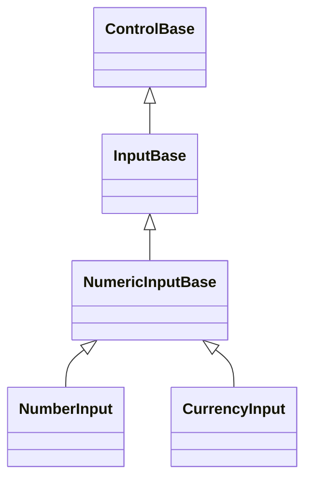

# NumericInputBase authoring API

## Overview

`NumericInputBase : InputBase` is the abstract base for a focusable field that
edits a nullable `decimal` value through a transient typed buffer committed on
Enter or when focus leaves the control.
[`NumberInput`](number-input.md#overview) and
[`CurrencyInput`](currency-input.md#overview) both derive from it today.

`NumericInputBase` owns the complete buffer-then-commit editing model: the
nullable value and inclusive range, routed key and pointer buffer editing
through `InputBase`'s in-assembly transient-numeric-editing capability,
affix-aware measurement and rendering, focused cursor replay, and the typed
`ValueChanged` event. A concrete derivative supplies only the handful of seams
that genuinely differ between numeric fields: how a value formats for idle
display versus the transient buffer, what parsing data and integer-only policy
the buffer configures against, how many fractional digits a commit rounds to and
under what policy, and - optionally - how a candidate `Value` or `Culture` is
validated before it commits, or how the buffer's own text projects into a richer
focused display. Everything else lives here exactly once, so a new numeric
field - a percentage, a duration, or an IP octet editor - reuses the same
transient-buffer lifecycle `NumberInput` and `CurrencyInput` already prove
instead of re-deriving it.

## Inheritance



## API

| Member                               | Type                                         | Default                         | Description                                                                                                                                                   |
| ------------------------------------ | -------------------------------------------- | ------------------------------- | ------------------------------------------------------------------------------------------------------------------------------------------------------------- |
| `Value`                              | `decimal?`                                   | `null`                          | The nullable value. Assignment clamps silently into `Minimum`/`Maximum`; a derived control may reject a candidate through `ValidateValueAssignment(decimal)`. |
| `AllowNull`                          | `bool`                                       | `true`                          | Allows the value to be cleared to null; disabling it while already null eagerly reseeds to zero, clamped into bounds.                                         |
| `Minimum`                            | `decimal`                                    | `decimal.MinValue`              | The inclusive lower bound (equal to `Maximum` allowed) that repairs the current value.                                                                        |
| `Maximum`                            | `decimal`                                    | `decimal.MaxValue`              | The inclusive upper bound (equal to `Minimum` allowed) that repairs the current value.                                                                        |
| `Step`                               | `decimal`                                    | `1`                             | The positive increment Up/Down apply, and the jump Home/End commit to `Minimum`/`Maximum` land on directly.                                                   |
| `AllowGrouping`                      | `bool`                                       | `true`                          | Whether the idle and freshly focused display groups digits under `Culture`; parsing always accepts a group separator.                                         |
| `RoundingMode`                       | `MidpointRounding`                           | `MidpointRounding.AwayFromZero` | The rounding applied to a typed value only at commit.                                                                                                         |
| `Culture`                            | `CultureInfo`                                | `CultureInfo.InvariantCulture`  | The culture supplying formatting and parsing data; a derived control may reject a candidate through `ValidateCulture(CultureInfo)`.                           |
| `Placeholder`                        | `string?`                                    | `null`                          | Optional dim hint shown while the committed value and transient buffer are empty, including while focused.                                                    |
| `CursorShape`                        | `CursorShape`                                | `CursorShape.Block`             | The protocol-neutral cursor shape requested while the field has focus.                                                                                        |
| `FormatValue(decimal)`               | `string`                                     | —                               | Protected abstract; formats a value the way idle, unfocused display presents it - also sizes the widest bound at measure time.                                |
| `FormatBufferValue(decimal)`         | `string`                                     | —                               | Protected virtual; formats a value for loading into the transient buffer. Defaults to `FormatValue(decimal)`.                                                 |
| `BuildBufferFormat()`                | `NumberFormatInfo`                           | —                               | Protected abstract; builds the separator, group, and sign token source the transient buffer parses and formats against.                                       |
| `EffectiveDecimalPlaces`             | `int`                                        | —                               | Protected abstract; the fractional digit count a commit rounds to and a bound jump (Home/End) rounds toward.                                                  |
| `IsIntegerOnly`                      | `bool`                                       | —                               | Protected abstract; whether the transient buffer rejects the decimal-separator keystroke outright.                                                            |
| `ResolveCommitRounding(decimal)`     | `decimal`                                    | —                               | Protected abstract; resolves the decimal places and rounding policy a freshly parsed buffer value commits under.                                              |
| `ValidateValueAssignment(decimal)`   | `void`                                       | —                               | Protected virtual; validates a non-null candidate `Value` before it is clamped and committed. No-op by default.                                               |
| `ValidateCulture(CultureInfo)`       | `void`                                       | —                               | Protected virtual; validates a non-null candidate `Culture` before it commits. No-op by default.                                                              |
| `ProjectFocusedDisplay()`            | `NumericFocusedDisplay`                      | —                               | Protected virtual; projects the transient buffer into the focused rendered text, selection, and caret. Identity by default.                                   |
| `ResolveBufferIndexAtColumn(int)`    | `int`                                        | —                               | Protected virtual; maps a pointer column to a UTF-16 index in the transient buffer's own text. Identity by default.                                           |
| `MeasureOverride(Constraint)`        | `Size`                                       | —                               | Protected override; sizes the widest formatted bound plus one caret cell and affixes.                                                                         |
| `OnRenderContent(TerminalCanvas)`    | `void`                                       | —                               | Protected override; draws affixes, the idle or focused-projected text, selection, placeholder, and cursor.                                                    |
| `OnReuseCleanRender(TerminalCanvas)` | `void`                                       | —                               | Protected override; replays the focused cursor after a clean cell-reuse frame.                                                                                |
| `OnUnavailable(ReleaseReason)`       | `void`                                       | —                               | Protected override; nulls `ValueChanged` on `ReleaseReason.Disposed`.                                                                                         |
| `ValueChanged`                       | `EventHandler<NumericValueChangedEventArgs>` | No subscribers                  | Raised after a committed value transition.                                                                                                                    |

`FormatValue(decimal)`, `BuildBufferFormat()`, `EffectiveDecimalPlaces`,
`IsIntegerOnly`, and `ResolveCommitRounding(decimal)` are the seams every
derivative must implement; `NumberInput` derives all five from its
`Mode`/`DecimalPlaces` policy, and `CurrencyInput` derives all five from its
culture-specific currency formatting. `FormatBufferValue(decimal)`,
`ValidateValueAssignment(decimal)`, `ValidateCulture(CultureInfo)`,
`ProjectFocusedDisplay()`, and `ResolveBufferIndexAtColumn(int)` default to an
identity or no-op implementation; a derivative overrides only the ones its own
policy actually needs - `NumberInput` overrides none of them, while
`CurrencyInput` overrides all five to compose its currency symbol and pattern
around the buffer's currency-agnostic core text.

## Keyboard

| Key                         | Behavior                                                      |
| --------------------------- | ------------------------------------------------------------- |
| Typed digits and separators | Edits the temporary text buffer at the caret.                 |
| Left / Right                | Moves the caret; Shift extends the directional selection.     |
| Ctrl+A                      | Selects the complete temporary buffer.                        |
| Backspace / Delete          | Removes the selection or text before or at the caret.         |
| Up / Down                   | Adds or subtracts `Step` and commits immediately.             |
| Home / End                  | Commits `Minimum` or `Maximum`.                               |
| Enter                       | Parses and commits the temporary buffer.                      |
| Escape                      | Discards the temporary edit and restores the committed value. |

## Example

```csharp
public sealed class PercentInput: NumericInputBase
{
    public PercentInput()
    {
        Minimum = 0m;
        Maximum = 1m;
        Step = 0.01m;
    }

    protected override string FormatValue(decimal value) =>
        value.ToString("P0", Culture);

    protected override System.Globalization.NumberFormatInfo BuildBufferFormat() =>
        Culture.NumberFormat;

    protected override int EffectiveDecimalPlaces => 2;

    protected override bool IsIntegerOnly => false;

    protected override decimal ResolveCommitRounding(decimal parsed) =>
        Math.Round(parsed, EffectiveDecimalPlaces, RoundingMode);
}
```

A caller interacts with `PercentInput.Value`, `Minimum`, `Maximum`, `Step`, and
`ValueChanged` exactly as it would with `NumberInput` or `CurrencyInput` -
`NumericInputBase` owns the complete buffer-then-commit lifecycle underneath
`PercentInput`'s own formatting policy.

## Expected behavior

| Scope               | Observable evidence                                                                                                                                                                           |
| ------------------- | --------------------------------------------------------------------------------------------------------------------------------------------------------------------------------------------- |
| Public API          | `Value` clamps into `Minimum`/`Maximum`, `ValueChanged` reports the exact previous and current committed value, and every validated setter rejects an invalid argument before mutating state. |
| Integrated behavior | Keyboard editing, selection, pasting, and focus transitions commit and revert through the shared buffer-then-commit lifecycle identically for every derivative.                               |

- `NumberInput` and `CurrencyInput` share this exact contract; their own pages
  document only the seams and asymmetries specific to each.
- A third-party derivative that implements only the five required abstract seams
  gets the complete transient-buffer editing, measurement, and rendering
  contract for free.
