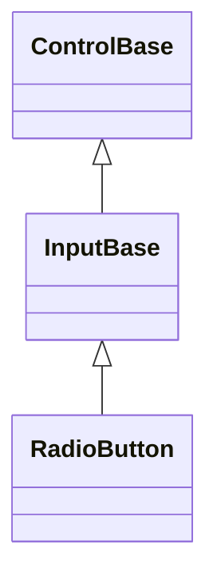
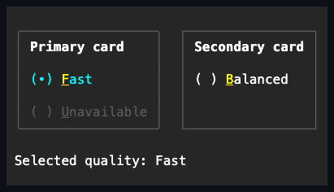

# RadioButton

## Overview

`RadioButton` is declared
`public sealed class RadioButton : InputBase, IStyled<RadioButtonStyle>`. It is
a focusable mutually exclusive selection control: at most one owned member of an
effective group is checked at a time.

## Inheritance



## API

| Member                       | Type                                                 | Default        | Description                                                                    |
| ---------------------------- | ---------------------------------------------------- | -------------- | ------------------------------------------------------------------------------ |
| `RadioButton()`              | —                                                    | —              | Initializes an unselected RadioButton.                                         |
| `RadioButton(string text)`   | —                                                    | —              | Initializes an unselected RadioButton with the given text; rejects `null`.     |
| Inherited `Text`             | `string`                                             | `""`           | The radio button's label.                                                      |
| `IsChecked`                  | `bool`                                               | `false`        | Selects the member; setting `false` programmatically may leave a group empty.  |
| `GroupName`                  | `string?`                                            | `null`         | Exact-slot unnamed grouping, or ordinal named grouping when set.               |
| `StartAffix`                 | `Affix?`                                             | `null`         | Optional leading edge-pinned decoration, reserved before the mark glyph.       |
| `EndAffix`                   | `Affix?`                                             | `null`         | Optional trailing edge-pinned decoration, reserved after the caption.          |
| `Style`                      | `RadioButtonStyle?`                                  | `null`         | Optional complete developer-authored presentation.                             |
| `ActualStyle`                | `RadioButtonStyle`                                   | Resolved       | Read-only; the complete local, theme-owned, or code-owned presentation.        |
| Inherited `Command`          | `ICommand?`                                          | `null`         | Runs after the group selection commits, when bound and `CanExecute` allows it. |
| Inherited `CommandParameter` | `object?`                                            | `null`         | The borrowed parameter passed to `Command` queries and execution.              |
| `PerformClick()`             | `void`                                               | —              | Activates an available, visible, enabled RadioButton through its public API.   |
| `Checked`                    | `EventHandler<RadioButtonSelectionChangedEventArgs>` | No subscribers | Raised after this member becomes selected.                                     |
| `Unchecked`                  | `EventHandler<RadioButtonSelectionChangedEventArgs>` | No subscribers | Raised after this member loses selection.                                      |
| `SelectionChanged`           | `EventHandler<RadioButtonSelectionChangedEventArgs>` | No subscribers | Raised on the newly selected or explicitly cleared member.                     |

The bound command, if any and if `CanExecute` allows it, runs after the group
selection commits and its events raise. Unlike selection itself — which is a
no-op when this member is already the sole checked one in its group — the
command runs on every activation, including re-selecting the current member.

`RadioButtonStyle : InputStyle` is a complete immutable presentation: it bundles
a `RadioButtonMarkStyle`, a complete `RadioButtonGlyphs` pair (unchecked and
checked), and the inherited `Face`/`Border`/`Shadow`.
`RadioButtonStyle.Parentheses` is the default fixed-width `( )`/`(•)`
presentation reserving three cells; `Glyph` is a compact one-cell circle preset.
A `with` expression creates a validated member-wise copy of
`RadioButtonStyle.Default` (`Parentheses`) or of any resolved style. RadioButton
declares no `styles.*` theme key of its own: its code-owned mark style and glyph
pair come from the active theme's root-level `glyphs` field whenever no local
`Style` is assigned (see [themes.md](../../concepts/themes.md#glyph-families)).
Assigning `Style` replaces the whole Theme-owned presentation, and assigning
`null` restores it. `ActualStyle` never returns null. The parentheses style
marks the selected interior with a bullet; the glyph style reserves one cell.
The checked state defaults to the Theme accent foreground, and a
developer-authored checked appearance replaces that color for the complete mark.

`StartAffix` and `EndAffix` each reserve a fixed cell column for
application-owned, per-instance content - never theme-authored - outside the
mark and the caption's own alignment box: `StartAffix` sits before the mark
glyph, `EndAffix` sits after the caption. The gap between a present affix and
its neighbor comes from the shared `InputStyle.AffixGap` (see
[styling.md](../../concepts/styling.md#instance-content-affix)). When the
control is too narrow for everything, the caption shrinks first, then the end
affix drops whole, then the start affix - never a partial cluster - and the
decision is re-evaluated against the control's actual bounds on every render. A
same-width content or color swap on either property repaints without
remeasuring, so an affix can animate (a spinner swapping frames, for example) at
render cost only.

RadioButton does not expose raw border, shadow, or state-appearance mutation.
For third-party composition, inspect `ActualStyle`, `ActualBorder`, and
`ActualShadow` instead.

## Group and interaction behavior

User activation selects a member and never toggles it back to false. Unnamed
members group only within their exact ownership slot; named groups match by
ordinal comparison throughout the ownership root. Reparenting and regrouping
resolve exclusivity atomically. The `Unchecked` notification precedes `Checked`,
followed by `SelectionChanged`.

Space and pointer both select. The arrow keys move focus and selection through
eligible members, wrapping at the ends. Disabled, hidden, collapsed, and
detached members are skipped. Disabled styling wins even when a retained member
remains selected.

## Example



```csharp
var compact = new RadioButton
{
    GroupName = "density",
    Text = "Compact"
};

var glyph = new RadioButton
{
    GroupName = "density",
    Text = "Comfortable",
    Style = RadioButtonStyle.Glyph
};
```

## Expected behavior

| Scope               | Observable evidence                                                       |
| ------------------- | ------------------------------------------------------------------------- |
| Public API          | Validation, defaults, state changes, and deterministic output.            |
| Integrated behavior | Cross-component behavior through the real ownership and routing boundary. |

- Group exclusivity holds through regrouping and reparenting, and events arrive
  in the documented order.
- Arrow keys move the selection while skipping disabled members, and unnamed and
  named scopes group exactly as described.
- Style validation and precedence hold, assigning `null` restores the Theme
  style, and a Theme replacement restyles members that have no local style.
- Both mark layouts render correctly, Unicode captions stay owned by their
  member, and rendering produces the exact terminal rows.
