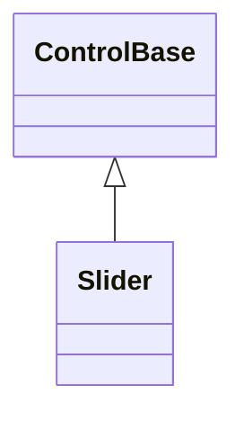
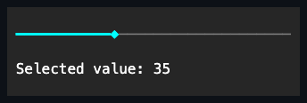

# Slider

## Overview

`Slider` is declared
`public sealed class Slider : ControlBase, IStyled<SliderStyle>`. It is a
focusable signed-integer range control for direct value selection. It differs
from [`ScrollBar`](../scrolling/scroll-bar.md#overview): a track press
immediately selects the mapped value, the thumb always occupies one cell, and no
viewport extent or paging buttons participate in the geometry.

## Inheritance



## API

| Member                | Type                                        | Default                  | Description                                                                               |
| --------------------- | ------------------------------------------- | ------------------------ | ----------------------------------------------------------------------------------------- |
| `Minimum`             | `int`                                       | `0`                      | The inclusive signed lower endpoint; auto-clamps `Value` when needed.                     |
| `Maximum`             | `int`                                       | `100`                    | The inclusive signed upper endpoint; auto-clamps `Value` when needed.                     |
| `Value`               | `int`                                       | `0`                      | The current value inside the inclusive `Minimum`–`Maximum` range.                         |
| `SmallChange`         | `int`                                       | `1`                      | The non-negative arrow or wheel increment.                                                |
| `LargeChange`         | `int`                                       | `10`                     | The non-negative Page Up or Page Down increment.                                          |
| `Orientation`         | `Orientation`                               | `Orientation.Horizontal` | Chooses left-to-right or bottom-to-top mapping.                                           |
| `Style`               | `SliderStyle?`                              | `null`                   | Optional complete developer-authored presentation.                                        |
| `ActualStyle`         | `SliderStyle`                               | Resolved                 | Read-only; the complete local, theme-owned, or code-owned presentation.                   |
| `ChangeBy(int delta)` | `bool`                                      | —                        | Applies a widened, saturating, endpoint-clamped programmatic change.                      |
| `ValueChanged`        | `EventHandler<SliderValueChangedEventArgs>` | No subscribers           | Raised after the property notification, while that commit is still the newest generation. |

`SliderStyle : ControlStyle` is a complete immutable presentation: it owns the
`FillColor`, `TrackColor`, and `ThumbColor` rail-part `ControlColor`s (required,
not nullable) and a validated one-cell-per-part `SliderGlyphs` family, alongside
the inherited `Face`/`Border`/`Shadow`. A `with` expression creates a validated
member-wise copy of `SliderStyle.Default`; assigning `null` to `Style` restores
the Theme-owned presentation.

## Keyboard

| Key                 | Behavior                                                     |
| ------------------- | ------------------------------------------------------------ |
| Left / Right        | Decreases or increases a horizontal slider by `SmallChange`. |
| Down / Up           | Decreases or increases a vertical slider by `SmallChange`.   |
| Page Down / Page Up | Decreases or increases the value by `LargeChange`.           |
| Home / End          | Selects `Minimum` or `Maximum`.                              |

## Behavior

- An endpoint setter throws `ArgumentException` only when it would invert the
  range. Unlike [`ScrollBar`](../scrolling/scroll-bar.md#behavior), which
  rejects an endpoint change that would exclude `Value`, a Slider endpoint that
  would exclude `Value` instead commits and auto-clamps `Value` to the new
  endpoint, raising `ValueChanged` when that clamp is still the newest commit.
- Direct `Value` assignment outside the current range throws
  `ArgumentOutOfRangeException`.
- `SmallChange` and `LargeChange` accept non-negative integers; zero is a valid
  no-op.
- `ChangeBy` adds with widened arithmetic, clamps to the endpoints, and returns
  whether a changed value committed.
- `ValueChanged`'s immutable `SliderValueChangedEventArgs` exposes
  `PreviousValue` and `Value`; a no-op raises no event, and a
  `PropertyChanged(Value)` observer that commits a newer value supersedes the
  interrupted transition's typed event.
- `Orientation.Horizontal` is the default and measures 5 by 1 cells;
  `Orientation.Vertical` measures 1 by 5 cells. Explicit layout may safely
  stretch or shrink either axis.
- Horizontal geometry maps the minimum to the left edge and the maximum to the
  right; vertical geometry maps the minimum to the bottom and the maximum to the
  top. Mapping uses the complete signed range in widened arithmetic with
  inclusive endpoint rounding, and it stays correct across `int.MinValue`
  through `int.MaxValue`.

## Input and visual states

A primary press focuses the control, then — provided no focus callback detached,
hid, disabled, or disposed the slider — selects the nearest mapped value and
takes pointer capture. Captured movement keeps selecting against the geometry
captured at press time. Release, leave, focus transfer, terminal focus loss,
disabling, hiding, detachment, or disposal ends the drag without committing
another value.

Left/Right operate a horizontal slider and Down/Up a vertical one: the
decreasing key subtracts `SmallChange` and the increasing key adds it. Page Down
subtracts `LargeChange`, Page Up adds it, and Home/End select the minimum and
maximum. Key press and repeat are accepted; release is ignored. Movement keys
accept lock state but no Shift or application-command modifier; unsupported
chords remain unhandled. A wheel gesture applies `SmallChange` and is handled
only when the value actually changes, which leaves endpoint gestures available
to an enclosing scroll surface. Keys outside the slider command set remain
available to inherited routed input.

The rail renders its filled, thumb, and unfilled cells with the `Accent`,
`Accent`, and `Muted` foregrounds respectively, from `SliderStyle`'s code-owned
`FillColor`, `ThumbColor`, and `TrackColor` defaults. Slider declares no
`styles.*` theme key of its own, so a local `Style` assignment is the only way
to move these away from their code-owned defaults - which already match what
every bundled theme showed. Background, attributes, and the normal,
pointer-over, focused, pressed, and disabled appearances follow the shared
[styling contract](../../concepts/styling.md#visual-states). Zero and tiny
bounds stay contained, and ambiguous-width glyphs fall back to one-cell ASCII.

## Example



```csharp
var volume = new Slider
{
    Minimum = 0,
    Maximum = 100,
    Value = 40,
    SmallChange = 2,
    LargeChange = 10,
    HorizontalAlignment = HorizontalAlignment.Stretch,
};

volume.ValueChanged += (_, change) => SaveVolume(change.Value);
```

## Expected behavior

| Scope               | Observable evidence                                                       |
| ------------------- | ------------------------------------------------------------------------- |
| Public API          | Validation, defaults, state changes, and deterministic output.            |
| Integrated behavior | Cross-component behavior through the real ownership and routing boundary. |

- Validation runs before any mutation, and the signed extremes are safe.
- Events arrive in committed order, and horizontal and vertical rails render
  their exact cells.
- Zero and tiny bounds stay contained, keyboard and wheel semantics behave as
  documented, and endpoint gestures bubble to ancestors.
- Pointer presses map directly to values, capture and its cancellation end drags
  safely, and focus and disabled states render correctly.
- Resize is handled, and the final mounted semantic output is correct.
