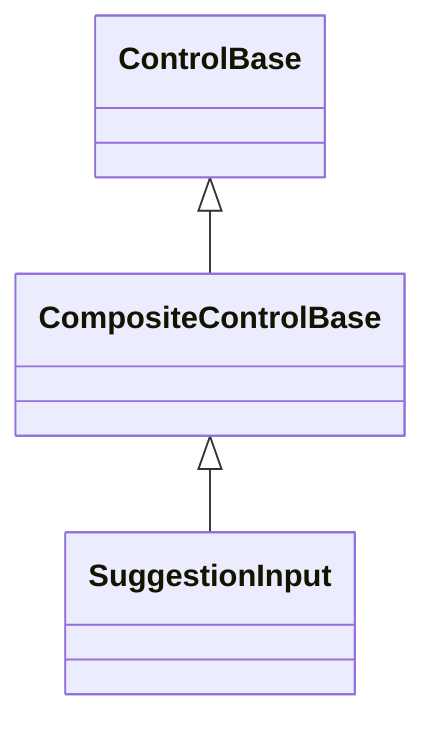
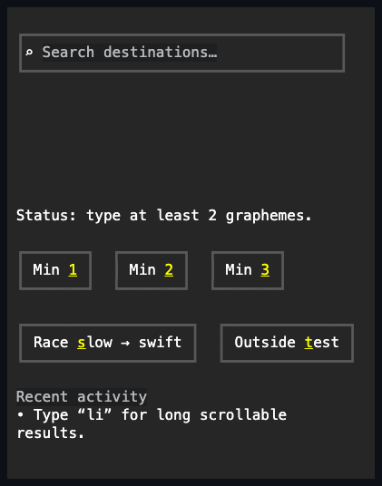
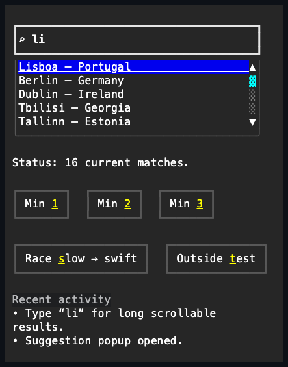

# SuggestionInput

## Overview

`SuggestionInput` is declared
`public sealed class SuggestionInput : CompositeControlBase`. It retains one
grapheme-safe `TextInput`, an owner-managed `Popup`, and a private
single-selection `ListView`. Text remains freely editable; only explicit Enter
or primary-pointer acceptance replaces it with a suggestion.

Use it for search-assisted text such as destinations, people, tags, or file
paths where the user may still enter a value that is not in the result set. Use
[`ComboBox`](combo-box.md#overview) when the value must be one item from a fixed
list, and [`CommandPalette`](command-palette.md#overview) when choosing a result
invokes a command rather than completing text.

The caller-supplied resolver may complete synchronously or asynchronously. Each
request receives a stable text snapshot and cancellation token. A newer request
supersedes the older request even when that resolver ignores cancellation, and
the control copies current results before publishing them.

## Inheritance



## API

| Member                 | Type                                                | Default            | Description                                                                                             |
| ---------------------- | --------------------------------------------------- | ------------------ | ------------------------------------------------------------------------------------------------------- |
| `Text`                 | `string`                                            | `""`               | Freely editable non-null text forwarded to the retained `TextInput`.                                    |
| `Placeholder`          | `string?`                                           | `null`             | Placeholder shown while the retained editor is empty.                                                   |
| `StartAffix`           | `Affix?`                                            | `null`             | Optional leading edge-pinned editor decoration.                                                         |
| `EndAffix`             | `Affix?`                                            | `null`             | Optional trailing edge-pinned editor decoration.                                                        |
| `MinimumPrefixLength`  | `int`                                               | `1`                | Minimum extended-grapheme count eligible for resolution; zero permits an empty query.                   |
| `Resolver`             | `SuggestionResolver?`                               | `null`             | Resolves a borrowed item snapshot for the current text and cancellation token.                          |
| `Suggestions`          | `IReadOnlyList<object?>`                            | Empty              | Read-only copied snapshot from the latest current successful resolution.                                |
| `IsResolving`          | `bool`                                              | `false`            | Read-only; true while the current asynchronous request has not settled.                                 |
| `IsOpen`               | `bool`                                              | `false`            | Opens a non-empty current snapshot, or closes while preserving text and the current request.            |
| `ItemTemplate`         | `ItemTemplate`                                      | List text template | Realizes each copied suggestion as one detached row control.                                            |
| `TextSelector`         | `Func<object?, string>?`                            | `null`             | Projects an accepted item to non-null text; invariant `Convert.ToString` is the fallback.               |
| `DropDownHeight`       | `Length`                                            | `Length.Cells(8)`  | Automatic, fixed-cell, or placement-relative maximum suggestion-list height.                            |
| `RowHeight`            | `Length`                                            | `Length.Auto`      | Automatic eager rows or a positive fixed/percentage uniform row request.                                |
| `ScrollBars`           | `ScrollBars`                                        | `Vertical`         | Forwards the available overflow axes to the retained list.                                              |
| `ShowScrollBars`       | `ShowScrollBars`                                    | `WhenNeeded`       | Forwards the suggestion-list scrollbar reservation policy.                                              |
| `ScrollBarStyle`       | `ScrollBarStyle?`                                   | `null`             | Complete local style for the retained list's rails.                                                     |
| `ActualScrollBarStyle` | `ScrollBarStyle`                                    | Resolved           | Read-only local, theme-owned, or code-owned rail style.                                                 |
| `PopupChrome`          | `PopupChrome`                                       | `default`          | Local border and shadow fragments for the owned suggestion popup.                                       |
| `ResetPopupChrome()`   | `void`                                              | —                  | Returns both popup chrome facets to Popup appearance ownership.                                         |
| `Open()`               | `bool`                                              | —                  | Records open intent, resolves stale results, focuses the retained editor, and returns the focus result. |
| `Close()`              | `void`                                              | —                  | Closes suggestions without changing text or cancelling the current request.                             |
| `Refresh()`            | `void`                                              | —                  | Starts a fresh current-text request and makes a non-empty completion eligible to open.                  |
| `SuggestionsChanged`   | `EventHandler`                                      | —                  | Raised after the copied current suggestion snapshot changes.                                            |
| `ResolutionFailed`     | `EventHandler<SuggestionResolutionFailedEventArgs>` | —                  | Raised when a still-current request fails after its suggestions are cleared.                            |
| `SuggestionAccepted`   | `EventHandler<ItemInvokedEventArgs>`                | —                  | Raised after accepted text commits and the popup closes; carries index, borrowed item, and cause.       |

`SuggestionResolver` returns `ValueTask<IReadOnlyList<object?>>`. Returning null
is a resolver contract failure and follows the current-failure path. The result
collection remains owned by the resolver; `SuggestionInput` copies it into
`Suggestions`, so later caller mutation cannot change the visible snapshot.

`SuggestionResolutionFailedEventArgs.SearchTerms` is the immutable text snapshot
supplied to the failed request, including an empty string when
`MinimumPrefixLength` is zero. Its constructor rejects null `searchTerms` and
null `exception` before assigning either property.

`TextSelector` runs before an acceptance can mutate text, popup state, or row
selection. When unset, it uses invariant-culture `Convert.ToString` and maps a
null conversion to `string.Empty`. A configured selector must return non-null;
an exception propagates unchanged, while a null result throws
`InvalidOperationException`. Either failure leaves the current text, popup,
results, and activation state intact.

`DropDownHeight` limits only the result-list interior. `Length.Auto`, positive
`Cells`, and positive `Percent` values are valid; percentages resolve against
the usable extent on the popup's chosen placement side and re-resolve after a
root resize. Star lengths and zero-valued fixed or percentage limits are
rejected before mutation. `RowHeight` follows the retained ListView contract:
`Length.Auto` or positive fixed/viewport-relative percentage values are valid,
while Star and zero fixed/percentage values are invalid.

All public mutation is dispatcher-affine while attached and rejects a disposed
control. `Text` also forwards the retained editor's validation. A negative
`MinimumPrefixLength`, unknown scrollbar value, invalid length, null
`ItemTemplate`, or invalid template output is rejected before observable state
changes.

## Keyboard

| Key                                    | Behavior                                                                                    |
| -------------------------------------- | ------------------------------------------------------------------------------------------- |
| Unicode text, paste, and edit commands | Edits text safely and starts a new eligible resolution.                                     |
| Up / Down / Left / Right               | Moves the provisional current suggestion once while open; initial and repeat presses work.  |
| Home / End                             | Moves to the first or last available suggestion.                                            |
| Page Up / Page Down                    | Moves by one visible suggestion page.                                                       |
| Enter                                  | Accepts the current row while open and settled; while closed, retains TextInput submission. |
| Space                                  | Inserts text; it never accepts a suggestion.                                                |
| Escape                                 | Closes without changing text.                                                               |
| Tab / Shift+Tab                        | Closes without acceptance, then continues ordinary focus traversal.                         |
| Primary release on a row               | Accepts that current result through the same guarded transaction as Enter.                  |
| Wheel over results                     | Scrolls the list first; an endpoint wheel remains consumed inside the suggestion plane.     |

Navigation accepts incidental Caps Lock or Num Lock state. Shift-modified
navigation and Control, Alt, Super, Hyper, or Meta command chords remain
unhandled. Enter and Escape require an initial activation-eligible press. Plain
Tab and Shift+Tab may carry lock state, but application-command-modified Tab
does not close the popup. The control owns no access key because editable query
characters cannot safely double as mnemonics.

## Resolution and lifetime

1. A committed text edit, resolver replacement, threshold change, `Refresh()`,
   or stale `Open()` advances the resolution generation and cancels the older
   lease. Successful text edits with a non-null resolver also record open
   intent.
2. A null resolver or text shorter than `MinimumPrefixLength` synchronously
   clears a changed suggestion snapshot, clears `IsResolving`, and closes.
   Prefix length counts extended grapheme clusters—not UTF-16 units or terminal
   cells. Raising or lowering the threshold re-evaluates the current text
   immediately.
3. An eligible request publishes `IsResolving = true`, invokes the resolver with
   the stable text snapshot, and applies a synchronous completion directly or
   posts an asynchronous completion for the current attachment.
4. Only the current undisposed lease, resolution generation, and compatible
   attachment may publish. Current success copies results, clears private stale
   row state, clears `IsResolving`, raises `PropertyChanged(Suggestions)` before
   `SuggestionsChanged`, and opens only for retained open intent and non-empty
   results.
5. A current failure clears results and resolving state, closes, raises
   `SuggestionsChanged` only when the snapshot changed, then raises
   `ResolutionFailed`. Cancellation is silent. Stale success, failure, and
   cancellation have no observable effect.

Public callbacks are reentrancy boundaries. If a property notification,
`SuggestionsChanged`, popup transition, or failure observer starts newer work,
changes the resolver, closes, detaches, or disposes the control, the older
continuation cannot resume and overwrite that decision.

Hiding or disabling the control or one of its ancestors suppresses rendering,
input, and the active modal scope without cancelling current resolver work.
Restoring availability resumes the still-open logical plane once. Detachment and
disposal revoke the lease, cancel the token, clear `IsResolving`, remove
deferred selection work, and reject late completion. A completion begun while
detached may apply only while that same detached lifetime remains current.

## Acceptance, focus, and dismissal

The retained `TextInput` is the sole focus target; the private ListView is not a
sequential Tab stop. Opening a non-empty current snapshot selects its first
available row provisionally while focus remains in the editor. Popup navigation
uses the shared
[focus-independent delegation rule](../../concepts/input-routing.md#popup-navigation-delegation),
so one routed keystroke moves one row even if focus routing reaches the list.

Enter or primary-pointer activation captures the exact item, row, resolver
generation, attachment, popup transition, and popup session. The projected text
commits through the retained editor before the popup closes. That text commit
may start its normal next resolution without suppressing this acceptance. After
the close transaction completes, `SuggestionAccepted` fires exactly once only if
the accepted text and transaction remain current.

A competing activation, replacement result or popup session, different text,
explicit close, direct popup closure, Escape, Tab, light dismissal, detach, or
disposal supersedes a pending acceptance notification. Pointer activation
projects the item before ListView changes its provisional row, so selector
failure on a non-current row rolls back cleanly instead of leaving a false
selection.

Cancellation closes without changing text and restores the opening provisional
row only when it still belongs to the same suggestion snapshot. It never
restores an index into replacement results. Outside input closes through the
shared dismissing modal plane and consumes that outside action; focus traversal
and later input then proceed normally. Opening this owner-managed popup does not
close unrelated owner-managed popups elsewhere in the tree.

## Placement and appearance

The popup is connected below the editor and falls back within the root's usable
bounds. It is at least as wide as the field; its height cap applies to the list
interior, while Popup owns the connected frame and shadow. Extremely narrow or
short arrangements saturate safely. Text measurement, clipping, and acceptance
remain grapheme-safe, including combining sequences, emoji, and wide terminal
cells.

The private `TextInput` retains standard input-field appearance ownership.
`StartAffix` and `EndAffix` reserve editor cells without exposing a raw field
border API. `PopupChrome` customizes the owned Popup as one complete value, and
the scrollbar properties proxy the private ListView without exposing that list
or its mutable selection.

## Binding

`BindingExtensions.Bind` provides the same nullable-string forms as `TextInput`:
one defaults to `BindingMode.TwoWay`, and one accepts an explicit mode. Initial
source-to-target synchronization maps null to `string.Empty`; target-to-source
synchronization writes the control's non-null text. The target owns and disposes
the returned `Binding`, while callers may dispose it earlier. Attached source
notifications are coordinated through the target dispatcher; compatible detached
changes are retained until attachment.

There is no `BindItems`, `BindSelection`, mutable `Suggestions` setter, or
incremental result collection. Resolver completion is a current asynchronous
snapshot, not a collection-delta source.

## Exclusions

`SuggestionInput` deliberately has no inline ghost completion, tokens,
multi-selection, grouping, provider paging, or built-in debounce/cache policy.
Applications may debounce or cache inside their resolver and should honor the
cancellation token when their provider supports cancellation. These exclusions
keep text editing, result publication, and explicit acceptance as three clear
contracts instead of a second editor framework hiding inside one control.

## Example





```csharp
var destinations = new[] { "Lisboa", "Zürich", "東京", "São Paulo" };

async ValueTask<IReadOnlyList<object?>> ResolveDestinationsAsync(
    string searchTerms,
    CancellationToken cancellationToken)
{
    await Task.Delay(100, cancellationToken);

    return destinations
        .Where(value => value.Contains(searchTerms, StringComparison.OrdinalIgnoreCase))
        .Cast<object?>()
        .ToArray();
}

var destination = new SuggestionInput
{
    Width = Length.Cells(36),
    Placeholder = "Search destinations…",
    MinimumPrefixLength = 2,
    Resolver = ResolveDestinationsAsync,
    DropDownHeight = Length.Cells(5),
};

destination.SuggestionAccepted += (_, eventArgs) =>
    UseDestination(eventArgs.Item, eventArgs.Cause);
```

## Expected behavior

| Scope                 | Observable evidence                                                                    |
| --------------------- | -------------------------------------------------------------------------------------- |
| Public API            | Defaults, validation, copied snapshots, binding direction, events, and exception data. |
| Integrated behavior   | Editor focus, latest-query popup, navigation, acceptance, rollback, and dismissal.     |
| Complete runtime path | Unicode field cells, connected popup, long-list rails, resize, pointer, and key input. |

- Freely edited Unicode text remains authoritative until one current suggestion
  is explicitly accepted.
- A stale, cancelled, detached, or disposed resolver completion cannot publish
  over a newer query or attachment, even when the provider ignores cancellation.
- Enter and pointer acceptance commit the same projected item and activation
  cause; selector failure leaves the entire open transaction unchanged.
- Escape, Tab, outside input, direct close, and unavailability never accept a
  provisional row or overwrite the editor text.
- Long results scroll inside the placement-relative cap, and tiny layouts never
  draw half of a wide grapheme.
