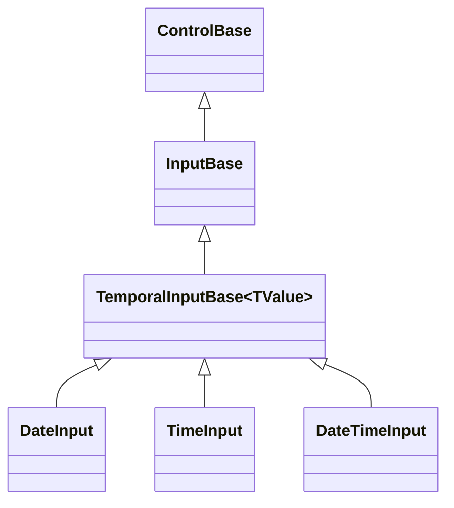

# TemporalInputBase authoring API

## Overview

`TemporalInputBase<TValue> : InputBase` is the abstract base for a focusable,
segmented field that edits a nullable, bounded, immutable temporal value one
segment at a time, seeded lazily from the owning dispatcher's clock.
[`DateInput`](date-input.md#overview), [`TimeInput`](time-input.md#overview),
and [`DateTimeInput`](date-time-input.md#overview) all derive from it today.

`TemporalInputBase<TValue>` owns the complete segmented-editing model: the
nullable value and inclusive range, the lazy dispatcher-clock seed, routed key
and pointer segment editing through `InputBase`'s in-assembly
`EnableSegmentEditing` capability (called once, from this base's own
constructor), the shared segment-layout skeleton that turns a parsed custom
format pattern into rendered segments, the null-value seeding a routed digit
entry or increment performs first, culture validation dispatch, and the typed
`ValueChanged` event. A concrete derivative supplies only the handful of seams
that genuinely differ between temporal fields: which pattern letters map to
which `TemporalSegmentKind`, which format pattern is currently active, how a
value renders against a resolved pattern, the largest value one editable segment
can hold, and the three per-segment arithmetic operations a routed key
ultimately performs - increment, digit entry, and clear. Everything else lives
here exactly once, so a new temporal field (a duration editor, a month picker)
reuses the same segmented-editing lifecycle `DateInput`, `TimeInput`, and
`DateTimeInput` already prove instead of re-deriving it, without needing friend
access to the in-assembly segmented-field engine: `TemporalSegmentKind` is
public precisely so an out-of-assembly derivative can classify and dispatch on
it.

## Inheritance



## API

| Member                                              | Type                                                  | Default        | Description                                                                                                                                                    |
| --------------------------------------------------- | ----------------------------------------------------- | -------------- | -------------------------------------------------------------------------------------------------------------------------------------------------------------- |
| `Value`                                             | `TValue?`                                             | `null`         | The nullable value. Assignment clamps silently into `Minimum`/`Maximum`.                                                                                       |
| `AllowNull`                                         | `bool`                                                | `true`         | Allows the value to be cleared to null.                                                                                                                        |
| `Minimum`                                           | `TValue`                                              | type-defined   | The inclusive lower bound that repairs the current value.                                                                                                      |
| `Maximum`                                           | `TValue`                                              | type-defined   | The inclusive upper bound that repairs the current value.                                                                                                      |
| `Culture`                                           | `CultureInfo`                                         | derivative-set | The culture governing segment order, separators, designator text, and digit glyphs; a derivative validates a candidate through `ValidateCulture(CultureInfo)`. |
| `ResolveClockSeed()`                                | `TValue`                                              | —              | Protected abstract; projects the owning dispatcher's current clock into `TValue`, used to lazily seed `Value` and to seed a null value an increment reaches.   |
| `ResolveDigitEntrySeed()`                           | `TValue`                                              | —              | Protected virtual; the seed a routed digit entry commits first when it reaches a null value. Defaults to `ResolveClockSeed()`.                                 |
| `TokenKinds`                                        | `IReadOnlyDictionary<char, TemporalSegmentKind>`      | —              | Protected abstract; maps a recognized custom format pattern letter to the segment kind it produces.                                                            |
| `ResolvePattern()`                                  | `string`                                              | —              | Protected abstract; resolves the currently active custom format pattern.                                                                                       |
| `AdjustRenderingPattern(string, bool)`              | `string`                                              | —              | Protected virtual; rewrites a parsed pattern immediately before it formats a non-null value. Identity by default.                                              |
| `ResolveRenderingCulture()`                         | `CultureInfo`                                         | —              | Protected virtual; resolves the culture a non-null value formats under. Defaults to `Culture`.                                                                 |
| `FormatValue(TValue, string, CultureInfo)`          | `string`                                              | —              | Protected abstract; formats a non-null value against a resolved pattern and culture.                                                                           |
| `IsPm(TValue)`                                      | `bool`                                                | —              | Protected virtual; reports whether a non-null value falls in the PM half of the day. False by default.                                                         |
| `MaxValueFor(TemporalSegmentKind, bool, int)`       | `int`                                                 | —              | Protected abstract; resolves the largest numeric value one editable segment can hold.                                                                          |
| `Increment(TValue, TemporalSegmentKind, int, int)`  | `TValue?`                                             | —              | Protected abstract; applies a one-step increment to one segment, or returns null when it cannot apply.                                                         |
| `ApplyDigit(TValue, TemporalSegmentKind, int, int)` | `TValue?`                                             | —              | Protected abstract; applies a typed numeric value to one segment, or returns null when it cannot apply.                                                        |
| `ClearSegment(TValue, TemporalSegmentKind)`         | `TValue?`                                             | —              | Protected abstract; resets one segment to its lowest representable value.                                                                                      |
| `ValidateCulture(CultureInfo)`                      | `void`                                                | —              | Protected abstract; validates a non-null candidate `Culture` before it commits.                                                                                |
| `SynchronizeValue(TValue?)`                         | `void`                                                | —              | Protected virtual; synchronizes a connected presentation after a value commit. No-op by default.                                                               |
| `SynchronizeBounds()`                               | `void`                                                | —              | Protected virtual; synchronizes a connected presentation's range after a bound commit. No-op by default.                                                       |
| `SynchronizeCulture(CultureInfo)`                   | `void`                                                | —              | Protected virtual; synchronizes a connected presentation's culture after a committed transition. No-op by default.                                             |
| `ClearValue()`                                      | `bool`                                                | —              | Protected virtual; clears the complete value to null when `AllowNull` allows it and a value is present.                                                        |
| `ResolveCharacterCommand()`                         | `Func<Rune, bool>?`                                   | `null`         | Protected virtual; the optional non-digit character command (an AM/PM shortcut) wired into the segmented-editing engine.                                       |
| `ResolvePopupCommand()`                             | `Func<KeyEventArgs, bool?>?`                          | `null`         | Protected virtual; the optional popup-opening command wired into the segmented-editing engine.                                                                 |
| `ReservesDropDownIndicator`                         | `bool`                                                | `false`        | Protected virtual; whether the field reserves a column for an owned drop-down indicator.                                                                       |
| `ActivateFirstSegmentOnFocus`                       | `bool`                                                | `false`        | Protected virtual; whether each focus entry returns to the first editable segment.                                                                             |
| `EnsureSeeded()`                                    | `void`                                                | —              | Protected; latches `Value` to `ResolveClockSeed()` on first read.                                                                                              |
| `OnUnavailable(ReleaseReason)`                      | `void`                                                | —              | Protected override; nulls `ValueChanged` on `ReleaseReason.Disposed`.                                                                                          |
| `ValueChanged`                                      | `EventHandler<TemporalValueChangedEventArgs<TValue>>` | No subscribers | Raised after a committed value transition.                                                                                                                     |

`ResolveClockSeed()`, `TokenKinds`, `ResolvePattern()`,
`FormatValue(TValue, string, CultureInfo)`,
`MaxValueFor(TemporalSegmentKind, bool, int)`,
`Increment(TValue, TemporalSegmentKind, int, int)`,
`ApplyDigit(TValue, TemporalSegmentKind, int, int)`,
`ClearSegment(TValue, TemporalSegmentKind)`, and `ValidateCulture(CultureInfo)`
are the seams every derivative must implement; `DateInput` derives all of them
from Gregorian calendar arithmetic over `DateOnly`, `TimeInput` from clock
arithmetic over `TimeOnly`, and `DateTimeInput` from both over `DateTime`.
`ResolveDigitEntrySeed()`, `AdjustRenderingPattern(string, bool)`,
`ResolveRenderingCulture()`, `IsPm(TValue)`, `SynchronizeValue(TValue?)`,
`SynchronizeBounds()`, `SynchronizeCulture(CultureInfo)`, `ClearValue()`,
`ResolveCharacterCommand()`, `ResolvePopupCommand()`,
`ReservesDropDownIndicator`, and `ActivateFirstSegmentOnFocus` default to an
identity, no-op, or `false` implementation; a derivative overrides only the ones
its own policy actually needs - `TimeInput` overrides `ResolveDigitEntrySeed()`
to seed `TimeOnly.MinValue` rather than the current clock, while `DateInput` and
`DateTimeInput` override `SynchronizeValue`, `SynchronizeBounds`, and
`SynchronizeCulture` to keep an owned Calendar popup current and override
`ResolvePopupCommand()`/`ReservesDropDownIndicator` for that popup's disclosure
key and column. `TemporalSegmentKind` (`Month`, `Day`, `Year`, `Hour`, `Minute`,
`Second`, `FractionalSecond`, `AmPmDesignator`) is public so an out-of-assembly
derivative can implement every abstract seam above without needing friend access
to the internal segmented-field engine that classifies on it.

## Keyboard

| Key          | Behavior                                                                     |
| ------------ | ---------------------------------------------------------------------------- |
| Left / Right | Moves to the previous or next editable segment.                              |
| Home / End   | Moves to the first or last editable segment.                                 |
| Up / Down    | Applies a one-step increment to the active segment through `Increment`.      |
| Digits       | Applies a typed numeric value to the active segment through `ApplyDigit`.    |
| Backspace    | Clears the active segment through `ClearSegment`.                            |
| Delete       | Clears the complete value through `ClearValue()` when `AllowNull` is `true`. |

A recognized key is consumed even when it cannot change anything - an increment
at a bound, a traversal at the first or last segment, or a clearing key over an
already-empty value - so a bounded field inside a scrolling or directionally
navigating container never scrolls or moves focus in that container. A
derivative that also enables an owned popup (`DateInput`, `DateTimeInput`)
additionally swallows every key and pointer event outright while that popup is
open; see [InputBase](../input-base.md#api) for that shared precedence rule.

## Example

```csharp
public sealed class YearMonthInput: TemporalInputBase<DateOnly>
{
    private static readonly IReadOnlyDictionary<char, TemporalSegmentKind> TokenKindMap =
        new Dictionary<char, TemporalSegmentKind>
        {
            ['y'] = TemporalSegmentKind.Year,
            ['M'] = TemporalSegmentKind.Month,
        };

    public YearMonthInput()
        : base(DateOnly.MinValue, DateOnly.MaxValue, System.Globalization.CultureInfo.InvariantCulture)
    {
    }

    protected override DateOnly ResolveClockSeed() =>
        DateOnly.FromDateTime(System.TimeProvider.System.GetLocalNow().DateTime);

    protected override IReadOnlyDictionary<char, TemporalSegmentKind> TokenKinds => TokenKindMap;

    protected override string ResolvePattern() => "yyyy-MM";

    protected override string FormatValue(
        DateOnly value, string format, System.Globalization.CultureInfo culture) =>
        value.ToString(format, culture);

    protected override int MaxValueFor(TemporalSegmentKind kind, bool hasAmPmDesignator, int runLength) =>
        kind == TemporalSegmentKind.Month ? 12 : 9999;

    protected override DateOnly? Increment(DateOnly value, TemporalSegmentKind kind, int delta, int digitCapacity) =>
        kind == TemporalSegmentKind.Month ? value.AddMonths(delta) : value.AddYears(delta);

    protected override DateOnly? ApplyDigit(DateOnly value, TemporalSegmentKind kind, int digitValue, int digitCapacity) =>
        kind == TemporalSegmentKind.Month
            ? new DateOnly(value.Year, Math.Clamp(digitValue, 1, 12), 1)
            : new DateOnly(Math.Clamp(digitValue, 1, 9999), value.Month, 1);

    protected override DateOnly? ClearSegment(DateOnly value, TemporalSegmentKind kind) =>
        kind == TemporalSegmentKind.Month ? new DateOnly(value.Year, 1, 1) : new DateOnly(1, value.Month, 1);

    protected override void ValidateCulture(System.Globalization.CultureInfo culture)
    {
    }
}
```

A caller interacts with `YearMonthInput.Value`, `Minimum`, `Maximum`, `Culture`,
and `ValueChanged` exactly as it would with `DateInput` -
`TemporalInputBase<TValue>` owns the complete segmented-editing lifecycle
underneath `YearMonthInput`'s own two-segment layout, entirely outside the
assembly that ships `DateInput`, `TimeInput`, and `DateTimeInput`.

## Expected behavior

| Scope               | Observable evidence                                                                                                                                               |
| ------------------- | ----------------------------------------------------------------------------------------------------------------------------------------------------------------- |
| Public API          | `Value` clamps into `Minimum`/`Maximum`, `ValueChanged` reports the exact previous and current committed value, and a null value seeds through the derived seams. |
| Integrated behavior | Keyboard segment editing, null-value seeding, and focus transitions commit through the shared segmented-editing lifecycle identically for every derivative.       |

- `DateInput`, `TimeInput`, and `DateTimeInput` share this exact contract; their
  own pages document only the seams and asymmetries specific to each.
- A third-party derivative that implements the required abstract seams gets the
  complete segmented-editing, measurement, and rendering contract for free,
  without needing friend access to the internal segmented-field engine.
