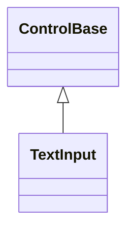
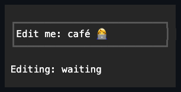
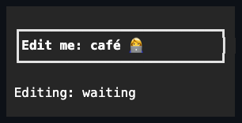

# TextInput

## Overview

`TextInput` is declared `public sealed class TextInput : ControlBase`. Unlike
its input siblings, it derives directly from `ControlBase` — it is not an
`InputBase` editor and has no press/activation state machine. It is a focusable
single- or multiline text editor whose caret and selection indices always fall
on valid grapheme boundaries.

## Inheritance



## API

| Member                             | Type                                           | Default                         | Description                                                                                                                                         |
| ---------------------------------- | ---------------------------------------------- | ------------------------------- | --------------------------------------------------------------------------------------------------------------------------------------------------- |
| `Text`                             | `string`                                       | `""` (empty)                    | The committed text; direct assignment validates policy and `MaxLength` before mutating, then moves the caret to the end.                            |
| `Placeholder`                      | `string?`                                      | `null`                          | Optional hint drawn with dim attributes while `Text` is empty and the control is unfocused.                                                         |
| `IsReadOnly`                       | `bool`                                         | `false`                         | Blocks user text mutation while enabled.                                                                                                            |
| `AcceptsReturn`                    | `bool`                                         | `false`                         | Allows inserted CR/LF; when `false`, Enter submits instead.                                                                                         |
| `AcceptsTab`                       | `bool`                                         | `false`                         | Allows local Tab insertion; when `false`, Tab moves focus.                                                                                          |
| `PasswordCharacter`                | `Rune?`                                        | `null`                          | Optional printable one-cell mask drawn per source grapheme; suppresses copy and cut.                                                                |
| `MaxLength`                        | `int`                                          | `0`                             | Maximum grapheme count; zero means unlimited.                                                                                                       |
| `CaretIndex`                       | `int`                                          | `0`                             | The collapsed caret position at a grapheme boundary.                                                                                                |
| `SelectionStart`                   | `int`                                          | `0`                             | The normalized selection start at a grapheme boundary.                                                                                              |
| `SelectionLength`                  | `int`                                          | `0`                             | The normalized selection length; the caret sits at whichever endpoint moved last.                                                                   |
| Inherited `IsTextSelectionEnabled` | `bool`                                         | `true`                          | Enabled by the constructor; disabling clears the editor selection and gesture state.                                                                |
| Inherited `TextSelection`          | `Selection`                                    | Empty at `0`                    | The same directional range represented by `SelectionStart`, `SelectionLength`, and `CaretIndex`.                                                    |
| Inherited `SelectedText`           | `string`                                       | —                               | Read-only; selected source text as a new owned string.                                                                                              |
| `HorizontalOffset`                 | `int`                                          | `0`                             | Read-only; the current horizontal cell scroll offset.                                                                                               |
| `VerticalOffset`                   | `int`                                          | `0`                             | Read-only; the current vertical logical-line scroll offset.                                                                                         |
| `CursorShape`                      | `CursorShape`                                  | `CursorShape.Block`             | The protocol-neutral cursor shape requested while the editor has focus.                                                                             |
| `StartAffix`                       | `Affix?`                                       | `null`                          | Optional leading edge-pinned decoration, reserved inboard of the border and outboard of the caret/selection viewport; never scrolls with the text.  |
| `EndAffix`                         | `Affix?`                                       | `null`                          | Optional trailing edge-pinned decoration, reserved inboard of the border and outboard of the caret/selection viewport; never scrolls with the text. |
| `ScrollBars`                       | `ScrollBars`                                   | `ScrollBars.Both`               | The axes eligible for editor overflow scrolling.                                                                                                    |
| `ShowScrollBars`                   | `ShowScrollBars`                               | `ShowScrollBars.WhenNeeded`     | The scrollbar reservation policy for enabled axes.                                                                                                  |
| `ScrollBarStyle`                   | `ScrollBarStyle?`                              | `null`                          | Optional complete local style requested for the owned editor rails.                                                                                 |
| `ActualScrollBarStyle`             | `ScrollBarStyle`                               | Resolved                        | Read-only; the complete local or Theme-owned editor-rail style.                                                                                     |
| `UndoLimit`                        | `int`                                          | `100`                           | The maximum retained snapshots per stack; zero disables both retained undo and retained redo.                                                       |
| `WordWrap`                         | `bool`                                         | `false`                         | Wraps long lines at word boundaries, falling back to grapheme boundaries when a word alone overflows.                                               |
| `CanUndo`                          | `bool`                                         | —                               | Read-only; whether one undo snapshot is available.                                                                                                  |
| `CanRedo`                          | `bool`                                         | —                               | Read-only; whether one redo snapshot is available.                                                                                                  |
| Inherited `ContextMenu`            | `ContextMenu?`                                 | `TextInputContextMenu` instance | Provides Undo, Redo, Cut, Copy, Paste, and Select All; replaceable through the inherited ownership contract.                                        |
| `Select(int start, int length)`    | `void`                                         | —                               | Selects a normalized grapheme-aligned range with the caret at its end.                                                                              |
| `CopySelection()`                  | `string`                                       | —                               | Returns selected text as an owned string, unless password policy suppresses it.                                                                     |
| `GetSelectableTextSnapshot()`      | `SelectableTextSnapshot`                       | —                               | Override; returns the editor's semantic text and visible grapheme geometry as an owned snapshot — empty and authoritative in password mode.         |
| `CutSelection()`                   | `string`                                       | —                               | Copies and deletes the selection, unless read-only or password policy suppresses it.                                                                |
| `ReplaceSelection(string value)`   | `bool`                                         | —                               | Replaces the selection, or inserts at the caret, through the same edit transaction every other edit path uses.                                      |
| `Undo()`                           | `bool`                                         | —                               | Restores the newest retained undo snapshot.                                                                                                         |
| `Redo()`                           | `bool`                                         | —                               | Restores the newest retained redo snapshot.                                                                                                         |
| `TextChanging`                     | `EventHandler<TextChangingEventArgs>`          | —                               | Raised before a text mutation and cancellable before commit.                                                                                        |
| `TextChanged`                      | `EventHandler<TextChangedEventArgs>`           | —                               | Raised after text and selection commit atomically.                                                                                                  |
| `SelectionChanged`                 | `EventHandler<InputSelectionChangedEventArgs>` | —                               | Raised after a changed directional selection commits.                                                                                               |
| Inherited `TextSelectionChanged`   | `EventHandler<TextSelectionChangedEventArgs>`  | —                               | Raised from the same committed transition as the editor-specific `SelectionChanged`.                                                                |
| `Submitted`                        | `EventHandler<SubmittedEventArgs>`             | —                               | Raised when Enter submits a single-line editor.                                                                                                     |

`Text` is never null. Direct assignment validates the control-character policy,
`MaxLength`, and complete Unicode boundaries before mutating, moves the caret to
the new end, and participates in cancellable events and undo history.
`CaretIndex`, `SelectionStart`, and `SelectionLength` never clamp direct
assignments; `Select(start, length)` validates overflow, containment, and both
grapheme boundaries before committing a forward range. The automatic
caret-reveal chase that keeps `HorizontalOffset`/`VerticalOffset` tracking the
caret runs only while the editor is focused, since there is no visible caret to
reveal otherwise — gaining focus forces one reveal pass immediately, and losing
focus leaves both offsets exactly where they were. Only content or viewport size
changes still clamp an out-of-range offset back into bounds, focused or not;
wheel scrolling is unaffected by any of this (see [Pointer](#pointer)). If
`SelectionChanged` synchronously commits a newer range, the superseded
transition does not subsequently reach inherited `TextSelectionChanged`
subscribers.

`ReplaceSelection` reuses the control's ordinary validation, `MaxLength`
truncation, grapheme-safe boundaries, undo recording, and
`TextChanging`/`TextChanged` sequencing — the same primitive keyboard input,
bracketed paste, context-menu paste, and cut already route through. It is the
composition seam for virtual keyboards, clipboard adapters, input-method
components, and find/replace UI that need to edit content without reconstructing
`Text` externally and bypassing those guarantees.

## Default field chrome

`TextInput` resolves the shared `InputStyle` (`styles.input`). Bundled themes
paint its normal face with `SemanticColor.Surface` and provide a one-cell border
on every edge. Hover, direct focus, and disabled state apply the theme's partial
input overlays, while a caller-assigned complete face or border remains
authoritative. The intrinsic
[shared chrome](../../concepts/styling.md#shared-chrome) reserves those cells
before the editor viewport, so text, selection, caret, pointer mapping, and the
owned scrollbars all use the inset content box. Callers may choose another glyph
family through a complete `Border`, or opt out by assigning a complete border
whose `Sides` is `BorderSide.None`.

`StartAffix` and `EndAffix` reserve a fixed cell column inboard of the border,
deflated away from the caret/selection viewport once, before any scroll or
scrollbar-reservation math runs - so an affix stays pinned in place while
`HorizontalOffset` scrolls the text underneath it, never traveling with the
content. The gap between a present affix and the viewport comes from the shared
`InputStyle.AffixGap` (see
[styling.md](../../concepts/styling.md#instance-content-affix)), the same member
`Button` reads. When the deflated box cannot hold everything, the viewport
shrinks first, then the end affix drops whole, then the start affix -
re-evaluated on every render against the control's actual bounds, never a
partial cluster.

## Edit model API

All mutation first runs through the pure
[`Edit`](../../../src/SharpVision/Text/Edit.cs) transaction model. It stores
immutable strings and a directional
[`Selection`](../../../src/SharpVision/Text/Selection.cs) with an `Anchor` and
an active `Caret` endpoint. `Start`, `Length`, and `End` are normalized views;
keeping both endpoints means repeated selection extension never loses its
direction.

- `Edit.Validate` rejects endpoints beyond the source or inside a surrogate
  pair, combining sequence, emoji sequence, flag, Indic conjunct, or any other
  Unicode 17 extended grapheme cluster.
- `MovePrevious` and `MoveNext` step by complete grapheme. Without extension, an
  existing selection collapses toward the requested direction; with extension,
  the original anchor stays fixed.
- `MoveHome` and `MoveEnd` target logical line boundaries and treat CRLF as one
  grapheme-safe separator. `MovePreviousWord` and `MoveNextWord` classify the
  first `Rune` of each cluster and keep marks attached to their base.
- `SelectWord` returns the complete letter, digit, or underscore run containing
  a grapheme boundary. A non-word position returns its single complete grapheme,
  and the end of the source returns an empty selection.
- `Backspace` and `Delete` remove the selected range or exactly one neighboring
  cluster. `Replace` validates the complete proposal before allocating anything:
  it enforces the control-character policy — CR and LF only with
  `AcceptsReturn`, tab only with `AcceptsTab`, and every other control character
  (ESC, DEL, NEL, LS/PS, ...) always rejected, because such a character would be
  stored with no paint width and freeze the caret at that index — and truncates
  over-length input only at a grapheme boundary. A `MaxLength` of zero means
  unlimited.
- `ProjectPassword` validates a printable one-cell mask under the default narrow
  policy and returns exactly one mask `Rune` per source grapheme. Invalid UTF-16
  source units count as their own conservative replacement clusters but are
  never normalized or copied into the projection.
- `EditResult` owns the resulting immutable `Text`, the directional `Selection`,
  and an `IsChanged` flag. Callers own undo/redo history by retaining these
  snapshots; the pure model keeps no hidden mutable history.

`Edit`'s public API is intentionally stateless: `MovePrevious`, `MoveNext`,
`MovePreviousWord`, and `MoveNextWord` each validate and scan `text` from
scratch, so a call costs time proportional to the caret's distance from the
source start. That is the correct default for a pure, cacheable-by-nothing
segmentation model with one authoritative implementation, but it means a caller
navigating a large document one boundary at a time by calling these methods
directly pays for the whole prefix on every call.

`TextInput` avoids that cost for its own Left, Right, Up, Down, and
Ctrl+Left/Right handling — the caret movements a caller can hold to repeat
across a large span. It maintains a lazily built, per-`Text`-version cache of
every grapheme boundary paired with its non-word-wrap cell row and column, so
caret navigation resolves in O(log n) via binary search instead of rescanning
the document per keystroke. The cache is rebuilt once, lazily, the next time
navigation runs after `Text` changes — the same order of work an edit already
pays for its own `string` copy, not an additional scaling tier. Word-wrapped
vertical navigation and the wrapped position lookup use the same technique
against the retained visual-line array. Holding one of these keys through a
large document therefore stays near-linear in the number of keystrokes rather
than growing with the document length on every one of them. Home and End are
discrete, not held-repeat gestures, and still go through the public,
unconditionally validated `Edit.MoveHome`/`Edit.MoveEnd`.

## Behavior

- `WordWrap` reflows long lines at whitespace, falling back to a grapheme
  boundary when a single word alone overflows the viewport; wrapping never
  splits a surrogate pair, combining sequence, or wide-cell cluster.
- `ScrollBars`, `ShowScrollBars`, and the nullable `ScrollBarStyle` follow the
  common overflow policy. When the rails reserve cells, the editor's Unicode
  text, caret, selection, pointer mapping, and wheel offsets use the remaining
  viewport. `ActualScrollBarStyle` exposes the complete Theme or local result,
  and the owned canonical `ScrollBar` controls keep their normal keyboard,
  track, thumb-drag, and focus behavior.
- Construction installs one `TextInputContextMenu`, a public specialized
  `ContextMenu` reached through the inherited `ContextMenu` property. It orders
  Undo, Redo, a separator, Cut, Copy, Paste, another separator, and Select All.
  Opening it recomputes enablement from the selection, the password and
  read-only policy, the application clipboard content, the text length, and
  undo/redo availability. Callers may replace or clear it through the ordinary
  context-menu ownership contract.
- `CanUndo`, `CanRedo`, `Undo()`, and `Redo()` operate on immutable
  text-and-selection snapshots and never keep more than `UndoLimit` entries per
  stack, independently for undo and redo.
- `TextChanging` receives the complete proposed `EditResult` and may cancel it
  before any field changes. If its callback commits another edit, that newer
  edit supersedes the outer proposal and owns the undo/redo snapshot; the stale
  proposal is not applied afterward. After the text, selection, and scroll
  commit atomically, `TextChanged` precedes `SelectionChanged` when both apply.
  `Submitted` carries the committed single-line text and is raised only for the
  initial Enter press. A multiline editor instead inserts a newline for each
  accepted Enter repeat.
- Password mode masks the display and keeps secret text out of diagnostics,
  snapshots, and the default clipboard copy. The model still stores the
  caller-provided text; it is not a secure-memory primitive.
- Rendering never builds a display string that contains the source text: it
  emits one validated mask `Rune` directly for each source cluster. An ambiguous
  mask uses the inherited policy for measurement, scrolling, pointer mapping,
  caret placement, and rendering. A selected wide cluster receives reverse
  rendition on both its lead and continuation cells.
- The terminal cursor is visible only while the editor is focused, and its
  position and requested shape are committed through the semantic frame — the
  control never emits terminal bytes itself.
- `TextInput` clears its complete committed content box with its resolved style
  before drawing graphemes. A configured background therefore paints the full
  editable rectangle — including empty trailing cells, multiline slack,
  selection, and caret space — rather than only the cells occupied by text.
  Themes provide the actual colors through the normal, hovered, focused, and
  disabled style overlays.

## Interaction

Typed text, navigation, selection, Backspace/Delete, Home/End, word movement,
undo/redo, paste, copy/cut, mouse placement and drag, and scrolling all operate
on grapheme boundaries. IME composition is represented separately from committed
text when the terminal protocol supplies it. Keys outside the editor command set
remain available to inherited routed input.

### Keyboard

- An unhandled Tab moves focus through the owning manager's tab order, while
  `AcceptsTab` handles Tab locally and inserts it when only Shift, Caps Lock, or
  Num Lock accompanies the stroke. Control, Alt, Super, Hyper, or Meta keeps Tab
  unhandled and never edits the document. Shift+Tab moves backward when the
  editor does not accept tabs.
- Space-independent text events insert decoded `Rune` values.
- Shift extends the selection from the retained anchor, Control switches to word
  movement, and Up/Down map the rendered caret column to the nearest grapheme
  boundary on the adjacent line.
- Control+A, Control+Z, and Control+Y select all, undo, and redo. They match the
  exact Control command after lock-key normalization, so larger chords remain
  unhandled under the shared
  [keyboard modifier policy](../../concepts/input-routing.md#keyboard-modifier-policy).
- Enter inserts LF only when `AcceptsReturn` is set; otherwise it submits.
- Tab inserts only when `AcceptsTab` is set and the stroke carries text-entry
  modifiers rather than an application-command chord.

### Clipboard

Bracketed paste decodes its owned UTF-8 payload once and applies one atomic
proposal; a policy rejection drops the complete proposal, while subscriber
exceptions propagate after any committed notification state.

- Inside a running `Application`, Control+C and Control+X publish a non-empty,
  non-password selection to the application-owned text clipboard and mirror it
  to the capability-gated terminal clipboard writer.
- Control+V inserts that owned text through the same policy, events, Unicode
  validation, and undo history as a terminal paste.
- An empty or password-suppressed copy or cut preserves the existing application
  buffer.
- External terminal paste remains the bracketed `Paste` event path; the
  in-process shortcut never claims an unavailable synchronous host clipboard
  read.
- While a modal plane is active, these shortcuts follow the
  [modal keyboard contract](../../concepts/modality.md#keyboard-text-and-paste)
  on its stable
  [modal route boundary](../../concepts/modality.md#modal-route-boundaries), so
  editor callbacks cannot redirect the in-progress handled key to newly exposed
  ancestry.

### Pointer

- A primary pointer press focuses the editor and captures the pointer. Cell
  coordinates — including those inferred from pixel protocols — map through the
  same grapheme widths used for rendering, so wide and combining clusters can
  never yield interior indices.
- Drag release, focus or capture cancellation, disabling, hiding, detachment,
  and disposal release transient ownership without changing the text.
- A primary double-click selects the complete Unicode-safe word or non-word
  grapheme beneath the pointer. The routed input manager owns the deterministic
  500-millisecond same-target, same-cell, same-button gesture count; the editor
  owns only the resulting grapheme-aligned selection.
- Wheel deltas scroll the editor's existing horizontal and vertical content
  offsets in cell and logical-line units, whether or not the editor is focused —
  unlike the caret-reveal chase, wheel scrolling never depends on focus. The
  editor handles a wheel event only when at least one enabled offset changes; at
  either endpoint it leaves an otherwise unmoved event unhandled, so normal
  bubble routing can offer it to an enclosing
  [scrollable `Container`](../../concepts/scrolling.md) instead of swallowing
  nested scrolling.

## Example





```csharp
var name = new TextInput
{
    MaxLength = 80,
    Placeholder = "Enter your name",
    Width = Length.Percent(100),
};
```

## Expected behavior

| Scope                 | Observable evidence                                                          |
| --------------------- | ---------------------------------------------------------------------------- |
| Public API            | Validation, defaults, state changes, and deterministic output.               |
| Integrated behavior   | Cross-component behavior through the real ownership and routing boundary.    |
| Complete runtime path | Final cells, bytes, lifecycle ordering, cleanup, or pseudoterminal behavior. |

- IsEditing behaves correctly for empty and Unicode text, including movement and
  deletion across combining and emoji clusters.
- Selection, read-only, password, and maximum-length policies hold; events fire
  and cancel as documented; paste respects the same limits; and the clipboard
  fallback works.
- Mouse and pixel hit testing, horizontal and vertical scrolling, resize, focus
  and disabled state, the cursor-shape fallback, and the final cursor and cells
  all behave as described above.

Mounted cross-layer coverage in
[`TextInputSurfaceTests`](../../../tests/SharpVision.Tests/Controls/Input/TextInputSurfaceTests.cs)
drives terminal bytes through the live application and demonstrates placeholder
rendering, focus, Unicode typing and deletion, atomic paste, wide-cell
selection, the submit policy, password masking, read-only and disabled refusal,
automatic offsets, resize repair, and the committed terminal cursor. The
component harness does not consider input consumed until the terminal session
requests its next read, so an earlier dispatcher idle cannot expose a partially
routed action.

The pure model additionally replays 10,000 operations with seed `0x00ED175A`
over ASCII, CJK, combining sequences, emoji ZWJ sequences, flags, and invalid
UTF-16. Every step independently validates both endpoints, the maximum grapheme
count, deterministic replay, and the absence of split clusters.
