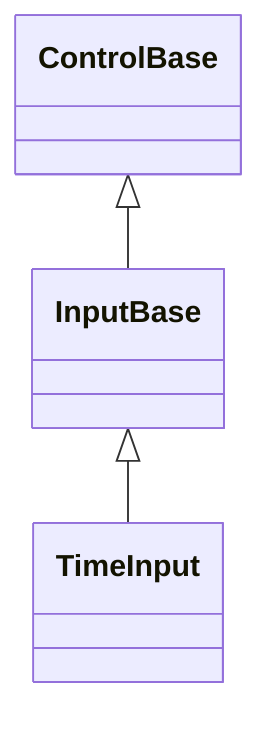
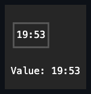

# TimeInput

## Overview

`TimeInput` displays a formatted time with inline segment editing.

`TimeStep` configures the minute increment that Up/Down applies while the minute
segment is active. It defaults to one minute and accepts positive whole minutes.
`Use24HourFormat`, `ShowSeconds`, and `AllowNull` are independent display and
editing options.

`Culture` localizes the rendered time separator, the AM/PM designator text, and
each numeric segment's digit glyphs. It defaults to
`CultureInfo.InvariantCulture`, so out-of-the-box rendering never depends on the
host operating system's locale; set it explicitly to localize the field. The
property treats the `CultureInfo` instance as mutable configuration identity, so
a distinct same-name clone refreshes separators, designators, digit glyphs, and
the active edit buffer; reassigning the identical instance is silent. The
segment order itself - hour, minute, optionally second, optionally an AM/PM
designator - defaults to `Use24HourFormat` and `ShowSeconds` rather than a
culture's time pattern, since those two properties are the field's own explicit
structural contract. Set `Format` to a custom pattern (for example
`"hh:mm:ss tt"`) to override that structure directly; pair a 12-hour `h`/`hh`
hour token with a `t`/`tt` AM/PM designator token for correct 12-hour clamping,
since a 12-hour hour token without a designator is treated as a 24-hour segment
for editing purposes. `TimeInput` derives from
[`InputBase`](../input-base.md#overview), enabling only segment editing - it has
no press activation and no popup. It shares its active-segment navigation,
digit-entry buffering, routed key classification, pointer hit testing, and
focus-continuation engine with [`DateInput`](date-input.md) and
[`DateTimeInput`](date-time-input.md) through
[`InputBase.EnableSegmentEditing`](../input-base.md#api). Only the
calendar/clock arithmetic and pattern for each control's own value type differ.
The three controls also use the same generic nullable value state for one-shot
dispatcher-clock seeding, inclusive clamping, endpoint repair, and
reentrant-safe event publication. AM/PM discovery and conversion remain pure
shared temporal classification helpers used by the two clock-capable fields.

Disabling `AllowNull` repairs an existing null only if that policy remains live
after `PropertyChanged`. A synchronous observer that restores `AllowNull`
prevents obsolete clock-derived seeding and preserves the null value.

## Inheritance



## API

| Member            | Type                                           | Default                        | Description                                                                                               |
| ----------------- | ---------------------------------------------- | ------------------------------ | --------------------------------------------------------------------------------------------------------- |
| `Value`           | `TimeOnly?`                                    | current local time             | The nullable committed time, clamped to the inclusive bounds.                                             |
| `AllowNull`       | `bool`                                         | `true`                         | Allows clearing; disabling it repairs a null value.                                                       |
| `Culture`         | `CultureInfo`                                  | `CultureInfo.InvariantCulture` | Localizes the time separator, AM/PM designator text, and digits.                                          |
| `Use24HourFormat` | `bool`                                         | `true`                         | Selects 24-hour or AM/PM segments.                                                                        |
| `ShowSeconds`     | `bool`                                         | `false`                        | Adds the seconds segment.                                                                                 |
| `Format`          | `string?`                                      | `null`                         | A custom pattern overriding the derived segment order and count.                                          |
| `TimeStep`        | `TimeSpan`                                     | one minute                     | The positive whole-minute increment for the minute segment.                                               |
| `Minimum`         | `TimeOnly`                                     | `TimeOnly.MinValue`            | The inclusive lower bound that repairs the current value.                                                 |
| `Maximum`         | `TimeOnly`                                     | `TimeOnly.MaxValue`            | The inclusive upper bound that repairs the current value.                                                 |
| `StartAffix`      | `Affix?`                                       | `null`                         | Optional leading edge-pinned decoration, reserved inside the content box and outside the segment layout.  |
| `EndAffix`        | `Affix?`                                       | `null`                         | Optional trailing edge-pinned decoration, reserved inside the content box and outside the segment layout. |
| `ValueChanged`    | `EventHandler<TimeInputValueChangedEventArgs>` | no subscribers                 | Raised after a committed value transition.                                                                |

`StartAffix` and `EndAffix` each reserve a fixed cell column inside the content
box - the segment layout deflates around both. Unlike `ComboBox`, `DateInput`,
and `DateTimeInput`, TimeInput has no drop-down indicator to stay clear of, so
the affix columns are the only extra reservation. The gap between a present
affix and the segments comes from the shared `InputStyle.AffixGap` (see
[styling.md](../../concepts/styling.md#instance-content-affix)). When the
content box is too narrow for everything, the segment layout shrinks first, then
the end affix drops whole, then the start affix - never a partial cluster -
re-evaluated against the control's actual bounds on every render.

## Keyboard

| Key          | Behavior                                                                       |
| ------------ | ------------------------------------------------------------------------------ |
| Left / Right | Moves to the previous or next editable segment.                                |
| Home / End   | Moves to the first or last editable segment.                                   |
| Up / Down    | Increases or decreases the active segment; the minute segment uses `TimeStep`. |
| Digits       | Replaces or advances the active numeric segment.                               |
| A / P        | Selects AM or PM when an AM/PM segment is present.                             |
| Backspace    | Clears the active segment.                                                     |
| Delete       | Clears the complete value when `AllowNull` is `true`.                          |

Every key in the table is consumed even when it cannot change anything: Up or
Down at a bound, Left or Right at the first or last segment, Home or End when
already there, Delete or Backspace over an empty value, and a repeated A or P
that only moves the designator highlight. The key is the field's own, so a
bounded field inside a scrolling or directionally navigating container never
scrolls or moves focus in that container. Keys outside the table stay unhandled.

## Example



```csharp
var timeInput = new TimeInput { TimeStep = TimeSpan.FromMinutes(15) };
```

## Expected behavior

| Scope                 | Observable evidence                                                                                                                                                                                |
| --------------------- | -------------------------------------------------------------------------------------------------------------------------------------------------------------------------------------------------- |
| Public API            | Defaults, bounds, the null policy, time-step validation, `Format` validation, segment edits, and event order behave as documented.                                                                 |
| Integrated behavior   | Keyboard and pointer segment selection work through mounted routed input.                                                                                                                          |
| Complete runtime path | The 12- and 24-hour formats, optional seconds, custom `Format` layouts, active segment, focus, disabled state, tiny clipping, and non-invariant `Culture` separators/designators render correctly. |

- Direct digit and AM/PM entry follows the shared
  [keyboard modifier policy](../../concepts/input-routing.md#keyboard-modifier-policy),
  leaving command-modified characters unhandled without changing a segment.
