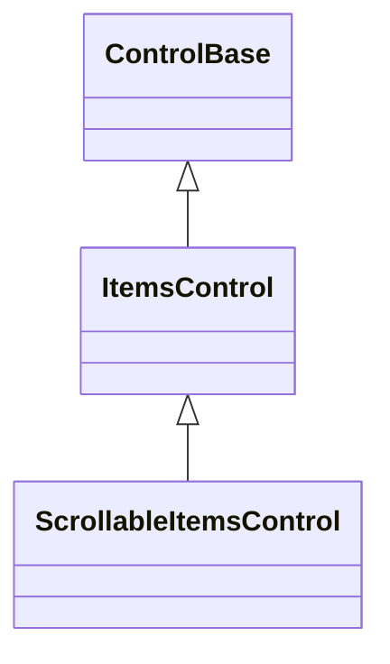

# ItemsControl

## Overview

`ItemsControl : ControlBase` is the base role for semantic controls that realize
an ordered set of controls inside one private presentation container. It behaves
as an ordinary semantic owner: its direct appearance does not create a style
scope and does not cascade through its private host to the realized items.

A concrete constructor calls `InitializeItemsHost(Container)` exactly once. A
rejected candidate does not consume the initialization, so the constructor can
recover and try a valid host. Once a host commits, it remains the permanent
presentation root even if a lifecycle callback throws. An incomplete owner is
rejected before insertion or dispatcher attachment. Direct host disposal makes
the owner permanently incomplete and never permits replacement. The host is an
ordinary owned control, so it receives dispatcher, theme, cell-policy,
enabled/visible, rendering, hit-testing, focus-navigation, popup, and disposal
behavior through the shared ownership registry.

The base class exposes no `Children`, no host, no mutable collection, and no
data-item type. Derived controls define their own semantic collection and use
the protected helpers listed below. Complete replacement copies and validates
every candidate before changing any ownership. Removed controls are detached
without being disposed; controls still owned when the item owner is disposed are
disposed along with the private host.

`OnItemControlsChanged` runs once after each committed snapshot, including a
change caused by direct item disposal. It observes the complete new order while
guarded ownership publication is still active. A callback failure does not roll
back the committed snapshot, and reentrant ownership mutation is rejected. A
derived owner that needs more than "a change occurred" overrides the typed
`OnItemControlsChanged(OwnedControlChange)` overload instead: it receives the
immutable committed delta - copied old/new orders, entering and leaving
identities, affected indices, normalized mutation kind (including
`DirectDisposal` for a child that disposed itself), and release reason - and
calls `base.OnItemControlsChanged(change)` to keep the parameterless overload
running for that change. `ListView`, `Table`, `Menu`, and `CommandBar` use those
facts for selection and current-item repair instead of reconstructing the
mutation from the final list; a consumer-derived owner has the same seam
available for the same purpose.

Beyond structural change notification, `ItemsControl` also wires three
`ControlBase` ancestor hooks - `OnDescendantFocused`, `OnDescendantAccessKey`,
and `OnDescendantDisposalRequested` - into item-scoped counterparts, so a
derived owner reacts to what happened to one specific realized item instead of
re-deriving that item from the wider descendant `ControlBase` reports.
`FindItemControl(ControlBase descendant)` resolves the direct realized item
control that owns a descendant: the descendant itself when it is already a
realized item, or the ancestor whose own direct parent is the private host when
the descendant is some control nested inside one. `OnItemFocused` and
`OnItemAccessKey` fire through that resolution, so a caption or nested control
gaining focus or matching an access key deep inside a realized item still
reports the enclosing item. `OnItemDisposalRequested` fires only when the
requesting control is itself a realized item - not merely owned by one - because
it exists to let the owner detach the item being disposed through its own
removal path, not to react to disposal somewhere inside an item's own content.
Once `FindItemControl` resolves a descendant to one of this owner's items,
`OnDescendantAccessKey` claims the match and reports what `OnItemAccessKey`
returns, so the item's own local focus-then-activate fallback never also runs
while a declined match still lets the next duplicate candidate handle the key.
`ListView`, `Menu`, `CommandBar`, `Breadcrumb`, and `TabControl` all replace
what used to be a `FindAncestor<TOwner>()`-and-relay override on every item type
with one of these owner-side hooks instead.
`IsAvailableItemControl(ControlBase item)` is the shared realized-item
eligibility predicate - not disposed or disposing, still realized by this owner,
and directly and effectively both visible and enabled - so a derived owner does
not re-declare the same five-condition check for its own availability gates.

An item owner whose realized items act together as one collective tab stop - a
menu, a command bar, a breadcrumb path, or a similar roving-selection
collection - calls `EnableOwnerFocusModel()` once, typically from its own
constructor, instead of re-implementing the acquire/suppress/restore recipe for
every insertion, replacement, and removal path. Enabling the model sets this
owner's own `IsFocusable` and `IsTabStop` to true and its `TabNavigation` to
`None`, then, for every future item committed through the private host, leases
that item's own `IsFocusable` and `IsTabStop` through `ItemPropertyOverrides`
and forces both false for as long as it remains realized. A caller's own
authored value for either property is captured, not discarded: it is written
back once the item leaves through an ordinary owner API, and discarded without a
write attempt when the item instead leaves through its own disposal, because a
disposing control's storage is no longer a safe write target. A derived owner
that needs an additional property leased on the same item - a fixed item height,
for example - declares it through `GetOwnerFocusModelExtraDescriptors` and sets
its initial live value through `ConfigureOwnerFocusModelItem`, because one
control supports only one active retained-property generation at a time; a
second, independent lease acquired for the same item would silently retire this
model's own generation for it without restoring anything.
`ItemPropertyOverrides` is the same generation-checked lease service that model
builds on; a derived owner that does not enable the model reaches it directly to
lease a property of its own, following the same acquire/restore/retire recipe.
`Menu`, `CommandBar`, and `Breadcrumb` all enable this model; `TabControl` does
not, because its items are focus containers rather than a single collective tab
stop.

A framework control whose one semantic item requires controls in several private
hosts uses the internal compound ownership transaction rather than calling these
single-host helpers sequentially. All participating snapshots are prevalidated,
all slot contents and inherited context commit together, and only then do
lifecycle and per-host change callbacks run. This is a framework composition
facility; consumer-derived item controls continue to use the protected
single-host authoring surface below.

The base measures the host inside its own content box, includes a visible host
margin in its desired size, and arranges the host with both axes resolved. The
host owns item-specific layout. `ItemsControl` itself adds no scrolling
behavior; a derived control with a private scrolling host uses
[`ScrollableItemsControl`](#scrollableitemscontrol).

## Inheritance



## API

| Member                                                                                                                           | Type                                                | Default | Description                                                                                                            |
| -------------------------------------------------------------------------------------------------------------------------------- | --------------------------------------------------- | ------- | ---------------------------------------------------------------------------------------------------------------------- |
| `ItemControlCount`                                                                                                               | `int`                                               | —       | Protected internal, read-only; the number of currently realized item controls.                                         |
| `InitializeItemsHost(Container host)`                                                                                            | `void`                                              | —       | Protected; installs the one private presentation host for this item owner, exactly once.                               |
| `GetItemControl(int index)`                                                                                                      | `ControlBase`                                       | —       | Protected internal; gets one realized item control by zero-based position.                                             |
| `IndexOfItemControl(ControlBase control)`                                                                                        | `int`                                               | —       | Protected internal; gets the identity position of one realized item control, or -1 when not realized.                  |
| `InsertItemControl(int index, ControlBase control)`                                                                              | `void`                                              | —       | Protected internal; inserts one detached realized control at a validated position.                                     |
| `RemoveItemControl(ControlBase control)`                                                                                         | `bool`                                              | —       | Protected internal; removes one identical realized control without disposing it.                                       |
| `RemoveItemControlAt(int index)`                                                                                                 | `void`                                              | —       | Protected internal; removes one realized control by position without disposing it.                                     |
| `ReplaceItemControl(int index, ControlBase control)`                                                                             | `void`                                              | —       | Protected internal; atomically replaces one realized control without disposing the previous control.                   |
| `ClearItemControls()`                                                                                                            | `void`                                              | —       | Protected internal; atomically clears all realized controls without disposing them.                                    |
| `ReplaceItemControls(IEnumerable<ControlBase> controls)`                                                                         | `void`                                              | —       | Protected; atomically replaces the complete realized-control snapshot.                                                 |
| `MoveItemControl(int oldIndex, int newIndex)`                                                                                    | `void`                                              | —       | Protected internal; atomically reorders one realized control without detaching it.                                     |
| `OnItemControlsChanged()`                                                                                                        | `void`                                              | —       | Protected virtual; responds after one complete realized-control snapshot is committed.                                 |
| `OnItemControlsChanged(OwnedControlChange change)`                                                                               | `void`                                              | —       | Protected virtual; responds with the immutable committed delta; forwards to the parameterless overload by default.     |
| `FindItemControl(ControlBase descendant)`                                                                                        | `ControlBase?`                                      | —       | Protected; resolves the direct realized item control that owns a descendant, or null when it owns none.                |
| `OnItemFocused(ControlBase item)`                                                                                                | `void`                                              | No-op   | Protected virtual; wired from `OnDescendantFocused` through `FindItemControl`.                                         |
| `OnItemAccessKey(ControlBase item, Rune key)`                                                                                    | `bool`                                              | `false` | Protected virtual; wired from `OnDescendantAccessKey` through `FindItemControl`.                                       |
| `OnItemDisposalRequested(ControlBase item)`                                                                                      | `bool`                                              | `false` | Protected virtual; wired from `OnDescendantDisposalRequested`, only for a directly disposing realized item.            |
| `IsAvailableItemControl(ControlBase item)`                                                                                       | `bool`                                              | —       | Protected; the shared realized-item eligibility predicate: not disposed or disposing, realized, visible, and enabled.  |
| `EnableSelectedItemPressActivation(getSelectedTarget, isTargetAvailable, setTargetPressed, activateTarget, consumeWhenNoTarget)` | `void`                                              | —       | Protected; opts a one-focus item owner into the shared selected-face Space activation gesture.                         |
| `HandleSelectedItemPressActivation(KeyEventArgs eventArgs)`                                                                      | `void`                                              | —       | Protected; routes one key event through selected-face Space activation when enabled.                                   |
| `CancelSelectedItemPressActivation()`                                                                                            | `void`                                              | —       | Protected; cancels a held selected-face Space interaction without activation.                                          |
| `ItemPropertyOverrides`                                                                                                          | `RetainedPropertyOverrideService`                   | —       | Protected, read-only; the retained-property override service for this owner's realized items, created on first access. |
| `EnableOwnerFocusModel()`                                                                                                        | `void`                                              | —       | Protected; opts a single-focus-stop item owner into the shared owner-focus item model.                                 |
| `GetOwnerFocusModelExtraDescriptors(ControlBase item)`                                                                           | `IReadOnlyList<RetainedPropertyOverrideDescriptor>` | `[]`    | Protected virtual; extra descriptors this owner leases alongside the owner focus model for one item.                   |
| `ConfigureOwnerFocusModelItem(ControlBase item, RetainedPropertyOverrideLease lease)`                                            | `void`                                              | —       | Protected virtual; runs immediately after the owner focus model acquires one item's combined lease.                    |

`ItemsControl` deliberately exposes no public `Children` collection. Concrete
types such as [`ListView`](collections/list-view.md#overview) and
[`Table`](layout/table.md#overview) publish typed semantic collections.

### Typed collections

`ItemCollection<TItem> : IReadOnlyList<TItem>` is the shared base for the
`IReadOnlyList<TItem>` facade an `ItemsControl` owner publishes over its own
realized item controls. A derived owner constructs one sealed collection type
deriving from it, typically as a single get-only property assigned immediately
after `InitializeItemsHost` in its own constructor. `StatusBarItemCollection`,
`TabItemCollection`, `MenuEntryCollection`, `CommandBarEntryCollection`, and
`BreadcrumbItemCollection` all derive from it today.

The default `this[int]`, `Count`, `Add`, `Insert`, `Remove`, `RemoveAt`, `Move`,
`IndexOf`, `Contains`, and `Clear` implementations read and mutate realized item
controls directly through the owner's `protected internal` item-control
accessors above. Those accessors are `protected internal` rather than plain
`protected` specifically so `ItemCollection<TItem>` - a sibling class in the
same assembly, not a subclass of `ItemsControl` - can reach them on the owner
instance it wraps: C# protected access requires the accessing code to itself
derive from the declaring type, so a plain `protected` member would stay
unreachable from that base even though both live in the same assembly.

An owner whose collection needs more than that raw structural mutation -
reindexing a current or selected position, notifying a dependent property, or
maintaining a private subscription - keeps that logic exactly where it already
lives, on the owner itself, in the owner's own internal method. Its derived
collection then overrides the corresponding virtual member to call that existing
owner method instead of running the default accessor-only path; it does not move
or duplicate the owner's logic into the collection. `TabControl` and `Menu` both
keep their insert/remove index-repair blocks and dependent-property
notifications on the owner for exactly this reason.

`ItemCollection<TItem>` exposes the seven protected hooks below for the simpler
case: a derived collection that only needs to react before or after a
default-path mutation commits, without replacing the mutation itself.

| Member                                              | Type   | Default | Description                                                                              |
| --------------------------------------------------- | ------ | ------- | ---------------------------------------------------------------------------------------- |
| `OnInserting(int index, TItem item)`                | `void` | No-op   | Protected virtual; runs immediately before the default `Insert` path commits.            |
| `OnInserted(int index, TItem item)`                 | `void` | No-op   | Protected virtual; runs immediately after the default `Insert` path commits.             |
| `OnRemoving(int index, TItem item)`                 | `void` | No-op   | Protected virtual; runs immediately before the default `Remove`/`RemoveAt` path commits. |
| `OnRemoved(int index, TItem item)`                  | `void` | No-op   | Protected virtual; runs immediately after the default `Remove`/`RemoveAt` path commits.  |
| `OnMoved(int oldIndex, int newIndex)`               | `void` | No-op   | Protected virtual; runs immediately after the default `Move` path commits.               |
| `OnReplaced(int index, TItem previous, TItem item)` | `void` | No-op   | Protected virtual; runs immediately after the default indexer setter commits.            |
| `OnCleared()`                                       | `void` | No-op   | Protected virtual; runs immediately after the default `Clear` path commits.              |

### ScrollableItemsControl

`ScrollableItemsControl : ItemsControl` is the shared authoring role for a
semantic item control whose one private presentation host supplies scrolling. It
keeps that mutable host private while exposing extent, viewport, offsets, scroll
policy, scrollbar styling, and `ScrollChanged` on the semantic owner. The event
sender is always the item owner; retained presentation controls never escape
through the public contract. A composite with the same scrolling need whose
implementation tree is not a typed item collection uses
[`ScrollableCompositeControlBase`](scrollable-composite-control.md#overview)
instead - the two roles share the same forwarding contract shape over different
base classes.

A concrete constructor calls `InitializeScrollableItemsHost(Container)` once.
The host must already contain the control-specific layout behavior and may
remain private for its complete lifetime. That same call subscribes the base
class to the host's own `ScrollChanged` once; a derived owner never subscribes
to it a second time.

A virtualizing item owner that lays out its realized items in equal-height
strides - `ListView` and `Table` both do - calls the protected
`ArrangeUniformRows` helper from its own `ArrangeOverride`, after arranging its
private host, instead of re-implementing the same two-pass resolve loop and
offset-remap arithmetic. The helper repeatedly asks the overridden
`TryResolveUniformRowHeight(int viewportHeight)` to resolve and commit a new
uniform row height against the viewport height with any leading band excluded,
re-measuring and re-arranging the host through the shared `MeasureChild`/
`ArrangeChild` seams whenever a pass actually commits one; once no further
change occurs, if the overridden `ResolvedUniformRowHeight` ends up different
from the height captured before the caller's own arrange began, the previous
offset is remapped onto the same logical row and proportional point within it
and the host is re-anchored there through `Container.ScrollByKnownMaximum`, so
the caller never has to. A `leadingBandHeight` parameter (zero unless the caller
reserves a header band ahead of its rows) and a `rowGap` parameter (zero for
contiguous rows) let one shared implementation express both `ListView`'s
bandless rows and `Table`'s header-and-gap arithmetic: an offset that already
sits inside the band passes through unchanged, since the band's own height never
changes with the row height.

A virtualizing item owner also overrides the protected virtual
`OnItemsHostScrollChanged(ScrollChangedEventArgs)` seam only to change which
causes trigger reconciliation; the default implementation skips
`ScrollCause.Content` and `ScrollCause.Resize` - both fire while the host's own
arrange transaction is still open - and otherwise calls the protected virtual
`RewindowItems()`, which the owner overrides to derealize items outside the
current window and realize items inside it.

| Member                                                                                           | Type                                   | Default          | Description                                                                         |
| ------------------------------------------------------------------------------------------------ | -------------------------------------- | ---------------- | ----------------------------------------------------------------------------------- |
| `ScrollBars`                                                                                     | `ScrollBars`                           | Host-defined     | Axes enabled by the private presentation host.                                      |
| `ShowScrollBars`                                                                                 | `ShowScrollBars`                       | Host-defined     | Reservation policy for generated scrollbars.                                        |
| `ScrollBarStyle`                                                                                 | `ScrollBarStyle?`                      | `null`           | Complete local generated-scrollbar style.                                           |
| `ActualScrollBarStyle`                                                                           | `ScrollBarStyle`                       | Resolved         | Resolved generated-scrollbar style.                                                 |
| `Extent`                                                                                         | `Size`                                 | Layout-dependent | Committed content extent.                                                           |
| `Viewport`                                                                                       | `Size`                                 | Layout-dependent | Committed visible extent.                                                           |
| `HorizontalOffset`                                                                               | `int`                                  | `0`              | Valid horizontal content offset.                                                    |
| `VerticalOffset`                                                                                 | `int`                                  | `0`              | Valid vertical content offset.                                                      |
| `LineSize`                                                                                       | `int`                                  | `1`              | Non-negative keyboard and wheel increment in cells.                                 |
| `PageOverlap`                                                                                    | `int`                                  | `0`              | Non-negative context retained between page commands.                                |
| `ScrollBy(int x, int y, ScrollCause cause)`                                                      | `bool`                                 | —                | Adds signed deltas with saturation and endpoint clamping.                           |
| `ScrollChanged`                                                                                  | `EventHandler<ScrollChangedEventArgs>` | No subscribers   | Reports offsets with the item owner as sender.                                      |
| `InitializeScrollableItemsHost(Container)`                                                       | `void`                                 | —                | Protected; installs the private scrolling item host.                                |
| `ArrangeUniformRows(host, bounds, previousRowHeight, previousOffset, leadingBandHeight, rowGap)` | `void`                                 | —                | Protected; runs the shared virtualized uniform-row resolve-and-remap state machine. |
| `TryResolveUniformRowHeight(int viewportHeight)`                                                 | `bool`                                 | `false`          | Protected virtual; resolves and commits this owner's uniform row height, if any.    |
| `ResolvedUniformRowHeight`                                                                       | `int`                                  | Throws           | Protected virtual; the currently committed uniform row height.                      |
| `OnItemsHostScrollChanged(ScrollChangedEventArgs)`                                               | `void`                                 | —                | Protected virtual; filters host scroll transitions and calls `RewindowItems`.       |
| `RewindowItems()`                                                                                | `void`                                 | No-op            | Protected virtual; reconciles realized item controls against the current window.    |

## Keyboard

| Key | Behavior                                                |
| --- | ------------------------------------------------------- |
| —   | This control has no control-specific keyboard commands. |

## Example

```csharp
public sealed class TagCloudItems : ItemCollection<Text>
{
    internal TagCloudItems(TagCloud owner)
        : base(owner)
    {
    }

    public void Add(string tag) => Add(new Text { Content = tag });
}

public sealed class TagCloud : ItemsControl
{
    public TagCloud()
    {
        InitializeItemsHost(new Stack { Orientation = Orientation.Horizontal });
        Items = new TagCloudItems(this);
    }

    public TagCloudItems Items { get; }
}
```

An application interacts with the semantic `TagCloud.Items` collection. It
cannot replace the host or insert arbitrary presentation children: every
insertion, removal, and replacement runs through `ItemCollection<Text>`'s
default accessor-driven implementation, which `TagCloudItems` never overrides.

## Expected behavior

| Scope    | Observable evidence                                                                                               |
| -------- | ----------------------------------------------------------------------------------------------------------------- |
| Unit     | Permanent host initialization, incomplete-owner rejection, atomic snapshots, callbacks, reentrancy, and disposal. |
| Surface  | Host margin, measure/arrange delegation, rendering, hit testing, and popup traversal.                             |
| Consumer | External derivation uses only the protected authoring surface without accessing the private host.                 |
