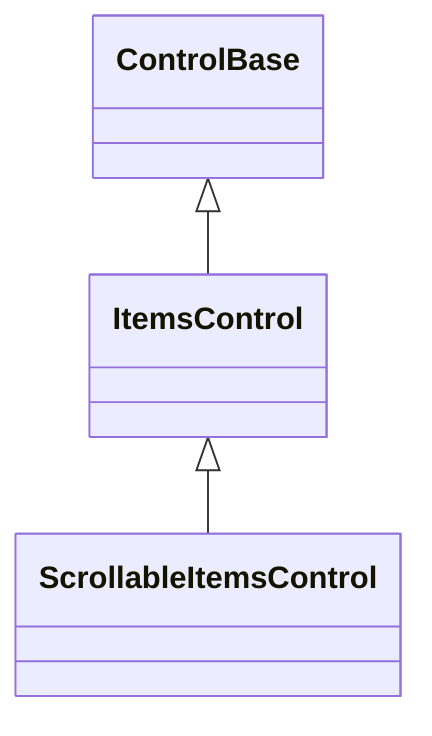

# ItemsControl

## Overview

`ItemsControl : ControlBase` is the base role for semantic controls that realize
an ordered set of controls inside one private presentation container. It behaves
as an ordinary semantic owner: its direct appearance does not create a style
scope and does not cascade through its private host to the realized items.

A concrete constructor calls `InitializeItemsHost(Container)` exactly once. A
rejected candidate does not consume the initialization, so the constructor can
recover and try a valid host. Once a host commits, it remains the permanent
presentation root even if a lifecycle callback throws. An incomplete owner is
rejected before insertion or dispatcher attachment. Direct host disposal makes
the owner permanently incomplete and never permits replacement. The host is an
ordinary owned control, so it receives dispatcher, theme, cell-policy,
enabled/visible, rendering, hit-testing, focus-navigation, popup, and disposal
behavior through the shared ownership registry.

The base class exposes no `Children`, no host, no mutable collection, and no
data-item type. Derived controls define their own semantic collection and use
the protected helpers listed below. Complete replacement copies and validates
every candidate before changing any ownership. Removed controls are detached
without being disposed; controls still owned when the item owner is disposed are
disposed along with the private host.

`OnItemControlsChanged` runs once after each committed snapshot, including a
change caused by direct item disposal. It observes the complete new order while
guarded ownership publication is still active. A callback failure does not roll
back the committed snapshot, and reentrant ownership mutation is rejected. The
framework-side host adapter also receives the immutable committed delta: copied
old/new orders, entering and leaving identities, indices, mutation kind, and
release reason. Concrete framework controls use those facts for selection and
current-item repair instead of reconstructing the mutation from the final list.

A framework control whose one semantic item requires controls in several private
hosts uses the internal compound ownership transaction rather than calling these
single-host helpers sequentially. All participating snapshots are prevalidated,
all slot contents and inherited context commit together, and only then do
lifecycle and per-host change callbacks run. This is a framework composition
facility; consumer-derived item controls continue to use the protected
single-host authoring surface below.

The base measures the host inside its own content box, includes a visible host
margin in its desired size, and arranges the host with both axes resolved. The
host owns item-specific layout. `ItemsControl` itself adds no scrolling
behavior; a derived control with a private scrolling host uses
[`ScrollableItemsControl`](#scrollableitemscontrol).

## Inheritance



## API

| Member                                                   | Type          | Default | Description                                                                                  |
| -------------------------------------------------------- | ------------- | ------- | -------------------------------------------------------------------------------------------- |
| `ItemControlCount`                                       | `int`         | —       | Protected, read-only; the number of currently realized item controls.                        |
| `InitializeItemsHost(Container host)`                    | `void`        | —       | Protected; installs the one private presentation host for this item owner, exactly once.     |
| `GetItemControl(int index)`                              | `ControlBase` | —       | Protected; gets one realized item control by zero-based position.                            |
| `IndexOfItemControl(ControlBase control)`                | `int`         | —       | Protected; gets the identity position of one realized item control, or -1 when not realized. |
| `InsertItemControl(int index, ControlBase control)`      | `void`        | —       | Protected; inserts one detached realized control at a validated position.                    |
| `RemoveItemControl(ControlBase control)`                 | `bool`        | —       | Protected; removes one identical realized control without disposing it.                      |
| `RemoveItemControlAt(int index)`                         | `void`        | —       | Protected; removes one realized control by position without disposing it.                    |
| `ReplaceItemControl(int index, ControlBase control)`     | `void`        | —       | Protected; atomically replaces one realized control without disposing the previous control.  |
| `ClearItemControls()`                                    | `void`        | —       | Protected; atomically clears all realized controls without disposing them.                   |
| `ReplaceItemControls(IEnumerable<ControlBase> controls)` | `void`        | —       | Protected; atomically replaces the complete realized-control snapshot.                       |
| `OnItemControlsChanged()`                                | `void`        | —       | Protected virtual; responds after one complete realized-control snapshot is committed.       |

`ItemsControl` deliberately exposes no public `Children` collection. Concrete
types such as [`ListView`](collections/list-view.md#overview) and
[`Table`](layout/table.md#overview) publish typed semantic collections.

### ScrollableItemsControl

`ScrollableItemsControl : ItemsControl` is the shared authoring role for a
semantic item control whose one private presentation host supplies scrolling. It
keeps that mutable host private while exposing extent, viewport, offsets, scroll
policy, scrollbar styling, and `ScrollChanged` on the semantic owner. The event
sender is always the item owner; retained presentation controls never escape
through the public contract.

A concrete constructor calls `InitializeScrollableItemsHost(Container)` once.
The host must already contain the control-specific layout behavior and may
remain private for its complete lifetime.

| Member                                      | Type                                   | Default          | Description                                               |
| ------------------------------------------- | -------------------------------------- | ---------------- | --------------------------------------------------------- |
| `ScrollBars`                                | `ScrollBars`                           | Host-defined     | Axes enabled by the private presentation host.            |
| `ShowScrollBars`                            | `ShowScrollBars`                       | Host-defined     | Reservation policy for generated scrollbars.              |
| `ScrollBarStyle`                            | `ScrollBarStyle?`                      | `null`           | Complete local generated-scrollbar style.                 |
| `ActualScrollBarStyle`                      | `ScrollBarStyle`                       | Resolved         | Resolved generated-scrollbar style.                       |
| `Extent`                                    | `Size`                                 | Layout-dependent | Committed content extent.                                 |
| `Viewport`                                  | `Size`                                 | Layout-dependent | Committed visible extent.                                 |
| `HorizontalOffset`                          | `int`                                  | `0`              | Valid horizontal content offset.                          |
| `VerticalOffset`                            | `int`                                  | `0`              | Valid vertical content offset.                            |
| `LineSize`                                  | `int`                                  | `1`              | Non-negative keyboard and wheel increment in cells.       |
| `PageOverlap`                               | `int`                                  | `0`              | Non-negative context retained between page commands.      |
| `ScrollBy(int x, int y, ScrollCause cause)` | `bool`                                 | —                | Adds signed deltas with saturation and endpoint clamping. |
| `ScrollChanged`                             | `EventHandler<ScrollChangedEventArgs>` | No subscribers   | Reports offsets with the item owner as sender.            |
| `InitializeScrollableItemsHost(Container)`  | `void`                                 | —                | Protected; installs the private scrolling item host.      |

## Keyboard

| Key | Behavior                                                |
| --- | ------------------------------------------------------- |
| —   | This control has no control-specific keyboard commands. |

## Example

```csharp
public sealed class TagCloud : ItemsControl
{
    public TagCloud()
    {
        InitializeItemsHost(new Stack { Orientation = Orientation.Horizontal });
    }

    public void Add(string tag) =>
        InsertItemControl(ItemControlCount, new Text { Content = tag });
}
```

An application interacts with the semantic `TagCloud` API. It cannot replace the
host or insert arbitrary presentation children.

## Expected behavior

| Scope    | Observable evidence                                                                                               |
| -------- | ----------------------------------------------------------------------------------------------------------------- |
| Unit     | Permanent host initialization, incomplete-owner rejection, atomic snapshots, callbacks, reentrancy, and disposal. |
| Surface  | Host margin, measure/arrange delegation, rendering, hit testing, and popup traversal.                             |
| Consumer | External derivation uses only the protected authoring surface without accessing the private host.                 |
