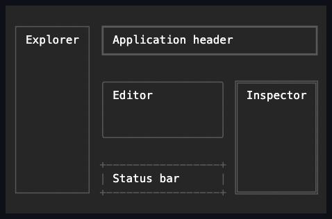

# Dock

## Overview

`Dock` consumes left, top, right, or bottom edges in child order and optionally
assigns the remaining rectangle to the final visible child.

## API

| Member           | Default   | Purpose                                                         |
| ---------------- | --------- | --------------------------------------------------------------- |
| `Children`       | Empty     | Owns controls in edge-consumption order.                        |
| Attached `Side`  | `Left`    | Selects the physical edge consumed by one child.                |
| `LastChildFills` | `true`    | Gives the final non-collapsed child the remaining rectangle.    |
| `Spacing`        | `0` cells | Inserts a non-negative gap after each consumed non-final child. |

## Behavior

- `Children` follows managed ownership.
- Attached `Side` defaults left and accepts left, top, right, or bottom.
- `LastChildFills` defaults true.
- `Spacing` defaults zero and is a non-negative cell gap after each consumed
  non-final child.

Each child measures against the remaining candidate size. Arrange saturates the
remaining rectangle at zero; no negative bounds are produced when children
request more than available.

Left/right children resolve width against the current remaining width and use
ordinary height/alignment across it; top/bottom children do the converse.
Percentages therefore resolve against each iteration's remaining axis, not the
original panel. The last non-collapsed child fills both resolved axes when
`LastChildFills` is true. Collapsed children consume neither an edge nor
spacing.

A Star-length child shares its axis's leftover space with its Star siblings by
weight, exactly as `Grid` and `StackPanel` split a Star track: after every
fixed, percent, and automatic sibling on the same axis is resolved, whatever
remains is divided among the Star children in proportion to their weight. A
Star's `MinWidth`/`MaxWidth` (or `MinHeight`/`MaxHeight`) reserves or clips that
Star's own share; a clipped or reserved amount is redistributed among the
remaining eligible Star siblings rather than being dropped or taken from an
unrelated child. Non-Star siblings resolve against the axis with every Star's
consumption excluded from their own basis — a Star claims whatever the non-Star
siblings collectively leave, and letting a later Percent sibling see a Star's
real rendered share would make the Percent's resolution depend on a value that
in turn depends on it, with no stable answer. Declaring a Star before or after a
Percent sibling that claims the same nominal share therefore yields the same
split either way.

Changing an attached side validates the enum and dispatcher affinity before
mutation, then invalidates measure only when the child belongs to a Dock.

## Example



```csharp
var shell = new Dock { LastChildFills = true, Spacing = 1 };
Dock.SetSide(sidebar, DockSide.Left);
shell.Children.Add(sidebar);
shell.Children.Add(main);
```

## Expected behavior

Cover all sides, ordering, fill on/off, spacing, fixed/percent/auto sizes,
over-consumption, collapsed children, zero/tiny bounds, resize, ownership,
navigation order, clipping, and exact bounds/cells.

Mounted cross-layer coverage in
[`DockSurfaceTests`](../../../tests/SharpVision.Tests/Controls/Layout/DockSurfaceTests.cs)
proves all four edge consumptions, final fill, exact region cells, a real fill
hit target, same-instance resize reflow, and removal of obsolete cells.
