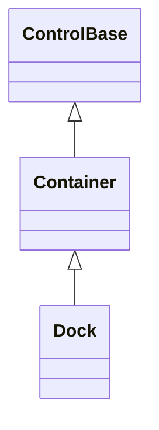

# Dock

## Overview

`Dock` is declared `public sealed class Dock : Container`. It lays its managed
children out by consuming space from the panel's physical edges: each child
docks against the left, top, right, or bottom edge in collection order, and the
last visible child can optionally take whatever rectangle remains. Its
constructor calls the inherited `EnableChromeAuthoring()`, so a caller can
author Dock's own frame directly instead of only inheriting a Theme profile.

## Inheritance



## API

| Member                    | Type                | Default                              | Description                                                                   |
| ------------------------- | ------------------- | ------------------------------------ | ----------------------------------------------------------------------------- |
| Inherited `Children`      | `ControlCollection` | Empty                                | Owns controls in edge-consumption order.                                      |
| `LastChildFills`          | `bool`              | `true`                               | Gives the final non-collapsed child the remaining rectangle.                  |
| `Spacing`                 | `int`               | `0`                                  | Non-negative cells inserted after each consumed non-final child.              |
| Inherited `Border`        | `Border`            | Theme `control` profile (borderless) | Public complete local frame authoring, enabled by `EnableChromeAuthoring()`.  |
| Inherited `ResetBorder()` | `void`              | —                                    | Returns the local border to Theme ownership.                                  |
| Inherited `Shadow`        | `Shadow`            | Theme `control` profile (none)       | Public complete local shadow authoring, enabled by `EnableChromeAuthoring()`. |
| Inherited `ResetShadow()` | `void`              | —                                    | Returns the local shadow to Theme ownership.                                  |

### Attached properties

| Member      | Type       | Default | Description                                        |
| ----------- | ---------- | ------- | -------------------------------------------------- |
| `Dock.Side` | `DockSide` | `Left`  | Selects the physical edge one child docks against. |

## Layout algorithm

Each child measures against whatever space is still available. Arrangement
saturates the remaining rectangle at zero, so children that request more than is
available never produce negative bounds.

Children docked left or right resolve their width against the current remaining
width and use the ordinary height and alignment rules across it; children docked
top or bottom do the converse. Percentages therefore resolve against the space
remaining at that child's turn, not against the original panel size. When
`LastChildFills` is true, the last non-collapsed child fills both remaining
axes. Collapsed children consume neither an edge nor spacing.

A Star-sized child shares its axis's leftover space with its Star siblings in
proportion to weight, exactly as `Grid` and `Stack` split a Star track:

1. Every fixed, percent, and automatic sibling on the same axis resolves first.
2. The remainder is divided among the Star children by weight.
3. A Star's `MinWidth`/`MaxWidth` (or `MinHeight`/`MaxHeight`) reserves or clips
   only that Star's own share; the reserved or clipped amount is redistributed
   among the remaining eligible Star siblings rather than dropped or taken from
   an unrelated child.
4. Non-Star siblings resolve against the axis with every Star's consumption
   excluded from their own basis — a Star claims whatever the non-Star siblings
   collectively leave.

If a later Percent sibling could see a Star's real rendered share, the Percent's
resolution would depend on a value that in turn depends on it, with no stable
answer. Declaring a Star before or after a Percent sibling that claims the same
nominal share therefore produces the same split either way.

Setting the attached side validates the enum value and dispatcher affinity
before any state changes, and it invalidates measure only when the child
currently belongs to a Dock. The weak attached value remains available while
detached or parented elsewhere without invalidating that other parent; moving
the child into a Dock makes that Dock the eligible target.

## Example


```csharp
var shell = new Dock { LastChildFills = true, Spacing = 1 };
Dock.SetSide(sidebar, DockSide.Left);
shell.Children.Add(sidebar);
shell.Children.Add(main);
```

## Expected behavior

| Scope               | Observable evidence                                                       |
| ------------------- | ------------------------------------------------------------------------- |
| Public API          | Validation, defaults, state changes, and deterministic output.            |
| Integrated behavior | Cross-component behavior through the real ownership and routing boundary. |

- Layout is deterministic across every side, child order, and size mix.
- Fixed, percentage, and automatic lengths resolve as described above, and a
  Star sibling divides leftover space by weight with clipped shares
  redistributed rather than dropped.
- Over-consuming children saturate at the panel bounds instead of producing
  negative geometry, collapsed children are skipped entirely, and zero or tiny
  panels stay well-defined.
- Fill on and off, spacing, resize reflow, managed ownership, collection-order
  navigation, clipping, and the exact committed bounds and cells are all
  observable guarantees.

Mounted cross-layer coverage in
[`DockSurfaceTests`](../../../tests/SharpVision.Tests/Controls/Layout/DockSurfaceTests.cs)
demonstrates consumption of all four edges, final-child fill, exact region
cells, a real pointer hit target inside the fill child, reflow when the same
instance is resized, and removal of cells an earlier layout no longer owns.
