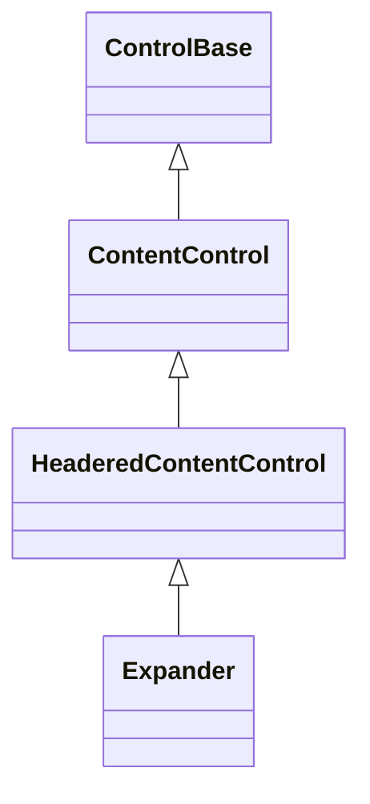
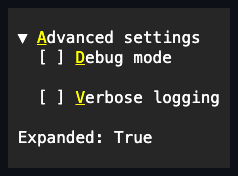

# Expander

## Overview

`Expander` is declared `public sealed class Expander : HeaderedContentControl`
and implements `IStyled<ExpanderStyle>`. It displays a collapsible section with
a focusable header toggle and optional content. Pressing Enter or Space, or
clicking the header with the primary pointer button, toggles the visibility of
the content region below. The header row always renders the resolved expanded or
collapsed disclosure glyph, followed by `Header` arranged into the remaining
width.

The Expander itself owns focus, hover, and press for the header row, and keeps
the disclosure glyph and the focus-highlighted row background as its own chrome.
A plain `Text` header — the `HeaderText` common case — is painted by the
Expander with its own state-resolved style, so the caption carries the same
hover, focus, and disabled cues as the glyph; any other header control is an
ordinary owned control arranged beside the glyph that paints with its own
resolved style. A `Header` set to `Visibility.Hidden` or `Visibility.Collapsed`
paints no caption at all, leaving only the disclosure glyph — matching the
ordinary `Visibility` gate every other owned control's own render pass already
respects, and the zero header width `MeasureOverride` already reports once
collapsed. Its pointer rectangle is the first non-empty row of `ContentBounds`,
after any caller-supplied border and padding are deflated. The caller's content
remains the one ordinary owned child.

By default the control has no border and a transparent background; the
disclosure glyph, the header, and the content indentation supply the structural
signal. Hover and direct focus change only the foreground and border semantics
of the header — they do not invent a frame or a fill. Caller content composes
over the surrounding surface unless a descendant supplies an explicit
background. Callers can opt into inherited frame, face, or shadow properties, in
which case layout follows the shared
[chrome contract](../../concepts/styling.md#shared-chrome).

## Inheritance



## API

| Member                 | Type                                     | Default        | Description                                                                       |
| ---------------------- | ---------------------------------------- | -------------- | --------------------------------------------------------------------------------- |
| Inherited `Header`     | `ControlBase?`                           | `null`         | Owns one replaceable control arranged beside the disclosure glyph.                |
| Inherited `HeaderText` | `string`                                 | Empty          | Convenience over `Header` for a plain single-line title.                          |
| Inherited `Content`    | `ControlBase?`                           | `null`         | Owns the optional collapsible body.                                               |
| `IsExpanded`           | `bool`                                   | `true`         | Includes or excludes owned content from layout, rendering, input, and navigation. |
| `Style`                | `ExpanderStyle?`                         | `null`         | Optional complete developer-authored presentation.                                |
| `ActualStyle`          | `ExpanderStyle`                          | Resolved       | Read-only; the complete local, theme-owned, or code-owned presentation.           |
| `ExpandedChanged`      | `EventHandler<ExpandedChangedEventArgs>` | No subscribers | Raised after a committed expansion change.                                        |

`Header` is any owned control arranged beside the toggle glyph; `HeaderText` is
the plain-text convenience described by
[`HeaderedContentControl`](../headered-content-control.md#headertext).
`IsExpanded` defaults to `true` and controls content visibility. When it is
`false`, only the header row renders; the content is excluded from measure,
arrangement, rendering, hit testing, and navigation, but it remains owned and
attached.

> [!NOTE]
>
> The exclusion works by writing the content's own public `Visibility`:
> collapsing assigns `Collapsed`, and expanding restores the visibility the
> child had when it was assigned as `Content` — not the value it holds now. A
> child whose `Visibility` was changed after assignment silently reverts to that
> captured value on the next expand.

`ExpandedChanged` fires after `IsExpanded` commits a changed value. If a
property observer commits a newer expansion state, that newer transition owns
content visibility and the typed event; the superseded outer setter does not
publish a stale `ExpandedChanged` payload. `Content` is the single owned child,
arranged below the header row while expanded. Replacing the content while
collapsed releases the previous child immediately without changing the expansion
state.

`ExpanderStyle : ControlStyle` is a complete immutable presentation: it adds a
one-cell `CollapsedGlyph`, a one-cell `ExpandedGlyph`, and a non-negative
`ContentIndent`, alongside the inherited `Face`/`Border`/`Shadow`. A `with`
expression creates a validated member-wise copy of `ExpanderStyle.Default`;
assigning `null` to `Style` restores the Theme-owned presentation, and
`ActualStyle` never returns null. `ContentIndent` defaults to `2` cells and sets
the leading inset for expanded content; the indent participates in intrinsic
width and is clamped to the arranged content width when space is tight. Changing
`ContentIndent` invalidates measure; any other style difference is render-only.

> [!NOTE]
>
> `Expander` exposes no `CollapsedGlyph`, `ExpandedGlyph`, or `ContentIndent`
> property, and no reset method for them: those values live only on
> `ExpanderStyle`, reached through `Style`/`ActualStyle`. To override a glyph or
> the indent, assign a complete local `Style` carrying the replacement, rather
> than looking for a single-member property or a reset method.

Inherited disabled state applies to the Expander as the semantic header owner: a
disabled header remains visible, but pointer, Space, and Enter input cannot
change expansion.

## Example



```csharp
var details = new Expander
{
    HeaderText = "Advanced settings",
    IsExpanded = false,
    Content = new Stack
    {
        Children =
        {
            new CheckBox { Text = "Debug mode" },
            new CheckBox { Text = "Verbose logging" },
        },
    },
};
```

An ampersand in `HeaderText` declares an
[access key](../../concepts/access-keys.md#focus-and-semantic-actions). The
marker does not count toward visible width, and pressing Alt plus the key
focuses the Expander and toggles expansion.

## Expected behavior

| Scope               | Observable evidence                                                       |
| ------------------- | ------------------------------------------------------------------------- |
| Public API          | Validation, defaults, state changes, and deterministic output.            |
| Integrated behavior | Cross-component behavior through the real ownership and routing boundary. |

- Measurement is correct in both the expanded and collapsed states, and
  collapsing excludes the content without giving up ownership.
- Toggling raises `ExpandedChanged` in a deterministic order, and the borderless
  header renders its glyph and text into exact cells.
- Reentrant property observers leave content visibility and the typed expansion
  event aligned with the newest committed state.
- The header responds to keyboard and pointer activation with hit geometry that
  accounts for any optional border and padding, hovering a descendant does not
  light the header, and a disabled Expander refuses to toggle.
- Focus, content replacement, Unicode cell geometry, resize and reflow, clearing
  of stale cells, and the final committed cells are all observable guarantees.
  The showcase includes expanded, collapsed, nested, disabled, wide-header, and
  replaced-content specimens.
