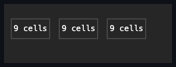

# Grid

## Overview

`Grid` arranges managed children in rows and columns. Tracks can be fixed,
percentage, automatic, or proportional, with configurable spacing between tracks
and children that span several of them.

## API

| Member                           | Default                            | Purpose                                                         |
| -------------------------------- | ---------------------------------- | --------------------------------------------------------------- |
| `Rows`, `Columns`                | Empty, meaning one automatic track | Define automatic, fixed, percentage, or proportional tracks.    |
| `RowSpacing`, `ColumnSpacing`    | `0` cells                          | Insert non-negative gaps between tracks.                        |
| Attached `Row`, `Column`         | `0`                                | Select a child's zero-based track origin.                       |
| Attached `RowSpan`, `ColumnSpan` | `1`                                | Extend a child across a positive in-range track count.          |
| `Children`                       | Empty                              | Owns controls whose attached placement is resolved by the grid. |

## Behavior

- `Rows` and `Columns` are permanent non-null `TrackCollection` values. Empty
  definitions mean one implicit automatic track.
- The immutable `Track` type stores `Length`, `Minimum`, and `Maximum` and
  provides the `Auto`, `Cells`, `Percent`, and `Star` factories. Limits must be
  non-negative, and a maximum cannot be below its minimum.
- `RowSpacing` and `ColumnSpacing` default to zero and are measured in
  non-negative cells.
- The attached `Row`, `Column`, `RowSpan`, and `ColumnSpan` properties require
  in-range origins and positive spans once definitions are committed. The
  defaults place a child at row and column zero with spans of one.
- `Children` follows managed ownership.

Mutating a track collection or a child placement validates dispatcher affinity
before any observable state changes, then invalidates measure once per real
change.

Measure first asks each child for its unbounded intrinsic size. Non-spanning
children contribute their largest margin-inclusive request to their track;
spanning children then widen their track range deterministically after
subtracting only the gaps inside the span. Fixed, automatic, percentage, and
proportional tracks are then resolved, with their limits applied, against the
bounded track area left after saturated outer spacing is reserved.

Every child is measured again with its resolved spanned slot. The grid rebuilds
the intrinsic requests once from that result, so wrapping on either axis can
affect the other. A child that spans only automatic rows is measured with its
resolved finite column width and unbounded height, which lets wrapped text grow
those rows instead of being clipped to the height probed before wrapping.
Arrange repeats the bounded pass when the final viewport differs from measure,
computes cumulative integer origins, and commits each child to the union of its
tracks plus the actual allocated internal gaps. The arrange invalidation raised
by that bounded remeasurement stays local to the active Grid transaction, which
prevents a percentage-sized Grid ancestor from scheduling an identical layout
forever.

When `AutoScroll` arms a row or column axis, that axis has no real ceiling to
allocate within - the extent is however much the content needs, and scrolling
covers the rest - so nothing competes for space along it: every track gets its
own full, non-competing size instead of shrinking under an artificial deficit. A
`Percent` track still resolves against the visible viewport rather than the
extent it itself contributes to, matching the
[automatic scrollbar algorithm](../../concepts/scrolling.md#automatic-scrollbar-algorithm).
A `Star` track along that same armed axis has no fixed remaining space to
divide, so it falls back to its own intrinsic request instead of the ordinary
proportional division; an unarmed axis is unaffected.

Arrange resolves an axis to the cell it was placed in only while the child
leaves that axis at its default `Auto` `Width`/`Height`: an unstyled child fills
the complete union of its spanned tracks plus internal gaps, matching every
other Grid usage that relies on a cell to size its children. A child that sets
an explicit non-`Auto` `Width` or `Height` is left unresolved on that axis
instead, so the requested size and the child's own
`HorizontalAlignment`/`VerticalAlignment` take over and place it within the cell
rather than being silently overridden. `MinWidth`/`MinHeight` and
`MaxWidth`/`MaxHeight` are honored on both paths: on the default filled path
they cap the fill itself, and alignment then has slack to work with, since there
is now room between the shrunk child and the cell to align within; on the
explicit-`Width`/`Height` path they cap the requested size the same way
`ControlBase.Arrange` caps it everywhere else. `Stack` resolves only its own
stacking axis this way and leaves the cross axis to the child's own
`Width`/`Height` and alignment instead (see [Stack](stack.md#behavior)).

Rounding uses the shared cumulative-edge allocator. When the definitions and
spacing cannot fit, spacing saturates first, then tracks shrink
deterministically until every slot stays inside the Grid. Empty definitions
behave exactly like one implicit automatic track. Collapsed children contribute
no request and receive empty bounds.

An ancestor with `AutoScroll` may translate a Grid to a negative visual origin.
Track extents and gaps remain non-negative, while the committed screen
coordinates preserve the signed translation. This is the ordinary scrolling
arrangement defined by the
[scrolling contract](../../concepts/scrolling.md#overview), not an invalid Grid
placement.

Shrinking a definition collection first validates the candidate origin and span
of every owned child. When any placement would fall out of range, the mutation
throws `InvalidOperationException` and leaves the definitions and placements
unchanged.

## Example



```csharp
var grid = new Grid
{
    Columns = { Track.Cells(20), Track.Star(1) },
    ColumnSpacing = 1,
};
```

## Expected behavior

Layout is deterministic across every track kind and mix, minimum and maximum
limits, spacing, spans, and competing intrinsic requirements. Rounding
remainders are allocated deterministically, collapsed children are excluded,
invalid attached values are rejected, and zero, tiny, and overflowing sizes
never break containment. Wrapping triggers the single documented remeasure, a
percentage-sized parent settles after resize, ownership stays managed, origins
may be signed under ancestor scrolling, and the committed bounds and cells are
exact. Seed `0x051A475A` runs 10,000 mixed valid grids twice and demonstrates
determinism, containment, non-negative geometry, ordered shared edges, and exact
axis consumption when an uncapped proportional track absorbs the remainder.

Mounted cross-layer coverage in
[`GridSurfaceTests`](../../../tests/SharpVision.Tests/Controls/Layout/GridSurfaceTests.cs)
demonstrates mixed fixed, percentage, automatic, and proportional tracks,
deterministic resize remainders, wide-cell ownership, padding, spanning,
collapsed exclusion, exact bounds and cells, and pointer routing to a final
arranged slot.
