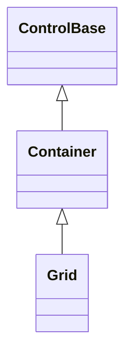

# Grid

## Overview

`Grid` is declared `public sealed class Grid : Container`. It arranges managed
children in rows and columns whose tracks can be fixed, percentage, automatic,
or proportional, with configurable spacing between tracks and children that span
several of them. Its constructor calls the inherited `EnableChromeAuthoring()`,
so a caller can author Grid's own frame directly instead of only inheriting a
Theme profile.

## Inheritance



## API

| Member                        | Type                | Default                              | Description                                                                   |
| ----------------------------- | ------------------- | ------------------------------------ | ----------------------------------------------------------------------------- |
| Inherited `Children`          | `ControlCollection` | Empty                                | Owns controls whose attached placement is resolved by the grid.               |
| `Rows`, `Columns`             | `TrackCollection`   | Empty, meaning one automatic track   | Own mutable row and column track definitions.                                 |
| `RowSpacing`, `ColumnSpacing` | `int`               | `0`                                  | Non-negative cells inserted between rows or columns.                          |
| Inherited `Border`            | `Border`            | Theme `control` profile (borderless) | Public complete local frame authoring, enabled by `EnableChromeAuthoring()`.  |
| Inherited `ResetBorder()`     | `void`              | —                                    | Returns the local border to Theme ownership.                                  |
| Inherited `Shadow`            | `Shadow`            | Theme `control` profile (none)       | Public complete local shadow authoring, enabled by `EnableChromeAuthoring()`. |
| Inherited `ResetShadow()`     | `void`              | —                                    | Returns the local shadow to Theme ownership.                                  |

### Attached properties

| Member                            | Type  | Default | Description                                             |
| --------------------------------- | ----- | ------- | ------------------------------------------------------- |
| `Grid.Row`, `Grid.Column`         | `int` | `0`     | Selects a child's zero-based track origin.              |
| `Grid.RowSpan`, `Grid.ColumnSpan` | `int` | `1`     | Extends a child across a positive in-range track count. |

`Rows` and `Columns` are permanent non-null `TrackCollection` values; empty
definitions mean one implicit automatic track. The immutable `Track` type stores
`Length`, `Minimum`, and nullable `Maximum`, and provides the `Auto`, `Cells`,
`Percent`, and `Star` factories. A limit must use `Length.Cells` or
`Length.Percent`; `Auto` and `Star` limits are rejected. Percentage limits use
the same spacing-reduced track area as percentage requests. Comparable limits
cannot be inverted; if differently expressed limits cross after resolution, the
minimum wins. During unbounded measure, a relative minimum contributes zero and
a relative maximum remains unbounded. The attached `Row`, `Column`, `RowSpan`,
and `ColumnSpan` properties require in-range origins and positive spans once
definitions are committed. Their shared weak storage validates against the
current Grid's live definitions before commit, suppresses equivalent writes, and
invalidates only that Grid's measure phase. Detached and wrong-parent writes
retain their values without dirtying an unrelated owner.

Mutating a track collection or a child placement validates dispatcher affinity
before any observable state changes, then invalidates measure once per real
change. Shrinking a definition collection first validates the candidate origin
and span of every owned child; when any placement would fall out of range, the
mutation throws `InvalidOperationException` and leaves the definitions and
placements unchanged.

## Layout algorithm

1. Measure first asks each child for its unbounded intrinsic size. Non-spanning
   children contribute their largest margin-inclusive request to their track;
   spanning children then widen their track range deterministically after
   subtracting only the gaps inside the span.
2. Fixed, automatic, percentage, and proportional tracks are then resolved, with
   their limits applied, against the bounded track area left after saturated
   outer spacing is reserved.
3. Every child is measured again with its resolved spanned slot. The grid
   rebuilds the intrinsic requests once from that result, so wrapping on either
   axis can affect the other. A child that spans only automatic rows is measured
   with its resolved finite column width and unbounded height, which lets
   wrapped text grow those rows instead of being clipped to the height probed
   before wrapping.
4. Arrange repeats the bounded pass when the final viewport differs from
   measure, computes cumulative integer origins, and commits each child to the
   union of its tracks plus the actual allocated internal gaps. The arrange
   invalidation raised by that bounded remeasurement stays local to the active
   Grid transaction, which prevents a percentage-sized Grid ancestor from
   scheduling an identical layout forever.

When `AutoScroll` arms a row or column axis, that axis has no real ceiling to
allocate within — the extent is however much the content needs, and scrolling
covers the rest — so nothing competes for space along it: every track gets its
own full, non-competing size instead of shrinking under an artificial deficit. A
`Percent` track still resolves against the visible viewport rather than the
extent it itself contributes to, matching the
[automatic scrollbar algorithm](../../concepts/scrolling.md#automatic-scrollbar-algorithm).
A `Star` track along that same armed axis has no fixed remaining space to
divide, so it falls back to its own intrinsic request instead of the ordinary
proportional division; an unarmed axis is unaffected.

Arrange resolves an axis to the cell it was placed in only while the child
leaves that axis at its default `Auto` `Width`/`Height`: an unstyled child fills
the complete union of its spanned tracks plus internal gaps, matching every
other Grid usage that relies on a cell to size its children. A child that sets
an explicit non-`Auto` `Width` or `Height` is left unresolved on that axis
instead, so the requested size and the child's own
`HorizontalAlignment`/`VerticalAlignment` take over and place it within the cell
rather than being silently overridden. `MinWidth`/`MinHeight` and
`MaxWidth`/`MaxHeight` are honored on both paths: on the default filled path
they cap the fill itself, and alignment then has slack to work with, since there
is now room between the shrunk child and the cell to align within; on the
explicit-`Width`/`Height` path they cap the requested size the same way
`ControlBase.Arrange` caps it everywhere else. [`Stack`](stack.md#behavior)
resolves only its own stacking axis this way and leaves the cross axis to the
child's own `Width`/`Height` and alignment instead.

Rounding uses the shared cumulative-edge allocator. When the definitions and
spacing cannot fit, spacing saturates first, then tracks shrink
deterministically until every slot stays inside the Grid. Empty definitions
behave exactly like one implicit automatic track. Collapsed children contribute
no request and receive empty bounds.

An ancestor with `AutoScroll` may translate a Grid to a negative visual origin.
Track extents and gaps remain non-negative, while the committed screen
coordinates preserve the signed translation. This is the ordinary scrolling
arrangement defined by the
[scrolling contract](../../concepts/scrolling.md#overview), not an invalid Grid
placement.

## Example


```csharp
var grid = new Grid
{
    Columns =
    {
        Track.Percent(40, minimum: Length.Percent(25), maximum: Length.Cells(20)),
        Track.Star(1),
    },
    ColumnSpacing = 1,
};
```

## Expected behavior

| Scope               | Observable evidence                                                       |
| ------------------- | ------------------------------------------------------------------------- |
| Public API          | Validation, defaults, state changes, and deterministic output.            |
| Integrated behavior | Cross-component behavior through the real ownership and routing boundary. |

- Layout is deterministic across every track kind and mix, fixed and relative
  minimum and maximum limits, spacing, spans, and competing intrinsic
  requirements.
- Rounding remainders are allocated deterministically, collapsed children are
  excluded, invalid attached values are rejected, and zero, tiny, and
  overflowing sizes never break containment.
- Wrapping triggers the single documented remeasure, a percentage-sized parent
  settles after resize, ownership stays managed, origins may be signed under
  ancestor scrolling, and the committed bounds and cells are exact.
- Seed `0x051A475A` runs 10,000 mixed valid grids twice and demonstrates
  determinism, containment, non-negative geometry, ordered shared edges, and
  exact axis consumption when an uncapped proportional track absorbs the
  remainder.

Mounted cross-layer coverage in
[`GridSurfaceTests`](../../../tests/SharpVision.Tests/Controls/Layout/GridSurfaceTests.cs)
demonstrates mixed fixed, percentage, automatic, and proportional tracks,
relative-limit resize reflow, deterministic remainders, wide-cell ownership,
padding, spanning, collapsed exclusion, exact bounds and cells, and pointer
routing to a final arranged slot.
