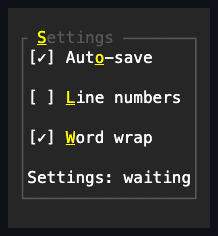

# GroupBox

## Overview

`GroupBox` frames a single owned content control with a titled border, giving
related controls a visual group. It extends
[`HeaderedContentControl`](../headered-content-control.md#overview) and renders
a border frame with an optional header in the top edge — like a
[`Window`](../windows/window.md) without the window-specific drag behavior or
default shadow.

## API

| Member                               | Default                | Purpose                                                   |
| ------------------------------------ | ---------------------- | --------------------------------------------------------- |
| `Header`                             | `null`                 | Owns one replaceable control written into the top border. |
| `HeaderText`                         | Empty                  | Convenience over `Header` for a plain single-line title.  |
| `Content`                            | `null`                 | Owns one child inside the framed content box.             |
| Inherited `Face`, `Border`, `Shadow` | `Container` theme role | Supply the complete body, titled frame, and depth.        |

## Behavior

- `Header` is any owned control drawn into the top border, with one leading and
  one trailing space around it, keeping the top corners intact and clipping only
  within that interior span. `HeaderText` is the plain-text convenience: it
  materializes or mutates an owned `Text` caption and is the common case for a
  simple title.
- A plain `Text` header (the one `HeaderText` materializes) always paints with
  the frame's own theme-owned border style, so the title reads as part of the
  frame even when a local `Face` is assigned to the group. Any other header
  control paints with its own resolved style instead.
- The global `Container` theme profile supplies the terminal-safe frame family
  and appearance. Assign a complete local composite when a particular group
  needs a different body, border, or shadow; local values stay authoritative
  when the theme is replaced.
- `Content` is the single owned child, arranged inside the one-cell border
  inset. To hold several children, use a [`Stack`](stack.md), [`Grid`](grid.md),
  or another layout container as the content.

The frame is drawn with the intrinsic `ControlBase` border properties rather
than a wrapper control. The header's cell width participates in measurement,
including combining and wide graphemes. The frame overlays retained content, so
a child's shadow cannot replace final frame cells. The inherited `Shadow`
property remains available when the group itself needs visual depth. Descendants
receive normal ambient face inheritance, and an explicit `Face` on a child stays
authoritative.

## Example



```csharp
var group = new GroupBox
{
    HeaderText = "Settings",
    Content = new Stack
    {
        Children =
        {
            new CheckBox { Text = "Auto save" },
            new CheckBox { Text = "Line numbers" },
        },
    },
};
```

An ampersand in `HeaderText` declares an
[access key](../../concepts/access-keys.md#focus-and-semantic-actions). The
marker occupies no cells, the marked grapheme renders underlined, and pressing
Alt plus the key focuses the first eligible descendant in hierarchical tab
order.

## Expected behavior

The header renders correctly whether present or empty, content is arranged
inside the border, and a wide header expands the measured width. Zero bounds,
alternative glyph families, and style states stay well-defined, the frame is
preserved over child shadows, and the final cells are exact.

Mounted cross-layer coverage in
[`GroupBoxSurfaceTests`](../../../tests/SharpVision.Tests/Controls/Layout/GroupBoxSurfaceTests.cs)
demonstrates continuous and interrupted frames, wide-header continuation
ownership, tiny clipping, the reveal on resize, content inset exactly once, and
scoped style inheritance. The
[`GroupBoxPane`](../../../examples/Showcase/Panes/GroupBoxPane.cs) demonstrates
empty, titled, Unicode, styled, ASCII, nested-content, and tiny specimens in the
gallery.
