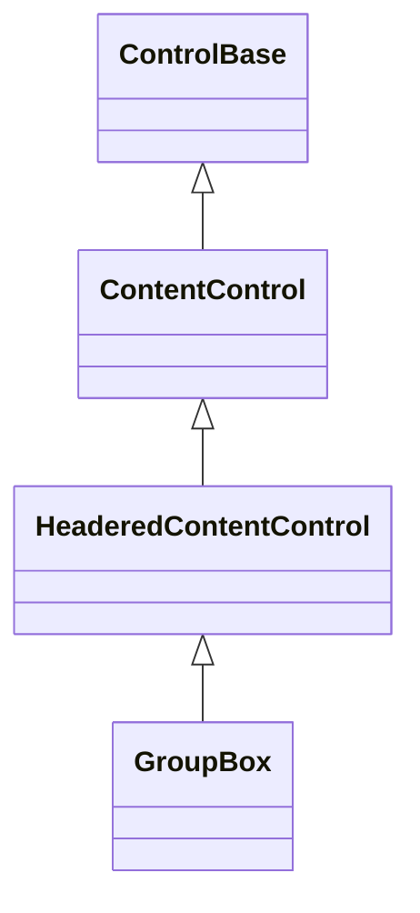

# GroupBox

## Overview

`GroupBox` is declared `public sealed class GroupBox : HeaderedContentControl`.
It frames a single owned content control with a titled border, giving related
controls a visual group — like a [`Window`](../windows/window.md#overview)
without the window-specific drag behavior or default shadow. Unlike the other
`HeaderedContentControl` derivative (`Expander` paints no frame at all),
`GroupBox`'s entire purpose is a caller-authored titled border, so its
constructor calls the inherited `EnableChromeAuthoring()` directly, rather than
`HeaderedContentControl` enabling it for every derivative, which would also leak
raw chrome authoring onto `Expander`.

## Inheritance



## API

| Member                 | Type           | Default                   | Description                                                                   |
| ---------------------- | -------------- | ------------------------- | ----------------------------------------------------------------------------- |
| Inherited `Header`     | `ControlBase?` | `null`                    | Owns one replaceable control written into the top border.                     |
| Inherited `HeaderText` | `string`       | Empty                     | Convenience over `Header` for a plain single-line title.                      |
| Inherited `Content`    | `ControlBase?` | `null`                    | Owns one child inside the framed content box.                                 |
| `Border`               | `Border`       | `ContainerStyle`-resolved | Public complete local border authoring, enabled by `EnableChromeAuthoring()`. |
| `ResetBorder()`        | `void`         | —                         | Returns the local border to Theme ownership.                                  |
| `Shadow`               | `Shadow`       | `ContainerStyle`-resolved | Public complete local shadow authoring, enabled by `EnableChromeAuthoring()`. |
| `ResetShadow()`        | `void`         | —                         | Returns the local shadow to Theme ownership.                                  |

`GroupBox` resolves the `ContainerStyle` theme profile by default — the
terminal-safe framed family other framed controls also start from — supplying
the light all-side border and body appearance. Assign a complete local `Face`,
`Border`, or `Shadow` when a particular group needs a different body, border, or
shadow; local values stay authoritative when the Theme is replaced.

`Header` is any owned control drawn into the top border, with one leading and
one trailing space around it, keeping the top corners intact and clipping only
within that interior span. A `Header` set to `Visibility.Hidden` or
`Visibility.Collapsed` paints no caption and reserves no leading/trailing space,
leaving a continuous border — matching the ordinary `Visibility` gate every
other owned control's own render pass already respects, and the zero header
width `MeasureOverride` already reports once collapsed. `HeaderText` is the
plain-text convenience: it materializes or mutates an owned `Text` caption and
is the common case for a simple title. A plain `Text` header (the one
`HeaderText` materializes) always paints with the frame's own theme-owned border
style, so the title reads as part of the frame even when a local `Face` is
assigned to the group. Any other header control paints with its own resolved
style instead.

`Content` is the single owned child, arranged inside the one-cell border inset.
To hold several children, use a [`Stack`](stack.md#overview),
[`Grid`](grid.md#overview), or another layout container as the content.

## Layout and rendering

The frame is drawn with the intrinsic `ControlBase` border properties rather
than a wrapper control. The header's cell width participates in measurement,
including combining and wide graphemes. The frame overlays retained content, so
a child's shadow cannot replace final frame cells. The inherited `Shadow`
property remains available when the group itself needs visual depth. Descendants
receive normal ambient face inheritance, and an explicit `Face` on a child stays
authoritative.

## Example


```csharp
var group = new GroupBox
{
    HeaderText = "Settings",
    Content = new Stack
    {
        Children =
        {
            new CheckBox { Text = "Auto save" },
            new CheckBox { Text = "Line numbers" },
        },
    },
};
```

An ampersand in `HeaderText` declares an
[access key](../../concepts/access-keys.md#focus-and-semantic-actions). The
marker occupies no cells, the marked grapheme renders underlined, and pressing
Alt plus the key focuses the first eligible descendant in hierarchical tab
order.

## Expected behavior

| Scope               | Observable evidence                                                       |
| ------------------- | ------------------------------------------------------------------------- |
| Public API          | Validation, defaults, state changes, and deterministic output.            |
| Integrated behavior | Cross-component behavior through the real ownership and routing boundary. |

- The header renders correctly whether present or empty, content is arranged
  inside the border, and a wide header expands the measured width.
- Zero bounds, alternative glyph families, and style states stay well-defined,
  the frame is preserved over child shadows, and the final cells are exact.

Mounted cross-layer coverage in
[`GroupBoxSurfaceTests`](../../../tests/SharpVision.Tests/Controls/Layout/GroupBoxSurfaceTests.cs)
demonstrates continuous and interrupted frames, wide-header continuation
ownership, tiny clipping, the reveal on resize, content inset exactly once, and
scoped style inheritance. The
[`GroupBoxPane`](../../../examples/Showcase/Panes/GroupBoxPane.cs) demonstrates
empty, titled, Unicode, styled, ASCII, nested-content, and tiny specimens in the
gallery.
