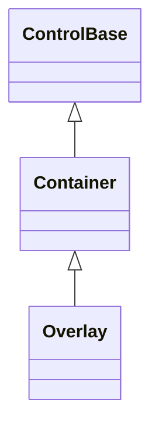
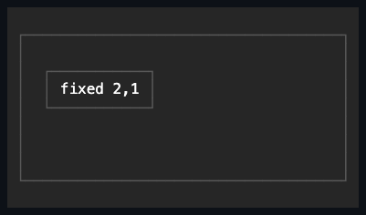

# Overlay

## Overview

`Overlay` is declared `public sealed class Overlay : Container`. It owns
overlapping managed children with optional absolute positioning and a
deterministic z-order: unpositioned children share the complete content box, and
positioned children resolve their attached offsets against that same box. Its
constructor calls the inherited `EnableChromeAuthoring()`, so a caller can
author Overlay's own frame directly instead of only inheriting a Theme profile.

## Inheritance



## API

| Member                    | Type                | Default                              | Description                                                                   |
| ------------------------- | ------------------- | ------------------------------------ | ----------------------------------------------------------------------------- |
| Inherited `Children`      | `ControlCollection` | Empty                                | Owns overlapping controls in stable collection order.                         |
| `ClipToBounds`            | `bool`              | `true`                               | Clips descendant drawing and hit testing to the overlay bounds.               |
| Inherited `Border`        | `Border`            | Theme `control` profile (borderless) | Public complete local frame authoring, enabled by `EnableChromeAuthoring()`.  |
| Inherited `ResetBorder()` | `void`              | —                                    | Returns the local border to Theme ownership.                                  |
| Inherited `Shadow`        | `Shadow`            | Theme `control` profile (none)       | Public complete local shadow authoring, enabled by `EnableChromeAuthoring()`. |
| Inherited `ResetShadow()` | `void`              | —                                    | Returns the local shadow to Theme ownership.                                  |

### Attached properties

| Member                                                           | Type      | Default | Description                                                                                                     |
| ---------------------------------------------------------------- | --------- | ------- | --------------------------------------------------------------------------------------------------------------- |
| `Overlay.Left`, `Overlay.Top`, `Overlay.Right`, `Overlay.Bottom` | `Length?` | `null`  | Optionally positions a child from one or both axis edges; accepts only non-negative cell or percentage lengths. |
| `Overlay.ZIndex`                                                 | `int`     | `0`     | Orders rendering low-to-high and hit testing high-to-low.                                                       |

Position offsets accept non-negative cell or percentage lengths. Undefined,
negative, automatic, and proportional values throw before any attached state
changes. Clearing an offset returns that edge to ordinary shared-box layout. The
attached `ZIndex` accepts any integer; children with equal values keep their
collection order.

## Keyboard

| Key | Behavior                                                |
| --- | ------------------------------------------------------- |
| —   | This control has no control-specific keyboard commands. |

## Layout algorithm

An unpositioned child contributes its margin-inclusive desired size and resolves
its length and alignment independently against the complete content box. A
positioned child resolves fixed and percentage offsets from that same box: one
leading offset chooses the origin, and one trailing offset anchors the trailing
edge. Opposing offsets stretch an automatic or proportional dimension between
them; either offset alone stretches a proportional dimension to the far edge. A
fixed or percentage dimension keeps its explicit extent regardless of offsets,
and opposing offsets still give the leading-edge origin precedence. When both
offsets are set, the child's margin stays inside that stretched extent, so the
child never extends past either offset; a single offset instead clamps a
border-box candidate and may extend margin past the unanchored far edge.

During bounded measure, percentage offsets resolve from the available extent.
During unbounded measure, only finite cell-offset unions contribute to the
desired size; coordinates expressed purely as percentages cannot manufacture an
intrinsic bound. Saturated arithmetic keeps extreme offsets deterministic. A
trailing-anchored child wider or taller than the content box may receive a
negative origin and is then clipped by the normal policy.

[`Window`](../windows/window.md#layout-and-positioning) implements the internal
`IOverlayPositionConstraint` interface (see the
[Window inheritance diagram](../windows/window.md#inheritance)). A Window that
fits and has no authored offsets is centered inside the content box. Every
arrange clamps its complete border box after the authored offsets resolve —
including after a resize — without rewriting those offsets. A Window larger than
the box starts at the leading content edge and clips normally. Dragging the
title bar writes the `Left` and `Top` offsets.

## Hit testing, rendering, and z-order

Hit testing visits the highest visible z-order first and respects clipping and
`IsHitTestVisible` pointer transparency. Rendering visits z-order low to high.
Children with equal values keep their stable collection order, and default focus
traversal always remains collection order regardless of z-order. The same stable
z-order governs elevated popup descendants: higher-z branches render later and
hit-test first, including when a generated scrollbar occupies the same cells.

When `AutoScroll` is armed, ordinary z-ordered content renders and hit-tests
only inside the committed viewport. Generated scrollbar parts render above
ordinary content and receive pointer input before it. Elevated popup branches
remain the highest layer, and among them the same stable `ZIndex` order still
applies.

Modality changes none of this: it does not reorder visuals, reparent children,
or synthesize a scrim. A modal Window still needs ordinary Overlay placement,
and Popup promotion remains authoritative. The
[rendering and layout contract](../../concepts/modality.md#rendering-and-layout)
separates visual layering from interaction-plane membership.

`ClipToBounds` defaults to `true` and clips descendant drawing and hit testing
to the overlay bounds. The clip is a hard visual boundary — even descendant
shadows cannot escape it — and the overlay's own drawing remains clipped as
well. Setting it to `false` keeps the inherited ancestor aperture for ordinary
content and shadow overflow.

Attached values use weak ownership and validate dispatcher affinity before
mutation. Changing a child's z-order invalidates only the owning Overlay's
render phase; changing a position offset invalidates only its measure phase.
Detached and wrong-parent changes persist without invalidating unrelated
controls, and equivalent writes are silent. Ordering uses pooled child storage
that is cleared afterward, so no controls are retained past the synchronous
render or hit-test operation.

## Example



```csharp
var overlay = new Overlay();
overlay.Children.Add(content);
overlay.Children.Add(statusPopup);
Overlay.SetRight(statusPopup, Length.Cells(1));
Overlay.SetTop(statusPopup, Length.Cells(0));
Overlay.SetZIndex(statusPopup, 10);
```

## Expected behavior

| Scope               | Observable evidence                                                       |
| ------------------- | ------------------------------------------------------------------------- |
| Public API          | Validation, defaults, state changes, and deterministic output.            |
| Integrated behavior | Cross-component behavior through the real ownership and routing boundary. |

- Unpositioned children share the content box, and every leading, trailing, and
  opposing-edge combination resolves as described for both cells and
  percentages.
- Invalid offset values are rejected, explicit sizes take precedence over
  opposing stretch, only finite offsets contribute intrinsic unions, and
  saturated or negative coordinates stay deterministic.
- Z-order ties and changes, hit testing, pointer-transparent children, clipping,
  collapsed children, and zero and tiny bounds behave as documented.
- Window drag and resize constraints, managed ownership, focus-order
  independence from z-order, popup z-order, viewport clipping, scrollbar
  precedence, removal damage, and the exact committed cells are all observable
  guarantees.

Mounted cross-layer coverage in
[`OverlaySurfaceTests`](../../../tests/SharpVision.Tests/Controls/Layout/OverlaySurfaceTests.cs)
demonstrates z-order visual and pointer precedence, reordering, removal damage
with lower-layer reveal, and percentage sizing with trailing-alignment resize.
