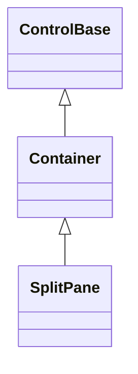
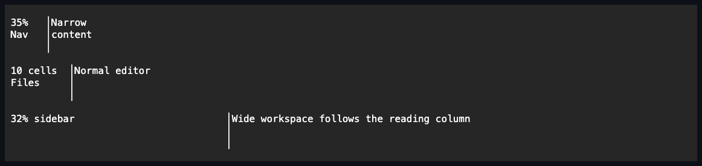

# SplitPane

## Overview

`SplitPane` is declared `public sealed class SplitPane : Container`. It owns up
to two controls in source order and, while both participate, arranges them around
one owner-rendered divider. `Orientation` maps the same leading/trailing model
onto left/right or top/bottom geometry; the caller retains references to the
children while `SplitPane` owns their attachment and lifetime until removal or
disposal.

The authored leading length is either terminal cells or a percentage. Public
setters validate before changing observable state, and attached mutations use
the shared dispatcher-affine control boundary. Unsupported length kinds,
unknown orientations, negative changes, and a third child are rejected without
partially changing the split or child ownership.

## Inheritance



## API

| Member                 | Type                                  | Default       | Description                                                                          |
| ---------------------- | ------------------------------------- | ------------- | ------------------------------------------------------------------------------------ |
| Inherited `Children`   | `ControlCollection`                   | Empty         | Owns at most two panes in leading-to-trailing source order.                          |
| `Orientation`          | `Orientation`                         | `Horizontal`  | Places the first pane left of or above the second pane.                              |
| `FirstPaneLength`      | `Length`                              | `Percent(50)` | Requests the leading pane's border box in cells or percentage, excluding its margin. |
| `IsResizable`          | `bool`                                | `true`        | Enables divider keyboard and primary-pointer resizing.                               |
| `SmallChange`          | `int`                                 | `1`           | Non-negative arrow-key change in terminal cells.                                     |
| `LargeChange`          | `int`                                 | `10`          | Non-negative Page Up and Page Down change in terminal cells.                         |
| Inherited `CanTabStop` | `bool`                                | `false`       | Read-only; true while the visible divider can accept interaction.                    |
| `SplitChanged`         | `EventHandler<SplitChangedEventArgs>` | —             | Raised after a changed authored leading-pane length commits.                         |

`FirstPaneLength` accepts only `Length.Cells` and `Length.Percent`; `Length.Auto`
and `Length.Star` throw `ArgumentException`. `Orientation` rejects undefined
enum values, and `SmallChange` and `LargeChange` reject negative values with
`ArgumentOutOfRangeException`. The inherited child collection accepts zero, one,
or two controls; adding a third throws `InvalidOperationException` before the
candidate receives a parent.

`SplitChangedEventArgs` exposes immutable `PreviousLength` and `Length` values,
both validated as fixed-cell or percentage lengths. An equivalent assignment is
silent. A changed assignment commits `FirstPaneLength`, publishes its inherited
property notification, and then raises `SplitChanged` while that transition is
still current. If a property observer commits a newer length, the newer
transition owns the final state and the superseded typed event is not raised.

## Keyboard

| Key                 | Behavior                                                              |
| ------------------- | --------------------------------------------------------------------- |
| Tab                 | Focuses the available divider before continuing to pane descendants.  |
| Left / Right        | Decreases or increases a horizontal split by `SmallChange`.           |
| Up / Down           | Decreases or increases a vertical split by `SmallChange`.             |
| Page Up / Page Down | Decreases or increases the split by `LargeChange`.                    |
| Home / End          | Moves the divider to the minimum or maximum feasible pane allocation. |

Only an unmodified key-down [routed directly to the focused
control](../../concepts/input-routing.md#route-construction) runs a split command.
A pane descendant keeps its own directional input, and the shared
[keyboard modifier policy](../../concepts/input-routing.md#keyboard-modifier-policy)
leaves other keys, modified chords, key releases, and wheel records available
to normal routing. Recognized commands are handled even when clamping or a zero
change leaves the effective divider cell unchanged; that no-op publishes no
property or typed event.

## Layout

Under the shared [layout-pass and collapsed-child
rules](../../concepts/layout.md#passes-and-rounding), `Visibility.Hidden` panes
keep their layout track while `Visibility.Collapsed` panes do not participate.
Zero participating panes have zero intrinsic size. One participating pane
receives the complete content box without a divider. Two participating panes
reserve a one-cell divider on the split axis whenever that axis and the cross
axis are non-empty.

For a finite split axis, the divider is removed first. Following the shared
[length resolution](../../concepts/layout.md#lengths), a percentage
`FirstPaneLength` and percentage pane limits resolve against that
divider-excluded content-axis pool before pane margins are subtracted. Margins
then consume the pool in source order, saturating at the available cells, and
the two pane border boxes share the remainder. A fixed `FirstPaneLength` keeps
its cell request across resize; a percentage request follows the pool. The
shared [track-allocation precedence](../../concepts/layout.md#track-allocation)
applies to each pane's resolved minimum and maximum: the trailing minimum caps
the leading maximum, and the trailing maximum raises the leading minimum. When
both panes cannot satisfy one common interval, layout chooses one deterministic
contained allocation and divider interaction collapses to that single position.

When [`AutoScroll` arms the split axis](../../concepts/scrolling.md#overview),
that axis is measured as an extent rather than a competing finite track:
percentage requests still use the visible viewport minus its divider, and the
trailing pane keeps its intrinsic extent for scrolling. The shared
[automatic scrollbar feedback](../../concepts/scrolling.md#automatic-scrollbar-algorithm)
narrows that percentage viewport for a perpendicular bar before allocation,
while scrolling only the cross axis leaves the finite split-axis allocation
unchanged. The logical divider remains in content coordinates and is painted
and hit-tested only where it intersects the committed viewport.

At one cell on the split axis, the divider consumes that cell and both pane
border boxes collapse to zero. At zero cells, or with an empty cross axis, no
visible divider is produced. All margins, pane bounds, divider cells, scroll
rails, and clipped output remain inside their owning geometry.

## Divider interaction

The divider is sequentially focusable only while `IsResizable` is true, both
owned panes are `Visibility.Visible`, the control is effectively enabled and
visible, and the divider has a visible cell. Otherwise the shared
[Tab traversal](../../concepts/input-routing.md#general-keyboard-behavior) skips
the divider and continues to eligible pane descendants. Losing Tab eligibility
does not evict focus that was assigned programmatically. Setting `IsResizable`
to `false` disables only divider interaction; ordinary pane input and focus
remain intact.

Under the shared [pointer coordinate and capture
contract](../../concepts/input-routing.md#pointer-capture-and-coordinates),
divider hover is true only for the physical pointer cell directly over the
visible divider, never for a pane descendant or uncovered owner background. A
primary press on that cell focuses the `SplitPane`, captures the pointer, and
starts from the committed divider position without a press-time jump. Captured
movement remains relative to that starting position, continues outside the
divider cell, and clamps to the latest range allowed by both panes. Cell-authored
splits remain cells and percentage-authored splits remain percentages of the
divider-excluded viewport pool.

Primary release, terminal leave, focus loss, capture loss, disposal, removal,
reparenting, owner unavailability, an orientation or resizability change, or a
pane becoming hidden, collapsed, or absent cancels the gesture and releases
pressed and capture state without inventing another split commit. An auxiliary
button release does not end a primary drag, and wheel input remains available
to routed ancestors. A primary press in pane content follows that descendant's
normal [preview-and-bubble route](../../concepts/input-routing.md#route-construction);
a press on empty non-focusable pane content may use the shared
nearest-focusable-ancestor fallback, but it does not capture or resize the
divider.

## Example



```csharp
var workspace = new SplitPane
{
    FirstPaneLength = Length.Cells(18),
    SmallChange = 2,
    LargeChange = 8,
    Children =
    {
        new Text("Files"),
        new Text("Editor"),
    },
};

workspace.SplitChanged += (_, change) =>
    Console.WriteLine($"{change.PreviousLength} -> {change.Length}");
```

## Expected behavior

| Scope               | Observable evidence                                                       |
| ------------------- | ------------------------------------------------------------------------- |
| Public API          | Validation, defaults, state changes, and deterministic output.            |
| Integrated behavior | Cross-component behavior through the real ownership and routing boundary. |

- Child capacity, authored length kinds, orientation, and key increments are
  validated before state or ownership changes.
- Fixed and percentage splits, margins, both panes' limits, hidden and collapsed
  panes, viewport scrolling, and zero or tiny bounds produce deterministic,
  contained pane and divider geometry.
- Keyboard commands and captured primary-pointer dragging clamp to the same
  current feasible range, preserve the authored length kind, and publish only
  committed changes.
- Divider hover, focus, press, capture, cancellation, and unavailable-state
  cleanup remain local to the divider while ordinary pane input retains its
  routed behavior.
- The live Showcase keeps its narrow, normal, and reading-column-wide specimens
  contained and demonstrates fixed and percentage sidebars, a vertical
  editor/output split, interaction status, locking, disabling, and collapse.
