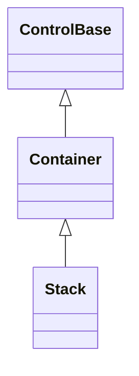

# Stack

## Overview

`Stack` is declared `public sealed class Stack : Container`. It arranges managed
children one after another on a vertical or horizontal axis; child order is also
the render order, the navigation order, and the default z-order. Its constructor
calls the inherited `EnableChromeAuthoring()`, so a caller can author Stack's
own frame directly instead of only inheriting a Theme profile.

## Inheritance



## API

| Member                    | Type                | Default                              | Description                                                                                                                   |
| ------------------------- | ------------------- | ------------------------------------ | ----------------------------------------------------------------------------------------------------------------------------- |
| Inherited `Children`      | `ControlCollection` | Empty                                | Owns controls in stable stack order.                                                                                          |
| `Orientation`             | `Orientation`       | `Vertical`                           | Chooses the primary layout axis.                                                                                              |
| `Spacing`                 | `int`               | `0`                                  | Non-negative cells inserted between non-collapsed children.                                                                   |
| `Reverse`                 | `bool`              | `false`                              | Reverses geometry, rendering, selectable-text reading order, popup priority, and default focus traversal without reparenting. |
| Inherited `Border`        | `Border`            | Theme `control` profile (borderless) | Public complete local frame authoring, enabled by `EnableChromeAuthoring()`.                                                  |
| Inherited `ResetBorder()` | `void`              | —                                    | Returns the local border to Theme ownership.                                                                                  |
| Inherited `Shadow`        | `Shadow`            | Theme `control` profile (none)       | Public complete local shadow authoring, enabled by `EnableChromeAuthoring()`.                                                 |
| Inherited `ResetShadow()` | `void`              | —                                    | Returns the local shadow to Theme ownership.                                                                                  |

`Children` rejects nulls, duplicates, cycles, and controls that already have a
parent. `Orientation` defaults to vertical and accepts vertical or horizontal.
`Spacing` defaults to zero and is a non-negative cell count inserted between
non-collapsed children; hidden children still participate, but collapsed
children consume neither a track nor adjacent spacing. `Reverse` defaults to
`false`; setting it reverses geometry, rendering, and default focus navigation
consistently, without reparenting any child. Elevated popup descendants follow
that same order, so reversing the stack also reverses popup drawing and hit
priority. Selectable-text aggregation follows the same visual reading order, so
semantic offsets, pointer geometry, and copied text remain aligned.

## Behavior

Along the stack axis, automatic children receive their intrinsic space and
proportional children divide whatever arranged space remains. Percentages
resolve once against the final inner stack size. Fixed, percentage, automatic,
and proportional border-box extents are then allocated after external margins
and saturated spacing have reserved their cells. When the minimums cannot fit,
containment wins and later tracks may shrink to zero; overflow follows the
ancestor's clipping or scrolling policy.

When `AutoScroll` arms the stacking axis, that axis has no real ceiling to
allocate within — the extent is however much the content needs, and scrolling
covers the rest — so nothing competes for space along it: every child gets its
own full, non-competing size instead of shrinking under an artificial deficit. A
`Percent` child still resolves against the visible viewport rather than the
extent it itself contributes to, matching the
[automatic scrollbar algorithm](../../concepts/scrolling.md#automatic-scrollbar-algorithm).
A `Star` child along that same armed axis has no fixed remaining space to
divide, so it falls back to its own intrinsic request instead of the ordinary
proportional division described above; the cross axis and an unarmed stacking
axis are unaffected.

The cross axis uses the ordinary child length and alignment contract. Layout
uses pooled temporary track storage and clears any retained child references
before returning it.

## Example


```csharp
var actions = new Stack { Orientation = Orientation.Horizontal, Spacing = 1 };
actions.Children.Add(primaryAction);
actions.Children.Add(cancelAction);
```

## Expected behavior

| Scope               | Observable evidence                                                       |
| ------------------- | ------------------------------------------------------------------------- |
| Public API          | Validation, defaults, state changes, and deterministic output.            |
| Integrated behavior | Cross-component behavior through the real ownership and routing boundary. |

- Layout is deterministic for both orientations and for any mix of fixed,
  percentage, automatic, and proportional children, with spacing and `Reverse`
  applied consistently.
- Collapsed children are skipped, alignment follows the cross-axis contract, and
  zero or tiny sizes never break containment.
- Overflow, resize, managed ownership, navigation order, reversed popup drawing
  and hit priority, Unicode measurement, and the exact committed bounds and
  cells are all observable guarantees.

Mounted cross-layer coverage in
[`StackSurfaceTests`](../../../tests/SharpVision.Tests/Controls/Layout/StackSurfaceTests.cs)
demonstrates exact mixed-track cells with resize reflow, reversed and collapsed
visual order with a real pointer target, and intrinsic wheel scrolling with
Unicode continuation ownership and offset repair.
