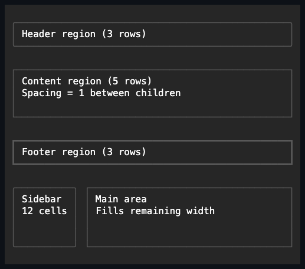

# Stack

## Overview

`Stack` arranges managed children one after another on a vertical or
horizontal axis. Child order is also the render order, the navigation order,
and the default z-order.

## API

| Member        | Default    | Purpose                                                                                        |
| ------------- | ---------- | ---------------------------------------------------------------------------------------------- |
| `Children`    | Empty      | Owns controls in stable stack order.                                                           |
| `Orientation` | `Vertical` | Chooses the primary layout axis.                                                               |
| `Spacing`     | `0` cells  | Inserts a non-negative gap between non-collapsed children.                                     |
| `Reverse`     | `false`    | Reverses geometry, rendering, popup priority, and default focus traversal without reparenting. |

## Behavior

- `Children` rejects nulls, duplicates, cycles, and controls that already have
  a parent.
- `Orientation` defaults to vertical and accepts vertical or horizontal.
- `Spacing` defaults to zero and is a non-negative cell count inserted between
  non-collapsed children. Hidden children still participate; collapsed
  children consume neither a track nor adjacent spacing.
- `Reverse` defaults to `false`. Setting it reverses geometry, rendering, and
  default focus navigation consistently, without reparenting any child.
  Elevated popup descendants follow that same order, so reversing the stack
  also reverses popup drawing and hit priority.

Along the stack axis, automatic children receive their intrinsic space and
proportional children divide whatever arranged space remains. Percentages
resolve once against the final inner stack size. Fixed, percentage, automatic,
and proportional border-box extents are then allocated after external margins
and saturated spacing have reserved their cells. When the minimums cannot fit,
containment wins and later tracks may shrink to zero; overflow follows the
ancestor's clipping or scrolling policy.

The cross axis uses the ordinary child length and alignment contract. Layout
uses pooled temporary track storage and clears any retained child references
before returning it.

## Example



```csharp
var actions = new Stack { Orientation = Orientation.Horizontal, Spacing = 1 };
actions.Children.Add(primaryAction);
actions.Children.Add(cancelAction);
```

## Expected behavior

Layout is deterministic for both orientations and for any mix of fixed,
percentage, automatic, and proportional children, with spacing and `Reverse`
applied consistently. Collapsed children are skipped, alignment follows the
cross-axis contract, and zero or tiny sizes never break containment.
Overflow, resize, managed ownership, navigation order, reversed popup drawing
and hit priority, Unicode measurement, and the exact committed bounds and
cells are all observable guarantees.

Mounted cross-layer coverage in
[`StackSurfaceTests`](../../../tests/SharpVision.Tests/Controls/Layout/StackSurfaceTests.cs)
demonstrates exact mixed-track cells with resize reflow, reversed and
collapsed visual order with a real pointer target, and intrinsic wheel
scrolling with Unicode continuation ownership and offset repair.
