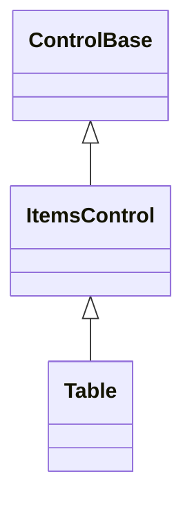
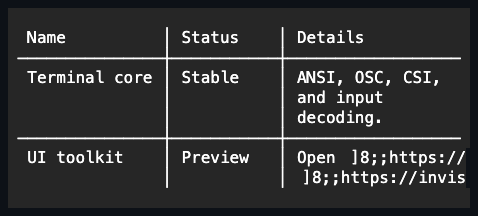

# Table

## Overview

`Table` is declared `public sealed class Table : ItemsControl` and implements
`IStyled<TableStyle>`. It owns typed rows of ordinary controls and aligns them
against titled columns whose widths can be fixed, automatic, percentage, or
proportional. Cells measure, arrange, and render through the normal control
pipeline, so marked text, links, buttons, and input controls can all appear in a
table without a separate rendering model. `Rows` and `Columns` are the only
semantic mutation surfaces: a private scrolling table presenter owns the
realized cell controls, so `Table` intentionally exposes no general `Children`
collection.

The private presenter registers its transparent Normal appearance overlay once
at construction. The base appearance pipeline composes it identically for live
rendering and prospective Theme comparison, preserving the table's owner-painted
surface without duplicated overrides.

`SetDataSource` switches a table into an alternative progressive mode that
requests index-addressed rows on demand instead of owning them upfront — see
[Progressive loading](#progressive-loading) below.

## Inheritance



## API

| Member                                                                                         | Type                                           | Default      | Description                                                                                                                       |
| ---------------------------------------------------------------------------------------------- | ---------------------------------------------- | ------------ | --------------------------------------------------------------------------------------------------------------------------------- |
| `Columns`                                                                                      | `TableColumnCollection`                        | Empty        | Owns the mutable titled column definitions.                                                                                       |
| `Rows`                                                                                         | `TableRowCollection`                           | Empty        | Owns the mutable owned data rows; always empty while progressive.                                                                 |
| `IsProgressive`                                                                                | `bool`                                         | `false`      | Read-only; whether `SetDataSource` bound this table to a progressive data source.                                                 |
| `LoadState`                                                                                    | `TableLoadState`                               | `Idle`       | Read-only; the table-wide aggregate progressive loading state.                                                                    |
| `SelectionMode`                                                                                | `TableSelectionMode`                           | `Row`        | Selects the row or cell selection granularity for pointer and keyboard input.                                                     |
| `SelectedRows`                                                                                 | `IReadOnlyList<TableRow>`                      | Empty        | Read-only; immutable snapshot of the selected rows in current display order.                                                      |
| `SelectedCells`                                                                                | `IReadOnlyList<TableCellReference>`            | Empty        | Read-only; immutable snapshot of selected cells in current display row/column order.                                              |
| `SelectedKeys`                                                                                 | `IReadOnlyList<object>`                        | Empty        | Read-only; immutable snapshot of selected progressive keys; empty while not progressive.                                          |
| `ActiveRow`                                                                                    | `TableRow?`                                    | `null`       | Read-only; the active row used by keyboard navigation.                                                                            |
| `ActiveColumnIndex`                                                                            | `int`                                          | `-1`         | Read-only; the active zero-based cell column, or `-1` when no cell is active.                                                     |
| `ActiveCell`                                                                                   | `TableCellReference?`                          | `null`       | Read-only; derived from `ActiveRow`/`ActiveColumnIndex`.                                                                          |
| `ActiveIndex`                                                                                  | `int`                                          | `-1`         | Read-only; the active progressive navigation index; `-1` while not progressive.                                                   |
| `ActiveKey`                                                                                    | `object?`                                      | `null`       | Read-only; the active progressive navigation key; `null` while not progressive.                                                   |
| `IsEditing`                                                                                    | `bool`                                         | `false`      | Read-only; whether one TextInput cell edit transaction is active; always `false` while progressive.                               |
| `SortColumnIndex`                                                                              | `int`                                          | `-1`         | Read-only; the current sorted column, or `-1` when sorting is reset.                                                              |
| `SortDirection`                                                                                | `TableSortDirection`                           | `None`       | Read-only; the current sort direction.                                                                                            |
| `ShowHeader`                                                                                   | `bool`                                         | `true`       | Includes the titled header row.                                                                                                   |
| `Style`                                                                                        | `TableStyle?`                                  | `null`       | Optional complete developer-authored presentation.                                                                                |
| `ActualStyle`                                                                                  | `TableStyle`                                   | Resolved     | Read-only; the complete local, theme-owned, or code-owned presentation.                                                           |
| `RowSpacing`                                                                                   | `int`                                          | `0`          | Non-negative cells between adjacent data rows.                                                                                    |
| `ColumnSpacing`                                                                                | `int`                                          | `0`          | Non-negative cells between adjacent columns.                                                                                      |
| `ShowGridLines`                                                                                | `bool`                                         | `true`       | Draws code-owned light grid-line separators in every available table gap.                                                         |
| `Extent`                                                                                       | `Size`                                         | Empty        | Read-only; the committed non-negative scrolling content extent.                                                                   |
| `Viewport`                                                                                     | `Size`                                         | Empty        | Read-only; the committed non-negative scrolling viewport extent.                                                                  |
| `ScrollBars`                                                                                   | `ScrollBars`                                   | `Vertical`   | The scrollable axes of the private cell presenter.                                                                                |
| `ShowScrollBars`                                                                               | `ShowScrollBars`                               | `WhenNeeded` | The common chrome-reservation policy for the private presenter's scrollbars.                                                      |
| `ScrollBarStyle`                                                                               | `ScrollBarStyle?`                              | `null`       | The complete local style shared by both private generated bars.                                                                   |
| `ActualScrollBarStyle`                                                                         | `ScrollBarStyle`                               | Resolved     | Read-only; the resolved private-scrollbar style.                                                                                  |
| `LineSize`                                                                                     | `int`                                          | `1`          | Non-negative keyboard and wheel scrolling increment, in cells.                                                                    |
| `PageOverlap`                                                                                  | `int`                                          | `0`          | Non-negative cells retained between page commands.                                                                                |
| `HorizontalOffset`                                                                             | `int`                                          | `0`          | The valid horizontal content offset.                                                                                              |
| `VerticalOffset`                                                                               | `int`                                          | `0`          | The valid vertical content offset.                                                                                                |
| `ScrollBy(int x, int y, ScrollCause cause = Programmatic)`                                     | `bool`                                         | —            | Adds signed scrolling deltas with endpoint clamping.                                                                              |
| `BringIntoView(ControlBase descendant)`                                                        | `bool`                                         | —            | Scrolls minimally to expose one row-cell descendant.                                                                              |
| `SelectRow(TableRow row, Modifiers modifiers = None)`                                          | `void`                                         | —            | Selects one owned row and makes its first cell active; unavailable while progressive.                                             |
| `SelectCell(TableRow row, int columnIndex, Modifiers modifiers = None)`                        | `void`                                         | —            | Selects one owned cell and makes it active; unavailable while progressive.                                                        |
| `ClearSelection()`                                                                             | `void`                                         | —            | Clears all selected rows/cells or progressive keys, retaining the active location.                                                |
| `SelectAll()`                                                                                  | `void`                                         | —            | Selects every row/cell or progressive key allowed by the current selection mode.                                                  |
| `SortBy(int columnIndex)`                                                                      | `void`                                         | —            | Cycles one column through ascending, descending, and reset ordering.                                                              |
| `SetSort(int columnIndex, TableSortDirection direction)`                                       | `void`                                         | —            | Commits an explicit sort direction, or resets to insertion order; unavailable while progressive.                                  |
| `ResetSort()`                                                                                  | `void`                                         | —            | Resets active sorting to the original insertion order.                                                                            |
| `SetDataSource<T>(ITableDataSource<T> source, TableRowTemplate<T> rowTemplate, int rowHeight)` | `void`                                         | —            | Binds this table to a progressive data source, replacing any prior mode.                                                          |
| `ClearDataSource()`                                                                            | `void`                                         | —            | Detaches any progressive data source and returns to empty eager `Rows`.                                                           |
| `Reload()`                                                                                     | `void`                                         | —            | Discards cached progressive data and reloads the active window; progressive only.                                                 |
| `SelectIndex(int index, Modifiers modifiers = None)`                                           | `void`                                         | —            | Moves the active progressive index and applies a key-based selection gesture.                                                     |
| `SelectKey(object key, Modifiers modifiers = None)`                                            | `void`                                         | —            | Applies a key-based selection gesture directly by stable key; progressive only.                                                   |
| `BeginEdit(TableRow row, int columnIndex)`                                                     | `bool`                                         | —            | Begins editing one existing TextInput cell; always returns `false` while progressive (read-only in v1).                           |
| `CommitEdit()`                                                                                 | `bool`                                         | —            | Commits the current TextInput edit transaction.                                                                                   |
| `CancelEdit()`                                                                                 | `bool`                                         | —            | Restores the original text and cancels the current TextInput edit transaction.                                                    |
| `CopySelection()`                                                                              | `string`                                       | —            | Returns selected rows/cells or loaded progressive rows as tab-separated clipboard text, skipping any selected key not yet loaded. |
| `SelectionChanged`                                                                             | `EventHandler<TableSelectionChangedEventArgs>` | —            | Raised after selected rows/cells or progressive keys actually change.                                                             |
| `RowInvoked`                                                                                   | `EventHandler<TableRowInvokedEventArgs>`       | —            | Raised after a row is activated by pointer or keyboard.                                                                           |
| `SortChanged`                                                                                  | `EventHandler<TableSortChangedEventArgs>`      | —            | Raised after `SortColumnIndex` or `SortDirection` actually changes.                                                               |
| `SortRequested`                                                                                | `EventHandler<TableSortChangedEventArgs>`      | —            | Raised instead of `SortChanged` when a header is clicked while progressive; see [Progressive loading](#progressive-loading).      |
| `LoadStateChanged`                                                                             | `EventHandler<TableLoadStateChangedEventArgs>` | —            | Raised after `LoadState` actually changes; progressive only.                                                                      |
| `LoadFailed`                                                                                   | `EventHandler<TableLoadFailedEventArgs>`       | —            | Raised after one progressive range exhausts its bounded retry attempts.                                                           |
| `ScrollChanged`                                                                                | `EventHandler<ScrollChangedEventArgs>`         | —            | Raised after the private table viewport commits one or both offsets.                                                              |

`TableStyle : ControlStyle` is a complete immutable presentation: it bundles a
`TableGlyphs` grid/sort-indicator family, a `CellPadding` thickness applied to
every header and data cell, nullable `HeaderForeground`, `HeaderBackground`, and
`GridLineColor` overrides, and required `PlaceholderForeground` and
`PlaceholderErrorForeground` colors for the progressive skeleton row (see
[Progressive loading](#progressive-loading)). Every color member accepts either
a concrete `Color` or a `SemanticColor` role, so an override can either pin a
literal color or continue following theme swaps through a named role. `null`
means "inherit the table's own resolved face" for `HeaderForeground` and
`GridLineColor`; for `HeaderBackground` it additionally means the header row
paints no fill of its own unless the table itself paints an opaque fill.
`PlaceholderForeground` and `PlaceholderErrorForeground` are required rather
than nullable — the placeholder skeleton is a synthetic status indicator with no
table face to inherit — and default to the `Muted` and `Error` semantic roles
respectively, matching the fixed appearance the placeholder always had before it
became themeable. A `with` expression creates a validated member-wise copy of
`TableStyle.Default`; assigning `null` to `Style` restores the Theme-owned
presentation, and `ActualStyle` never returns null. A style difference in
`CellPadding` invalidates measure; any other difference is render-only.

## Rows and columns

`Columns` owns non-empty `TableColumn` definitions. Every column has a non-empty
header and an automatic, fixed-cell, percentage, or fill width, created through
the `TableColumn.Auto`, `TableColumn.Fixed`, `TableColumn.Percent`, or
`TableColumn.Fill` factories; each factory also accepts an optional read-only
flag and a stable comparable sort-key selector. `Rows` owns `TableRow` values,
each an immutable ordered snapshot of detached cell controls constructed once
and then transferred to the table. Every row must be non-null and must contain
exactly as many cells as there are columns; inserting or replacing a null row,
or a row with the wrong cell count, fails at the public collection boundary and
leaves every candidate cell detached. Removing a row releases its cells for
another owner. Disposing any cell that is currently attached directly to a table
removes its entire semantic row before disposal commits, repairs active,
selected, and editing state, and releases the row's remaining cells.

## Progressive loading

`SetDataSource<T>(source, rowTemplate, rowHeight)` binds a table to an
`ITableDataSource<T>` that supplies rows on demand, by contiguous index range,
instead of the table owning every row upfront. A progressive table requests only
the visible window plus a small prefetch margin, caches what it already loaded,
and evicts entries once they scroll far enough away — the same `Table` a caller
already knows stays fully interactive over a source with millions of logical
rows. Implement the interface and its two supporting types like this:

```csharp
public interface ITableDataSource<T>
{
    int? Count { get; }

    object GetKey(T item);

    ValueTask<TableDataResult<T>> LoadAsync(TableDataRequest request, CancellationToken cancellationToken);

    event EventHandler? Changed;
}

public readonly record struct TableDataRequest
{
    public int StartIndex { get; }
    public int Count { get; }
}

public sealed class TableDataResult<T>
{
    public required IReadOnlyList<T> Items { get; init; }
    public bool IsEndOfData { get; init; }
}
```

`LoadAsync` always answers with `Items` starting at exactly
`TableDataRequest.StartIndex`, with no gap, and sets `IsEndOfData` once nothing
follows the returned range. `GetKey` must return a stable identity independent
of an item's current index, since a cached range can be evicted and reloaded at
a different offset later. A source raises `Changed` whenever data it already
answered for may be stale — for example after a write elsewhere invalidates
cached rows — and the table responds by reloading its currently visible window:

```csharp
public sealed class WorkerLogSource(int total) : ITableDataSource<int>
{
    public event EventHandler? Changed;

    public int? Count => total;

    public object GetKey(int item) => item;

    public ValueTask<TableDataResult<int>> LoadAsync(
        TableDataRequest request, CancellationToken cancellationToken)
    {
        var count = Math.Min(request.Count, total - request.StartIndex);
        var items = Enumerable.Range(request.StartIndex, count).ToArray();

        return ValueTask.FromResult(new TableDataResult<int>
        {
            Items = items,
            IsEndOfData = request.StartIndex + count >= total
        });
    }

    // Call when the backing store changes underneath the table.
    public void NotifyChanged() => Changed?.Invoke(this, EventArgs.Empty);
}

// table.SetDataSource(
//     new WorkerLogSource(50_000),
//     row => new TableRow([new Text(row.ToString())]),
//     rowHeight: 1);
```

Progressive and eager mode are mutually exclusive and mutually gated:
`SetDataSource` requires `Rows` to be empty and `SelectionMode` to be `None`,
`Row`, or `MultipleRows` (never a cell mode), and rejects any column whose
`Width` is `LengthKind.Auto`, since a progressive column must resolve without
ever probing a row. `SetDataSource` also requires the table to already be
attached to a running dispatcher. Once progressive, every `Rows`-mutating member
(`Rows.Add`/`Insert`/`Remove`/`Clear`, `SelectRow`, `SelectCell`, `SetSort`)
throws `InvalidOperationException`, and `BeginEdit` simply reports `false` —
progressive tables are read-only in this release. `ClearDataSource()` tears the
binding down and returns to an empty eager table. A rejected `SetDataSource`
call always leaves the prior mode — eager or an earlier progressive source —
completely untouched.

Off-dispatcher `Changed` notifications are marshalled to the table's exact
dispatcher attachment generation. Detaching or migrating the table before a
queued notification runs discards that obsolete callback; it cannot reload a
controller through the previous dispatcher. Fetch success, cancellation, and
failure completions use the same attachment token and pending-range membership,
so a failed request removed during migration cannot be resurrected or retried by
the former dispatcher.

A progressive table addresses rows by zero-based logical `int` index and by a
caller-supplied stable key (`ITableDataSource<T>.GetKey`), independent of
whatever range happens to be cached. `ActiveIndex`, `ActiveKey`, and
`SelectedKeys` track that state; a selected key survives its backing range being
evicted from cache and being scrolled back into view later, and every member
reports the same neutral default (`-1`, `null`, empty) that
`Rows`/`SelectedRows` already use while the table is not progressive, rather
than throwing on a mode mismatch. `SelectIndex` and `SelectKey` move the active
location and apply a selection gesture synchronously, by arithmetic alone, never
blocking on a fetch — including `Home`, `End`, `PageUp`, and `PageDown`, which
move the active index immediately even against a wholly unloaded target and let
its fetch resolve asynchronously afterward. `SelectAll` branches by
`SelectionMode` exactly like the eager path: nothing under `None`, the
active-or-first loaded key under `Row`, and every currently loaded key under
`MultipleRows` — it never reaches past what is already cached.

The resolved progressive row stride is the saturating sum of `rowHeight` and
`RowSpacing`. Windowing, arrangement, hit testing, paging, prefetch margins, and
bottom-edge offsets all use that same positive stride with saturating index and
coordinate arithmetic, so valid extreme `int` values cannot wrap into a negative
row or an unrelated range.

The logical row count is elastic when `ITableDataSource<T>.Count` is `null`: the
table exposes one phantom row past the highest confirmed index until the source
reports `IsEndOfData`, at which point the extent collapses to the exact
confirmed count. An unloaded or permanently failed row renders as a themed
skeleton cell — `TableGlyphs.Placeholder` while pending,
`TableGlyphs.PlaceholderError` once its range exhausts three bounded retry
attempts — and is never focusable, never enters `SelectedKeys` on its own, and
is skipped by `CopySelection` until it actually loads. `LoadFailed` fires
exactly once per exhausted range, and `LoadState` (`Idle`, `Loading`, or
`Failed`) aggregates every in-flight and failed range table-wide, raising
`LoadStateChanged` on each committed transition. Failure observers run after the
failed range commits; even when an observer throws, the table first reconciles
the visible window and admits any work released by that range. A failed range
recovers automatically once it scrolls far enough away and back (cache eviction
clears its error), or explicitly through `Reload()`, which discards every cached
row and re-fetches the current window from scratch. Requests coalesce: an
already-cached or already-pending index is never re-requested, and at most four
ranges fetch concurrently.

Sorting a progressive table is entirely source-side: clicking a sortable header
still cycles and commits `SortColumnIndex`/`SortDirection` the same way `SortBy`
does and repaints the same direction indicator, but raises `SortRequested`
instead of reordering any row itself, then calls `Reload()`. An application
subscribes to `SortRequested`, reconfigures its `ITableDataSource<T>` query to
honor the reported column and direction, and lets the triggered `Reload()`
re-fetch under the new order. The callback may also clear or replace the data
source, dispose the table, or synchronously request a newer sort. Reload occurs
only when the same controller and sort generation still own the transaction, so
obsolete outer work never touches replacement state or duplicates the newer
request.

A table that merely leaves the tree keeps its progressive source, cache, and
selection — only genuinely in-flight fetches are canceled, matching the
framework's convention that no background work outlives the control that
requested it — and resumes exactly where it left off once reattached. Disposing
the table tears the progressive controller down fully.

## Interaction and editing

An interactive table is focusable and eligible as a tab stop. A pointer press
selects the hit row or cell and makes the clicked cell active. `Up`, `Down`,
`Left`, `Right`, `Home`, and `End` move the active cell, and `PageUp` and
`PageDown` move by as many rows as fill the committed viewport height minus
`PageOverlap`. The paging keys are handled even when the active cell cannot move
any further, so the keystroke never escapes to page an enclosing scrollable
container. Every move — including `Home` and `End` — brings the active cell into
view.

The initial `Enter` press activates the active row, and begins editing when the
active cell is an editable `TextInput`; held-key repeats neither invoke nor
reopen editing. While editing, the initial `Enter` press commits, `Escape`
restores the original text, and `Tab` commits and then moves to the next cell. A
`TableColumn` marked `isReadOnly` and a read-only `TextInput` both refuse
editing. Edit completion publishes `IsEditing` after clearing the transaction;
if that callback removes, clears, replaces, or disposes the edited cell, the
completed outer operation does not reactivate the obsolete row. `Ctrl+A` selects
every row or cell when the active selection mode supports it and the stroke
matches the exact lock-normalized Control command. An ancestor that handles
preview key or pointer input suppresses all Table defaults; deliberate
handled-events observers still receive the record. These rules follow the shared
[keyboard modifier policy](../../concepts/input-routing.md#keyboard-modifier-policy)
and routed handled-state contract.

`SelectRow`, `SelectCell`, `ClearSelection`, and `SelectAll` commit selection
state and raise `SelectionChanged`. `SelectedRows` and `SelectedCells` property
notifications are transaction boundaries: a callback that commits a newer
selection suppresses the superseded transaction's remaining notification and
typed event. After a pointer selection callback returns, editing and
`RowInvoked` continue only when the Table remains attached and effectively
available and the exact hit row and cell remain owned and available; disable,
detach, removal, replacement, clearing, or disposal ends that input transaction,
while moving the same row preserves its current identity and index. `RowInvoked`
reports pointer and keyboard activation. `SortBy` cycles a column through
ascending, descending, and reset; `SetSort` selects an explicit state and raises
`SortChanged` when the column or direction actually changes — a call that
re-applies the currently active column and direction raises nothing, matching
`SortColumnIndex`'s and `SortDirection`'s own change-gated property
notifications. Those property notifications are transaction boundaries: a
callback that commits a newer sort suppresses the superseded transaction's
remaining notifications and typed event. Inserting or replacing a row while
sorted re-splices it into the active order without raising `SortChanged`, since
the sort settings themselves are unchanged; the row collection's own mutation is
the signal for that. A supplied `SortKey` is compared with culture-independent
ordering, and rows with equal keys keep their original insertion order in both
directions.

`CopySelection()` returns the selected rows or cells as deterministic
tab-separated text with LF row separators. A host can pass that text to the
existing application clipboard service; the control does not emit clipboard
protocol bytes itself.

## Grid lines and the sort indicator

`ShowGridLines` and `GridLineColor` draw light Unicode lines in the available
gaps without covering child controls. `TableStyle.Glyphs` is a `TableGlyphs`
value with `Horizontal`, `Vertical`, and `Cross` grid-line runes,
`SortAscending` and `SortDescending` sort-indicator runes, and `Placeholder` and
`PlaceholderError` runes drawn across an unloaded or permanently failed
progressive row (see [Progressive loading](#progressive-loading)). Each member
is a validated one-cell rune with a terminal-safe code-owned default. Table
declares no `styles.*` theme key of its own, so a locally assigned `Style` is
the only way to move them - every table draws the code-owned defaults otherwise.

The placeholder row's own foreground follows the same local-style-only path:
`TableStyle.PlaceholderForeground` and `PlaceholderErrorForeground` are
required, non-nullable `ControlColor` members — a synthetic status indicator has
no table face to fall back to — defaulting to the `Muted` and `Error` semantic
roles respectively.

The sorted column's header reserves one trailing cell inside its own padded
content area for the direction indicator — `SortAscending` for
`TableSortDirection.Ascending`, `SortDescending` for
`TableSortDirection.Descending` — and clips its caption one cell short so the
caption and the indicator never collide. Every column reserves that trailing
cell uniformly, not only the currently sorted one, so moving the sort to a
different column never changes any column's measured header width.
`TableSortDirection.None` draws no indicator, and the reserved cell goes back to
ordinary caption text.

## Layout and ownership

Columns resolve with the shared
[track allocator](../../concepts/layout.md#overview): fixed widths reserve exact
cells, percentage widths resolve from the final table width, automatic widths
take the largest cell or header request, and fill columns receive the remaining
cells. Headers and rows remeasure wrapping controls once their finite column
widths are known.

Each resolved cell rectangle is an ordinary arrange slot, not a forced border
box, so a cell's `HorizontalAlignment`, `VerticalAlignment`, explicit lengths,
margin, and desired size keep their normal meaning. An intrinsically sized
Button or CheckBox stays at its measured size and aligned position inside a
larger track, while a cell explicitly set to Stretch consumes the available
slot.

Arrangement reuses the column and row measurement committed for the current
width basis. An arrangement caused purely by a scroll origin, focus, or
pointer-state change does not repeat the unbounded and constrained cell probes;
repeating them would let child measurement re-invalidate the presenter during
its own arrange pass and create an unbounded frame loop. A genuinely different
final width, such as a resize, earns exactly one final constrained measurement
pass.

`Table` uses the intrinsic
[`Container` scrolling contract](../../concepts/scrolling.md#overview). The
translated content rectangle is the single origin for headers, grid lines,
cells, and hit testing. Table chrome renders through the same viewport-clipped
content canvas before the owned scrollbars render above it, so horizontal,
vertical, and combined offsets can never separate a header or divider from its
row controls. Grid lines and progressive placeholder fills iterate only that
canvas intersection, so a tiny viewport never performs work proportional to an
off-screen table extent. IsRunning origins are signed, because scrolling can
move content above or left of zero; only extents and gaps keep the non-negative
accumulation invariant.

A header-only table measures and renders just its padded header. It reserves no
phantom data-row spacing or grid divider until the first row is present.

## Example



```csharp
var table = new Table { ShowGridLines = true };
table.Columns.Add(TableColumn.Fixed("Name", 14));
table.Columns.Add(TableColumn.Percent("Status", 25));
table.Columns.Add(TableColumn.Fill("Details"));
table.Rows.Add(new TableRow([
    new Text("Renderer"),
    new Text("Stable"),
    new Text("<link=https://example.test>Open documentation</link>"),
]));
```

## Expected behavior

| Scope               | Observable evidence                                                       |
| ------------------- | ------------------------------------------------------------------------- |
| Public API          | Validation, defaults, state changes, and deterministic output.            |
| Integrated behavior | Cross-component behavior through the real ownership and routing boundary. |

- Column and row ownership is validated atomically, and a rejected mutation
  leaves every candidate cell detached.
- Fixed, percentage, fill, and automatic widths resolve as described, intrinsic
  and stretched cells align normally inside their slots, and the header, grid
  lines, and padded cells render exactly.
- Rich or wide cell content, tiny bounds, and headerless tables stay
  well-defined; scrolling on both axes keeps chrome and hit testing aligned;
  resize reflows deterministically; removal releases cells for reuse; and
  continuation ownership holds in the final cells.
- Interaction, editing, selection, sorting, and copy behave exactly as described
  above.
- A progressive table requests only its visible window plus prefetch margin
  regardless of logical row count, coalesces overlapping requests, bounds
  concurrent fetches, retries a failing range a bounded number of times before
  rendering the themed error placeholder, and keeps key-based selection correct
  across cache eviction and return.

Mounted cross-layer coverage in
[`TableSurfaceTests`](../../../tests/SharpVision.Tests/Controls/Layout/TableSurfaceTests.cs)
demonstrates all four column kinds with exact header, grid, and Unicode cells;
clickable row removal with ownership reuse and no stale cells; both-axis wheel
scrolling; and resize-driven offset repair. A direct layout regression
additionally shows that a pure scroll-origin arrangement neither remeasures
cells nor leaves arrange invalidation pending. The same mounted suite covers
focusability, pointer and keyboard navigation, activation, edit commit and
cancel, and the read-only policy, while unit coverage proves selection and copy,
stable sort ordering, and reset transitions.

Progressive loading is covered separately:
[`TableDataControllerTests`](../../../tests/SharpVision.Tests/Controls/Layout/TableDataControllerTests.cs)
proves `SetDataSource` preconditions, fetch coalescing and the concurrency cap,
generation and cancellation discipline, the elastic unknown-count extent,
malformed-result handling, bounded cache eviction, and every progressive
selection mutation;
[`TableDataControllerSurfaceTests`](../../../tests/SharpVision.Tests/Controls/Layout/TableDataControllerSurfaceTests.cs)
proves mounted placeholder and loaded rendering, visible selected/current state,
failure-to-recovery, unloaded-row keyboard navigation, the header-click
`SortRequested` flow, detach/reattach resumption, and byte-for-byte equivalence
against an eager table populated with the same rows; and
[`TableDataControllerPerformanceTests`](../../../tests/SharpVision.Tests/Controls/Layout/TableDataControllerPerformanceTests.cs)
proves realized controls and fetch traffic stay bounded by the viewport against
a 150,000-row source.
