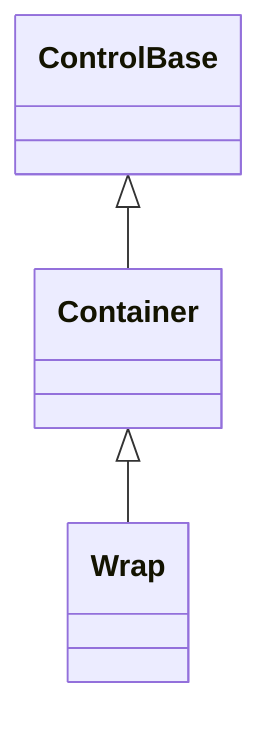
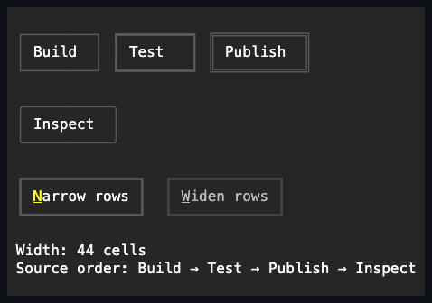

# Wrap

## Overview

`Wrap` is declared `public sealed class Wrap : Container`. It packs caller-owned
children in source order into horizontal rows or vertical columns, beginning a
new line when the next non-collapsed child does not fit in the finite primary
lane. Callers retain their child controls; Wrap retains the normal container
ownership edges while attached. Geometry, gaps, and margins are measured in
integer terminal cells, and attached mutations follow the ordinary
dispatcher-affinity and disposal rules.

## Inheritance



## API

| Member                    | Type                | Default                              | Description                                                                    |
| ------------------------- | ------------------- | ------------------------------------ | ------------------------------------------------------------------------------ |
| Inherited `Children`      | `ControlCollection` | Empty                                | Owns normal-layer children in stable packing, rendering, and navigation order. |
| `Orientation`             | `Orientation`       | `Orientation.Horizontal`             | Chooses horizontal rows or vertical columns; undefined values are rejected.    |
| `Spacing`                 | `int`               | `0`                                  | Non-negative cells between adjacent non-collapsed children in a line.          |
| `LineSpacing`             | `int`               | `0`                                  | Non-negative cells between non-empty wrapped lines.                            |
| Inherited `Border`        | `Border`            | Theme `control` profile (borderless) | Public complete local frame authoring enabled by `EnableChromeAuthoring()`.    |
| Inherited `ResetBorder()` | `void`              | —                                    | Returns the local border to Theme ownership.                                   |
| Inherited `Shadow`        | `Shadow`            | Theme `control` profile (none)       | Public complete local shadow authoring enabled by `EnableChromeAuthoring()`.   |
| Inherited `ResetShadow()` | `void`              | —                                    | Returns the local shadow to Theme ownership.                                   |

`Children` rejects nulls, duplicate ownership, cycles, and controls that already
have a parent. `Spacing` and `LineSpacing` reject negative values without
changing their prior value. Wrap has no reverse or per-line justification
setting: source order remains the packing, render, and ordinary focus-navigation
order.

## Keyboard

| Key | Behavior                                                |
| --- | ------------------------------------------------------- |
| —   | This control has no control-specific keyboard commands. |

## Packing and scrolling

Wrap measures every non-collapsed child against the complete primary lane, then
packs its margin-inclusive extent in source order. A horizontal Wrap uses width
as that lane; a vertical Wrap uses height. A finite lane starts a new line
before the next child would exceed it. An oversized child occupies its own
contained line, and an unbounded primary lane keeps all participants on one
line.

Percentage and proportional child lengths resolve against that complete finite
lane. A child that requests the full lane therefore occupies its own line; Wrap
does not divide a line's remainder among proportional children. Hidden children
keep their measured slot but do not render or receive input. Collapsed children
consume neither a slot nor either adjacent gap.

When inherited scrolling arms the primary axis, that axis is unbounded for
packing and forms one scrollable line or column. The viewport is not used as a
wrap lane; percentages on the scrolling axis continue to resolve from the
visible viewport. Cross-axis percentage requests and limits resolve once from
their containing lane, or from the committed viewport when that cross axis also
scrolls. Cross-axis overflow follows the ordinary
[scrolling contract](../../concepts/scrolling.md#overview).

## Example



```csharp
var commands = new Wrap { Spacing = 1, LineSpacing = 1 };
commands.Children.Add(new Button { Text = "Save" });
commands.Children.Add(new Button { Text = "Cancel" });
```

## Expected behavior

| Scope                 | Observable evidence                                                                                       |
| --------------------- | --------------------------------------------------------------------------------------------------------- |
| Public API            | Defaults, validation, source-order packing, and deterministic contained geometry.                         |
| Integrated behavior   | Mounted child rendering, focus traversal, visibility transitions, popup routing, and inherited scrolling. |
| Complete runtime path | Final semantic cells preserve Unicode continuation ownership after resize reflow.                         |

- Children pack deterministically in source order for both orientations, with
  margins, item gaps, and line gaps included in their correct cell positions.
- Finite lanes contain oversized requests, while unbounded primary lanes retain
  one natural line and primary-axis scrolling retains that same rule.
- Hidden children retain geometry; collapsed children release geometry and
  adjacent spacing; normal Container ownership and input behavior remains in
  effect.

Mounted cross-layer coverage in
[`WrapSurfaceTests`](../../../tests/SharpVision.Tests/Controls/Layout/WrapSurfaceTests.cs)
demonstrates visibility reflow, wide-cell rendering after resize, source-order
Tab traversal, child popup routing, disabled inheritance, and scrolling.
